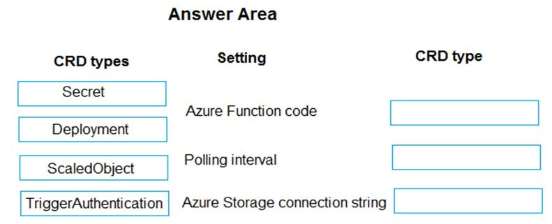
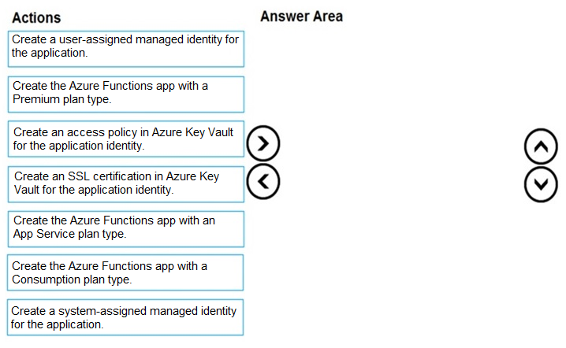
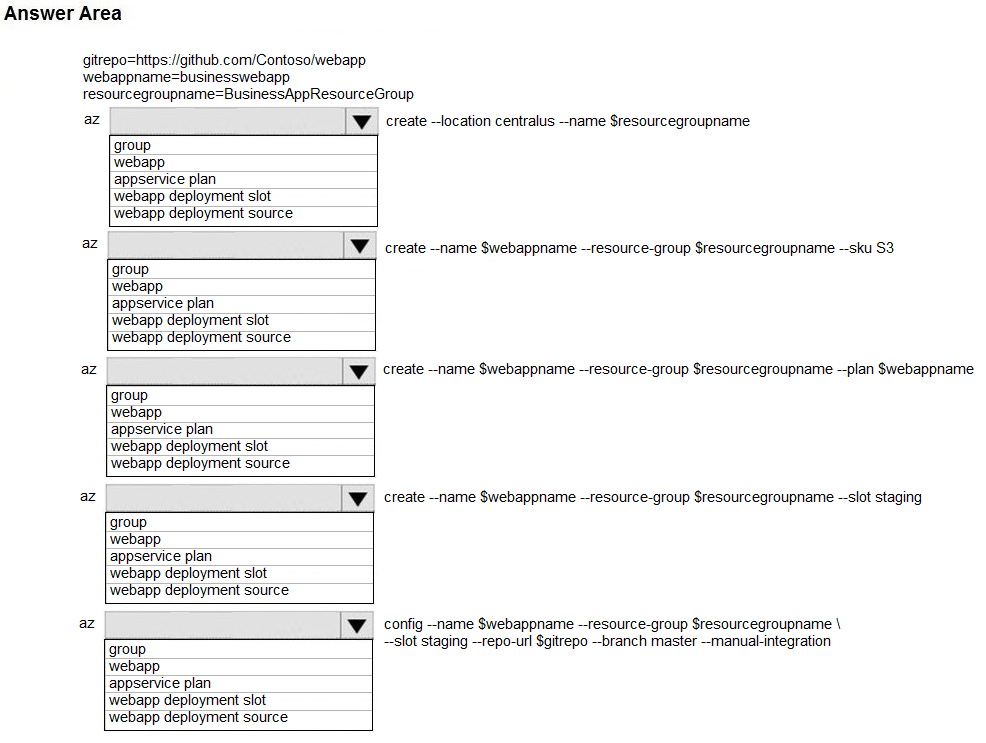
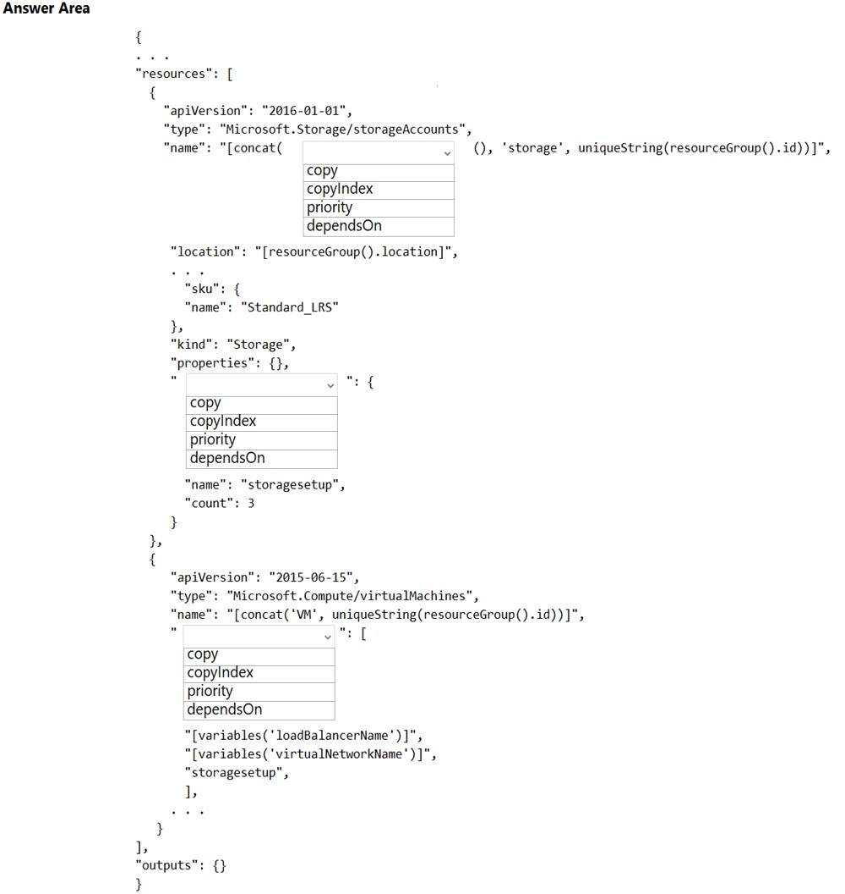

Question #1

You have two Hyper-V hosts named Host1 and Host2. Host1 has an Azure virtual machine named VM1 that was deployed by using a custom Azure Resource Manager template.
You need to move VM1 to Host2.
What should you do?

	A. From the Update management blade, click Enable.
	B. From the Overview blade, move VM1 to a different subscription.
	C. From the Redeploy blade, click Redeploy.
	D. From the Profile blade, modify the usage location.

Correct Answer: C 

When you redeploy a VM, it moves the VM to a new node within the Azure infrastructure and then powers it back on, retaining all your configuration options and associated resources.

---

Question #2

DRAG DROP -
You have downloaded an Azure Resource Manager template to deploy numerous virtual machines. The template is based on a current virtual machine, but must be adapted to reference an administrative password.
You need to make sure that the password is not stored in plain text.
You are preparing to create the necessary components to achieve your goal.
Which of the following should you create to achieve your goal? Answer by dragging the correct option from the list to the answer area.
Select and Place:

Key Vault + Access Policy.

Using Key Vault we create a secret containing our Password: https://docs.microsoft.com/en-us/azure/key-vault/secrets/quick-create-portal .

Using an Access Policy we allow access to the previously created secret.

Documentation Guide: https://docs.microsoft.com/en-us/azure/azure-resource-manager/templates/key-vault-parameter?tabs=azure-cli

---

Question #3
Your company has an Azure Kubernetes Service (AKS) cluster that you manage from an Azure AD-joined device. The cluster is located in a resource group.
Developers have created an application named MyApp. MyApp was packaged into a container image.
You need to deploy the YAML manifest file for the application.
Solution: You install the Azure CLI on the device and run the `kubectl apply -f myapp.yaml` command.
Does this meet the goal?

	A. Yes
	B. No

Correct Answer: A

---

Question #4

Your company has an Azure Kubernetes Service (AKS) cluster that you manage from an Azure AD-joined device. The cluster is located in a resource group.
Developers have created an application named MyApp. MyApp was packaged into a container image.
You need to deploy the YAML manifest file for the application.

Solution: You install the docker client on the device and run the `docker run -it microsoft/azure-cli:0.10.17` command.
Does this meet the goal?

	A. Yes
	B. No

Correct Answer: B

---

Question #5

Your company has a web app named WebApp1.
You use the WebJobs SDK to design a triggered App Service background task that automatically invokes a function in the code every time new data is received in a queue.
You are preparing to configure the service processes a queue data item.
Which of the following is the service you should use?

	A. Logic Apps
	B. WebJobs
	C. Flow
	D. Functions

Correct Answer: B

Reference:
https://docs.microsoft.com/en-us/azure/azure-functions/functions-compare-logic-apps-ms-flow-webjobs

---

Question #6

Your company has an Azure subscription.
You need to deploy a number of Azure virtual machines to the subscription by using Azure Resource Manager (ARM) templates. The virtual machines will be included in a single availability set.
You need to ensure that the ARM template allows for as many virtual machines as possible to remain accessible in the event of fabric failure or maintenance.
Which of the following is the value that you should configure for the platformFaultDomainCount property?

	A. 10
	B. 30
	C. Min Value
	D. Max Value

Correct Answer: D

The number of fault domains for managed availability sets varies by region - either two or three per region.

https://learn.microsoft.com/en-us/azure/virtual-machine-scale-sets/virtual-machine-scale-sets-manage-fault-domains

You can set the parameter --platform-fault-domain-count to 1, 2, or 3 (default of 3 if not specified). Refer to the documentation for Azure CLI here.

---

Question #7

Your company has an Azure subscription.
You need to deploy a number of Azure virtual machines to the subscription by using Azure Resource Manager (ARM) templates. The virtual machines will be included in a single availability set.
You need to ensure that the ARM template allows for as many virtual machines as possible to remain accessible in the event of fabric failure or maintenance.
Which of the following is the value that you should configure for the platformUpdateDomainCount property?

	A. 10
	B. 20
	C. 30
	D. 40

Correct Answer: B

Answer is B 20
Each availability set can be configured with up to three fault domains and twenty update domains.
https://docs.microsoft.com/en-us/azure/virtual-machines/availability-set-overview
The platformUpdateDomainCount property in Azure Resource Manager (ARM) templates specifies the number of update domains that should be created for the availability set. The maximum value for this property is 20.

---

Question #8
DRAG DROP -
You are creating an Azure Cosmos DB account that makes use of the SQL API. Data will be added to the account every day by a web application.
You need to ensure that an email notification is sent when information is received from IoT devices, and that compute cost is reduced.
You decide to deploy a function app.
Which of the following should you configure the function app to use? Answer by dragging the correct options from the list to the answer area.
Select and Place:

Correct awnser:

Consumption plan
SendGrid binding

Azure Functions 中的 SendGrid 绑定是一种用于与 SendGrid 电子邮件服务集成的功能。通过使用 SendGrid 绑定，你可以在 Azure Functions 中轻松地发送电子邮件，无需编写大量的代码。

---

Question #9

This question requires that you evaluate the underlined text to determine if it is correct.
You company has an on-premises deployment of MongoDB, and an Azure Cosmos DB account that makes use of the MongoDB API.
You need to devise a strategy to migrate MongoDB to the Azure Cosmos DB account.
You include the Data Management Gateway tool in your migration strategy.
Instructions: Review the underlined text. If it makes the statement correct, select `No change required.` If the statement is incorrect, select the answer choice that makes the statement correct.

题目中说的underlined text应该指的是Data Management Gateway

	A. No change required
	B. mongorestore
	C. Azure Storage Explorer
	D. AzCopy

Answer: B --mongorestore
https://docs.microsoft.com/en-us/azure/cosmos-db/mongodb-pre-migration

Data Management Gateway is not supported for Azure Cosmos DB - Mongo API

Got this on the Microsoft documentation: "The MongoDB native tools are a set of binaries that facilitate data manipulation on an existing MongoDB instance. Since Azure Cosmos DB exposes an API for MongoDB, the MongoDB native tools are able to insert data into Azure Cosmos DB. The focus of this doc is on migrating data out of a MongoDB instance using mongoexport/mongoimport or mongodump/mongorestore. Since the native tools connect to MongoDB using connection strings, you can run the tools anywhere, however we recommend running these tools within the same network as the MongoDB instance to avoid firewall issues."

---

Question #10

You are developing an e-Commerce Web App.
You want to use Azure Key Vault to ensure that sign-ins to the e-Commerce Web App are secured by using Azure App Service authentication and Azure Active Directory (AAD).
What should you do on the e-Commerce Web App?

	A. Run the az keyvault secret command.
	B. Enable Azure AD Connect.
	C. Enable Managed Service Identity (MSI).
	D. Create an Azure AD service principal.

Correct Answer: C

A managed identity from Azure Active Directory allows your app to easily access other AAD-protected resources such as Azure Key Vault.
Reference:
https://docs.microsoft.com/en-us/azure/app-service/overview-managed-identity https://docs.microsoft.com/en-us/samples/azure-samples/app-service-msi-keyvault-dotnet/keyvault-msi-appservice-sample/

Managed Service Identity (MSI) is a feature in Azure that allows you to securely authenticate an Azure service to other Azure services without having to manage credentials. By enabling MSI on the Azure App Service hosting the e-Commerce Web App, you can create a trust relationship between the App Service and Azure Key Vault. This allows the e-Commerce Web App to authenticate with Azure Active Directory (AAD) and securely retrieve secrets from the Key Vault.

Managed Service Identity (MSI) 是 Azure 中的一项安全功能，它提供了一种简化和增强身份验证的方法。通过使用 Managed Service Identity，Azure 资源（如虚拟机、Azure Functions、Web 应用等）可以在 Azure Active Directory (Azure AD) 中自动注册和管理标识，而无需明文存储凭据。

---

Question #11

This question requires that you evaluate the underlined text to determine if it is correct.
Your Azure Active Directory Azure (Azure AD) tenant has an Azure subscription linked to it.
Your developer has created a mobile application that obtains Azure AD access tokens using the OAuth 2 implicit grant type.
The mobile application must be registered in Azure AD.
You require a redirect URI from the developer for registration purposes.
Instructions: Review the underlined text. If it makes the statement correct, select `No change is needed.` If the statement is incorrect, select the answer choice that makes the statement correct.

underlined text指的应该是Redirect URI

	A. No change required.
	B. a secret
	C. a login hint
	D. a client ID

Correct Answer: A

For Native Applications you need to provide a Redirect URI, which Azure AD will use to return token responses.
Reference:
https://docs.microsoft.com/en-us/azure/active-directory/develop/v1-protocols-oauth-code

Redirect URI（Uniform Resource Identifier）是在 OAuth 2.0 和 OpenID Connect 认证流程中使用的一个重要参数。在这两个协议中，Redirect URI 用于指定用户在完成身份验证后应该被重定向到的目标地址。

在 OAuth 2.0 和 OpenID Connect 中，认证流程通常包括以下步骤：

用户发起认证请求： 用户向身份提供者（Identity Provider，例如认证服务器）发起身份验证请求。这通常是通过在应用程序中点击“登录”按钮或发起登录请求的方式。

身份提供者验证用户： 身份提供者验证用户的身份，并要求用户授予应用程序访问其受保护资源的权限。

生成授权码或令牌： 一旦用户成功验证，身份提供者生成一个授权码（Authorization Code）或访问令牌（Access Token）。

重定向用户： 在这一步，身份提供者需要将用户重定向回应用程序。这时就用到了 Redirect URI。

应用程序接收令牌或授权码： 应用程序的服务器（后端）会接收到从身份提供者返回的授权码或令牌。

Redirect URI 是在第4步中用于指定身份提供者将用户重定向到应用程序的地址。该 URI 必须是应用程序事先在身份提供者注册的地址之一，以确保安全性和避免恶意行为。通常，开发者需要在应用程序的身份提供者配置中注册 Redirect URI，以允许身份提供者将用户重定向到应用程序的正确位置。

需要注意的是，Redirect URI 在注册时通常包含了应用程序的标识信息和处理授权或认证的终结点。在接收到身份提供者返回的令牌或授权码后，应用程序通常会使用 Redirect URI 处理后续的认证和授权流程。

---

Question #12

You are creating an Azure key vault using PowerShell. Objects deleted from the key vault must be kept for a set period of 90 days.
Which two of the following parameters must be used in conjunction to meet the requirement? (Choose two.)

	A. EnabledForDeployment
	B. EnablePurgeProtection
	C. EnabledForTemplateDeployment
	D. EnableSoftDelete

Correct Answer: BD

Reference:
https://docs.microsoft.com/en-us/powershell/module/azurerm.keyvault/new-azurermkeyvault
https://docs.microsoft.com/en-us/azure/key-vault/key-vault-ovw-soft-delete

EnabledForDeployment is a property of Azure Key Vault that allows you to control whether the Key Vault can be deployed as part of an Azure Resource Manager (ARM) template deployment.
When EnabledForDeployment is set to true, it means that the Key Vault can be included in ARM templates and deployed using Azure Resource Manager.

EnablePurgeProtection is a property of Azure Key Vault's soft delete feature.
When EnablePurgeProtection is set to true, it ensures that deleted Key Vault entities (such as secrets, keys, or certificates) cannot be permanently deleted immediately.

EnabledForTemplateDeployment is a property of Azure Key Vault that determines whether the Key Vault can be deployed as part of an Azure Resource Manager (ARM) template deployment.

EnableSoftDelete is a property of Azure Key Vault that enables the soft delete feature for the Key Vault.
Soft delete allows you to recover deleted entities (secrets, keys, or certificates) within a specified retention period, even after they have been deleted.

---

Question #13

HOTSPOT -
You have an Azure Active Directory (Azure AD) tenant.
You want to implement multi-factor authentication by making use of a conditional access policy. The conditional access policy must be applied to all users when they access the Azure portal.
Which three settings should you configure? To answer, select the appropriate settings in the answer area.
NOTE: Each correct selection is worth one point.
Hot Area:

Correct awnser:

Box 1:
The conditional access policy must be applied or assigned to Users and Groups.
Box 2:
The conditional access policy must be applied when users access the Azure portal, which is a cloud app. That is: Microsoft Azure Management
Box 3:
Access control must require multi-factor authentication when granting access.
Reference:

https://docs.microsoft.com/en-us/azure/active-directory/conditional-access/app-based-mfa

https://learn.microsoft.com/en-us/azure/active-directory/conditional-access/howto-conditional-access-policy-all-users-mfa#create-a-conditional-access-policy

---

Question #14

You manage an Azure SQL database that allows for Azure AD authentication.
You need to make sure that database developers can connect to the SQL database via Microsoft SQL Server Management Studio (SSMS). You also need to make sure the developers use their on-premises Active Directory account for authentication. Your strategy should allow for authentication prompts to be kept to a minimum.
Which of the following should you implement?

	A. Azure AD token.
	B. Azure Multi-Factor authentication.
	C. Active Directory integrated authentication.
	D. OATH software tokens.

Correct Answer: C

使用 Active Directory 集成身份验证，你可以实现 Azure SQL 数据库的 Azure AD 身份验证，并使数据库开发人员能够使用他们在本地 Active Directory 中的帐户登录，同时最小化身份验证提示。这样，他们可以使用他们已经掌握的本地 Active Directory 凭据连接到数据库而无需额外的多因素身份验证。

---

Question #15

You are developing an application to transfer data between on-premises file servers and Azure Blob storage. The application stores keys, secrets, and certificates in Azure Key Vault and makes use of the Azure Key Vault APIs.
You want to configure the application to allow recovery of an accidental deletion of the key vault or key vault objects for 90 days after deletion.What should you do?

	A. Run the Add-AzKeyVaultKey cmdlet.
	B. Run the az keyvault update --enable-soft-delete true --enable-purge-protection true CLI.
	C. Implement virtual network service endpoints for Azure Key Vault.
	D. Run the az keyvault update --enable-soft-delete false CLI.

Correct Answer: B

---

Question #16

HOTSPOT -
You have developed a Web App for your company. The Web App provides services and must run in multiple regions.
You want to be notified whenever the Web App uses more than 85 percent of the available CPU cores over a 5 minute period. Your solution must minimize costs.
Which command should you use? To answer, select the appropriate settings in the answer area.
NOTE: Each correct selection is worth one point.
Hot Area:

https://docs.microsoft.com/sv-se/cli/azure/monitor/metrics/alert

For anyone wondering why it's --window-size and not --evaluation-frequency: you want the average across 5 minutes. With --evaluation-frequency you don't go for averages, you simply check what the given value is at specific intervals.

---

Question #17

Note: The question is included in a number of questions that depicts the identical set-up. However, every question has a distinctive result. Establish if the solution satisfies the requirements.
You are configuring a web app that delivers streaming video to users. The application makes use of continuous integration and deployment.
You need to ensure that the application is highly available and that the users' streaming experience is constant. You also want to configure the application to store data in a geographic location that is nearest to the user.
Solution: You include the use of Azure Redis Cache in your design.
Does the solution meet the goal?

	A. Yes
	B. No

Correct Answer: B

Redis caches won't support streaming video content. Azure CDN is suitable.

根据提供的信息，Azure Redis Cache 确实可以提高应用程序的性能和可伸缩性，并通过缓存数据来提供更一致的用户体验。然而，要实现数据存储在距离用户最近的地理位置，可能需要考虑其他 Azure 服务，如 Azure Content Delivery Network (CDN) 或 Azure Blob 存储。

---

Question #18

Note: The question is included in a number of questions that depicts the identical set-up. However, every question has a distinctive result. Establish if the solution satisfies the requirements.
You are configuring a web app that delivers streaming video to users. The application makes use of continuous integration and deployment.
You need to ensure that the application is highly available and that the users' streaming experience is constant. You also want to configure the application to store data in a geographic location that is nearest to the user.
Solution: You include the use of an Azure Content Delivery Network (CDN) in your design.
Does the solution meet the goal?

	A. Yes
	B. No

Correct Answer: A

---

Question #19

Note: The question is included in a number of questions that depicts the identical set-up. However, every question has a distinctive result. Establish if the solution satisfies the requirements.
You are configuring a web app that delivers streaming video to users. The application makes use of continuous integration and deployment.
You need to ensure that the application is highly available and that the users' streaming experience is constant. You also want to configure the application to store data in a geographic location that is nearest to the user.
Solution: You include the use of a Storage Area Network (SAN) in your design.
Does the solution meet the goal?

	A. Yes
	B. No

Correct Answer: B

不符合目标。

Storage Area Network (SAN) 通常用于中央存储，不设计为根据用户的地理位置来优化数据存储。要实现将数据存储在离用户最近的地理位置的目标，其他解决方案，如内容交付网络 (CDN) 或分布式存储选项，将更为适合。SAN通常用于块级存储，不具备根据地理位置进行内容交付或分布的内在优化。

A Storage Area Network (SAN) is a dedicated network that provides access to consolidated, block-level data storage. It is used to increase the availability of data and improve the performance of applications that require access to shared data. However, SANs do not provide features to ensure high availability of web applications, nor do they provide a mechanism to store data in the geographic location nearest to the user.

---

Question #20

You develop a Web App on a tier D1 app service plan.
You notice that page load times increase during periods of peak traffic.
You want to implement automatic scaling when CPU load is above 80 percent. Your solution must minimize costs.
What should you do first?

	A. Enable autoscaling on the Web App.
	B. Switch to the Premium App Service tier plan.
	C. Switch to the Standard App Service tier plan.
	D. Switch to the Azure App Services consumption plan.

Correct Answer: C

Configure the web app to the Standard App Service Tier. The Standard tier supports auto-scaling, and we should minimize the cost. We can then enable autoscaling on the web app, add a scale rule and add a Scale condition.
Reference:
https://docs.microsoft.com/en-us/azure/monitoring-and-diagnostics/monitoring-autoscale-get-started https://azure.microsoft.com/en-us/pricing/details/app-service/plans/

Tier D1 is a basically shared app service plan, so we need to move standard or premium plan to enable auto scaling. As we need to provide low cost solution, then standard plan will be best for this approach

---

Question #21

Your company's Azure subscription includes an Azure Log Analytics workspace.
Your company has a hundred on-premises servers that run either Windows Server 2012 R2 or Windows Server 2016, and is linked to the Azure Log Analytics workspace. The Azure Log Analytics workspace is set up to gather performance counters associated with security from these linked servers.
You must configure alerts based on the information gathered by the Azure Log Analytics workspace.
You have to make sure that alert rules allow for dimensions, and that alert creation time should be kept to a minimum. Furthermore, a single alert notification must be created when the alert is created and when the alert is resolved.
You need to make use of the necessary signal type when creating the alert rules.
Which of the following is the option you should use?

	A. The Activity log signal type.
	B. The Application Log signal type.
	C. The Metric signal type.
	D. The Audit Log signal type.

Correct Answer: C

https://learn.microsoft.com/en-us/azure/azure-monitor/alerts/alerts-metric-logs#configuring-metric-alert-for-logs

C is correct. "Metric Alerts are stateful - only notifying once when alert is fired and once when alert is resolved; as opposed to Log alerts, which are stateless and keep firing at every interval if the alert condition is met."

在配置 Azure Log Analytics workspace 的警报规则时，根据题意，你需要确保警报规则允许使用维度，同时最小化警报的创建时间，且在创建和解决警报时只生成单个通知。

正确的选项是：

C. The Metric signal type（指标信号类型）

Metric signal type 允许你基于性能计数器等指标生成警报规则，并且通常用于监视和报警。这种信号类型支持维度（Dimensions），使你能够更精细地定义和配置警报规则，同时确保在创建和解决警报时只生成单个通知。

---

Question #22

You are developing a .NET Core MVC application that allows customers to research independent holiday accommodation providers.
You want to implement Azure Search to allow the application to search the index by using various criteria to locate documents related to accommodation.
You want the application to allow customers to search the index by using regular expressions.
What should you do?

	A. Configure the SearchMode property of the SearchParameters class.
	B. Configure the QueryType property of the SearchParameters class.
	C. Configure the Facets property of the SearchParameters class.
	D. Configure the Filter property of the SearchParameters class.

Correct Answer: B

要在 .NET Core MVC 应用程序中使用 Azure Search，以便允许按照各种标准搜索索引，包括使用正则表达式搜索文档，你应该：

B. 配置 SearchParameters 类的 QueryType 属性。

QueryType 属性可用于指定查询的类型。对于支持 Lucene 查询语法的 Azure Search 索引，将 QueryType 设置为 SearchQueryType.Full 可以让你使用正则表达式等高级查询。这样，你可以更灵活地定义搜索条件以匹配索引中的文档。

---

Question #23

You are a developer at your company.
You need to update the definitions for an existing Logic App.
What should you use?

	A. the Enterprise Integration Pack (EIP)
	B. the Logic App Code View
	C. the API Connections
	D. the Logic Apps Designer

Correct Answer: B

这题似乎不再是考试范围之内的题目了

B. Logic App Code View

Logic App Code View 允许你直接编辑 Logic App 的底层工作流定义（以 JSON 格式表示）。这提供了一种详细和精确修改 Logic App 行为的方式。对于那些熟悉 JSON 并希望对 Logic App 结构和行为进行细粒度控制的开发人员来说，Logic App Code View 是一个有价值的工具。

---

Question #24

Note: The question is included in a number of questions that depicts the identical set-up. However, every question has a distinctive result. Establish if the solution satisfies the requirements.
You are developing a solution for a public facing API.
The API back end is hosted in an Azure App Service instance. You have implemented a RESTful service for the API back end.
You must configure back-end authentication for the API Management service instance.
Solution: You configure Basic gateway credentials for the Azure resource.
Does the solution meet the goal?

	A. Yes
	B. No

Correct Answer: B 不确定

There are two components we're interested in:
a. APIM, and
b. App Service (resource)

The App Service doesn't support basic-auth at all; though APIM does. The tricky part is the word "resource" which is App Service.

不符合目标。

仅为 Azure 资源配置基本网关凭据本身并不足以为 API Management 服务实例配置后端身份验证。在 API Management 的上下文中，后端身份验证通常涉及配置托管在 Azure App Service 中的 API 的必要身份验证设置，这可能包括 API 密钥、OAuth 或其他身份验证机制。

要实现 API Management 服务实例的后端身份验证，你需要为 Azure App Service 中托管的底层 API 配置适当的身份验证设置。Azure 资源的基本网关凭据通常与管理访问相关，不直接解决 API 的后端身份验证需求。

To achieve back-end authentication for the API Management service instance, you need to configure the appropriate authentication settings for the underlying API hosted in the Azure App Service. Basic gateway credentials for the Azure resource are generally related to administrative access and do not directly address the back-end authentication requirements for the API.

---

Question #25

Note: The question is included in a number of questions that depicts the identical set-up. However, every question has a distinctive result. Establish if the solution satisfies the requirements.
You are developing a solution for a public facing API.
The API back end is hosted in an Azure App Service instance. You have implemented a RESTful service for the API back end.
You must configure back-end authentication for the API Management service instance.
Solution: You configure Client cert gateway credentials for the HTTP(s) endpoint.
Does the solution meet the goal?

	A. Yes
	B. No

Correct Answer: A 不确定

This is scenario questions.
If backend is accepts HTTP(S)
Then Basic AUTH or Certificate will work.
so Client Certificate + HTTP(s) YES

配置 HTTP(s) 终结点的客户端证书网关凭据是为 API Management 服务实例配置后端身份验证的一种有效方式。通过使用客户端证书，你可以确保只有具有有效证书的请求才能够访问你的 API 后端。这提供了额外的安全性层，确保只有经过授权的客户端可以调用 API。因此，这个解决方案满足目标。

---

Question #26

Note: The question is included in a number of questions that depicts the identical set-up. However, every question has a distinctive result. Establish if the solution satisfies the requirements.
You are developing a solution for a public facing API.
The API back end is hosted in an Azure App Service instance. You have implemented a RESTful service for the API back end.
You must configure back-end authentication for the API Management service instance.
Solution: You configure Basic gateway credentials for the HTTP(s) endpoint.
Does the solution meet the goal?

	A. Yes
	B. No

A 不确定

This is scenario questions.
If backend is accepts HTTP(S)
Then Basic AUTH or Certificate will work.
so Basic + HTTPS Yes

Target: "Azure Logic App" or "HTTP(s) endpoint"
Gateway credentials: "None" or "Basic" or "Client cert"

https://docs.microsoft.com/en-us/azure/api-management/api-management-howto-mutual-certificates#configure-an-api-to-use-client-certificate-for-gateway-authentication

---

Question #27
Note: The question is included in a number of questions that depicts the identical set-up. However, every question has a distinctive result. Establish if the solution satisfies the requirements.
You are developing a solution for a public facing API.
The API back end is hosted in an Azure App Service instance. You have implemented a RESTful service for the API back end.
You must configure back-end authentication for the API Management service instance.
Solution: You configure Client cert gateway credentials for the Azure resource.
Does the solution meet the goal?

	A. Yes
	B. No

B 不确定

This is scenario questions.
If backend is accepts HTTP(S)
Then Basic AUTH or Certificate will work.
so Certificate + Azure Resource NO
https://www.youtube.com/watch?v=HQ0U7lwP93o

---

Question #28

You are developing a .NET Core MVC application that allows customers to research independent holiday accommodation providers.
You want to implement Azure Search to allow the application to search the index by using various criteria to locate documents related to accommodation venues.
You want the application to list holiday accommodation venues that fall within a specific price range and are within a specified distance to an airport.
What should you do?

	A. Configure the SearchMode property of the SearchParameters class.
	B. Configure the QueryType property of the SearchParameters class.
	C. Configure the Facets property of the SearchParameters class.
	D. Configure the Filter property of the SearchParameters class.

Correct Answer: D

你应该：

D. 配置 SearchParameters 类的 Filter 属性。

Filter 属性用于指定搜索结果的筛选条件，你可以使用它来限制在特定价格范围内和指定距离内的搜索结果。通过配置 Filter 属性，你可以实现根据价格和距离来筛选和显示符合条件的度假住宿场所。

---

Question #29

You are a developer at your company.
You need to edit the workflows for an existing Logic App.
What should you use?

	A. the Enterprise Integration Pack (EIP)
	B. the Logic App Code View
	C. the API Connections
	D. the Logic Apps Designer

Correct Answer: D

不确定，但是我觉得workflow用designer比较好改

---

Question #30

DRAG DROP -
You are a developer for a company that provides a bookings management service in the tourism industry. You are implementing Azure Search for the tour agencies listed in your company's solution.
You create the index in Azure Search. You now need to use the Azure Search .NET SDK to import the relevant data into the Azure Search service.
Which three actions should you perform in sequence? To answer, move the appropriate actions from the list of actions from left to right and arrange them in the correct order.

Select and Place:

	Create a DataSource instance and set its Container property to the DataContainer.
	Create an IndexBatch that contains the documents which must be added.
	Set the DataSources property of the SearchServiceClient.
	Create a SearchlndexClient object to connect to the search index.
	Call the Documents.Index method of the SearchindexClient and pass the IndexBatch
	Call the Documents.Suggest method of the SearchindexClient and pass the DataSource

Answer:

	Create a SearchlndexClient object to connect to the search index.
	Create an IndexBatch that contains the documents which must be added.
	Call the Documents.Index method of the SearchindexClient and pass the IndexBatch

注：Azure search is out of scope for AZ-204

---

Question #31

You are developing an application that applies a set of governance policies for internal and external services, as well as for applications.
You develop a stateful ASP.NET Core 2.1 web application named PolicyApp and deploy it to an Azure App Service Web App. The PolicyApp reacts to events from
Azure Event Grid and performs policy actions based on those events.
You have the following requirements:
✑ Authentication events must be used to monitor users when they sign in and sign out.
✑ All authentication events must be processed by PolicyApp.
✑ Sign outs must be processed as fast as possible.
What should you do?

	A. Create a new Azure Event Grid subscription for all authentication events. Use the subscription to process sign-out events.
	B. Create a separate Azure Event Grid handler for sign-in and sign-out events.
	C. Create separate Azure Event Grid topics and subscriptions for sign-in and sign-out events.
	D. Add a subject prefix to sign-out events. Create an Azure Event Grid subscription. Configure the subscription to use the subjectBeginsWith filter.

Correct Answer: C 不确定

Only C is mentioned both topic and subscription, which are two critical parts for event grid, so I will go C, anyway, this question is very poorly worded

根据给定的要求，你应该选择：

C. 为登录和登出事件创建单独的 Azure Event Grid 主题和订阅。

这种方法允许你为登录和登出事件分别创建专用主题，提供更好的分离和处理每种事件类型的灵活性。通过拥有单独的主题，你可以为每种事件类型创建订阅，确保 PolicyApp 处理登录和登出的身份验证事件。

选项 A 可能是一个有效的方法，但它没有提供所需的分离和灵活性。选项 B 不是理想的选择，因为它暗示使用单个处理程序处理登录和登出事件。选项 D 引入了使用主题前缀过滤的复杂性，而单独的主题提供了一种更清晰和可维护的解决方案。

---

Question #32

HOTSPOT -
You are developing a C++ application that compiles to a native application named process.exe. The application accepts images as input and returns images in one of the following image formats: GIF, PNG, or JPEG.
You must deploy the application as an Azure Function.
You need to configure the function and host json files.
How should you complete the json files? To answer, select the appropriate options in the answer area.
NOTE: Each correct selection is worth one point.

**the last one should be true**

- Your Azure Function will be a custom handler since Azure Functions doesn't directly support C++ as a runtime.
- enableForwardingHttpRequest is set to true to allow the custom handler to receive the HTTP request data

In the function.json file, enableForwardingHttpRequest should be set to true for the Azure Function to accept HTTP requests and forward them to the C++ application for processing.

This is because the C++ application is compiled as a native application and cannot directly receive HTTP requests. By setting enableForwardingHttpRequest to true, the Azure Function acts as a proxy and forwards incoming HTTP requests to the C++ application.

---

Question #33

HOTSPOT

You are developing an Azure Static Web app that contains training materials for a tool company. Each tool’s training material is contained in a static web page that is linked from the tool’s publicly available description page.

A user must be authenticated using Azure AD prior to viewing training.

You need to ensure that the user can view training material pages after authentication.

How should you complete the configuration file? To answer, select the appropriate options in the answer area.

NOTE: Each correct selection is worth one point.

Got on 9/25/2023
responseoverrides
401
aad
.referrer

---

Question #34

HOTSPOT

You are authoring a set of nested Azure Resource Manager templates to deploy Azure resources. You author an Azure Resource Manager template named mainTemplate.json that contains the following linked templates: linkedTemplate1.json, linkedTemplate2.json.

You add parameters to a parameters template file named mainTemplate.parameters,json. You save all templates on a local device in the C:\templates\ folder.

You have the following requirements:

• Store the templates in Azure for later deployment.
• Enable versioning of the templates.
• Manage access to the templates by using Azure RBAC.
• Ensure that users have read-only access to the templates.
• Allow users to deploy the templates.

You need to store the templates in Azure.

How should you complete the command? To answer, select the appropriate options in the answer area.

NOTE: Each correct selection is worth one point.

correct
https://learn.microsoft.com/en-us/azure/azure-resource-manager/templates/template-specs-create-linked?tabs=azure-cli

---

Question #35

HOTSPOT

You are developing a service where customers can report news events from a browser using Azure Web PubSub. The service is implemented as an Azure Function App that uses the JSON WebSocket subprotocol to receive news events.

You need to implement the bindings for the Azure Function App.

How should you configure the binding? To answer, select the appropriate options in the answer area.

NOTE: Each correct selection is worth one point.

Given answer is correct.
https://learn.microsoft.com/en-us/azure/azure-web-pubsub/reference-functions-bindings?tabs=javascript

---

Question #36

HOTSPOT

You are building a software-as-a-service (SaaS) application that analyzes DNA data that will run on Azure virtual machines (VMs) in an availability zone. The data is stored on managed disks attached to the VM. The performance of the analysis is determined by the speed of the disk attached to the VM.

You have the following requirements:

• The application must be able to quickly revert to the previous day’s data if a systemic error is detected.
• The application must minimize downtime in the case of an Azure datacenter outage.

You need to provision the managed disk for the VM to maximize performance while meeting the requirements.

Which type of Azure Managed Disk should you use? To answer, select the appropriate options in the answer area.

NOTE: Each correct selection is worth one point.

Wrong answer: Managed disk doesn't support GRS

Ans: Premium SSD and ZRS
They are asking for high performance workloads which is supported by Premium tier https://learn.microsoft.com/en-us/azure/virtual-machines/disks-types
Also they are asking for zone redundancy (if datacenter goes down, NOT region outage). Also managed disk doesn't support GRS https://learn.microsoft.com/en-us/azure/virtual-machines/disks-redundancy

Locally Redundant Storage (LRS):

* 冗余级别： 数据在同一区域的多个存储节点上进行三次复制。
* 故障转移范围： 限于同一 Azure 区域。
* 成本： 相对较低，是较为经济的选项。
* 应用场景： 适用于对数据冗余要求不高，但仍希望在同一区域内获得某种程度的冗余和可靠性。

Geo-Redundant Storage (GRS):

* 冗余级别： 数据在主区域内进行 LRS 复制，同时异步复制到辅助区域。
* 故障转移范围： 跨 Azure 区域。
* 成本： 相对较高，因为提供了跨区域的冗余。
* 应用场景： 适用于对数据要求较高的冗余，希望在主要区域发生故障时能够迅速切换到辅助区域。

Zone-Redundant Storage (ZRS):

* 冗余级别： 数据在同一区域的不同可用性区域内进行复制。
* 故障转移范围： 限于同一 Azure 区域，但是可以跨多个可用性区域。
* 成本： 介于 LRS 和 GRS 之间。
* 应用场景： 适用于要求高可用性且能够抵御单一可用性区域故障的情况。

WHEN THEY SAY 'Azure datacenter outage' they are implying a data center within a region which is hosted in one of the region's three zones. That alone gives it away that its ZRS with P-SSD.

---

Question #37

HOTSPOT

You are developing an application that includes two Docker containers.

The application must meet the following requirements:

• The containers must not run as root.
• The containers must be deployed to Azure Container Instances by using a YAML file.
• The containers must share a lifecycle, resources, local network, and storage volume.
• The storage volume must persist through container crashes.
• The storage volume must be deployed on stop or restart of the containers.

You need to configure Azure Container Instances for the application.

Which configuration values should you use? To answer, select the appropriate options in the answer area.

NOTE: Each correct selection is worth one point.

Ans: Container group, EmptyDir

Container group is the only logical answer that can have shared lifecycle https://learn.microsoft.com/en-us/azure/container-instances/container-instances-container-groups?source=recommendations#what-is-a-container-group
Azure files need root permission
Secret is for secrets and read-only
EmtyDir can persist through crash and redeployed on stop and restart
https://learn.microsoft.com/en-us/azure/container-instances/container-instances-volume-emptydir#emptydir-volume
Cloned Git Repo also does the job but it needs more details like Git URL and stuff which are not mentioned to be available in the question

---

38

HOTSPOT -

You are implementing a software as a service (SaaS) ASP.NET Core web service that will run as an Azure Web App. The web service will use an on-premises
SQL Server database for storage. The web service also includes a WebJob that processes data updates. Four customers will use the web service.
✑ Each instance of the WebJob processes data for a single customer and must run as a singleton instance.
✑ Each deployment must be tested by using deployment slots prior to serving production data.
✑ Azure costs must be minimized.
✑ Azure resources must be located in an isolated network.
You need to configure the App Service plan for the Web App.
How should you configure the App Service plan? To answer, select the appropriate settings in the answer area.
NOTE: Each correct selection is worth one point.
Hot Area:

Box 1: 4
There are four customers that use this service, and each instance of the WebJob processes data for a single customer and must run as a singleton instance. So, the number of VM should be 4. WebJobs is a feature of Azure App Service that enables you to run a program or script in the same instance as a web app. Like running background tasks.

Box 2: Isolated
Azure resources must be located in an isolated network .
In the Isolated tier, the App Service Environment defines the number of isolated workers that run your apps, and each worker is charged. In addition, there's a flat Stamp Fee for the running the App Service Environment itself. Isolated: This tier runs dedicated Azure VMs on dedicated Azure Virtual Networks. It provides network isolation on top of compute isolation to your apps. It provides the maximum scale-out capabilities.

---

39

DRAG DROP -
You are a developer for a software as a service (SaaS) company that uses an Azure Function to process orders. The Azure Function currently runs on an Azure
Function app that is triggered by an Azure Storage queue.
You are preparing to migrate the Azure Function to Kubernetes using Kubernetes-based Event Driven Autoscaling (KEDA).
You need to configure Kubernetes Custom Resource Definitions (CRD) for the Azure Function.
Which CRDs should you configure? To answer, drag the appropriate CRD types to the correct locations. Each CRD type may be used once, more than once, or not at all. You may need to drag the split bar between panes or scroll to view content.
NOTE: Each correct selection is worth one point.
Select and Place:

Box 1: Deployment
To deploy Azure Functions to Kubernetes use the func kubernetes deploy command has several attributes that directly control how our app scales, once it is deployed to Kubernetes.

Box 2: ScaledObject
With --polling-interval, we can control the interval used by KEDA to check Azure Service Bus Queue for messages.

Box 3: Secret
Store connection strings in Kubernetes Secrets.

---

40

HOTSPOT -
You are creating a CLI script that creates an Azure web app and related services in Azure App Service. The web app uses the following variables:

You need to automatically deploy code from GitHub to the newly created web app.
How should you complete the script? To answer, select the appropriate options in the answer area.
NOTE: Each correct selection is worth one point.
Hot Area:

Given answer is correct, got this on my test yesterday

---

41

Note: This question is part of a series of questions that present the same scenario. Each question in the series contains a unique solution that might meet the stated goals. Some question sets might have more than one correct solution, while others might not have a correct solution.
After you answer a question in this section, you will NOT be able to return to it. As a result, these questions will not appear in the review screen.
You develop a software as a service (SaaS) offering to manage photographs. Users upload photos to a web service which then stores the photos in Azure
Storage Blob storage. The storage account type is General-purpose V2.
When photos are uploaded, they must be processed to produce and save a mobile-friendly version of the image. The process to produce a mobile-friendly version of the image must start in less than one minute.
You need to design the process that starts the photo processing.
Solution: Trigger the photo processing from Blob storage events.
Does the solution meet the goal?

	A. Yes
	B. No

B 不确定

Hi All,
The answer (B) is correct. Because, the trick is in the "less than one minute" detail.
You can read about "..10-minute delay in processing new blobs.." in "3-Minimizing latency" description.
Microsoft says: ".....Use Event Grid instead of the Blob storage trigger for the following scenarios:"
1-Blob-only storage accounts: Blob-only storage accounts are supported for blob input and output bindings but not for blob triggers.
2-High-scale: High scale can be loosely defined as containers that have more than 100,000 blobs in them or storage accounts that have more than 100 blob updates per second.
3-Minimizing latency: If your function app is on the Consumption plan, there can be up to a **10-minute delay in processing new blobs** if a function app has gone idle. To avoid this latency, you can switch to an App Service plan with Always On enabled. You can also use an Event Grid trigger with your Blob storage account. For an example, see the Event Grid tutorial.

REFENCE: https://docs.microsoft.com/en-us/azure/azure-functions/functions-bindings-storage-blob-trigger?tabs=csharp#event-grid-trigger

I wish you a good day.

---

42

Note: This question is part of a series of questions that present the same scenario. Each question in the series contains a unique solution that might meet the stated goals. Some question sets might have more than one correct solution, while others might not have a correct solution.
After you answer a question in this section, you will NOT be able to return to it. As a result, these questions will not appear in the review screen.
You develop and deploy an Azure App Service API app to a Windows-hosted deployment slot named Development. You create additional deployment slots named Testing and Production. You enable auto swap on the Production deployment slot.
You need to ensure that scripts run and resources are available before a swap operation occurs.
Solution: Update the web.config file to include the applicationInitialization configuration element. Specify custom initialization actions to run the scripts.
Does the solution meet the goal?

	A. No
	B. Yes

B

This should work:
https://docs.microsoft.com/en-us/azure/app-service/deploy-staging-slots#specify-custom-warm-up

解决方案中的方法是更新 web.config 文件以包含 applicationInitialization 配置元素，并指定要运行脚本的自定义初始化操作。这样可以确保在执行交换操作之前运行脚本并准备资源，从而满足要求。

---

43

Note: This question is part of a series of questions that present the same scenario. Each question in the series contains a unique solution that might meet the stated goals. Some question sets might have more than one correct solution, while others might not have a correct solution.
After you answer a question in this section, you will NOT be able to return to it. As a result, these questions will not appear in the review screen.
You develop and deploy an Azure App Service API app to a Windows-hosted deployment slot named Development. You create additional deployment slots named Testing and Production. You enable auto swap on the Production deployment slot.
You need to ensure that scripts run and resources are available before a swap operation occurs.
Solution: Enable auto swap for the Testing slot. Deploy the app to the Testing slot.
Does the solution meet the goal?

	A. No
	B. Yes

A

I vote A, No, because for me the solution is updating the web.config file to include the applicationInitialization configuration element.

---

44

Note: This question is part of a series of questions that present the same scenario. Each question in the series contains a unique solution that might meet the stated goals. Some question sets might have more than one correct solution, while others might not have a correct solution.
After you answer a question in this section, you will NOT be able to return to it. As a result, these questions will not appear in the review screen.
You develop and deploy an Azure App Service API app to a Windows-hosted deployment slot named Development. You create additional deployment slots named Testing and Production. You enable auto swap on the Production deployment slot.
You need to ensure that scripts run and resources are available before a swap operation occurs.
Solution: Disable auto swap. Update the app with a method named statuscheck to run the scripts. Re-enable auto swap and deploy the app to the Production slot.
Does the solution meet the goal?

	A. No
	B. Yes

A

Ok, my bad autoswap has to be configured on the Staging Slot. So "You enable auto swap on the Production deployment slot." is not what you would do. Answer is A (NO).

---

45

Note: This question is part of a series of questions that present the same scenario. Each question in the series contains a unique solution that might meet the stated goals. Some question sets might have more than one correct solution, while others might not have a correct solution.
After you answer a question in this section, you will NOT be able to return to it. As a result, these questions will not appear in the review screen.

You develop a software as a service (SaaS) offering to manage photographs. Users upload photos to a web service which then stores the photos in Azure Storage Blob storage. The storage account type is General-purpose V2.
When photos are uploaded, they must be processed to produce and save a mobile-friendly version of the image. The process to produce a mobile-friendly version of the image must start in less than one minute.
You need to design the process that starts the photo processing.
Solution: Convert the Azure Storage account to a BlockBlobStorage storage account.
Does the solution meet the goal?

	A. Yes
	B. No

Correct Answer: B

不符合目标。

将 Azure 存储帐户转换为 BlockBlobStorage 存储帐户与在一分钟内启动照片处理的目标不直接相关。存储帐户类型本身并不确定启动照片处理的方式。

为了实现目标，你应该考虑使用具有 Blob 存储触发器或事件网格的 Azure Functions，在上传新照片到 Blob 存储时触发照片处理。配置适当的基于事件的机制将确保在上传照片后尽快启动照片处理，而不管存储帐户类型如何。

---

46

HOTSPOT -
You are developing an Azure Web App. You configure TLS mutual authentication for the web app.
You need to validate the client certificate in the web app. To answer, select the appropriate options in the answer area.
NOTE: Each correct selection is worth one point.
Hot Area:

Box 1: HTTP request header
If you are using ASP.NET and configure your app to use client certificate authentication, the certificate will be available through the HttpRequest.ClientCertificate property.

Box 2: Base64
For other application stacks, the client cert will be available in your app through a base64 encoded value in the "X-ARR-ClientCert" request header. Your application can create a certificate from this value and then use it for authentication and authorization purposes in your application.

Reference:

https://docs.microsoft.com/en-us/azure/app-service/app-service-web-configure-tls-mutual-auth

---

47

DRAG DROP -
You are developing a Docker/Go using Azure App Service Web App for Containers. You plan to run the container in an App Service on Linux. You identify a
Docker container image to use.
None of your current resource groups reside in a location that supports Linux. You must minimize the number of resource groups required.
You need to create the application and perform an initial deployment.
Which three Azure CLI commands should you use to develop the solution? To answer, move the appropriate commands from the list of commands to the answer area and arrange them in the correct order.
Select and Place:

Within the same resource group, you can't mix Windows and Linux apps in the same region.
https://docs.microsoft.com/en-us/azure/app-service/overview#app-service-on-linux
"None of your current resource groups reside in a location that supports Linux"
So you have to create new resource group. Answer is correct.

---

48

DRAG DROP -
Fourth Coffee has an ASP.NET Core web app that runs in Docker. The app is mapped to the www.fourthcoffee.com domain.
Fourth Coffee is migrating this application to Azure.
You need to provision an App Service Web App to host this docker image and map the custom domain to the App Service web app.
A resource group named FourthCoffeePublicWebResourceGroup has been created in the WestUS region that contains an App Service Plan named
AppServiceLinuxDockerPlan.
Which order should the CLI commands be used to develop the solution? To answer, move all of the Azure CLI commands from the list of commands to the answer area and arrange them in the correct order.
Select and Place:

1. /bin/bash
2. az webpp create
3.  config container set
4.  config hostname add

Step 1: #bin/bash -
The appName is used when the webapp-name is created in step 2.

Step 2: az webapp create -
Create a web app. In the Cloud Shell, create a web app in the myAppServicePlan App Service plan with the az webapp create command.

Step 3: az webapp config container set
In Create a web app, you specified an image on Docker Hub in the az webapp create command. This is good enough for a public image. To use a private image, you need to configure your Docker account ID and password in your Azure web app.

Step 4: az webapp config hostname add
The webapp-name is used when the webapp is created in step 2.
In the Cloud Shell, follow the az webapp create command with az webapp config container set.

---

49

DRAG DROP -
You are developing a serverless Java application on Azure. You create a new Azure Key Vault to work with secrets from a new Azure Functions application.
The application must meet the following requirements:
✑ Reference the Azure Key Vault without requiring any changes to the Java code.
✑ Dynamically add and remove instances of the Azure Functions host based on the number of incoming application events.
✑ Ensure that instances are perpetually warm to avoid any cold starts.
✑ Connect to a VNet.
✑ Authentication to the Azure Key Vault instance must be removed if the Azure Function application is deleted.
You need to grant the Azure Functions application access to the Azure Key Vault.
Which three actions should you perform in sequence? To answer, move the appropriate actions from the list of actions to the answer area and arrange them in the correct order.
Select and Place:

1. create Premium plan Type (Consumption X)
2. create system-assigned  (user-assigned X)
3. create an access policy in Azure Key Vault

I agree with you.
1. Premium plan (avoid any cold starts and connect to a VNet)
Overview of plans here: https://docs.microsoft.com/th-th/azure/azure-functions/functions-scale
2. create system-assigned => "A system-assigned identity is tied to your application and is deleted if your app is deleted."
3. create an access policy
https://docs.microsoft.com/en-us/azure/app-service/app-service-key-vault-references?toc=%2Fazure%2Fazure-functions%2Ftoc.json&tabs=azure-cli

---

50

You develop a website. You plan to host the website in Azure. You expect the website to experience high traffic volumes after it is published.
You must ensure that the website remains available and responsive while minimizing cost.
You need to deploy the website.
What should you do?

	A. Deploy the website to a virtual machine. Configure the virtual machine to automatically scale when the CPU load is high.
	B. Deploy the website to an App Service that uses the Shared service tier. Configure the App Service plan to automatically scale when the CPU load is high.
	C. Deploy the website to a virtual machine. Configure a Scale Set to increase the virtual machine instance count when the CPU load is high.
	D. Deploy the website to an App Service that uses the Standard service tier. Configure the App Service plan to automatically scale when the CPU load is high.

Correct Answer: D

Windows Azure Web Sites (WAWS) offers 3 modes: Standard, Free, and Shared.
Standard mode carries an enterprise-grade SLA (Service Level Agreement) of 99.9% monthly, even for sites with just one instance.
Standard mode runs on dedicated instances, making it different from the other ways to buy Windows Azure Web Sites.
Incorrect Answers:
B: Shared and Free modes do not offer the scaling flexibility of Standard, and they have some important limits.
Shared mode, just as the name states, also uses shared Compute resources, and also has a CPU limit. So, while neither Free nor Shared is likely to be the best choice for your production environment due to these limits.

To ensure that the website remains available and responsive while minimizing cost, you should deploy the website to an App Service that uses the Standard service tier and configure the App Service plan to automatically scale when the CPU load is high. This way, the website can handle high traffic volumes by automatically scaling the number of instances of the website, reducing the risk of the website becoming unavailable due to high traffic.

---

51

HOTSPOT
A company is developing a Java web app. The web app code is hosted in a GitHub repository located at https://github.com/Contoso/webapp.
The web app must be evaluated before it is moved to production. You must deploy the initial code release to a deployment slot named staging.
You need to create the web app and deploy the code.
How should you complete the commands? To answer, select the appropriate options in the answer area.
NOTE: Each correct selection is worth one point.
Hot Area:

Box 1: group -
Create a resource group.
az group create --location westeurope --name myResourceGroup

Box 2: appservice plan -
Create an App Service plan in STANDARD tier (minimum required by deployment slots). az appservice plan create --name $webappname --resource-group myResourceGroup --sku S1

Box 3: webapp -
Create a web app.
az webapp create --name $webappname --resource-group myResourceGroup \
--plan $webappname

Box 4: webapp deployment slot -
Create a deployment slot with the name "staging".
az webapp deployment slot create --name $webappname --resource-group myResourceGroup \
--slot staging

Box 5: webapp deployment source -
Deploy sample code to "staging" slot from GitHub.
az webapp deployment source config --name $webappname --resource-group myResourceGroup \
--slot staging --repo-url $gitrepo --branch master --manual-integration
Reference:
https://docs.microsoft.com/en-us/azure/app-service/scripts/cli-deploy-staging-environment

Given answer is correct.

---

52

HOTSPOT
You have a web service that is used to pay for food deliveries. The web service uses Azure Cosmos DB as the data store.
You plan to add a new feature that allows users to set a tip amount. The new feature requires that a property named tip on the document in Cosmos DB must be present and contain a numeric value.
There are many existing websites and mobile apps that use the web service that will not be updated to set the tip property for some time.
How should you complete the trigger?
NOTE: Each correct selection is worth one point.
Hot Area:

**Right answer in second drop down is the first one (..."tip" in i...)**

Similiar example can be found on https://docs.microsoft.com/en-us/azure/cosmos-db/how-to-write-stored-procedures-triggers-udfs

1. getRequest
2. (!"tip" in i)
3. setBody

---

53

Note: This question is part of a series of questions that present the same scenario. Each question in the series contains a unique solution that might meet the stated goals. Some question sets might have more than one correct solution, while others might not have a correct solution.
After you answer a question in this section, you will NOT be able to return to it. As a result, these questions will not appear in the review screen.
You develop an HTTP triggered Azure Function app to process Azure Storage blob data. The app is triggered using an output binding on the blob.
The app continues to time out after four minutes. The app must process the blob data.
You need to ensure the app does not time out and processes the blob data.
Solution: Use the Durable Function async pattern to process the blob data.
Does the solution meet the goal?

	A. Yes
	B. No

A. Yes

"230 seconds is the maximum amount of time[...] For longer processing times, consider using the DURABLE FUNCTIONS ASYNC PATTERN[...]"
https://docs.microsoft.com/en-us/azure/azure-functions/functions-scale#timeout

A. Yes

使用 Durable Functions 异步模式是一种解决函数运行时间限制问题的方法。Durable Functions 允许你创建长时间运行的工作流，通过将任务分解为可暂停和恢复的状态，以避免 HTTP 触发的 Azure Function 在默认的运行时间内超时。

因此，使用 Durable Functions 异步模式来处理 Blob 数据是一个符合目标的解决方案。

---

54

Note: This question is part of a series of questions that present the same scenario. Each question in the series contains a unique solution that might meet the stated goals. Some question sets might have more than one correct solution, while others might not have a correct solution.
After you answer a question in this section, you will NOT be able to return to it. As a result, these questions will not appear in the review screen.
You develop an HTTP triggered Azure Function app to process Azure Storage blob data. The app is triggered using an output binding on the blob.
The app continues to time out after four minutes. The app must process the blob data.
You need to ensure the app does not time out and processes the blob data.
Solution: Pass the HTTP trigger payload into an Azure Service Bus queue to be processed by a queue trigger function and return an immediate HTTP success response.
Does the solution meet the goal?

	A. Yes
	B. No

Correct Answer: A 不确定

https://docs.microsoft.com/en-us/azure/azure-functions/performance-reliability#avoid-long-running-functions

> You can pass the HTTP trigger payload into a queue to be processed by a queue trigger function. This approach lets you defer the actual work and return an immediate response.

---

55

Note: This question is part of a series of questions that present the same scenario. Each question in the series contains a unique solution that might meet the stated goals. Some question sets might have more than one correct solution, while others might not have a correct solution.
After you answer a question in this section, you will NOT be able to return to it. As a result, these questions will not appear in the review screen.
You develop an HTTP triggered Azure Function app to process Azure Storage blob data. The app is triggered using an output binding on the blob.
The app continues to time out after four minutes. The app must process the blob data.
You need to ensure the app does not time out and processes the blob data.
Solution: Configure the app to use an App Service hosting plan and enable the Always On setting.
Does the solution meet the goal?

	A. Yes
	B. No

Correct Answer: B

No is the answer, but the reason is the timeout being raised by HTTP layer from the Azure Load Balancer, not the App layer that at least it gives 5 minutes for the cheapest type, Consumption, so however you enhance the app layer, the http layer Azure Load Balance will not wait more than 230 second and will reply it as timeout. Use the durable function pattern to poll the status for completion will be the easiest solution, else avoid the http layer like service bus will work too.

https://docs.microsoft.com/en-us/azure/azure-functions/functions-scale

> Regardless of the function app timeout setting, 230 seconds is the maximum amount of time that an HTTP triggered function can take to respond to a request. This is because of the default idle timeout of Azure Load Balancer. For longer processing times, consider using the Durable Functions async pattern or defer the actual work and return an immediate response.

---

56

Note: This question is part of a series of questions that present the same scenario. Each question in the series contains a unique solution that might meet the stated goals. Some question sets might have more than one correct solution, while others might not have a correct solution.
After you answer a question in this section, you will NOT be able to return to it. As a result, these questions will not appear in the review screen.
You develop a software as a service (SaaS) offering to manage photographs. Users upload photos to a web service which then stores the photos in Azure Storage Blob storage. The storage account type is General-purpose V2.
When photos are uploaded, they must be processed to produce and save a mobile-friendly version of the image. The process to produce a mobile-friendly version of the image must start in less than one minute.
You need to design the process that starts the photo processing.
Solution: Move photo processing to an Azure Function triggered from the blob upload.
Does the solution meet the goal?

	A. Yes
	B. No

A 不确定

The answer is correct, but it should have also mentioned that the function app must not be on a consumption plan. because in that case, it might take up to 10 minutes to process the event.

---

57

You are developing an application that uses Azure Blob storage.
The application must read the transaction logs of all the changes that occur to the blobs and the blob metadata in the storage account for auditing purposes. The changes must be in the order in which they occurred, include only create, update, delete, and copy operations and be retained for compliance reasons.
You need to process the transaction logs asynchronously.
What should you do?

	A. Process all Azure Blob storage events by using Azure Event Grid with a subscriber Azure Function app.
	B. Enable the change feed on the storage account and process all changes for available events.
	C. Process all Azure Storage Analytics logs for successful blob events.
	D. Use the Azure Monitor HTTP Data Collector API and scan the request body for successful blob events.

Correct Answer: B

https://docs.microsoft.com/en-us/azure/storage/blobs/storage-blob-change-feed

启用存储帐户上的更改 feed 并处理所有可用事件是一个符合要求的解决方案。更改 feed 提供了对 Blob 存储中 blob 创建、更新、删除和复制操作的有序记录。通过启用更改 feed，可以异步处理这些更改以进行审核，并满足合规性要求。

---

58

DRAG DROP
You plan to create a Docker image that runs an ASP.NET Core application named ContosoApp. You have a setup script named setupScript.ps1 and a series of application files including ContosoApp.dll.
You need to create a Dockerfile document that meets the following requirements:
✑ Call setupScripts.ps1 when the container is built.
✑ Run ContosoApp.dll when the container starts.
The Dockerfile document must be created in the same folder where ContosoApp.dll and setupScript.ps1 are stored.
Which five commands should you use to develop the solution? To answer, move the appropriate commands from the list of commands to the answer area and arrange them in the correct order.
Select and Place:

It should be:
- FROM
- WORKDIR
- COPY
- RUN
- CMD

Same question on:
https://www.examtopics.com/discussions/microsoft/view/13131-exam-az-300-topic-3-question-4-discussion/

And:
https://www.examtopics.com/discussions/microsoft/view/11045-exam-az-203-topic-1-question-7-discussion/

---

59

You are developing an Azure Function App that processes images that are uploaded to an Azure Blob container.
Images must be processed as quickly as possible after they are uploaded, and the solution must minimize latency. You create code to process images when the Function App is triggered.
You need to configure the Function App.
What should you do?

	A. Use an App Service plan. Configure the Function App to use an Azure Blob Storage input trigger.
	B. Use a Consumption plan. Configure the Function App to use an Azure Blob Storage trigger.
	C. Use a Consumption plan. Configure the Function App to use a Timer trigger.
	D. Use an App Service plan. Configure the Function App to use an Azure Blob Storage trigger.
	E. Use a Consumption plan. Configure the Function App to use an Azure Blob Storage input trigger.

Correct Answer: D

The answer is D. Use an App Service plan. Configure the Function App to use an Azure Blob Storage trigger.
**Consumption plan can cause a 10-min delay in processing new blobs if a function app has gone idle.** To avoid this latency, you can switch to an App Service plan with Always On enabled.
https://docs.microsoft.com/en-us/azure/azure-functions/functions-bindings-storage-blob-trigger?tabs=csharp

Consumption Plan（消耗计划）：

计费模型： 消耗计划是一种无服务器计算模型，您根据实际执行函数时消耗的资源支付费用。

App Service Plan（应用服务计划）：

计费模型： 应用服务计划是一种更传统的托管模型，您根据分配的虚拟机资源支付费用，而不考虑实际使用情况。

---

60

HOTSPOT -
You are configuring a new development environment for a Java application.
The environment requires a Virtual Machine Scale Set (VMSS), several storage accounts, and networking components.
The VMSS must not be created until the storage accounts have been successfully created and an associated load balancer and virtual network is configured.
How should you complete the Azure Resource Manager template? To answer, select the appropriate options in the answer area.
NOTE: Each correct selection is worth one point.
Hot Area:

Box 1: copyIndex
Notice that the name of each resource includes the copyIndex() function, which returns the current iteration in the loop. copyIndex() is zero-based.

Box 2: copy
By adding copy loop to the resources section of your template, you can dynamically set the number of resources to deploy. You also avoid having to repeat template syntax.

Box 3: dependsOn
Within your Azure Resource Manager template (ARM template), the dependsOn element enables you to define one resource as a dependent on one or more resources.

Reference:
https://docs.microsoft.com/en-us/azure/azure-resource-manager/templates/copy-resources
https://docs.microsoft.com/en-us/azure/virtual-machine-scale-sets/quick-create-template-windows
https://docs.microsoft.com/en-us/azure/azure-resource-manager/templates/define-resource-dependency

