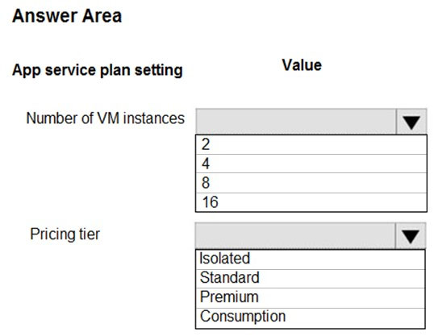
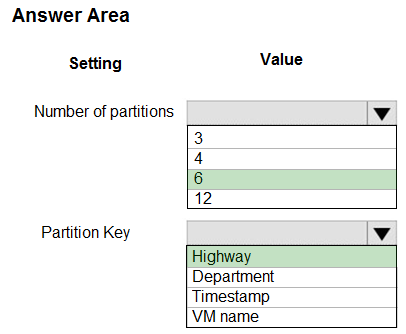
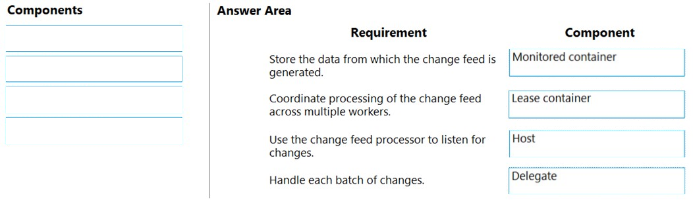
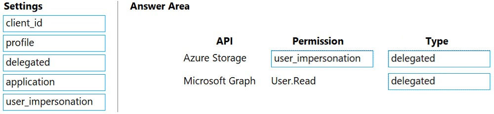
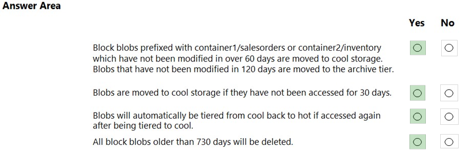
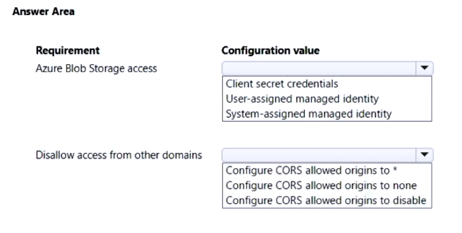
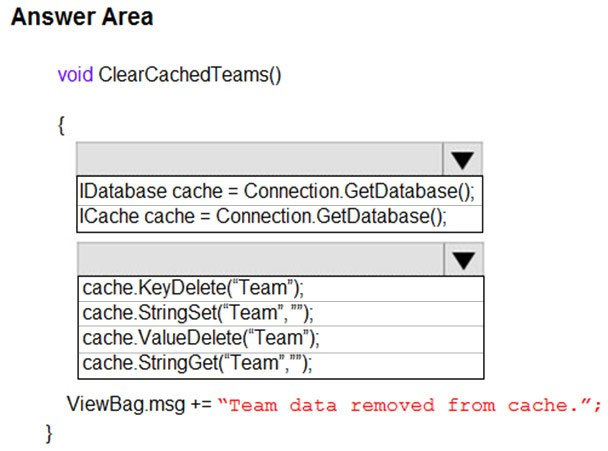
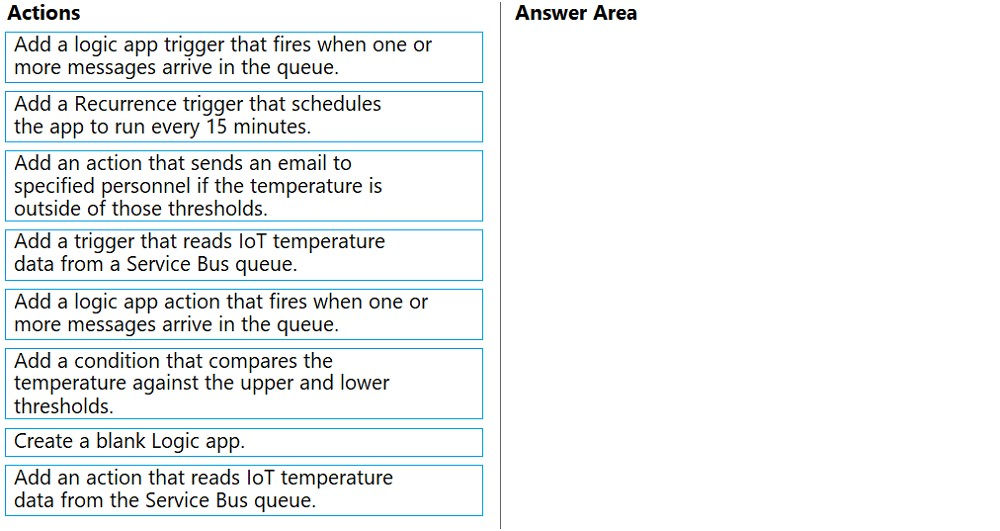

Question #1

You have two Hyper-V hosts named Host1 and Host2. Host1 has an Azure virtual machine named VM1 that was deployed by using a custom Azure Resource Manager template.
You need to move VM1 to Host2.
What should you do?

	A. From the Update management blade, click Enable.
	B. From the Overview blade, move VM1 to a different subscription.
	C. From the Redeploy blade, click Redeploy.
	D. From the Profile blade, modify the usage location.

Correct Answer: C 

When you redeploy a VM, it moves the VM to a new node within the Azure infrastructure and then powers it back on, retaining all your configuration options and associated resources.

---

Question #2

DRAG DROP -
You have downloaded an Azure Resource Manager template to deploy numerous virtual machines. The template is based on a current virtual machine, but must be adapted to reference an administrative password.
You need to make sure that the password is not stored in plain text.
You are preparing to create the necessary components to achieve your goal.
Which of the following should you create to achieve your goal? Answer by dragging the correct option from the list to the answer area.
Select and Place:


Key Vault + Access Policy.

Using Key Vault we create a secret containing our Password: https://docs.microsoft.com/en-us/azure/key-vault/secrets/quick-create-portal .

Using an Access Policy we allow access to the previously created secret.

Documentation Guide: https://docs.microsoft.com/en-us/azure/azure-resource-manager/templates/key-vault-parameter?tabs=azure-cli

---

Question #3
Your company has an Azure Kubernetes Service (AKS) cluster that you manage from an Azure AD-joined device. The cluster is located in a resource group.
Developers have created an application named MyApp. MyApp was packaged into a container image.
You need to deploy the YAML manifest file for the application.
Solution: You install the Azure CLI on the device and run the `kubectl apply -f myapp.yaml` command.
Does this meet the goal?

	A. Yes
	B. No

Correct Answer: A

---

Question #4

Your company has an Azure Kubernetes Service (AKS) cluster that you manage from an Azure AD-joined device. The cluster is located in a resource group.
Developers have created an application named MyApp. MyApp was packaged into a container image.
You need to deploy the YAML manifest file for the application.

Solution: You install the docker client on the device and run the `docker run -it microsoft/azure-cli:0.10.17` command.
Does this meet the goal?

	A. Yes
	B. No

Correct Answer: B

---

Question #5

Your company has a web app named WebApp1.
You use the WebJobs SDK to design a triggered App Service background task that automatically invokes a function in the code every time new data is received in a queue.
You are preparing to configure the service processes a queue data item.
Which of the following is the service you should use?

	A. Logic Apps
	B. WebJobs
	C. Flow
	D. Functions

Correct Answer: B

Reference:
https://docs.microsoft.com/en-us/azure/azure-functions/functions-compare-logic-apps-ms-flow-webjobs

---

Question #6

Your company has an Azure subscription.
You need to deploy a number of Azure virtual machines to the subscription by using Azure Resource Manager (ARM) templates. The virtual machines will be included in a single availability set.
You need to ensure that the ARM template allows for as many virtual machines as possible to remain accessible in the event of fabric failure or maintenance.
Which of the following is the value that you should configure for the platformFaultDomainCount property?

	A. 10
	B. 30
	C. Min Value
	D. Max Value

Correct Answer: D

The number of fault domains for managed availability sets varies by region - either two or three per region.

https://learn.microsoft.com/en-us/azure/virtual-machine-scale-sets/virtual-machine-scale-sets-manage-fault-domains

You can set the parameter --platform-fault-domain-count to 1, 2, or 3 (default of 3 if not specified). Refer to the documentation for Azure CLI here.

---

Question #7

Your company has an Azure subscription.
You need to deploy a number of Azure virtual machines to the subscription by using Azure Resource Manager (ARM) templates. The virtual machines will be included in a single availability set.
You need to ensure that the ARM template allows for as many virtual machines as possible to remain accessible in the event of fabric failure or maintenance.
Which of the following is the value that you should configure for the platformUpdateDomainCount property?

	A. 10
	B. 20
	C. 30
	D. 40

Correct Answer: B

Answer is B 20
Each availability set can be configured with up to three fault domains and twenty update domains.
https://docs.microsoft.com/en-us/azure/virtual-machines/availability-set-overview
The platformUpdateDomainCount property in Azure Resource Manager (ARM) templates specifies the number of update domains that should be created for the availability set. The maximum value for this property is 20.

---

Question #8
DRAG DROP -
You are creating an Azure Cosmos DB account that makes use of the SQL API. Data will be added to the account every day by a web application.
You need to ensure that an email notification is sent when information is received from IoT devices, and that compute cost is reduced.
You decide to deploy a function app.
Which of the following should you configure the function app to use? Answer by dragging the correct options from the list to the answer area.
Select and Place:


Correct awnser:

Consumption plan
SendGrid binding


Azure Functions 中的 SendGrid 绑定是一种用于与 SendGrid 电子邮件服务集成的功能。通过使用 SendGrid 绑定，你可以在 Azure Functions 中轻松地发送电子邮件，无需编写大量的代码。

---

Question #9

This question requires that you evaluate the underlined text to determine if it is correct.
You company has an on-premises deployment of MongoDB, and an Azure Cosmos DB account that makes use of the MongoDB API.
You need to devise a strategy to migrate MongoDB to the Azure Cosmos DB account.
You include the Data Management Gateway tool in your migration strategy.
Instructions: Review the underlined text. If it makes the statement correct, select `No change required.` If the statement is incorrect, select the answer choice that makes the statement correct.

题目中说的underlined text应该指的是Data Management Gateway

	A. No change required
	B. mongorestore
	C. Azure Storage Explorer
	D. AzCopy


Answer: B --mongorestore
https://docs.microsoft.com/en-us/azure/cosmos-db/mongodb-pre-migration

Data Management Gateway is not supported for Azure Cosmos DB - Mongo API

Got this on the Microsoft documentation: "The MongoDB native tools are a set of binaries that facilitate data manipulation on an existing MongoDB instance. Since Azure Cosmos DB exposes an API for MongoDB, the MongoDB native tools are able to insert data into Azure Cosmos DB. The focus of this doc is on migrating data out of a MongoDB instance using mongoexport/mongoimport or mongodump/mongorestore. Since the native tools connect to MongoDB using connection strings, you can run the tools anywhere, however we recommend running these tools within the same network as the MongoDB instance to avoid firewall issues."

---

Question #10

You are developing an e-Commerce Web App.
You want to use Azure Key Vault to ensure that sign-ins to the e-Commerce Web App are secured by using Azure App Service authentication and Azure Active Directory (AAD).
What should you do on the e-Commerce Web App?

	A. Run the az keyvault secret command.
	B. Enable Azure AD Connect.
	C. Enable Managed Service Identity (MSI).
	D. Create an Azure AD service principal.

Correct Answer: C

A managed identity from Azure Active Directory allows your app to easily access other AAD-protected resources such as Azure Key Vault.
Reference:
https://docs.microsoft.com/en-us/azure/app-service/overview-managed-identity https://docs.microsoft.com/en-us/samples/azure-samples/app-service-msi-keyvault-dotnet/keyvault-msi-appservice-sample/

Managed Service Identity (MSI) is a feature in Azure that allows you to securely authenticate an Azure service to other Azure services without having to manage credentials. By enabling MSI on the Azure App Service hosting the e-Commerce Web App, you can create a trust relationship between the App Service and Azure Key Vault. This allows the e-Commerce Web App to authenticate with Azure Active Directory (AAD) and securely retrieve secrets from the Key Vault.

Managed Service Identity (MSI) 是 Azure 中的一项安全功能，它提供了一种简化和增强身份验证的方法。通过使用 Managed Service Identity，Azure 资源（如虚拟机、Azure Functions、Web 应用等）可以在 Azure Active Directory (Azure AD) 中自动注册和管理标识，而无需明文存储凭据。

---

Question #11

This question requires that you evaluate the underlined text to determine if it is correct.
Your Azure Active Directory Azure (Azure AD) tenant has an Azure subscription linked to it.
Your developer has created a mobile application that obtains Azure AD access tokens using the OAuth 2 implicit grant type.
The mobile application must be registered in Azure AD.
You require a redirect URI from the developer for registration purposes.
Instructions: Review the underlined text. If it makes the statement correct, select `No change is needed.` If the statement is incorrect, select the answer choice that makes the statement correct.

underlined text指的应该是Redirect URI

	A. No change required.
	B. a secret
	C. a login hint
	D. a client ID

Correct Answer: A

For Native Applications you need to provide a Redirect URI, which Azure AD will use to return token responses.
Reference:
https://docs.microsoft.com/en-us/azure/active-directory/develop/v1-protocols-oauth-code


Redirect URI（Uniform Resource Identifier）是在 OAuth 2.0 和 OpenID Connect 认证流程中使用的一个重要参数。在这两个协议中，Redirect URI 用于指定用户在完成身份验证后应该被重定向到的目标地址。

在 OAuth 2.0 和 OpenID Connect 中，认证流程通常包括以下步骤：

用户发起认证请求： 用户向身份提供者（Identity Provider，例如认证服务器）发起身份验证请求。这通常是通过在应用程序中点击“登录”按钮或发起登录请求的方式。

身份提供者验证用户： 身份提供者验证用户的身份，并要求用户授予应用程序访问其受保护资源的权限。

生成授权码或令牌： 一旦用户成功验证，身份提供者生成一个授权码（Authorization Code）或访问令牌（Access Token）。

重定向用户： 在这一步，身份提供者需要将用户重定向回应用程序。这时就用到了 Redirect URI。

应用程序接收令牌或授权码： 应用程序的服务器（后端）会接收到从身份提供者返回的授权码或令牌。

Redirect URI 是在第4步中用于指定身份提供者将用户重定向到应用程序的地址。该 URI 必须是应用程序事先在身份提供者注册的地址之一，以确保安全性和避免恶意行为。通常，开发者需要在应用程序的身份提供者配置中注册 Redirect URI，以允许身份提供者将用户重定向到应用程序的正确位置。

需要注意的是，Redirect URI 在注册时通常包含了应用程序的标识信息和处理授权或认证的终结点。在接收到身份提供者返回的令牌或授权码后，应用程序通常会使用 Redirect URI 处理后续的认证和授权流程。

---

Question #12

You are creating an Azure key vault using PowerShell. Objects deleted from the key vault must be kept for a set period of 90 days.
Which two of the following parameters must be used in conjunction to meet the requirement? (Choose two.)

	A. EnabledForDeployment
	B. EnablePurgeProtection
	C. EnabledForTemplateDeployment
	D. EnableSoftDelete

Correct Answer: BD

Reference:
https://docs.microsoft.com/en-us/powershell/module/azurerm.keyvault/new-azurermkeyvault
https://docs.microsoft.com/en-us/azure/key-vault/key-vault-ovw-soft-delete

EnabledForDeployment is a property of Azure Key Vault that allows you to control whether the Key Vault can be deployed as part of an Azure Resource Manager (ARM) template deployment.
When EnabledForDeployment is set to true, it means that the Key Vault can be included in ARM templates and deployed using Azure Resource Manager.

EnablePurgeProtection is a property of Azure Key Vault's soft delete feature.
When EnablePurgeProtection is set to true, it ensures that deleted Key Vault entities (such as secrets, keys, or certificates) cannot be permanently deleted immediately.

EnabledForTemplateDeployment is a property of Azure Key Vault that determines whether the Key Vault can be deployed as part of an Azure Resource Manager (ARM) template deployment.

EnableSoftDelete is a property of Azure Key Vault that enables the soft delete feature for the Key Vault.
Soft delete allows you to recover deleted entities (secrets, keys, or certificates) within a specified retention period, even after they have been deleted.

---

Question #13

HOTSPOT -
You have an Azure Active Directory (Azure AD) tenant.
You want to implement multi-factor authentication by making use of a conditional access policy. The conditional access policy must be applied to all users when they access the Azure portal.
Which three settings should you configure? To answer, select the appropriate settings in the answer area.
NOTE: Each correct selection is worth one point.
Hot Area:


Correct awnser:


Box 1:
The conditional access policy must be applied or assigned to Users and Groups.
Box 2:
The conditional access policy must be applied when users access the Azure portal, which is a cloud app. That is: Microsoft Azure Management
Box 3:
Access control must require multi-factor authentication when granting access.
Reference:

https://docs.microsoft.com/en-us/azure/active-directory/conditional-access/app-based-mfa

https://learn.microsoft.com/en-us/azure/active-directory/conditional-access/howto-conditional-access-policy-all-users-mfa#create-a-conditional-access-policy

---

Question #14

You manage an Azure SQL database that allows for Azure AD authentication.
You need to make sure that database developers can connect to the SQL database via Microsoft SQL Server Management Studio (SSMS). You also need to make sure the developers use their on-premises Active Directory account for authentication. Your strategy should allow for authentication prompts to be kept to a minimum.
Which of the following should you implement?

	A. Azure AD token.
	B. Azure Multi-Factor authentication.
	C. Active Directory integrated authentication.
	D. OATH software tokens.

Correct Answer: C

使用 Active Directory 集成身份验证，你可以实现 Azure SQL 数据库的 Azure AD 身份验证，并使数据库开发人员能够使用他们在本地 Active Directory 中的帐户登录，同时最小化身份验证提示。这样，他们可以使用他们已经掌握的本地 Active Directory 凭据连接到数据库而无需额外的多因素身份验证。

---

Question #15

You are developing an application to transfer data between on-premises file servers and Azure Blob storage. The application stores keys, secrets, and certificates in Azure Key Vault and makes use of the Azure Key Vault APIs.
You want to configure the application to allow recovery of an accidental deletion of the key vault or key vault objects for 90 days after deletion.What should you do?

	A. Run the Add-AzKeyVaultKey cmdlet.
	B. Run the az keyvault update --enable-soft-delete true --enable-purge-protection true CLI.
	C. Implement virtual network service endpoints for Azure Key Vault.
	D. Run the az keyvault update --enable-soft-delete false CLI.

Correct Answer: B

---

Question #16

HOTSPOT -
You have developed a Web App for your company. The Web App provides services and must run in multiple regions.
You want to be notified whenever the Web App uses more than 85 percent of the available CPU cores over a 5 minute period. Your solution must minimize costs.
Which command should you use? To answer, select the appropriate settings in the answer area.
NOTE: Each correct selection is worth one point.
Hot Area:


https://docs.microsoft.com/sv-se/cli/azure/monitor/metrics/alert

For anyone wondering why it's --window-size and not --evaluation-frequency: you want the average across 5 minutes. With --evaluation-frequency you don't go for averages, you simply check what the given value is at specific intervals.

---

Question #17

Note: The question is included in a number of questions that depicts the identical set-up. However, every question has a distinctive result. Establish if the solution satisfies the requirements.
You are configuring a web app that delivers streaming video to users. The application makes use of continuous integration and deployment.
You need to ensure that the application is highly available and that the users' streaming experience is constant. You also want to configure the application to store data in a geographic location that is nearest to the user.
Solution: You include the use of Azure Redis Cache in your design.
Does the solution meet the goal?

	A. Yes
	B. No

Correct Answer: B

Redis caches won't support streaming video content. Azure CDN is suitable.

根据提供的信息，Azure Redis Cache 确实可以提高应用程序的性能和可伸缩性，并通过缓存数据来提供更一致的用户体验。然而，要实现数据存储在距离用户最近的地理位置，可能需要考虑其他 Azure 服务，如 Azure Content Delivery Network (CDN) 或 Azure Blob 存储。

---

Question #18

Note: The question is included in a number of questions that depicts the identical set-up. However, every question has a distinctive result. Establish if the solution satisfies the requirements.
You are configuring a web app that delivers streaming video to users. The application makes use of continuous integration and deployment.
You need to ensure that the application is highly available and that the users' streaming experience is constant. You also want to configure the application to store data in a geographic location that is nearest to the user.
Solution: You include the use of an Azure Content Delivery Network (CDN) in your design.
Does the solution meet the goal?

	A. Yes
	B. No

Correct Answer: A

---

Question #19

Note: The question is included in a number of questions that depicts the identical set-up. However, every question has a distinctive result. Establish if the solution satisfies the requirements.
You are configuring a web app that delivers streaming video to users. The application makes use of continuous integration and deployment.
You need to ensure that the application is highly available and that the users' streaming experience is constant. You also want to configure the application to store data in a geographic location that is nearest to the user.
Solution: You include the use of a Storage Area Network (SAN) in your design.
Does the solution meet the goal?

	A. Yes
	B. No

Correct Answer: B

不符合目标。

Storage Area Network (SAN) 通常用于中央存储，不设计为根据用户的地理位置来优化数据存储。要实现将数据存储在离用户最近的地理位置的目标，其他解决方案，如内容交付网络 (CDN) 或分布式存储选项，将更为适合。SAN通常用于块级存储，不具备根据地理位置进行内容交付或分布的内在优化。

A Storage Area Network (SAN) is a dedicated network that provides access to consolidated, block-level data storage. It is used to increase the availability of data and improve the performance of applications that require access to shared data. However, SANs do not provide features to ensure high availability of web applications, nor do they provide a mechanism to store data in the geographic location nearest to the user.

---

Question #20

You develop a Web App on a tier D1 app service plan.
You notice that page load times increase during periods of peak traffic.
You want to implement automatic scaling when CPU load is above 80 percent. Your solution must minimize costs.
What should you do first?

	A. Enable autoscaling on the Web App.
	B. Switch to the Premium App Service tier plan.
	C. Switch to the Standard App Service tier plan.
	D. Switch to the Azure App Services consumption plan.

Correct Answer: C

Configure the web app to the Standard App Service Tier. The Standard tier supports auto-scaling, and we should minimize the cost. We can then enable autoscaling on the web app, add a scale rule and add a Scale condition.
Reference:
https://docs.microsoft.com/en-us/azure/monitoring-and-diagnostics/monitoring-autoscale-get-started https://azure.microsoft.com/en-us/pricing/details/app-service/plans/

Tier D1 is a basically shared app service plan, so we need to move standard or premium plan to enable auto scaling. As we need to provide low cost solution, then standard plan will be best for this approach

---

Question #21

Your company's Azure subscription includes an Azure Log Analytics workspace.
Your company has a hundred on-premises servers that run either Windows Server 2012 R2 or Windows Server 2016, and is linked to the Azure Log Analytics workspace. The Azure Log Analytics workspace is set up to gather performance counters associated with security from these linked servers.
You must configure alerts based on the information gathered by the Azure Log Analytics workspace.
You have to make sure that alert rules allow for dimensions, and that alert creation time should be kept to a minimum. Furthermore, a single alert notification must be created when the alert is created and when the alert is resolved.
You need to make use of the necessary signal type when creating the alert rules.
Which of the following is the option you should use?

	A. The Activity log signal type.
	B. The Application Log signal type.
	C. The Metric signal type.
	D. The Audit Log signal type.

Correct Answer: C

https://learn.microsoft.com/en-us/azure/azure-monitor/alerts/alerts-metric-logs#configuring-metric-alert-for-logs

C is correct. "Metric Alerts are stateful - only notifying once when alert is fired and once when alert is resolved; as opposed to Log alerts, which are stateless and keep firing at every interval if the alert condition is met."

在配置 Azure Log Analytics workspace 的警报规则时，根据题意，你需要确保警报规则允许使用维度，同时最小化警报的创建时间，且在创建和解决警报时只生成单个通知。

正确的选项是：

C. The Metric signal type（指标信号类型）

Metric signal type 允许你基于性能计数器等指标生成警报规则，并且通常用于监视和报警。这种信号类型支持维度（Dimensions），使你能够更精细地定义和配置警报规则，同时确保在创建和解决警报时只生成单个通知。

---

Question #22

You are developing a .NET Core MVC application that allows customers to research independent holiday accommodation providers.
You want to implement Azure Search to allow the application to search the index by using various criteria to locate documents related to accommodation.
You want the application to allow customers to search the index by using regular expressions.
What should you do?

	A. Configure the SearchMode property of the SearchParameters class.
	B. Configure the QueryType property of the SearchParameters class.
	C. Configure the Facets property of the SearchParameters class.
	D. Configure the Filter property of the SearchParameters class.

Correct Answer: B

要在 .NET Core MVC 应用程序中使用 Azure Search，以便允许按照各种标准搜索索引，包括使用正则表达式搜索文档，你应该：

B. 配置 SearchParameters 类的 QueryType 属性。

QueryType 属性可用于指定查询的类型。对于支持 Lucene 查询语法的 Azure Search 索引，将 QueryType 设置为 SearchQueryType.Full 可以让你使用正则表达式等高级查询。这样，你可以更灵活地定义搜索条件以匹配索引中的文档。

---

Question #23

You are a developer at your company.
You need to update the definitions for an existing Logic App.
What should you use?

	A. the Enterprise Integration Pack (EIP)
	B. the Logic App Code View
	C. the API Connections
	D. the Logic Apps Designer

Correct Answer: B

这题似乎不再是考试范围之内的题目了

B. Logic App Code View

Logic App Code View 允许你直接编辑 Logic App 的底层工作流定义（以 JSON 格式表示）。这提供了一种详细和精确修改 Logic App 行为的方式。对于那些熟悉 JSON 并希望对 Logic App 结构和行为进行细粒度控制的开发人员来说，Logic App Code View 是一个有价值的工具。

---

Question #24

Note: The question is included in a number of questions that depicts the identical set-up. However, every question has a distinctive result. Establish if the solution satisfies the requirements.
You are developing a solution for a public facing API.
The API back end is hosted in an Azure App Service instance. You have implemented a RESTful service for the API back end.
You must configure back-end authentication for the API Management service instance.
Solution: You configure Basic gateway credentials for the Azure resource.
Does the solution meet the goal?

	A. Yes
	B. No

Correct Answer: B 不确定

There are two components we're interested in:
a. APIM, and
b. App Service (resource)

The App Service doesn't support basic-auth at all; though APIM does. The tricky part is the word "resource" which is App Service.

不符合目标。

仅为 Azure 资源配置基本网关凭据本身并不足以为 API Management 服务实例配置后端身份验证。在 API Management 的上下文中，后端身份验证通常涉及配置托管在 Azure App Service 中的 API 的必要身份验证设置，这可能包括 API 密钥、OAuth 或其他身份验证机制。

要实现 API Management 服务实例的后端身份验证，你需要为 Azure App Service 中托管的底层 API 配置适当的身份验证设置。Azure 资源的基本网关凭据通常与管理访问相关，不直接解决 API 的后端身份验证需求。

To achieve back-end authentication for the API Management service instance, you need to configure the appropriate authentication settings for the underlying API hosted in the Azure App Service. Basic gateway credentials for the Azure resource are generally related to administrative access and do not directly address the back-end authentication requirements for the API.

---

Question #25

Note: The question is included in a number of questions that depicts the identical set-up. However, every question has a distinctive result. Establish if the solution satisfies the requirements.
You are developing a solution for a public facing API.
The API back end is hosted in an Azure App Service instance. You have implemented a RESTful service for the API back end.
You must configure back-end authentication for the API Management service instance.
Solution: You configure Client cert gateway credentials for the HTTP(s) endpoint.
Does the solution meet the goal?

	A. Yes
	B. No

Correct Answer: A 不确定

This is scenario questions.
If backend is accepts HTTP(S)
Then Basic AUTH or Certificate will work.
so Client Certificate + HTTP(s) YES

配置 HTTP(s) 终结点的客户端证书网关凭据是为 API Management 服务实例配置后端身份验证的一种有效方式。通过使用客户端证书，你可以确保只有具有有效证书的请求才能够访问你的 API 后端。这提供了额外的安全性层，确保只有经过授权的客户端可以调用 API。因此，这个解决方案满足目标。

---

Question #26

Note: The question is included in a number of questions that depicts the identical set-up. However, every question has a distinctive result. Establish if the solution satisfies the requirements.
You are developing a solution for a public facing API.
The API back end is hosted in an Azure App Service instance. You have implemented a RESTful service for the API back end.
You must configure back-end authentication for the API Management service instance.
Solution: You configure Basic gateway credentials for the HTTP(s) endpoint.
Does the solution meet the goal?

	A. Yes
	B. No

A 不确定

This is scenario questions.
If backend is accepts HTTP(S)
Then Basic AUTH or Certificate will work.
so Basic + HTTPS Yes

Target: "Azure Logic App" or "HTTP(s) endpoint"
Gateway credentials: "None" or "Basic" or "Client cert"

https://docs.microsoft.com/en-us/azure/api-management/api-management-howto-mutual-certificates#configure-an-api-to-use-client-certificate-for-gateway-authentication

---

Question #27
Note: The question is included in a number of questions that depicts the identical set-up. However, every question has a distinctive result. Establish if the solution satisfies the requirements.
You are developing a solution for a public facing API.
The API back end is hosted in an Azure App Service instance. You have implemented a RESTful service for the API back end.
You must configure back-end authentication for the API Management service instance.
Solution: You configure Client cert gateway credentials for the Azure resource.
Does the solution meet the goal?

	A. Yes
	B. No

B 不确定

This is scenario questions.
If backend is accepts HTTP(S)
Then Basic AUTH or Certificate will work.
so Certificate + Azure Resource NO
https://www.youtube.com/watch?v=HQ0U7lwP93o

---

Question #28

You are developing a .NET Core MVC application that allows customers to research independent holiday accommodation providers.
You want to implement Azure Search to allow the application to search the index by using various criteria to locate documents related to accommodation venues.
You want the application to list holiday accommodation venues that fall within a specific price range and are within a specified distance to an airport.
What should you do?

	A. Configure the SearchMode property of the SearchParameters class.
	B. Configure the QueryType property of the SearchParameters class.
	C. Configure the Facets property of the SearchParameters class.
	D. Configure the Filter property of the SearchParameters class.

Correct Answer: D

你应该：

D. 配置 SearchParameters 类的 Filter 属性。

Filter 属性用于指定搜索结果的筛选条件，你可以使用它来限制在特定价格范围内和指定距离内的搜索结果。通过配置 Filter 属性，你可以实现根据价格和距离来筛选和显示符合条件的度假住宿场所。

---

Question #29

You are a developer at your company.
You need to edit the workflows for an existing Logic App.
What should you use?

	A. the Enterprise Integration Pack (EIP)
	B. the Logic App Code View
	C. the API Connections
	D. the Logic Apps Designer

Correct Answer: D

不确定，但是我觉得workflow用designer比较好改

---

Question #30

DRAG DROP -
You are a developer for a company that provides a bookings management service in the tourism industry. You are implementing Azure Search for the tour agencies listed in your company's solution.
You create the index in Azure Search. You now need to use the Azure Search .NET SDK to import the relevant data into the Azure Search service.
Which three actions should you perform in sequence? To answer, move the appropriate actions from the list of actions from left to right and arrange them in the correct order.

Select and Place:

	Create a DataSource instance and set its Container property to the DataContainer.
	Create an IndexBatch that contains the documents which must be added.
	Set the DataSources property of the SearchServiceClient.
	Create a SearchlndexClient object to connect to the search index.
	Call the Documents.Index method of the SearchindexClient and pass the IndexBatch
	Call the Documents.Suggest method of the SearchindexClient and pass the DataSource

Answer:

	Create a SearchlndexClient object to connect to the search index.
	Create an IndexBatch that contains the documents which must be added.
	Call the Documents.Index method of the SearchindexClient and pass the IndexBatch

注：Azure search is out of scope for AZ-204

---

Question #31

You are developing an application that applies a set of governance policies for internal and external services, as well as for applications.
You develop a stateful ASP.NET Core 2.1 web application named PolicyApp and deploy it to an Azure App Service Web App. The PolicyApp reacts to events from
Azure Event Grid and performs policy actions based on those events.
You have the following requirements:
✑ Authentication events must be used to monitor users when they sign in and sign out.
✑ All authentication events must be processed by PolicyApp.
✑ Sign outs must be processed as fast as possible.
What should you do?

	A. Create a new Azure Event Grid subscription for all authentication events. Use the subscription to process sign-out events.
	B. Create a separate Azure Event Grid handler for sign-in and sign-out events.
	C. Create separate Azure Event Grid topics and subscriptions for sign-in and sign-out events.
	D. Add a subject prefix to sign-out events. Create an Azure Event Grid subscription. Configure the subscription to use the subjectBeginsWith filter.

Correct Answer: C 不确定

Only C is mentioned both topic and subscription, which are two critical parts for event grid, so I will go C, anyway, this question is very poorly worded

根据给定的要求，你应该选择：

C. 为登录和登出事件创建单独的 Azure Event Grid 主题和订阅。

这种方法允许你为登录和登出事件分别创建专用主题，提供更好的分离和处理每种事件类型的灵活性。通过拥有单独的主题，你可以为每种事件类型创建订阅，确保 PolicyApp 处理登录和登出的身份验证事件。

选项 A 可能是一个有效的方法，但它没有提供所需的分离和灵活性。选项 B 不是理想的选择，因为它暗示使用单个处理程序处理登录和登出事件。选项 D 引入了使用主题前缀过滤的复杂性，而单独的主题提供了一种更清晰和可维护的解决方案。

---

Question #32

HOTSPOT -
You are developing a C++ application that compiles to a native application named process.exe. The application accepts images as input and returns images in one of the following image formats: GIF, PNG, or JPEG.
You must deploy the application as an Azure Function.
You need to configure the function and host json files.
How should you complete the json files? To answer, select the appropriate options in the answer area.
NOTE: Each correct selection is worth one point.


**the last one should be true**

- Your Azure Function will be a custom handler since Azure Functions doesn't directly support C++ as a runtime.
- enableForwardingHttpRequest is set to true to allow the custom handler to receive the HTTP request data

In the function.json file, enableForwardingHttpRequest should be set to true for the Azure Function to accept HTTP requests and forward them to the C++ application for processing.

This is because the C++ application is compiled as a native application and cannot directly receive HTTP requests. By setting enableForwardingHttpRequest to true, the Azure Function acts as a proxy and forwards incoming HTTP requests to the C++ application.

---

Question #33

HOTSPOT

You are developing an Azure Static Web app that contains training materials for a tool company. Each tool’s training material is contained in a static web page that is linked from the tool’s publicly available description page.

A user must be authenticated using Azure AD prior to viewing training.

You need to ensure that the user can view training material pages after authentication.

How should you complete the configuration file? To answer, select the appropriate options in the answer area.

NOTE: Each correct selection is worth one point.


Got on 9/25/2023
responseoverrides
401
aad
.referrer

---

Question #34

HOTSPOT

You are authoring a set of nested Azure Resource Manager templates to deploy Azure resources. You author an Azure Resource Manager template named mainTemplate.json that contains the following linked templates: linkedTemplate1.json, linkedTemplate2.json.

You add parameters to a parameters template file named mainTemplate.parameters,json. You save all templates on a local device in the C:\templates\ folder.

You have the following requirements:

• Store the templates in Azure for later deployment.
• Enable versioning of the templates.
• Manage access to the templates by using Azure RBAC.
• Ensure that users have read-only access to the templates.
• Allow users to deploy the templates.

You need to store the templates in Azure.

How should you complete the command? To answer, select the appropriate options in the answer area.

NOTE: Each correct selection is worth one point.


correct
https://learn.microsoft.com/en-us/azure/azure-resource-manager/templates/template-specs-create-linked?tabs=azure-cli

---

Question #35

HOTSPOT

You are developing a service where customers can report news events from a browser using Azure Web PubSub. The service is implemented as an Azure Function App that uses the JSON WebSocket subprotocol to receive news events.

You need to implement the bindings for the Azure Function App.

How should you configure the binding? To answer, select the appropriate options in the answer area.

NOTE: Each correct selection is worth one point.


Given answer is correct.
https://learn.microsoft.com/en-us/azure/azure-web-pubsub/reference-functions-bindings?tabs=javascript

---

Question #36

HOTSPOT

You are building a software-as-a-service (SaaS) application that analyzes DNA data that will run on Azure virtual machines (VMs) in an availability zone. The data is stored on managed disks attached to the VM. The performance of the analysis is determined by the speed of the disk attached to the VM.

You have the following requirements:

• The application must be able to quickly revert to the previous day’s data if a systemic error is detected.
• The application must minimize downtime in the case of an Azure datacenter outage.

You need to provision the managed disk for the VM to maximize performance while meeting the requirements.

Which type of Azure Managed Disk should you use? To answer, select the appropriate options in the answer area.

NOTE: Each correct selection is worth one point.


Wrong answer: Managed disk doesn't support GRS

Ans: Premium SSD and ZRS
They are asking for high performance workloads which is supported by Premium tier https://learn.microsoft.com/en-us/azure/virtual-machines/disks-types
Also they are asking for zone redundancy (if datacenter goes down, NOT region outage). Also managed disk doesn't support GRS https://learn.microsoft.com/en-us/azure/virtual-machines/disks-redundancy

Locally Redundant Storage (LRS):

* 冗余级别： 数据在同一区域的多个存储节点上进行三次复制。
* 故障转移范围： 限于同一 Azure 区域。
* 成本： 相对较低，是较为经济的选项。
* 应用场景： 适用于对数据冗余要求不高，但仍希望在同一区域内获得某种程度的冗余和可靠性。

Geo-Redundant Storage (GRS):

* 冗余级别： 数据在主区域内进行 LRS 复制，同时异步复制到辅助区域。
* 故障转移范围： 跨 Azure 区域。
* 成本： 相对较高，因为提供了跨区域的冗余。
* 应用场景： 适用于对数据要求较高的冗余，希望在主要区域发生故障时能够迅速切换到辅助区域。

Zone-Redundant Storage (ZRS):

* 冗余级别： 数据在同一区域的不同可用性区域内进行复制。
* 故障转移范围： 限于同一 Azure 区域，但是可以跨多个可用性区域。
* 成本： 介于 LRS 和 GRS 之间。
* 应用场景： 适用于要求高可用性且能够抵御单一可用性区域故障的情况。

WHEN THEY SAY 'Azure datacenter outage' they are implying a data center within a region which is hosted in one of the region's three zones. That alone gives it away that its ZRS with P-SSD.

---

Question #37

HOTSPOT

You are developing an application that includes two Docker containers.

The application must meet the following requirements:

• The containers must not run as root.
• The containers must be deployed to Azure Container Instances by using a YAML file.
• The containers must share a lifecycle, resources, local network, and storage volume.
• The storage volume must persist through container crashes.
• The storage volume must be deployed on stop or restart of the containers.

You need to configure Azure Container Instances for the application.

Which configuration values should you use? To answer, select the appropriate options in the answer area.

NOTE: Each correct selection is worth one point.


Ans: Container group, EmptyDir

Container group is the only logical answer that can have shared lifecycle https://learn.microsoft.com/en-us/azure/container-instances/container-instances-container-groups?source=recommendations#what-is-a-container-group
Azure files need root permission
Secret is for secrets and read-only
EmtyDir can persist through crash and redeployed on stop and restart
https://learn.microsoft.com/en-us/azure/container-instances/container-instances-volume-emptydir#emptydir-volume
Cloned Git Repo also does the job but it needs more details like Git URL and stuff which are not mentioned to be available in the question

---

38

HOTSPOT -

You are implementing a software as a service (SaaS) ASP.NET Core web service that will run as an Azure Web App. The web service will use an on-premises
SQL Server database for storage. The web service also includes a WebJob that processes data updates. Four customers will use the web service.
✑ Each instance of the WebJob processes data for a single customer and must run as a singleton instance.
✑ Each deployment must be tested by using deployment slots prior to serving production data.
✑ Azure costs must be minimized.
✑ Azure resources must be located in an isolated network.
You need to configure the App Service plan for the Web App.
How should you configure the App Service plan? To answer, select the appropriate settings in the answer area.
NOTE: Each correct selection is worth one point.
Hot Area:




Box 1: 4
There are four customers that use this service, and each instance of the WebJob processes data for a single customer and must run as a singleton instance. So, the number of VM should be 4. WebJobs is a feature of Azure App Service that enables you to run a program or script in the same instance as a web app. Like running background tasks.

Box 2: Isolated
Azure resources must be located in an isolated network .
In the Isolated tier, the App Service Environment defines the number of isolated workers that run your apps, and each worker is charged. In addition, there's a flat Stamp Fee for the running the App Service Environment itself. Isolated: This tier runs dedicated Azure VMs on dedicated Azure Virtual Networks. It provides network isolation on top of compute isolation to your apps. It provides the maximum scale-out capabilities.

---

39

DRAG DROP -
You are a developer for a software as a service (SaaS) company that uses an Azure Function to process orders. The Azure Function currently runs on an Azure
Function app that is triggered by an Azure Storage queue.
You are preparing to migrate the Azure Function to Kubernetes using Kubernetes-based Event Driven Autoscaling (KEDA).
You need to configure Kubernetes Custom Resource Definitions (CRD) for the Azure Function.
Which CRDs should you configure? To answer, drag the appropriate CRD types to the correct locations. Each CRD type may be used once, more than once, or not at all. You may need to drag the split bar between panes or scroll to view content.
NOTE: Each correct selection is worth one point.
Select and Place:


Box 1: Deployment
To deploy Azure Functions to Kubernetes use the func kubernetes deploy command has several attributes that directly control how our app scales, once it is deployed to Kubernetes.

Box 2: ScaledObject
With --polling-interval, we can control the interval used by KEDA to check Azure Service Bus Queue for messages.

Box 3: Secret
Store connection strings in Kubernetes Secrets.

---

40

HOTSPOT -
You are creating a CLI script that creates an Azure web app and related services in Azure App Service. The web app uses the following variables:


You need to automatically deploy code from GitHub to the newly created web app.
How should you complete the script? To answer, select the appropriate options in the answer area.
NOTE: Each correct selection is worth one point.
Hot Area:


Given answer is correct, got this on my test yesterday

---

41

Note: This question is part of a series of questions that present the same scenario. Each question in the series contains a unique solution that might meet the stated goals. Some question sets might have more than one correct solution, while others might not have a correct solution.
After you answer a question in this section, you will NOT be able to return to it. As a result, these questions will not appear in the review screen.
You develop a software as a service (SaaS) offering to manage photographs. Users upload photos to a web service which then stores the photos in Azure
Storage Blob storage. The storage account type is General-purpose V2.
When photos are uploaded, they must be processed to produce and save a mobile-friendly version of the image. The process to produce a mobile-friendly version of the image must start in less than one minute.
You need to design the process that starts the photo processing.
Solution: Trigger the photo processing from Blob storage events.
Does the solution meet the goal?

	A. Yes
	B. No

B 不确定

Hi All,
The answer (B) is correct. Because, the trick is in the "less than one minute" detail.
You can read about "..10-minute delay in processing new blobs.." in "3-Minimizing latency" description.
Microsoft says: ".....Use Event Grid instead of the Blob storage trigger for the following scenarios:"
1-Blob-only storage accounts: Blob-only storage accounts are supported for blob input and output bindings but not for blob triggers.
2-High-scale: High scale can be loosely defined as containers that have more than 100,000 blobs in them or storage accounts that have more than 100 blob updates per second.
3-Minimizing latency: If your function app is on the Consumption plan, there can be up to a **10-minute delay in processing new blobs** if a function app has gone idle. To avoid this latency, you can switch to an App Service plan with Always On enabled. You can also use an Event Grid trigger with your Blob storage account. For an example, see the Event Grid tutorial.

REFENCE: https://docs.microsoft.com/en-us/azure/azure-functions/functions-bindings-storage-blob-trigger?tabs=csharp#event-grid-trigger

I wish you a good day.

---

42

Note: This question is part of a series of questions that present the same scenario. Each question in the series contains a unique solution that might meet the stated goals. Some question sets might have more than one correct solution, while others might not have a correct solution.
After you answer a question in this section, you will NOT be able to return to it. As a result, these questions will not appear in the review screen.
You develop and deploy an Azure App Service API app to a Windows-hosted deployment slot named Development. You create additional deployment slots named Testing and Production. You enable auto swap on the Production deployment slot.
You need to ensure that scripts run and resources are available before a swap operation occurs.
Solution: Update the web.config file to include the applicationInitialization configuration element. Specify custom initialization actions to run the scripts.
Does the solution meet the goal?

	A. No
	B. Yes

B

This should work:
https://docs.microsoft.com/en-us/azure/app-service/deploy-staging-slots#specify-custom-warm-up

解决方案中的方法是更新 web.config 文件以包含 applicationInitialization 配置元素，并指定要运行脚本的自定义初始化操作。这样可以确保在执行交换操作之前运行脚本并准备资源，从而满足要求。

---

43

Note: This question is part of a series of questions that present the same scenario. Each question in the series contains a unique solution that might meet the stated goals. Some question sets might have more than one correct solution, while others might not have a correct solution.
After you answer a question in this section, you will NOT be able to return to it. As a result, these questions will not appear in the review screen.
You develop and deploy an Azure App Service API app to a Windows-hosted deployment slot named Development. You create additional deployment slots named Testing and Production. You enable auto swap on the Production deployment slot.
You need to ensure that scripts run and resources are available before a swap operation occurs.
Solution: Enable auto swap for the Testing slot. Deploy the app to the Testing slot.
Does the solution meet the goal?

	A. No
	B. Yes

A

I vote A, No, because for me the solution is updating the web.config file to include the applicationInitialization configuration element.

---

44

Note: This question is part of a series of questions that present the same scenario. Each question in the series contains a unique solution that might meet the stated goals. Some question sets might have more than one correct solution, while others might not have a correct solution.
After you answer a question in this section, you will NOT be able to return to it. As a result, these questions will not appear in the review screen.
You develop and deploy an Azure App Service API app to a Windows-hosted deployment slot named Development. You create additional deployment slots named Testing and Production. You enable auto swap on the Production deployment slot.
You need to ensure that scripts run and resources are available before a swap operation occurs.
Solution: Disable auto swap. Update the app with a method named statuscheck to run the scripts. Re-enable auto swap and deploy the app to the Production slot.
Does the solution meet the goal?

	A. No
	B. Yes

A

Ok, my bad autoswap has to be configured on the Staging Slot. So "You enable auto swap on the Production deployment slot." is not what you would do. Answer is A (NO).

---

45

Note: This question is part of a series of questions that present the same scenario. Each question in the series contains a unique solution that might meet the stated goals. Some question sets might have more than one correct solution, while others might not have a correct solution.
After you answer a question in this section, you will NOT be able to return to it. As a result, these questions will not appear in the review screen.

You develop a software as a service (SaaS) offering to manage photographs. Users upload photos to a web service which then stores the photos in Azure Storage Blob storage. The storage account type is General-purpose V2.
When photos are uploaded, they must be processed to produce and save a mobile-friendly version of the image. The process to produce a mobile-friendly version of the image must start in less than one minute.
You need to design the process that starts the photo processing.
Solution: Convert the Azure Storage account to a BlockBlobStorage storage account.
Does the solution meet the goal?

	A. Yes
	B. No

Correct Answer: B

不符合目标。

将 Azure 存储帐户转换为 BlockBlobStorage 存储帐户与在一分钟内启动照片处理的目标不直接相关。存储帐户类型本身并不确定启动照片处理的方式。

为了实现目标，你应该考虑使用具有 Blob 存储触发器或事件网格的 Azure Functions，在上传新照片到 Blob 存储时触发照片处理。配置适当的基于事件的机制将确保在上传照片后尽快启动照片处理，而不管存储帐户类型如何。

---

46

HOTSPOT -
You are developing an Azure Web App. You configure TLS mutual authentication for the web app.
You need to validate the client certificate in the web app. To answer, select the appropriate options in the answer area.
NOTE: Each correct selection is worth one point.
Hot Area:


Box 1: HTTP request header
If you are using ASP.NET and configure your app to use client certificate authentication, the certificate will be available through the HttpRequest.ClientCertificate property.

Box 2: Base64
For other application stacks, the client cert will be available in your app through a base64 encoded value in the "X-ARR-ClientCert" request header. Your application can create a certificate from this value and then use it for authentication and authorization purposes in your application.

Reference:

https://docs.microsoft.com/en-us/azure/app-service/app-service-web-configure-tls-mutual-auth

---

47

DRAG DROP -
You are developing a Docker/Go using Azure App Service Web App for Containers. You plan to run the container in an App Service on Linux. You identify a
Docker container image to use.
None of your current resource groups reside in a location that supports Linux. You must minimize the number of resource groups required.
You need to create the application and perform an initial deployment.
Which three Azure CLI commands should you use to develop the solution? To answer, move the appropriate commands from the list of commands to the answer area and arrange them in the correct order.
Select and Place:


Within the same resource group, you can't mix Windows and Linux apps in the same region.
https://docs.microsoft.com/en-us/azure/app-service/overview#app-service-on-linux
"None of your current resource groups reside in a location that supports Linux"
So you have to create new resource group. Answer is correct.

---

48

DRAG DROP -
Fourth Coffee has an ASP.NET Core web app that runs in Docker. The app is mapped to the www.fourthcoffee.com domain.
Fourth Coffee is migrating this application to Azure.
You need to provision an App Service Web App to host this docker image and map the custom domain to the App Service web app.
A resource group named FourthCoffeePublicWebResourceGroup has been created in the WestUS region that contains an App Service Plan named
AppServiceLinuxDockerPlan.
Which order should the CLI commands be used to develop the solution? To answer, move all of the Azure CLI commands from the list of commands to the answer area and arrange them in the correct order.
Select and Place:


1. /bin/bash
2. az webpp create
3.  config container set
4.  config hostname add


Step 1: #bin/bash -
The appName is used when the webapp-name is created in step 2.

Step 2: az webapp create -
Create a web app. In the Cloud Shell, create a web app in the myAppServicePlan App Service plan with the az webapp create command.

Step 3: az webapp config container set
In Create a web app, you specified an image on Docker Hub in the az webapp create command. This is good enough for a public image. To use a private image, you need to configure your Docker account ID and password in your Azure web app.

Step 4: az webapp config hostname add
The webapp-name is used when the webapp is created in step 2.
In the Cloud Shell, follow the az webapp create command with az webapp config container set.

---

49

DRAG DROP -
You are developing a serverless Java application on Azure. You create a new Azure Key Vault to work with secrets from a new Azure Functions application.
The application must meet the following requirements:
✑ Reference the Azure Key Vault without requiring any changes to the Java code.
✑ Dynamically add and remove instances of the Azure Functions host based on the number of incoming application events.
✑ Ensure that instances are perpetually warm to avoid any cold starts.
✑ Connect to a VNet.
✑ Authentication to the Azure Key Vault instance must be removed if the Azure Function application is deleted.
You need to grant the Azure Functions application access to the Azure Key Vault.
Which three actions should you perform in sequence? To answer, move the appropriate actions from the list of actions to the answer area and arrange them in the correct order.
Select and Place:


1. create Premium plan Type (Consumption X)
2. create system-assigned  (user-assigned X)
3. create an access policy in Azure Key Vault

I agree with you.
1. Premium plan (avoid any cold starts and connect to a VNet)
Overview of plans here: https://docs.microsoft.com/th-th/azure/azure-functions/functions-scale
2. create system-assigned => "A system-assigned identity is tied to your application and is deleted if your app is deleted."
3. create an access policy
https://docs.microsoft.com/en-us/azure/app-service/app-service-key-vault-references?toc=%2Fazure%2Fazure-functions%2Ftoc.json&tabs=azure-cli

---

50

You develop a website. You plan to host the website in Azure. You expect the website to experience high traffic volumes after it is published.
You must ensure that the website remains available and responsive while minimizing cost.
You need to deploy the website.
What should you do?

	A. Deploy the website to a virtual machine. Configure the virtual machine to automatically scale when the CPU load is high.
	B. Deploy the website to an App Service that uses the Shared service tier. Configure the App Service plan to automatically scale when the CPU load is high.
	C. Deploy the website to a virtual machine. Configure a Scale Set to increase the virtual machine instance count when the CPU load is high.
	D. Deploy the website to an App Service that uses the Standard service tier. Configure the App Service plan to automatically scale when the CPU load is high.

Correct Answer: D

Windows Azure Web Sites (WAWS) offers 3 modes: Standard, Free, and Shared.
Standard mode carries an enterprise-grade SLA (Service Level Agreement) of 99.9% monthly, even for sites with just one instance.
Standard mode runs on dedicated instances, making it different from the other ways to buy Windows Azure Web Sites.
Incorrect Answers:
B: Shared and Free modes do not offer the scaling flexibility of Standard, and they have some important limits.
Shared mode, just as the name states, also uses shared Compute resources, and also has a CPU limit. So, while neither Free nor Shared is likely to be the best choice for your production environment due to these limits.

To ensure that the website remains available and responsive while minimizing cost, you should deploy the website to an App Service that uses the Standard service tier and configure the App Service plan to automatically scale when the CPU load is high. This way, the website can handle high traffic volumes by automatically scaling the number of instances of the website, reducing the risk of the website becoming unavailable due to high traffic.

---

51

HOTSPOT
A company is developing a Java web app. The web app code is hosted in a GitHub repository located at https://github.com/Contoso/webapp.
The web app must be evaluated before it is moved to production. You must deploy the initial code release to a deployment slot named staging.
You need to create the web app and deploy the code.
How should you complete the commands? To answer, select the appropriate options in the answer area.
NOTE: Each correct selection is worth one point.
Hot Area:


Box 1: group -
Create a resource group.
az group create --location westeurope --name myResourceGroup

Box 2: appservice plan -
Create an App Service plan in STANDARD tier (minimum required by deployment slots). az appservice plan create --name $webappname --resource-group myResourceGroup --sku S1

Box 3: webapp -
Create a web app.
az webapp create --name $webappname --resource-group myResourceGroup \
--plan $webappname

Box 4: webapp deployment slot -
Create a deployment slot with the name "staging".
az webapp deployment slot create --name $webappname --resource-group myResourceGroup \
--slot staging

Box 5: webapp deployment source -
Deploy sample code to "staging" slot from GitHub.
az webapp deployment source config --name $webappname --resource-group myResourceGroup \
--slot staging --repo-url $gitrepo --branch master --manual-integration
Reference:
https://docs.microsoft.com/en-us/azure/app-service/scripts/cli-deploy-staging-environment

Given answer is correct.

---

52

HOTSPOT
You have a web service that is used to pay for food deliveries. The web service uses Azure Cosmos DB as the data store.
You plan to add a new feature that allows users to set a tip amount. The new feature requires that a property named tip on the document in Cosmos DB must be present and contain a numeric value.
There are many existing websites and mobile apps that use the web service that will not be updated to set the tip property for some time.
How should you complete the trigger?
NOTE: Each correct selection is worth one point.
Hot Area:


**Right answer in second drop down is the first one (..."tip" in i...)**

Similiar example can be found on https://docs.microsoft.com/en-us/azure/cosmos-db/how-to-write-stored-procedures-triggers-udfs

1. getRequest
2. (!"tip" in i)
3. setBody

---

53

Note: This question is part of a series of questions that present the same scenario. Each question in the series contains a unique solution that might meet the stated goals. Some question sets might have more than one correct solution, while others might not have a correct solution.
After you answer a question in this section, you will NOT be able to return to it. As a result, these questions will not appear in the review screen.
You develop an HTTP triggered Azure Function app to process Azure Storage blob data. The app is triggered using an output binding on the blob.
The app continues to time out after four minutes. The app must process the blob data.
You need to ensure the app does not time out and processes the blob data.
Solution: Use the Durable Function async pattern to process the blob data.
Does the solution meet the goal?

	A. Yes
	B. No

A. Yes

"230 seconds is the maximum amount of time[...] For longer processing times, consider using the DURABLE FUNCTIONS ASYNC PATTERN[...]"
https://docs.microsoft.com/en-us/azure/azure-functions/functions-scale#timeout

A. Yes

使用 Durable Functions 异步模式是一种解决函数运行时间限制问题的方法。Durable Functions 允许你创建长时间运行的工作流，通过将任务分解为可暂停和恢复的状态，以避免 HTTP 触发的 Azure Function 在默认的运行时间内超时。

因此，使用 Durable Functions 异步模式来处理 Blob 数据是一个符合目标的解决方案。

---

54

Note: This question is part of a series of questions that present the same scenario. Each question in the series contains a unique solution that might meet the stated goals. Some question sets might have more than one correct solution, while others might not have a correct solution.
After you answer a question in this section, you will NOT be able to return to it. As a result, these questions will not appear in the review screen.
You develop an HTTP triggered Azure Function app to process Azure Storage blob data. The app is triggered using an output binding on the blob.
The app continues to time out after four minutes. The app must process the blob data.
You need to ensure the app does not time out and processes the blob data.
Solution: Pass the HTTP trigger payload into an Azure Service Bus queue to be processed by a queue trigger function and return an immediate HTTP success response.
Does the solution meet the goal?

	A. Yes
	B. No

Correct Answer: A 不确定

https://docs.microsoft.com/en-us/azure/azure-functions/performance-reliability#avoid-long-running-functions

> You can pass the HTTP trigger payload into a queue to be processed by a queue trigger function. This approach lets you defer the actual work and return an immediate response.

---

55

Note: This question is part of a series of questions that present the same scenario. Each question in the series contains a unique solution that might meet the stated goals. Some question sets might have more than one correct solution, while others might not have a correct solution.
After you answer a question in this section, you will NOT be able to return to it. As a result, these questions will not appear in the review screen.
You develop an HTTP triggered Azure Function app to process Azure Storage blob data. The app is triggered using an output binding on the blob.
The app continues to time out after four minutes. The app must process the blob data.
You need to ensure the app does not time out and processes the blob data.
Solution: Configure the app to use an App Service hosting plan and enable the Always On setting.
Does the solution meet the goal?

	A. Yes
	B. No

Correct Answer: B

No is the answer, but the reason is the timeout being raised by HTTP layer from the Azure Load Balancer, not the App layer that at least it gives 5 minutes for the cheapest type, Consumption, so however you enhance the app layer, the http layer Azure Load Balance will not wait more than 230 second and will reply it as timeout. Use the durable function pattern to poll the status for completion will be the easiest solution, else avoid the http layer like service bus will work too.

https://docs.microsoft.com/en-us/azure/azure-functions/functions-scale

> Regardless of the function app timeout setting, 230 seconds is the maximum amount of time that an HTTP triggered function can take to respond to a request. This is because of the default idle timeout of Azure Load Balancer. For longer processing times, consider using the Durable Functions async pattern or defer the actual work and return an immediate response.

---

56

Note: This question is part of a series of questions that present the same scenario. Each question in the series contains a unique solution that might meet the stated goals. Some question sets might have more than one correct solution, while others might not have a correct solution.
After you answer a question in this section, you will NOT be able to return to it. As a result, these questions will not appear in the review screen.
You develop a software as a service (SaaS) offering to manage photographs. Users upload photos to a web service which then stores the photos in Azure Storage Blob storage. The storage account type is General-purpose V2.
When photos are uploaded, they must be processed to produce and save a mobile-friendly version of the image. The process to produce a mobile-friendly version of the image must start in less than one minute.
You need to design the process that starts the photo processing.
Solution: Move photo processing to an Azure Function triggered from the blob upload.
Does the solution meet the goal?

	A. Yes
	B. No

A 不确定

The answer is correct, but it should have also mentioned that the function app must not be on a consumption plan. because in that case, it might take up to 10 minutes to process the event.

---

57

You are developing an application that uses Azure Blob storage.
The application must read the transaction logs of all the changes that occur to the blobs and the blob metadata in the storage account for auditing purposes. The changes must be in the order in which they occurred, include only create, update, delete, and copy operations and be retained for compliance reasons.
You need to process the transaction logs asynchronously.
What should you do?

	A. Process all Azure Blob storage events by using Azure Event Grid with a subscriber Azure Function app.
	B. Enable the change feed on the storage account and process all changes for available events.
	C. Process all Azure Storage Analytics logs for successful blob events.
	D. Use the Azure Monitor HTTP Data Collector API and scan the request body for successful blob events.

Correct Answer: B

https://docs.microsoft.com/en-us/azure/storage/blobs/storage-blob-change-feed

启用存储帐户上的更改 feed 并处理所有可用事件是一个符合要求的解决方案。更改 feed 提供了对 Blob 存储中 blob 创建、更新、删除和复制操作的有序记录。通过启用更改 feed，可以异步处理这些更改以进行审核，并满足合规性要求。

---

58

DRAG DROP
You plan to create a Docker image that runs an ASP.NET Core application named ContosoApp. You have a setup script named setupScript.ps1 and a series of application files including ContosoApp.dll.
You need to create a Dockerfile document that meets the following requirements:
✑ Call setupScripts.ps1 when the container is built.
✑ Run ContosoApp.dll when the container starts.
The Dockerfile document must be created in the same folder where ContosoApp.dll and setupScript.ps1 are stored.
Which five commands should you use to develop the solution? To answer, move the appropriate commands from the list of commands to the answer area and arrange them in the correct order.
Select and Place:


It should be:
- FROM
- WORKDIR
- COPY
- RUN
- CMD

Same question on:
https://www.examtopics.com/discussions/microsoft/view/13131-exam-az-300-topic-3-question-4-discussion/

And:
https://www.examtopics.com/discussions/microsoft/view/11045-exam-az-203-topic-1-question-7-discussion/

---

59

You are developing an Azure Function App that processes images that are uploaded to an Azure Blob container.
Images must be processed as quickly as possible after they are uploaded, and the solution must minimize latency. You create code to process images when the Function App is triggered.
You need to configure the Function App.
What should you do?

	A. Use an App Service plan. Configure the Function App to use an Azure Blob Storage input trigger.
	B. Use a Consumption plan. Configure the Function App to use an Azure Blob Storage trigger.
	C. Use a Consumption plan. Configure the Function App to use a Timer trigger.
	D. Use an App Service plan. Configure the Function App to use an Azure Blob Storage trigger.
	E. Use a Consumption plan. Configure the Function App to use an Azure Blob Storage input trigger.

Correct Answer: D

The answer is D. Use an App Service plan. Configure the Function App to use an Azure Blob Storage trigger.
**Consumption plan can cause a 10-min delay in processing new blobs if a function app has gone idle.** To avoid this latency, you can switch to an App Service plan with Always On enabled.
https://docs.microsoft.com/en-us/azure/azure-functions/functions-bindings-storage-blob-trigger?tabs=csharp

Consumption Plan（消耗计划）：

计费模型： 消耗计划是一种无服务器计算模型，您根据实际执行函数时消耗的资源支付费用。

App Service Plan（应用服务计划）：

计费模型： 应用服务计划是一种更传统的托管模型，您根据分配的虚拟机资源支付费用，而不考虑实际使用情况。

---

60

HOTSPOT -
You are configuring a new development environment for a Java application.
The environment requires a Virtual Machine Scale Set (VMSS), several storage accounts, and networking components.
The VMSS must not be created until the storage accounts have been successfully created and an associated load balancer and virtual network is configured.
How should you complete the Azure Resource Manager template? To answer, select the appropriate options in the answer area.
NOTE: Each correct selection is worth one point.
Hot Area:


Box 1: copyIndex
Notice that the name of each resource includes the copyIndex() function, which returns the current iteration in the loop. copyIndex() is zero-based.

Box 2: copy
By adding copy loop to the resources section of your template, you can dynamically set the number of resources to deploy. You also avoid having to repeat template syntax.

Box 3: dependsOn
Within your Azure Resource Manager template (ARM template), the dependsOn element enables you to define one resource as a dependent on one or more resources.

Reference:
https://docs.microsoft.com/en-us/azure/azure-resource-manager/templates/copy-resources
https://docs.microsoft.com/en-us/azure/virtual-machine-scale-sets/quick-create-template-windows
https://docs.microsoft.com/en-us/azure/azure-resource-manager/templates/define-resource-dependency

---

61

HOTSPOT
You are developing an Azure Function App by using Visual Studio. The app will process orders input by an Azure Web App. The web app places the order information into Azure Queue Storage.
You need to review the Azure Function App code shown below.


Box 1: No
It logs the following:
- ExpirationTime - The time that the message expires.
- InsertionTime - The time that the message was added to the queue.

Box 2: Yes
maxDequeueCount: The number of times to try processing a message before moving it to the poison queue. Default value is 5.

Box 3: Yes
When there are multiple queue messages waiting, the queue trigger retrieves a batch of messages and invokes function instances concurrently to process them. By default, the batch size is 16. When the number being processed gets down to 8, the runtime gets another batch and starts processing those messages. So the maximum number of concurrent messages being processed per function on one virtual machine (VM) is 24.

Box 4: Yes
[Table("Orders")]ICollector<Order> table bindings
And in the code it adds the order:
tableBindings.Add(JsonConvert.DeserializeObject<Object>(myQueueItem.AsString));

---

62

DRAG DROP
You are developing a solution for a hospital to support the following use cases:
✑ The most recent patient status details must be retrieved even if multiple users in different locations have updated the patient record.
✑ Patient health monitoring data retrieved must be the current version or the prior version.
✑ After a patient is discharged and all charges have been assessed, the patient billing record contains the final charges.
You provision a Cosmos DB NoSQL database and set the default consistency level for the database account to Strong. You set the value for Indexing Mode to
Consistent.
You need to minimize latency and any impact to the availability of the solution. You must override the default consistency level at the query level to meet the required consistency guarantees for the scenarios.
Which consistency levels should you implement? To answer, drag the appropriate consistency levels to the correct requirements. Each consistency level may be used once, more than once, or not at all. You may need to drag the split bar between panes or scroll to view content.
NOTE: Each correct selection is worth one point.
Select and Place:


Box 1: Strong

Box 2: Bounded staleness

Box 3: Eventual

Note: Consistent prefix: Updates that are returned contain some prefix of all the updates, with no gaps. Consistent prefix guarantees that reads never see out-of-order writes.

Reference:
https://docs.microsoft.com/en-us/azure/cosmos-db/consistency-levels

The most recent patient status details must be retrieved even if multiple users in different locations have updated the patient record.

建议使用 Strong Consistency（强一致性）： 因为需要确保即使多个用户在不同地点更新了患者记录，也能够获取到最新的患者状态详情，这要求保证读取操作具有最新的一致性。
Patient health monitoring data retrieved must be the current version or the prior version.

建议使用 Bounded Staleness Consistency（有界陈旧一致性）： 由于要求获取患者健康监测数据时可以是当前版本或上一个版本，这表明可以接受一定程度的陈旧，因此使用有界陈旧一致性是一个合理的选择。
After a patient is discharged and all charges have been assessed, the patient billing record contains the final charges.

建议使用 Eventual Consistency（最终一致性）： 因为在患者出院并评估所有费用后，患者的计费记录包含最终费用，这种情况下，对于计费记录的一致性要求可能没有那么高，可以接受稍有延迟，因此最终一致性是一个适当的选择。

---

63

HOTSPOT -
You are configuring a development environment for your team. You deploy the latest Visual Studio image from the Azure Marketplace to your Azure subscription.
The development environment requires several software development kits (SDKs) and third-party components to support application development across the organization. You install and customize the deployed virtual machine (VM) for your development team. The customized VM must be saved to allow provisioning of a new team member development environment.
You need to save the customized VM for future provisioning.
Which tools or services should you use? To answer, select the appropriate options in the answer area.
NOTE: Each correct selection is worth one point.


Box 1: Azure Powershell
Creating an image directly from the VM ensures that the image includes all of the disks associated with the VM, including the OS disk and any data disks. Before you begin, make sure that you have the latest version of the Azure PowerShell module. You use Sysprep to generalize the virtual machine, then use Azure PowerShell to create the image.

Box 2: Azure Blob Storage
A VM Image is a collection of metadata and pointers to a set of VHDs (one VHD per disk) stored as page blobs in Azure Storage.

Reference:

https://azure.microsoft.com/en-us/blog/vm-image-blog-post

https://docs.microsoft.com/en-us/azure/virtual-machines/windows/capture-image-resource

---

64

You are preparing to deploy a website to an Azure Web App from a GitHub repository. The website includes static content generated by a script.
You plan to use the Azure Web App continuous deployment feature.
You need to run the static generation script before the website starts serving traffic.
What are two possible ways to achieve this goal? Each correct answer presents a complete solution.
NOTE: Each correct selection is worth one point.

	A. Add the path to the static content generation tool to WEBSITE_RUN_FROM_PACKAGE setting in the host.json file.
	B. Add a PreBuild target in the websites csproj project file that runs the static content generation script.
	C. Create a file named run.cmd in the folder /run that calls a script which generates the static content and deploys the website.
	D. Create a file named .deployment in the root of the repository that calls a script which generates the static content and deploys the website.

BD 不确定

两种可能的方式来在 Azure Web App 连续部署之前运行静态生成脚本是：

B. 在网站的 csproj 项目文件中添加 PreBuild 目标，运行静态内容生成脚本。

通过在项目文件中添加 PreBuild 目标，可以确保在构建过程中运行静态内容生成脚本。
D. 在仓库的根目录下创建名为 .deployment 的文件，调用一个脚本来生成静态内容并部署网站。

创建一个名为 .deployment 的文件，其中包含对静态内容生成脚本的调用，这样可以确保在部署时运行该脚本。
这两个选项都提供了在 Web App 连续部署之前运行静态生成脚本的完整解决方案。

---

65

DRAG DROP
You are developing an application to use Azure Blob storage. You have configured Azure Blob storage to include change feeds.
A copy of your storage account must be created in another region. Data must be copied from the current storage account to the new storage account directly between the storage servers.
You need to create a copy of the storage account in another region and copy the data.
In which order should you perform the actions? To answer, move all actions from the list of actions to the answer area and arrange them in the correct order.
Select and Place:


I think you first have to export the Resource Manager template before you can create a new template deployment. **So, swap options 1 and 2 from the solution.** In the first link of the solution's text, exporting is also considere as the first step.

	Export
	Create
	Modify
	Deploy
	AZ copy

---

66

DRAG DROP
You are preparing to deploy an Azure virtual machine (VM)-based application.
The VMs that run the application have the following requirements:
✑ When a VM is provisioned the firewall must be automatically configured before it can access Azure resources.
✑ Supporting services must be installed by using an Azure PowerShell script that is stored in Azure Storage.
You need to ensure that the requirements are met.
Which features should you use? To answer, drag the appropriate features to the correct requirements. Each feature may be used once, more than once, or not at all. You may need to drag the split bar between panes or scroll to view content.
NOTE: Each correct selection is worth one point.
Select and Place:


Box 1: Run Command
This capability is useful in all scenarios where you want to run a script within a VM. It's one of the only ways to troubleshoot and remediate a VM that doesn't have the RDP or SSH port open, because of improper network or administrative user configuration.

Box 2: Customer Script Extension
The Custom Script Extension downloads and executes scripts on Azure virtual machines. This extension is useful for post deployment configuration, software installation, or any other configuration or management tasks. Scripts can be downloaded from Azure storage or GitHub, or provided to the Azure portal at extension run time. The Custom Script Extension integrates with Azure Resource Manager templates, and can be run using the Azure CLI, PowerShell, Azure portal, or the Azure Virtual Machine REST API.

---

67

A company is developing a Node.js web app. The web app code is hosted in a GitHub repository located at https://github.com/TailSpinToys/webapp.
The web app must be reviewed before it is moved to production. You must deploy the initial code release to a deployment slot named review.
You need to create the web app and deploy the code.
How should you complete the commands? To answer, select the appropriate options in the answer area.
NOTE: Each correct selection is worth one point.
Hot Area:


Box 1: New-AzResourceGroup
The New-AzResourceGroup cmdlet creates an Azure resource group.

Box 2: New-AzAppServicePlan
The New-AzAppServicePlan cmdlet creates an Azure App Service plan in a given location

Box 3: New-AzWebApp
The New-AzWebApp cmdlet creates an Azure Web App in a given a resource group

Box 4: New-AzWebAppSlot
The New-AzWebAppSlot cmdlet creates an Azure Web App slot

---

68

HOTSPOT -
You are developing an application that needs access to an Azure virtual machine (VM).
The access lifecycle for the application must be associated with the VM service instance.
You need to enable managed identity for the VM.
How should you complete the PowerShell segment? To answer, select the appropriate options in the answer area.
NOTE: Each correct selection is worth one point.
Hot Area:


Box 1: -IdentityType
-IdentityType: The type of identity used for the virtual machine. Valid values are SystemAssigned, UserAssigned, SystemAssignedUserAssigned, and None.

-IdentityId: Specifies the list of user identities associated with the virtual machine. The user identity references will be ARM resource IDs in the form:

Box 2: $SystemAssigned
There are two types of managed identities:
- System-assigned: Some Azure services allow you to enable a managed identity directly on a service instance. When you enable a system-assigned managed identity an identity is created in Azure AD that is tied to the lifecycle of that service instance. So when the resource is deleted, Azure automatically deletes the identity for you. By design, only that Azure resource can use this identity to request tokens from Azure AD.
- User-assigned: You may also create a managed identity as a standalone Azure resource. You can create a user-assigned managed identity and assign it to one or more instances of an Azure service. In the case of user-assigned managed identities, the identity is managed separately from the resources that use it.

---

69

Note: This question is part of a series of questions that present the same scenario. Each question in the series contains a unique solution that might meet the stated goals. Some question sets might have more than one correct solution, while others might not have a correct solution.
After you answer a question in this section, you will NOT be able to return to it. As a result, these questions will not appear in the review screen.
You develop a software as a service (SaaS) offering to manage photographs. Users upload photos to a web service which then stores the photos in Azure
Storage Blob storage. The storage account type is General-purpose V2.
When photos are uploaded, they must be processed to produce and save a mobile-friendly version of the image. The process to produce a mobile-friendly version of the image must start in less than one minute.
You need to design the process that starts the photo processing.
Solution: Create an Azure Function app that uses the Consumption hosting model and that is triggered from the blob upload.
Does the solution meet the goal?

	A. Yes
	B. No

B

Answer should be "No". **Consumption plan can take up to several minutes** to trigger the function. See note from https://docs.microsoft.com/en-us/azure/azure-functions/functions-create-storage-blob-triggered-function.

"When your function app runs in the default Consumption plan, there may be a delay of up to several minutes between the blob being added or updated and the function being triggered. If you need low latency in your blob triggered functions, consider running your function app in an App Service plan."

---

70

Note: This question is part of a series of questions that present the same scenario. Each question in the series contains a unique solution that might meet the stated goals. Some question sets might have more than one correct solution, while others might not have a correct solution.
After you answer a question in this section, you will NOT be able to return to it. As a result, these questions will not appear in the review screen.
You develop and deploy an Azure App Service API app to a Windows-hosted deployment slot named Development. You create additional deployment slots named Testing and Production. You enable auto swap on the Production deployment slot.
You need to ensure that scripts run and resources are available before a swap operation occurs.
Solution: Update the app with a method named statuscheck to run the scripts. Update the app settings for the app. Set the
WEBSITE_SWAP_WARMUP_PING_PATH and WEBSITE_SWAP_WARMUP_PING_STATUSES with a path to the new method and appropriate response codes.
Does the solution meet the goal?

	A. No
	B. Yes

B 不确定

Should be YES?
https://docs.microsoft.com/en-us/azure/app-service/deploy-staging-slots

You can also customize the warm-up behavior with one or both of the following app settings:

WEBSITE_SWAP_WARMUP_PING_PATH: The path to ping to warm up your site. Add this app setting by specifying a custom path that begins with a slash as the value. An example is /statuscheck. The default value is /.
WEBSITE_SWAP_WARMUP_PING_STATUSES: Valid HTTP response codes for the warm-up operation. Add this app setting with a comma-separated list of HTTP codes. An example is 200,202 . If the returned status code isn't in the list, the warmup and swap operations are stopped. By default, all response codes are valid.
WEBSITE_WARMUP_PATH: A relative path on the site that should be pinged whenever the site restarts (not only during slot swaps). Example values include /statuscheck or the root path, /.

---

71

You create the following PowerShell script:


For each of the following statements, select Yes if the statement is true. Otherwise, select No.


Box 1: No -
The AzScheduledQueryRuleSource is Heartbeat, not CPU.

Box 2: Yes -
The AzScheduledQueryRuleSource is Heartbeat!
Note: New-AzScheduledQueryRuleTriggerCondition creates an object of type Trigger Condition. This object is to be passed to the command that creates Alerting
Action object.

Box 3: No -
The schedule is 60 minutes, not two hours.
-FrequencyInMinutes: The alert frequency.
-TimeWindowInMinutes: The alert time window
The New-AzAscheduledQueryRuleSchedule command creates an object of type Schedule. This object is to be passed to the command that creates Log Alert
Rule.
Reference:
https://docs.microsoft.com/en-us/powershell/module/az.monitor/new-azscheduledqueryrule https://docs.microsoft.com/en-us/powershell/module/az.monitor/new-azscheduledqueryruletriggercondition


I agree.
No
Yes
No

---

72

DRAG DROP -
You are developing an Azure Function app.
The app must meet the following requirements:
✑ Enable developers to write the functions by using the Rust language.
✑ Declaratively connect to an Azure Blob Storage account.
You need to implement the app.
Which Azure Function app features should you use? To answer, drag the appropriate features to the correct requirements. Each feature may be used once, more than once, or not at all. You may need to drag the split bar between panes or scroll to view content.
NOTE: Each correct selection is worth one point.
Select and Place:


Box 1: Custom handler
Custom handlers can be used to create functions in any language or runtime by running an HTTP server process, for example Go or Rust.

Box 2: extension bundles
is needed to support the bindings and triggers that you use
https://docs.microsoft.com/en-us/azure/azure-functions/functions-custom-handlers?WT.mc_id=thomasmaurer-blog-thmaure#bindings-support

https://learn.microsoft.com/en-us/azure/azure-functions/functions-custom-handlers
- With custom handlers, you can use triggers and input and output bindings via extension bundles.
So: Custom Handler and Extension bundles.
Azure Functions 中的 Extension Bundles 是一种机制，用于在 Azure Functions 应用程序中包含一组常见的 Azure Functions 扩展。这些扩展包括与常见的绑定（如 Blob 存储、Azure Cosmos DB、Event Hubs 等）和触发器（如 HTTP 触发器、定时触发器等）相关的功能。通过使用 Extension Bundles，可以将扩展捆绑到应用程序中，而不是在每个函数中单独引用。

---

73

HOTSPOT -
You are developing an ASP.NET Core web application. You plan to deploy the application to Azure Web App for Containers.
The application needs to store runtime diagnostic data that **must be persisted across application restarts**. You have the following code:


You need to configure the application settings so that diagnostic data is stored as required.
How should you configure the web app's settings? To answer, select the appropriate options in the answer area.
NOTE: Each correct selection is worth one point.
Hot Area:


I think the printed image is creating confusion. The correct answers (according to the image) are:
WEBSITES_ENABLE_APP_SERVICE_STORAGE=true
DIAGDATA=/home

Box 1: If WEBSITES_ENABLE_APP_SERVICE_STORAGE
If WEBSITES_ENABLE_APP_SERVICE_STORAGE setting is unspecified or set to true, the /home/ directory will be shared across scale instances, and files written will persist across restarts

Box 2: /home

Reference:
https://docs.microsoft.com/en-us/azure/app-service/containers/app-service-linux-faq

---

74

You are developing a web app that is protected by Azure Web Application Firewall (WAF). All traffic to the web app is routed through an Azure Application
Gateway instance that is used by multiple web apps. The web app address is contoso.azurewebsites.net.
All traffic must be secured with SSL. The Azure Application Gateway instance is used by multiple web apps.
You need to configure the Azure Application Gateway for the web app.
Which two actions should you perform? Each correct answer presents part of the solution.
NOTE: Each correct selection is worth one point.

	A. In the Azure Application Gateway's HTTP setting, enable the Use for App service setting.
	B. Convert the web app to run in an Azure App service environment (ASE).
	C. Add an authentication certificate for contoso.azurewebsites.net to the Azure Application Gateway.
	D. In the Azure Application Gateway's HTTP setting, set the value of the Override backend path option to contoso22.azurewebsites.net.

AD 不确定

D: The ability to specify a host override is defined in the HTTP settings and can be applied to any back-end pool during rule creation.
The ability to derive the host name from the IP or FQDN of the back-end pool members. HTTP settings also provide an option to dynamically pick the host name from a back-end pool member's FQDN if configured with the option to derive host name from an individual back-end pool member.

A (not C): SSL termination and end to end SSL with multi-tenant services.
In case of end to end SSL, trusted Azure services such as Azure App service web apps do not require whitelisting the backends in the application gateway.

Therefore, there is no need to add any authentication certificates.


---

75

Note: This question is part of a series of questions that present the same scenario. Each question in the series contains a unique solution that might meet the stated goals. Some question sets might have more than one correct solution, while others might not have a correct solution.
After you answer a question in this section, you will NOT be able to return to it. As a result, these questions will not appear in the review screen.
You develop a software as a service (SaaS) offering to manage photographs. Users upload photos to a web service which then stores the photos in Azure Storage Blob storage. The storage account type is General-purpose V2.
When photos are uploaded, they must be processed to produce and save a mobile-friendly version of the image. The process to produce a mobile-friendly version of the image must start in less than one minute.
You need to design the process that starts the photo processing.
Solution: Use the Azure Blob Storage change feed to trigger photo processing.
Does the solution meet the goal?

	A. Yes
	B. No

Correct Answer: B

Change feed is for audit logging.

---

76

You are developing a web application that runs as an Azure Web App. The web application stores data in Azure SQL Database and stores files in an Azure Storage account. The web application makes HTTP requests to external services as part of normal operations.
The web application is instrumented with Application Insights. The external services are OpenTelemetry compliant.
You need to ensure that the customer ID of the signed in user is associated with all operations throughout the overall system.
What should you do?

	A. Add the customer ID for the signed in user to the CorrelationContext in the web application
	B. On the current SpanContext, set the TraceId to the customer ID for the signed in user
	C. Set the header Ocp-Apim-Trace to the customer ID for the signed in user
	D. Create a new SpanContext with the TraceFlags value set to the customer ID for the signed in user

Correct Answer: A 

A SpanContext represents the portion of a Span which must be serialized and propagated along side of a Baggage.
https://open-telemetry.github.io/opentelemetry-js-api/interfaces/spancontext.html


正确的答案是 A. 将登录用户的客户ID添加到Web应用程序中的CorrelationContext。

解释：

A. 在Web应用程序中的CorrelationContext中添加登录用户的客户ID是一种常见的做法，用于确保在整个系统中的所有操作都与相应用户的上下文相关联。这有助于在调试和分析跨系统操作时保持上下文一致性。

B. 在当前的SpanContext中设置TraceId为登录用户的客户ID不是推荐的做法。TraceId通常是唯一标识整个跟踪，而不是用户ID。

C. 设置Ocp-Apim-Trace头部为登录用户的客户ID不是与Application Insights和OpenTelemetry兼容的标准做法。这不是用于关联用户ID的正式方法。

D. 创建一个新的SpanContext，并将TraceFlags值设置为登录用户的客户ID，也不是正确的做法。TraceFlags通常用于表示调试和追踪的标志，而不是关联用户ID。

因此，选项 A 是最符合要求的选项。

---

77

HOTSPOT

You are developing an Azure Function App. You develop code by using a language that is not supported by the Azure Function App host. The code language supports HTTP primitives.
You must deploy the code to a production Azure Function App environment.
You need to configure the app for deployment.
Which configuration values should you use? To answer, select the appropriate options in the answer area.
NOTE: Each correct selection is worth one point.
Hot Area:


answer is wrong: if you pick docker container you cant specify stack and version,
So ill go with

	1. Code
	2. Custom Handler
	3. custom (only option when you pick Custom Handler)

---

78

DRAG DROP
You provision virtual machines (VMs) as development environments.
One VM does not start. The VM is stuck in a Windows update process. You attach the OS disk for the affected VM to a recovery VM.
You need to correct the issue.
In which order should you perform the actions? To answer, move the appropriate actions from the list of actions to the answer area and arrange them in the correct order.
Select and Place:


Correct.

All steps are listed here - https://docs.microsoft.com/en-us/troubleshoot/azure/virtual-machines/troubleshoot-stuck-updating-boot-error

---

79

Note: This question is part of a series of questions that present the same scenario. Each question in the series contains a unique solution that might meet the stated goals. Some question sets might have more than one correct solution, while others might not have a correct solution.
After you answer a question in this section, you will NOT be able to return to it. As a result, these questions will not appear in the review screen.
You develop an HTTP triggered Azure Function app to process Azure Storage blob data. The app is triggered using an output binding on the blob.
The app continues to time out after four minutes. The app must process the blob data.
You need to ensure the app does not time out and processes the blob data.
Solution: Update the functionTimeout property of the host.json project file to 10 minutes.
Does the solution meet the goal?

	A. Yes
	B. No

Correct Answer: B

Regardless of the function app timeout setting, 230 seconds is the maximum amount of time that an HTTP triggered function can take to respond to a request. https://learn.microsoft.com/en-us/azure/azure-functions/functions-scale#timeout

---

80

You are developing an Azure Durable Function based application that processes a list of input values. The application is monitored using a console application that retrieves JSON data from an Azure Function diagnostic endpoint.
During processing a single instance of invalid input does not cause the function to fail. Invalid input must be available to the monitoring application.
You need to implement the Azure Durable Function and the monitoring console application.
How should you complete the code segments? To answer, select the appropriate options in the answer area.
NOTE: Each correct selection is worth one point.
Hot Area:


不确定

```
SetOutput()
== Completed
result.output
```
The function needs to return the one invalid input, so you could use either SetOutput or SetCustomStatus, but custom status is not available after the function completes.
The one invalid input does not cause the function to fail, therefore Completed.

---

81

You are developing an Azure Durable Function to manage an online ordering process.
The process must call an external API to gather product discount information.
You need to implement the Azure Durable Function.
Which Azure Durable Function types should you use? Each correct answer presents part of the solution.
NOTE: Each correct selection is worth one point.

	A. Orchestrator
	B. Entity
	C. Client
	D. Activity

A and D:
https://learn.microsoft.com/en-us/azure/azure-functions/durable/durable-functions-types-features-overview#activity-functions
Activity functions are frequently used to make network calls or run CPU intensive operations. An activity function can also return data back to the orchestrator function.

你需要使用 Azure Durable Function 来实现在线订购流程的管理，其中包括调用外部 API 获取产品折扣信息。在这种情况下，你应该使用以下 Azure Durable Function 类型：

A. Orchestrator（协调器）：协调器定义工作流的控制流程，并可以调用其他函数。

D. Activity（活动）：活动是工作流中执行实际工作的函数，例如调用外部 API 获取产品折扣信息。
因此，正确答案是 A. Orchestrator 和 D. Activity。

---

82

DRAG DROP -
You are authoring a set of nested Azure Resource Manager templates to deploy multiple Azure resources.
The templates must be tested before deployment and must follow recommended practices.
You need to validate and test the templates before deployment.
Which tools should you use? To answer, drag the appropriate tools to the correct requirements. Each tool may be used once, more than once, or not at all. You may need to drag the split bar between panes or scroll to view content.
NOTE: Each correct selection is worth one point.
Select and Place:


The Azure Resource Manager template (ARM template) test toolkit checks whether your template uses recommended practices.
https://learn.microsoft.com/en-us/azure/azure-resource-manager/templates/test-toolkit

Before deploying an Azure Resource Manager template (ARM template), you can preview the changes that will happen. Azure Resource Manager provides the what-if operation to let you see how resources will change if you deploy the template. The what-if operation doesn't make any changes to existing resources. Instead, it predicts the changes if the specified template is deployed.
https://learn.microsoft.com/en-us/azure/azure-resource-manager/templates/deploy-what-if?tabs=azure-powershell

---

83

You develop Azure Durable Functions to manage vehicle loans.

The loan process includes multiple actions that must be run in a specified order. One of the actions includes a customer credit check process, which may require multiple days to process.

You need to implement Azure Durable Functions for the loan process.

Which Azure Durable Functions type should you use?

	A. orchestrator
	B. client
	C. entity
	D. activity

Correct Answer: A

因为是单选所以选A

---

84

HOTSPOT

You are developing an Azure Function app.

All functions in the app meet the following requirements:

• Run until either a successful run or until 10 run attempts occur.
• Ensure that there are at least 20 seconds between attempts for up to 15 minutes.

You need to configure the host.json file.

How should you complete the code segment? To answer, select the appropriate options in the answer area.

NOTE: Each correct selection is worth one point.


Answer seems correct.

Did some research about exponential backoff:
The "exponential backoff" retry strategy is a technique for retrying failed operations in a manner that avoids overloading the system being accessed. It works by increasing the amount of time that is waited between each retry attempt, using an exponential function to calculate the wait time.

For example, with a coefficient of 2.0 and an initial retry interval of 1 second, the wait times between retries might be 1 second, 2 seconds, 4 seconds, 8 seconds, and so on. This allows the system being accessed to recover from any failures or load spikes before the next retry attempt is made, reducing the likelihood of further failures.

---

85

You develop Azure Web Apps for a commercial diving company. Regulations require that all divers fill out a health questionnaire every 15 days after each diving job starts.

You need to configure the Azure Web Apps so that the instance count scales up when divers are filling out the questionnaire and scales down after they are complete.

You need to configure autoscaling.

What are two possible auto scaling configurations to achieve this goal? Each correct answer presents a complete solution.

NOTE: Each correct selection is worth one point.

	A. Recurrence profile
	B. CPU usage-based autoscaling
	C. Fixed date profile
	D. Predictive autoscaling

BD 不确定

I think it should
B. CPU usage-based autoscaling
D. Predictive autoscaling

A. Recurrence profile is used to schedule the scaling of resources at specific times or dates, but it does not meet the requirement to scale up when divers are filling out the questionnaire and scale down after they are complete. It only triggers scaling based on a set schedule, not based on actual usage.

C. Fixed date profile is used to specify the number of instances at a specific date and time, but it also does not meet the requirement to dynamically scale based on actual usage. It only sets a fixed number of instances and does not adjust based on changing workloads.

Predictive autoscale - Support is only available for virtual machine scale sets.
D is incorrect options
A - Recurrence profile is correct because you can specify every 15 days.

---

86

HOTSPOT

You are developing an online game that allows players to vote for their favorite photo that illustrates a word. The game is built by using Azure Functions and uses durable entities to track the vote count.

The voting window is 30 seconds. You must minimize latency.

You need to implement the Azure Function for voting.

How should you complete the code? To answer, select the appropriate options in the answer area.


Answer is correct: https://learn.microsoft.com/en-us/azure/azure-functions/durable/durable-functions-dotnet-entities

---

87

HOTSPOT

You have an App Service plan named asp1 based on the Free pricing tier.

You plan to use asp1 to implement an Azure Function app with a queue trigger. Your solution must minimize cost.

You need to identify the configuration options that will meet the requirements.

Which value should you configure? To answer, select the appropriate options in the answer area.

NOTE: Each correct selection is worth one point.


不确定

Always On and Continuous Deployment are not supported on the Free tier plans.
Answer: Managed Identity & Basic

1. Always on
If you run on an App Service plan, you should enable the Always on setting so that your function app runs correctly. On an App Service plan, the functions runtime goes idle after a few minutes of inactivity, so only HTTP triggers will "wake up" your functions. The Always on setting is available only on an App Service plan. On a Consumption plan, the platform activates function apps automatically.
Even with Always On enabled, the execution timeout for individual functions is controlled by the functionTimeout setting in the host.json project file.

2. Basic
The dedicated App Service plans supported for function app hosting include Basic, Standard, Premium, and Isolated SKUs. Free and Shared tier App Service plans aren't supported by Azure Functions. Basic is the correct answer since it is cheaper than Standard.

https://learn.microsoft.com/en-us/azure/azure-functions/dedicated-plan

---

88

DRAG DROP

You are developing several microservices to run on Azure Container Apps.

The microservices must allow HTTPS access by using a custom domain.

You need to configure the custom domain in Azure Container Apps.

In which order should you perform the actions? To answer, move all actions from the list of actions to the answer area and arrange them in the correct order.


1. Enable ingress: Enable ingress for the Azure Container Apps. This allows external traffic to reach the microservices.
2. Add the custom domain name: Add the custom domain name that you want to use for HTTPS access to your Azure Container Apps.
3. Add DNS records to the domain provider: After adding the custom domain name in Azure Container Apps, you need to add the required DNS records (such as CNAME or A records) to your domain provider's DNS settings. This step is essential for directing traffic from the custom domain to your Azure Container Apps.
4. Validate the custom domain name (after adding the dns records to the provider): After adding the DNS records to the domain provider, you need to validate the custom domain name in Azure Container Apps. This step ensures that the DNS records are correctly configured and the domain is pointing to your Azure Container Apps.
5. Bind the certificate (only enabled after finishing the validation): Once the custom domain name is validated, you can bind the SSL/TLS certificate to enable HTTPS access for the custom domain.

---

89

You are developing several microservices to run on Azure Container Apps. External HTTP ingress traffic has been enabled for the microservices.

The microservices must be deployed to the same virtual network and write logs to the same Log Analytics workspace.

You need to deploy the microservices.

What should you do?

	A. Enable single revision mode.
	B. Use a separate environment for each container.
	C. Use a private container registry image and single image for all containers.
	D. Use a single environment for all containers.
	E. Enable multiple revision mode.

D

D. Use a single environment for all containers.

Explanation:

Using a single environment for all containers can help in managing multiple microservices within the same context, which may include deploying them to the same virtual network and configuring them to write logs to the same Log Analytics workspace.
The concept of "environment" in this context could refer to a shared Azure Container Apps instance or a broader resource group or Azure region where the microservices are deployed and managed together.

为了在 Azure Container Apps 上部署多个微服务，并确保它们部署到相同的虚拟网络并将日志写入相同的 Log Analytics 工作区，你可以采取以下步骤：

D. 使用单个环境（Use a single environment for all containers）：确保所有微服务都使用相同的环境，以便它们能够共享相同的虚拟网络和 Log Analytics 工作区。

因此，正确的答案是：

D. 使用单个环境（Use a single environment for all containers）。

---

90

HOTSPOT

You are developing several microservices to run on Azure Container Apps. External HTTP ingress traffic has been enabled for the microservices.

A deployed microservice must be updated to allow users to test new features. You have the following requirements:

• Enable and maintain a single URL for the updated microservice to provide to test users.
• Update the microservice that corresponds to the current microservice version.

You need to configure Azure Container Apps.

Which features should you configure? To answer, select the appropriate options in the answer area.

NOTE: Each correct selection is worth one point.


1. Revision Label
Labels are useful for testing new revisions. For example, when you want to give access to a set of test users, you can give them the label's URL. Then when you want to move your users to a different revision, you can move the label to that revision.

2. Revision Mode:
The revision mode controls whether only a single revision or multiple revisions of your container app can be simultaneously active. You can set your app's revision mode from your container app's Revision management page in the Azure portal, using Azure CLI commands, or in the ARM template.

https://learn.microsoft.com/en-us/azure/container-apps/revisions


在 Azure Container Apps 中，Revision Label 和 Revision Mode 是与多容器环境版本控制相关的概念：

Revision Label（版本标签）： 是指在环境中标识特定版本的标签。可以将 Revision Label 视为环境中不同版本的唯一标识符。每次对环境的更改都会创建一个新的 Revision Label。

Revision Mode（版本模式）： 定义了多容器环境中如何处理不同版本的容器。Azure Container Apps 提供两种 Revision Mode：

Single (单一)： 所有容器实例都使用相同的 Revision Label，因此它们部署相同版本的容器。
Multiple (多个)： 不同的容器实例可以使用不同的 Revision Label，因此可以在同一环境中部署多个版本的容器。
在使用 Azure Container Apps 时，通过这些概念，你可以更灵活地管理和更新你的容器环境中的微服务。

---

91

Question #54Topic 2
HOTSPOT

You plan to develop an Azure Functions app with an HTTP trigger.

The app must support the following requirements:

• Event-driven scaling
• Ability to use custom Linux images for function execution

You need to identify the app’s hosting plan and the maximum amount of time that the app function can take to respond to incoming requests.

Which configuration setting values should you use? To answer, select the appropriate values in the answer area.

NOTE: Each correct selection is worth one point.


Correct:
The Premium plan supports event-driven scaling and allows to use custom Linux images.
The default timeout for Azure Functions on the Consumption and Premium plans is 5 minutes (300 seconds), and 230 is a good fit.

---

92

HOTSPOT

You develop a Python application for image rendering. The application uses GPU resources to optimize rendering processes.

You have the following requirements:

• The application must be deployed to a Linux container.
• The container must be stopped when the image rendering is complete.
• The solution must minimize cost.

You need to deploy the application to Azure.


ACI - Because the GPU usage. Kubernetes can manage ACIs but is not a 'compute target' and it will increment the cost.
"The container instances in the group can access one or more NVIDIA Tesla GPUs while running container workloads such as CUDA and deep learning applications."
https://learn.microsoft.com/en-us/azure/container-instances/container-instances-gpu

Restart Policy - To stop the container after the execution (In fact is avoiding to restart it after a succeeded execution)
"Set an appropriate restart policy for the container instance, depending on whether the command-line specifies a long-running task or a run-once task. For example, a restart policy of Never or OnFailure is recommended for a run-once task."
https://learn.microsoft.com/en-us/azure/container-instances/container-instances-start-command#command-line-guidelines

---

93

Question #56Topic 2
HOTSPOT

You plan to develop an Azure Functions app with an Azure Blob Storage trigger. The app will be used infrequently, with a limited duration of individual executions.

The app must meet the following requirements:

• Event-driven scaling
• Support for deployment slots
• Minimize costs

You need to identify the hosting plan and the maximum duration when executing the app.

Which configuration setting values should you use? To answer, select the appropriate values in the answer area.

NOTE: Each correct selection is worth one point.


Right Answer: Premium - 230

Event-Driven requirement:
Is only souported by Consumption and Premium
https://learn.microsoft.com/en-us/azure/azure-functions/functions-scale#scale

Slot requirement:
Is only souported by Dedicated and Premium
"Function apps running under the Apps Service plan may have multiple slots, while under the Consumption plan only one slot is allowed."
https://learn.microsoft.com/en-us/azure/azure-functions/functions-deployment-slots

Minimize costs:
Is not relevant because there is just one service plan that meets the previous requirements

---

94

Question #1Topic 3
HOTSPOT -
You are developing a solution that uses the Azure Storage Client library for .NET. You have the following code: (Line numbers are included for reference only.)

For each of the following statements, select Yes if the statement is true. Otherwise, select No.
NOTE: Each correct selection is worth one point.
Hot Area:


Box 1: Yes -
AcquireLeaseAsync does not specify leaseTime.
leaseTime is a TimeSpan representing the span of time for which to acquire the lease, which will be rounded down to seconds. If null, an infinite lease will be acquired. If not null, this must be 15 to 60 seconds.

Box 2: No -
The GetBlockBlobReference method just gets a reference to a block blob in this container.

Box 3: Yes -
The BreakLeaseAsync method initiates an asynchronous operation that breaks the current lease on this container.
Reference:
https://docs.microsoft.com/en-us/dotnet/api/microsoft.azure.storage.blob.cloudblobcontainer.acquireleaseasync https://docs.microsoft.com/en-us/dotnet/api/microsoft.azure.storage.blob.cloudblobcontainer.getblockblobreference https://docs.microsoft.com/en-us/dotnet/api/microsoft.azure.storage.blob.cloudblobcontainer.breakleaseasync

I think the answer is correct:

Optional. Version 2012-02-12 and newer. For a break operation, this is the proposed duration of seconds that the lease should continue before it is broken, between 0 and 60 seconds. This break period is only used if it is shorter than the time remaining on the lease. If longer, the time remaining on the lease is used. A new lease will not be available before the break period has expired, but the lease may be held for longer than the break period. If this header does not appear with a break operation, a fixed-duration lease breaks after the remaining lease period elapses, and an infinite lease breaks immediately.
From: https://docs.microsoft.com/en-us/rest/api/storageservices/lease-blob

---

95

Question #2Topic 3
You are building a website that uses Azure Blob storage for data storage. You configure Azure Blob storage lifecycle to move all blobs to the archive tier after 30 days.
Customers have requested a service-level agreement (SLA) for viewing data older than 30 days.
You need to document the minimum SLA for data recovery.
Which SLA should you use?

	A. at least two days
	B. between one and 15 hours
	C. at least one day
	D. between zero and 60 minutes

Correct Answer: B

The archive access tier has the lowest storage cost. But it has higher data retrieval costs compared to the hot and cool tiers. Data in the archive tier can take several hours to retrieve depending on the priority of the rehydration. For small objects, a high priority rehydrate may retrieve the object from archive in under 1 hour.
Reference:
https://docs.microsoft.com/en-us/azure/storage/blobs/storage-blob-storage-tiers?tabs=azure-portal

- Standard priority: The rehydration request will be processed in the order it was received and may take up to 15 hours.
- High priority: The rehydration request will be prioritized over Standard requests and may finish in under 1 hour for objects under ten GB in size.

---

96

Question #3Topic 3
HOTSPOT -
You are developing a ticket reservation system for an airline.
The storage solution for the application must meet the following requirements:
✑ Ensure at least 99.99% availability and provide low latency.
✑ Accept reservations even when localized network outages or other unforeseen failures occur.
✑ Process reservations in the exact sequence as reservations are submitted to minimize overbooking or selling the same seat to multiple travelers.
✑ Allow simultaneous and out-of-order reservations with a maximum five-second tolerance window.
You provision a resource group named airlineResourceGroup in the Azure South-Central US region.
You need to provision a SQL API Cosmos DB account to support the app.
How should you complete the Azure CLI commands? To answer, select the appropriate options in the answer area.
NOTE: Each correct selection is worth one point.
Hot Area:


Box 1: BoundedStaleness -
Bounded staleness: The reads are guaranteed to honor the consistent-prefix guarantee. The reads might lag behind writes by at most "K" versions (that is,
"updates") of an item or by "T" time interval. In other words, when you choose bounded staleness, the "staleness" can be configured in two ways:
The number of versions (K) of the item
The time interval (T) by which the reads might lag behind the writes
Incorrect Answers:

Strong -
Strong consistency offers a linearizability guarantee. Linearizability refers to serving requests concurrently. The reads are guaranteed to return the most recent committed version of an item. A client never sees an uncommitted or partial write. Users are always guaranteed to read the latest committed write.

Box 2: --enable-automatic-failover true\
For multi-region Cosmos accounts that are configured with a single-write region, enable automatic-failover by using Azure CLI or Azure portal. After you enable automatic failover, whenever there is a regional disaster, Cosmos DB will automatically failover your account.
Question: Accept reservations event when localized network outages or other unforeseen failures occur.

Box 3: --locations'southcentralus=0 eastus=1 westus=2
Need multi-region.
Reference:
https://docs.microsoft.com/en-us/azure/cosmos-db/consistency-levels https://github.com/MicrosoftDocs/azure-docs/blob/master/articles/cosmos-db/manage-with-cli.md

**there is a --max-interval property which is being used with bounded staleness only**

No need to overthink here, max-interval, indicates this must be bounded-slateness, enable-automatic-failover, indicated this must be multi-region


---

97

Question #4Topic 3
HOTSPOT -
You are preparing to deploy a Python website to an Azure Web App using a container. The solution will use multiple containers in the same container group. The
Dockerfile that builds the container is as follows:

	FROM python:3
	ADD website.py
	CMD [ "python", "./website.py" ]

You build a container by using the following command. The Azure Container Registry instance named images is a private registry.

`docker build -t images.azurecr.io/website:v1.0.0`

The user name and password for the registry is admin.
The Web App must always run the same version of the website regardless of future builds.
You need to create an Azure Web App to run the website.
How should you complete the commands? To answer, select the appropriate options in the answer area.
NOTE: Each correct selection is worth one point.
Hot Area:


```
--sku B1 --is-linux
--deployment-container-image-name images.azurecr.io/website:v1.0.0
-- container set --docker-registry-server-url https://images.azurecr.io -u admin -p admin
```

---

98

Question #5Topic 3
HOTSPOT -
You are developing a back-end Azure App Service that scales based on the number of messages contained in a Service Bus queue.
A rule already exists to scale up the App Service when the average queue length of unprocessed and valid queue messages is greater than 1000.
You need to add a new rule that will continuously scale down the App Service as long as the scale up condition is not met.
How should you configure the Scale rule? To answer, select the appropriate options in the answer area.
NOTE: Each correct selection is worth one point.
Hot Area:


The correct answers are
	1) Service bus queue
	2) Active message count
	3) Average
	4) Less than or equal to
	5) Decrease count by


---

99

Question #6Topic 3
DRAG DROP -
You have an application that uses Azure Blob storage.
You need to update the metadata of the blobs.
Which three methods should you use to develop the solution? To answer, move the appropriate methods from the list of methods to the answer area and arrange them in the correct order.
Select and Place:


Since we're talking about updating the metadata,
- first we need to fetch it, to populate blob's properties and metadata (we want to update it - without fetching we would just set the new metadata):
FetchAttributesAsync

- second, we need to manipulate the metadatas to update them and the best fitting is
Metadata.Add

- third, we have to persist our changes. We can use a method that initiates an asynchronous operation to update the blob's metadata, which is
SetMetadataAsync

---

100

Note: This question is part of a series of questions that present the same scenario. Each question in the series contains a unique solution that might meet the stated goals. Some question sets might have more than one correct solution, while others might not have a correct solution.
After you answer a question in this section, you will NOT be able to return to it. As a result, these questions will not appear in the review screen.
You are developing an Azure solution to collect point-of-sale (POS) device data from 2,000 stores located throughout the world. A single device can produce
2 megabytes (MB) of data every 24 hours. Each store location has one to five devices that send data.
You must store the device data in Azure Blob storage. Device data must be correlated based on a device identifier. Additional stores are expected to open in the future.
You need to implement a solution to receive the device data.
Solution: Provision an Azure Event Grid. Configure the machine identifier as the partition key and enable capture.
Does the solution meet the goal?

	A. Yes
	B. No

B

It should be EventHub, not EventGrid.

---

101

Question #8Topic 3
You develop Azure solutions.
A .NET application needs to receive a message each time an Azure virtual machine finishes processing data. The messages must NOT persist after being processed by the receiving application.
You need to implement the .NET object that will receive the messages.
Which object should you use?

	A. QueueClient
	B. SubscriptionClient
	C. TopicClient
	D. CloudQueueClient

Correct Answer: A

Azure.Storage.Queues.QueueClient: .NET v12
Azure.Storage.Queues.CloudQueueClient: .NET v11 (Legacy)

So, the question is really about what kind of queue message tool you should use. And the key word here is that "message must NOT persist after being processed".

Azure.Storage.Queues.QueueClient supports "At-Most-Once" deliver mode, while Azure.Storage.Queues.CloudQueueClient doesn't.

Reference:

https://docs.microsoft.com/en-us/dotnet/api/azure.storage.queues.queueclient?view=azure-dotnet

https://docs.microsoft.com/en-us/dotnet/api/microsoft.azure.storage.queue.cloudqueueclient?view=azure-dotnet-legacy

---

102

Question #9Topic 3
DRAG DROP -
You are maintaining an existing application that uses an Azure Blob GPv1 Premium storage account. Data older than three months is rarely used.
Data newer than three months must be available immediately. Data older than a year must be saved but does not need to be available immediately.
You need to configure the account to support a lifecycle management rule that moves blob data to archive storage for data not modified in the last year.
Which three actions should you perform in sequence? To answer, move the appropriate actions from the list of actions to the answer area and arrange them in the correct order.
Select and Place:


不确定

Step 1: Upgrade the storage account to GPv2
Object storage data tiering between hot, cool, and archive is supported in Blob Storage and General Purpose v2 (GPv2) accounts. General Purpose v1 (GPv1) accounts don't support tiering. You can easily convert your existing GPv1 or Blob Storage accounts to GPv2 accounts through the Azure portal.

Step 2: Create a new GPV2 standard account with default access level to cool

Step 3: Copy the data to be archived to a Standard GPv2 storage account and then delete the data from the original storage account

---

103

Question #10Topic 3
You develop Azure solutions.
You must connect to a No-SQL globally-distributed database by using the .NET API.
You need to create an object to configure and execute requests in the database.
Which code segment should you use?

	A. new Container(EndpointUri, PrimaryKey);
	B. new Database(EndpointUri, PrimaryKey);
	C. new CosmosClient(EndpointUri, PrimaryKey);

Correct Answer: C


你需要使用的是：

C. new CosmosClient(EndpointUri, PrimaryKey);

CosmosClient 用于与 Azure Cosmos DB 进行交互，而在这种情况下，你是要连接到一个 No-SQL 全球分布的数据库。

---

104

Question #11Topic 3
You have an existing Azure storage account that stores large volumes of data across multiple containers.
You need to copy all data from the existing storage account to a new storage account. The copy process must meet the following requirements:
✑ Automate data movement.
✑ Minimize user input required to perform the operation.
✑ Ensure that the data movement process is recoverable.
What should you use?

	A. AzCopy
	B. Azure Storage Explorer
	C. Azure portal
	D. .NET Storage Client Library

Correct Answer: A

Answer – AzCopy, The Azcopy tool can be used to copy data from one storage account to another. You can use the tool within automation scripts to ensure the data can be copied automatically.

---

105

Question #12Topic 3
DRAG DROP -
You are developing a web service that will run on Azure virtual machines that use Azure Storage. You configure all virtual machines to use managed identities.
You have the following requirements:
✑ Secret-based authentication mechanisms are not permitted for accessing an Azure Storage account.
✑ Must use only Azure Instance Metadata Service endpoints.
You need to write code to retrieve an access token to access Azure Storage. To answer, drag the appropriate code segments to the correct locations. Each code segment may be used once or not at all. You may need to drag the split bar between panes or scroll to view content.
NOTE: Each correct selection is worth one point.
Select and Place:


Box 1: http://169.254.169.254/metadata/identity/oauth2/token
Sample request using the Azure Instance Metadata Service (IMDS) endpoint (recommended):
GET 'http://169.254.169.254/metadata/identity/oauth2/token?api-version=2018-02-01&resource=https://management.azure.com/' HTTP/1.1 Metadata: true

Box 2: JsonConvert.DeserializeObject<Dictionary<string,string>>(payload);
Deserialized token response; returning access code.


Reference:

https://docs.microsoft.com/en-us/azure/active-directory/managed-identities-azure-resources/how-to-use-vm-token

https://docs.microsoft.com/en-us/azure/service-fabric/how-to-managed-identity-service-fabric-app-code

--

106

DRAG DROP -
You are developing a new page for a website that uses Azure Cosmos DB for data storage. The feature uses documents that have the following format:

```
{
	"name": "John",
	"city": "Seattle"
}
```

You must display data for the new page in a specific order. You create the following query for the page:

```
SELECT *
FROM Peaple p
ORDER BY p.name, p.city DESC
```

You need to configure a Cosmos DB policy to support the query.
How should you configure the policy? To answer, drag the appropriate JSON segments to the correct locations. Each JSON segment may be used once, more than once, or not at all. You may need to drag the split bar between panes or scroll to view content.
NOTE: Each correct selection is worth one point.
Select and Place:


ORDER BY queries on multiple properties:
The composite index also supports an ORDER BY clause with the opposite order on all paths.

So I think it's about reversed index to the query. **Answer should be 'ascending'. You cannot support ASC (default), DESC query with DESC, DESC index**

---

107

Question #14Topic 3
HOTSPOT -
You are building a traffic monitoring system that monitors traffic along six highways. The system produces time series analysis-based reports for each highway.
Data from traffic sensors are stored in Azure Event Hub.
Traffic data is consumed by four departments. Each department has an Azure Web App that displays the time series-based reports and contains a WebJob that processes the incoming data from Event Hub. All Web Apps run on App Service Plans with three instances.
Data throughput must be maximized. Latency must be minimized.
You need to implement the Azure Event Hub.
Which settings should you use? To answer, select the appropriate options in the answer area.
NOTE: Each correct selection is worth one point.
Hot Area:




Partitions relate to producers - and the logical way to partition the incoming data is by the only value you have at that point, the highway name/id. So the selected answer is correct (6 Partitions, by Highway).

People are getting confused by the departments which would actually each be an event consumer with an associated Consumer Group which would have it's own isolated view of each of the highway partitions.

---

108

Question #15Topic 3
DRAG DROP -
You are developing a microservices solution. You plan to deploy the solution to a multinode Azure Kubernetes Service (AKS) cluster.
You need to deploy a solution that includes the following features:
✑ reverse proxy capabilities
✑ configurable traffic routing
✑ TLS termination with a custom certificate
Which components should you use? To answer, drag the appropriate components to the correct requirements. Each component may be used once, more than once, or not at all. You may need to drag the split bar between panes or scroll to view content.
NOTE: Each correct selection is worth one point.
Select and Place:


Box 1: Helm
Helm helps you manage Kubernetes applications — Helm Charts help you define, install, and upgrade even the most complex Kubernetes application. To create the ingress controller, use Helm to install nginx-ingress.

Box 2: Kubectl
The Kubernetes command-line tool, kubectl, allows you to run commands against Kubernetes clusters. To find the cluster IP address of a Kubernetes pod, use the kubectl get pod command on your local machine, with the option -o wide .

Box 3: Ingress Controller
An ingress controller is a piece of software that provides reverse proxy, configurable traffic routing, and TLS termination for Kubernetes services. Kubernetes ingress resources are used to configure the ingress rules and routes for individual Kubernetes services. Using an ingress controller and ingress rules, a single IP address can be used to route traffic to multiple services in a Kubernetes cluster.

---

109

DRAG DROP -
You are implementing an order processing system. A point of sale application publishes orders to topics in an Azure Service Bus queue. The Label property for the topic includes the following data:


The system has the following requirements for subscriptions:


You need to implement filtering and maximize throughput while evaluating filters.
Which filter types should you implement? To answer, drag the appropriate filter types to the correct subscriptions. Each filter type may be used once, more than once, or not at all. You may need to drag the split bar between panes or scroll to view content.
NOTE: Each correct selection is worth one point.
Select and Place:


-Correlation Filter (with the not existing value of any filed to avoid getting any message)
-SQL filter (as we need to get all high priority AND international orders, but for Correlation filter: A match exists when an arriving message's value for a property is equal to the value specified in the correlation filter and we need not equal)
-SQL filter
-SQL filter
-No Filter

---

110

Question #17Topic 3
DRAG DROP -
Your company has several websites that use a company logo image. You use Azure Content Delivery Network (CDN) to store the static image.
You need to determine the correct process of how the CDN and the Point of Presence (POP) server will distribute the image and list the items in the correct order.
In which order do the actions occur? To answer, move all actions from the list of actions to the answer area and arrange them in the correct order.
Select and Place:


Step 1: A user requests the image..
A user requests a file (also called an asset) by using a URL with a special domain name, such as <endpoint name>.azureedge.net. This name can be an endpoint hostname or a custom domain. The DNS routes the request to the best performing POP location, which is usually the POP that is geographically closest to the user.

Step 2: If no edge servers in the POP have the..
If no edge servers in the POP have the file in their cache, the POP requests the file from the origin server. The origin server can be an Azure Web App, Azure
Cloud Service, Azure Storage account, or any publicly accessible web server.

Step 3: The origin server returns the..
The origin server returns the file to an edge server in the POP.
An edge server in the POP caches the file and returns the file to the original requestor (Alice). The file remains cached on the edge server in the POP until the time-to-live (TTL) specified by its HTTP headers expires. If the origin server didn't specify a TTL, the default TTL is seven days.

Step 4: Subsequent requests for..
Additional users can then request the same file by using the same URL that the original user used, and can also be directed to the same POP.
If the TTL for the file hasn't expired, the POP edge server returns the file directly from the cache. This process results in a faster, more responsive user experience.
Reference:
https://docs.microsoft.com/en-us/azure/cdn/cdn-overview

---

111

Question #18Topic 3
You are developing an Azure Cosmos DB solution by using the Azure Cosmos DB SQL API. The data includes millions of documents. Each document may contain hundreds of properties.
The properties of the documents do not contain distinct values for partitioning. Azure Cosmos DB must scale individual containers in the database to meet the performance needs of the application by spreading the workload evenly across all partitions over time.
You need to select a partition key.
Which two partition keys can you use? Each correct answer presents a complete solution.
NOTE: Each correct selection is worth one point.

	A. a single property value that does not appear frequently in the documents
	B. a value containing the collection name
	C. a single property value that appears frequently in the documents
	D. a concatenation of multiple property values with a random suffix appended
	E. a hash suffix appended to a property value

Correct Answer: DE

You can form a partition key by concatenating multiple property values into a single artificial partitionKey property. These keys are referred to as synthetic keys.
Another possible strategy to distribute the workload more evenly is to append a random number at the end of the partition key value. When you distribute items in this way, you can perform parallel write operations across partitions.
Note: It's the best practice to have a partition key with many distinct values, such as hundreds or thousands. The goal is to distribute your data and workload evenly across the items associated with these partition key values. If such a property doesn't exist in your data, you can construct a synthetic partition key.
Reference:
https://learn.microsoft.com/en-us/azure/cosmos-db/nosql/synthetic-partition-keys

---

112

HOTSPOT -
You are developing an Azure-hosted e-commerce web application. The application will use Azure Cosmos DB to store sales orders. You are using the latest SDK to manage the sales orders in the database.
You create a new Azure Cosmos DB instance. You include a valid endpoint and valid authorization key to an appSettings.json file in the code project.
You are evaluating the following application code: (Line number are included for reference only.)


For each of the following statements, select Yes if the statement is true. Otherwise, select No.
NOTE: Each correct selection is worth one point.
Hot Area:


Box 1: Yes
The createDatabaseIfNotExistsAsync method checks if a database exists, and if it doesn't, create it. (Line 22)
The Database.CreateContainerAsync method creates a container as an asynchronous operation in the Azure Cosmos service. (Line 23 and 24)

Box 2: Yes
The CosmosContainer.CreateItemAsync method creates an item as an asynchronous operation in the Azure Cosmos service. (Line 26 and 28)

Box 3: Yes
The CosmosContainer.CreateItemAsync method creates an item as an asynchronous operation in the Azure Cosmos service. (Line 30)

---

113

Question #20Topic 3
DRAG DROP -
You develop an Azure solution that uses Cosmos DB.
The current Cosmos DB container must be replicated and must use a partition key that is optimized for queries.
You need to implement a change feed processor solution.
Which change feed processor components should you use? To answer, drag the appropriate components to the correct requirements. Each component may be used once, more than once, or not at all. You may need to drag the split bar between panes or scroll to view the content.
NOTE: Each correct selection is worth one point.
Select and Place:




Box 1: The monitored container -
The monitored container has the data from which the change feed is generated. Any inserts and updates to the monitored container are reflected in the change feed of the container.

Box 2: The lease container -
The lease container acts as a state storage and coordinates processing the change feed across multiple workers. The lease container can be stored in the same account as the monitored container or in a separate account.
Box 3: The host: A host is an application instance that uses the change feed processor to listen for changes. Multiple instances with the same lease configuration can run in parallel, but each instance should have a different instance name.

Box 4: The delegate -
The delegate is the code that defines what you, the developer, want to do with each batch of changes that the change feed processor reads.
Reference:
https://docs.microsoft.com/en-us/azure/cosmos-db/change-feed-processor

---

114

Question #21Topic 3
HOTSPOT -
You are developing a web application that will use Azure Storage. Older data will be less frequently used than more recent data.
You need to configure data storage for the application. You have the following requirements:
✑ Retain copies of data for five years.
✑ Minimize costs associated with storing data that is over one year old.
✑ Implement Zone Redundant Storage for application data.
What should you do? To answer, select the appropriate options in the answer area.
NOTE: Each correct selection is worth one point.
Hot Area:


---

115

Question #22Topic 3
HOTSPOT -
A company develops a series of mobile games. All games use a single leaderboard service.
You have the following requirements:
✑ Code must be scalable and allow for growth.
✑ Each record must consist of a playerId, gameId, score, and time played.
✑ When users reach a new high score, the system will save the new score using the SaveScore function below.
Each game is assigned an Id based on the series title.

You plan to store customer information in Azure Cosmos DB. The following data already exists in the database:


Box 1: Yes -
Create a table.
A CloudTableClient object lets you get reference objects for tables and entities. The following code creates a CloudTableClient object and uses it to create a new
CloudTable object, which represents a table
// Retrieve storage account from connection-string.
CloudStorageAccount storageAccount =
CloudStorageAccount.parse(storageConnectionString);
// Create the table client.
CloudTableClient tableClient = storageAccount.createCloudTableClient();
// Create the table if it doesn't exist.
String tableName = "people";
CloudTable cloudTable = tableClient.getTableReference(tableName); cloudTable.createIfNotExists();

Box 2: No -
New records are inserted with TableOperation.insert. Old records are not updated.
To update old records TableOperation.insertOrReplace should be used instead.

Box 3: No -

Box 4: Yes -
Reference:
https://docs.microsoft.com/en-us/azure/cosmos-db/table-storage-how-to-use-java

---

116

Question #23Topic 3
You develop and deploy a web application to Azure App Service. The application accesses data stored in an Azure Storage account. The account contains several containers with several blobs with large amounts of data. You deploy all Azure resources to a single region.
You need to move the Azure Storage account to the new region. You must copy all data to the new region.
What should you do first?

	A. Export the Azure Storage account Azure Resource Manager template
	B. Initiate a storage account failover
	C. Configure object replication for all blobs
	D. Use the AzCopy command line tool
	E. Create a new Azure Storage account in the current region
	F. Create a new subscription in the current region

Correct Answer: A

We can create a new Storage account in the new region, using the existing storage account ARM template. All we need to do is change the region name after exporting the ARM of existing account..

---

117

Question #24Topic 3
HOTSPOT -
You are developing an application to collect the following telemetry data for delivery drivers: first name, last name, package count, item id, and current location coordinates. The app will store the data in Azure Cosmos DB.
You need to configure Azure Cosmos DB to query the data.
Which values should you use? To answer, select the appropriate options in the answer area.
NOTE: Each correct selection is worth one point.
Hot Area:


Box 1: Core (SQL)
Core(SQL) API stores data in document format. It offers the best end-to-end experience as we have full control over the interface, service, and the SDK client libraries. SQL API supports analytics and offers performance isolation between operational and analytical workloads.

Box 2: item id -
item id is a unique identifier and is suitable for the partition key.
Reference:
https://docs.microsoft.com/en-us/azure/cosmos-db/choose-api
https://docs.microsoft.com/en-us/azure/cosmos-db/partitioning-overview

---

118

Question #25Topic 3
DRAG DROP -
You are implementing an Azure solution that uses Azure Cosmos DB and the latest Azure Cosmos DB SDK. You add a change feed processor to a new container instance.
You attempt to read a batch of 100 documents. The process fails when reading one of the documents. The solution must monitor the progress of the change feed processor instance on the new container as the change feed is read. You must prevent the change feed processor from retrying the entire batch when one document cannot be read.
You need to implement the change feed processor to read the documents.
Which features should you use? To answer, drag the appropriate features to the cored requirements. Each feature may be used once, more than once, or not at all. You may need to drag the split bar between panes or scroll to view content.
NOTE: Each cored selection is worth one point.
Select and Place:


Box 1: Change feed estimator -
You can use the change feed estimator to monitor the progress of your change feed processor instances as they read the change feed or use the life cycle notifications to detect underlying failures.

Box 2: Dead-letter queue -
To prevent your change feed processor from getting "stuck" continuously retrying the same batch of changes, you should add logic in your delegate code to write documents, upon exception, to a dead-letter queue. This design ensures that you can keep track of unprocessed changes while still being able to continue to process future changes. The dead-letter queue might be another Cosmos container. The exact data store does not matter, simply that the unprocessed changes are persisted.
Reference:
https://docs.microsoft.com/en-us/azure/cosmos-db/sql/change-feed-processor

---

119

Question #26Topic 3
HOTSPOT -
You are developing an application that uses a premium block blob storage account. The application will process a large volume of transactions daily. You enable
Blob storage versioning.
You are optimizing costs by automating Azure Blob Storage access tiers. You apply the following policy rules to the storage account. (Line numbers are included for reference only.)

For each of the following statements, select Yes if the statement is true. Otherwise, select No.
NOTE: Each correct selection is worth one point.
Hot Area:


不确定

Box 1: No -
Would be true if daysAfterModificationGreaterThan was used, but here daysAfterCreationGreaterThan

Box 2: No -
Would need to use the daysAfterLastAccessTimeGreaterThan predicate.

Box 3: Yes -

Box 4: No
is no present line "enableAutoTierToHotFromCool": true

I guess, third statement (The policy rule tiers..) result is Yes.
Container name "transactions" is in prefixMatch.

https://docs.microsoft.com/en-us/azure/storage/blobs/lifecycle-management-overview#archive-data-after-ingest

Solution is:
- No
- No
- Yes
- No

---

120

Question #27Topic 3
An organization deploys Azure Cosmos DB.
You need to ensure that the index is updated as items are created, updated, or deleted.
What should you do?

	A. Set the indexing mode to Lazy.
	B. Set the value of the automatic property of the indexing policy to False.
	C. Set the value of the EnableScanInQuery option to True.
	D. Set the indexing mode to Consistent. 

Correct Answer: D

Azure Cosmos DB supports two indexing modes:
Consistent: The index is updated synchronously as you create, update or delete items. This means that the consistency of your read queries will be the consistency configured for the account.
None: Indexing is disabled on the container.
Reference:
https://docs.microsoft.com/en-us/azure/cosmos-db/index-policy

Azure Cosmos DB 具有不同的索引模式，其中两种常见的模式是 Consistent 和 Lazy。

Consistent（一致性）： 在这个模式下，索引会在写入（创建、更新、删除）时同步更新。这确保了在查询时能够获得最新的数据，但也会导致写入操作的延迟。

Lazy（延迟）： 在这个模式下，写入操作不会立即更新索引，而是在后台异步进行。这可以减少写入操作的延迟，但在查询时可能会遇到一些较旧的数据，因为索引的更新有一些延迟。

在这个问题中，要求确保索引在创建、更新或删除项时得到同步更新，因此最佳选择是将索引模式设置为 Consistent。

---

121

Question #28Topic 3
You are developing a .Net web application that stores data in Azure Cosmos DB. The application must use the Core API and allow millions of reads and writes.
The Azure Cosmos DB account has been created with multiple write regions enabled. The application has been deployed to the East US2 and Central US regions.
You need to update the application to support multi-region writes.
What are two possible ways to achieve this goal? Each correct answer presents part of the solution.
NOTE: Each correct selection is worth one point.
A. Update the ConnectionPolicy class for the Cosmos client and populate the PreferredLocations property based on the geo-proximity of the application. Most Voted
B. Update Azure Cosmos DB to use the Strong consistency level. Add indexed properties to the container to indicate region.
C. Update the ConnectionPolicy class for the Cosmos client and set the UseMultipleWriteLocations property to true. Most Voted
D. Create and deploy a custom conflict resolution policy.
E. Update Azure Cosmos DB to use the Session consistency level. Send the SessionToken property value from the FeedResponse object of the write action to the end-user by using a cookie.


AC

The goal is

"You need to update the application to support multi-region writes",

that is enable multi-region writes (bool, option C) and add the regions (option A)
Then you have to apply the Conflict resolution policies.This can be LLW(default, not mentioned) or custom (option D).

Hence : there is only ONE way to to support multi-region writes (both apply C AND A) and there are subsequently TWO ways to apply the Conflict resolution policies (@ SQL) to solve write, update and delete conflicts of which one is mentioned in the question (D).
To support multi-region writes I would answer A and C , but they have to be set both, not one or the other.
See https://learn.microsoft.com/en-us/azure/cosmos-db/sql/how-to-multi-master?tabs=api-async and https://learn.microsoft.com/en-us/azure/cosmos-db/conflict-resolution-policies

---

122

Question #29Topic 3
HOTSPOT -
You are developing a solution to store documents in Azure Blob storage. Customers upload documents to multiple containers. Documents consist of PDF, CSV,
Microsoft Office format and plain text files.
The solution must process millions of documents across hundreds of containers. The solution must meet the following requirements:
✑ Documents must be categorized by a customer identifier as they are uploaded to the storage account.
✑ Allow filtering by the customer identifier.
✑ Allow searching of information contained within a document
✑ Minimize costs.
You create and configure a standard general-purpose v2 storage account to support the solution.
You need to implement the solution.
What should you implement? To answer, select the appropriate options in the answer area.
NOTE: Each correct selection is worth one point.
Hot Area:


Box 1: Azure Blob index tags -
As datasets get larger, finding a specific object in a sea of data can be difficult. Blob index tags provide data management and discovery capabilities by using key- value index tag attributes. You can categorize and find objects within a single container or across all containers in your storage account. As data requirements change, objects can be dynamically categorized by updating their index tags. Objects can remain in-place with their current container organization.

Box 2: Azure Cognitive Search -
Only index tags are automatically indexed and made searchable by the native Blob Storage service. Metadata can't be natively indexed or searched. You must use a separate service such as Azure Search.
Azure Cognitive Search is the only cloud search service with built-in AI capabilities that enrich all types of information to help you identify and explore relevant content at scale. Use cognitive skills for vision, language, and speech, or use custom machine learning models to uncover insights from all types of content.
Reference:
https://docs.microsoft.com/en-us/azure/storage/blobs/storage-manage-find-blobs https://azure.microsoft.com/en-us/services/search/


Azure Blob Indexer Tags 和 Azure Cognitive Search 是两个 Azure 服务，它们可以结合使用来实现对 Azure Blob 存储中的内容进行索引和搜索的功能。

Azure Blob Indexer Tags:

功能： Azure Blob Indexer Tags 是 Azure Blob 存储的一项功能，允许你在 Blob 上应用标签（tags）。标签是键值对，可以应用于 Blob、容器或文件系统目录。标签的使用可用于分类、组织和检索 Blob 数据。
用途： 通过 Blob Indexer Tags，你可以在 Blob 存储中为对象附加元数据，例如对内容的分类、版本、所有者等信息进行标记。这些标签可以提供额外的上下文信息，方便后续的搜索和组织。
Azure Cognitive Search:

功能： Azure Cognitive Search 是一项强大的搜索即服务（Search-as-a-Service），可以帮助你在大规模的文本数据集中实现全文搜索、分析和信息提取。
用途： 通过 Azure Cognitive Search，你可以创建全文搜索索引，对文本数据进行索引和搜索。它支持高级搜索功能，如全文搜索、模糊搜索、分析和过滤。还可以通过集成 Azure Blob 存储和其他数据源，将多种类型的数据纳入搜索范围。

---

123

Question #30Topic 3
HOTSPOT -
You are developing a web application by using the Azure SDK. The web application accesses data in a zone-redundant BlockBlobStorage storage account.
The application must determine whether the data has changed since the application last read the data. Update operations must use the latest data changes when writing data to the storage account.
You need to implement the update operations.
Which values should you use? To answer, select the appropriate option in the answer area.
NOTE: Each correct selection is worth one point.
Hot Area:


I think it should be:
- ETag - server returns this tag for a resource to ensure we operate on the same version of the resource in subsequent API calls
- If-Match - update is processed by the server only if the ETag provided matches the latest resource version ETag

The reason for that is we want to make sure we update the latest version of a resource:
"Update operations must use the latest data changes when writing"
So, when using Last-Modified with If-Modified-Since, the operation executes only when another client modifies the resource between our READ and WRITE operations.
If we wanted to use Last-Modified instead, we would need If-Unmodified-Since instead.

---

124

Question #31Topic 3
HOTSPOT -
An organization deploys a blob storage account. Users take multiple snapshots of the blob storage account over time.
You need to delete all snapshots of the blob storage account. You must not delete the blob storage account itself.
How should you complete the code segment? To answer, select the appropriate options in the answer area.
NOTE: Each correct selection is worth one point.
Hot Area:


it is DeleteSnapshotsOption.OnlySnapshots but the explanation in the answer is bogus as usual.
see https://learn.microsoft.com/en-us/dotnet/api/azure.storage.blobs.models.deletesnapshotsoption?view=azure-dotnet

---

125

Question #32Topic 3
HOTSPOT -
An organization deploys a blob storage account. Users take multiple snapshots of the blob storage account over time.
You need to delete all snapshots of the blob storage account. You must not delete the blob storage account itself.
How should you complete the code segment? To answer, select the appropriate options in the answer area.
NOTE: Each correct selection is worth one point.
Hot Area:


The answer looks correct and the link proves it:
Link to exact line with comment:
https://github.com/Azure/azure-sdk-for-python/blob/main/sdk/storage/azure-storage-blob/samples/blob_samples_common.py#L65

---

126

Question #33Topic 3
HOTSPOT

You are developing an application that monitors data added to an Azure Blob storage account.

You need to process each change made to the storage account.

How should you complete the code segment? To answer, select the appropriate options in the answer area.

NOTE: Each correct selection is worth one point.


I've tried the code in VS. Here's some thoughts:
1. box:
	- GetChanges() - wrong - var c in the foreach would be BlobChangeFeedEvent which doesn't contain Values property used in ProcessChanges(c.Values) line below
	- GetChangesAsync - wrong - code won't compile because it would require await foreach loop instead
	- GetChanges(x).AsPages() - correct - it's the only option to make this code even compile
	- GetChanges(x).GetEnumerator() - wrong - you cannot use IEnumerator type as foreach source
2. box:
	- x = c.ContinuationToken - right - variable x was used as continuationToken parameter in changeFeedClient.GetChanges(x).AsPages() above
	- c.GetRawResponse().ReasonPhrase - wrong - that does not make sense to use this value as continuation token
	- x = c.Values.Min - wrong - continuation token is a number not date
	- x = c.Values.Max - wrong - as above

So to sum up
	1. changeFeedClient.GetChanges(x).AsPages()
	2. x = c.ContinuationToken;

You can find more about Continuation Token here:
https://jessehouwing.net/azure-devops-accessing-apis-with-large-volumes-of-data/

---

127

Question #34Topic 3
HOTSPOT

You develop an application that sells AI generated images based on user input. You recently started a marketing campaign that displays unique ads every second day.

Sales data is stored in Azure Cosmos DB with the date of each sale being stored in a property named ‘whenFinished’.

The marketing department requires a view that shows the number of sales for each unique ad.
You need to implement the query for the view.

How should you complete the query? To answer, select the appropriate options in the answer area.

NOTE: Each correct selection is worth one point.


Correct!
Can't be DateTimePart as it takes two args only, see https://learn.microsoft.com/en-us/azure/cosmos-db/nosql/query/date-time-functions

---

128

Question #35Topic 3
HOTSPOT

You implement an Azure solution to include Azure Cosmos DB, the latest Azure Cosmos DB SDK, and the Core (SQL) API. You also implement a change feed processor on a new container instance by using the Azure Functions trigger for Azure Cosmos DB.

A large batch of documents continues to fail when reading one of the documents in the batch. The same batch of documents is continuously retried by the triggered function and a new batch of documents must be read.

You need to implement the change feed processor to read the documents.

Which feature should you implement? To answer, select the appropriate features in the answer area.

NOTE: Each correct selection is worth one point.


---

129

Question #36Topic 3
You are developing an application to store business-critical data in Azure Blob storage.

The application must meet the following requirements:

• Data must not be modified or deleted for a user-specified interval.
• Data must be protected from overwrites and deletes.
• Data must be written once and allowed to be read many times.

You need to protect the data in the Azure Blob storage account.

Which two actions should you perform? Each correct answer presents part of the solution.

NOTE: Each correct selection is worth one point.

	A. Configure a time-based retention policy for the storage account.
	B. Create an account shared-access signature (SAS).
	C. Enable the blob change feed for the storage account.
	D. Enable version-level immutability support for the storage account.
	E. Enable point-in-time restore for containers in the storage account.
	F. Create a service shared-access signature (SAS).

AD

I think the answer should be AD

A. Configure a time-based retention policy for the storage account
- A time-based retention policy stores blob data in a Write-Once, Read-Many (WORM) format for a specified interval. When a time-based retention policy is set, clients can create and read blobs, but can't modify or delete them. After the retention interval has expired, blobs can be deleted but not overwritten.
https://learn.microsoft.com/en-us/azure/storage/blobs/immutable-time-based-retention-policy-overview

D. Before you can apply a time-based retention policy to a blob version, you must enable support for version-level immutability.
https://learn.microsoft.com/en-us/azure/storage/blobs/immutable-policy-configure-version-scope?tabs=azure-portal


为了保护 Azure Blob 存储中的数据，以满足指定的要求，您应执行以下两个操作：

为存储帐户启用版本级别的不可变性支持：

这有助于确保在用户指定的时间段内不能修改或删除数据。版本级别的不可变性防止在保留策略中指定的期间内删除或修改 blob。
为存储帐户配置基于时间的保留策略：

这与版本级别的不可变性相辅相成，通过为数据保留设置基于时间的策略。在保留期间，数据无法修改或删除。
因此，正确的操作是：

A. 为存储帐户配置基于时间的保留策略。
D. 为存储帐户启用版本级别的不可变性支持。

---

130

Question #37Topic 3
You are updating an application that stores data on Azure and uses Azure Cosmos DB for storage. The application stores data in multiple documents associated with a single username.

The application requires the ability to update multiple documents for a username in a single ACID operation.

You need to configure Azure Cosmos DB.

Which two actions should you perform? Each correct answer presents part of the solution.

NOTE: Each correct selection is worth one point.

	A. Create a collection sharded on username to store documents.
	B. Configure Azure Cosmos DB to use the Gremlin API.
	C. Create an unsharded collection to store documents.
	D. Configure Azure Cosmos DB to use the MongoDB API.

Correct Answer: CD 

To update multiple documents for a username in a single ACID operation in Azure Cosmos DB, you need to ensure that the documents are stored in the same logical partition.

To do this, you should perform the following actions:

Create an unsharded collection to store documents. This will ensure that all documents are stored in the same logical partition.
Configure Azure Cosmos DB to use the MongoDB API. The MongoDB API supports multi-document ACID transactions, which allow you to update multiple documents in a single atomic operation.

---

131

Question #38Topic 3
You develop Azure solutions.

You must connect to a No-SQL globally-distributed database by using the .NET API.

You need to create an object to configure and execute requests in the database.

Which code segment should you use?

	A. database_name = 'MyDatabase'
	database = client.create_database_if_not_exists(id=database_name)
	B. client = CosmosClient(endpoint, key)
	C. container_name = 'MyContainer'
	container = database.create_container_if_not_exists(
	id=container_name, partition_key=PartitionKey(path="/lastName"), offer_throughput=400 )

Correct Answer: B

---

132

Question #39Topic 3
You develop a web application that provides access to legal documents that are stored on Azure Blob Storage with version-level immutability policies. Documents are protected with both time-based policies and legal hold policies. All time-based retention policies have the AllowProtectedAppendWrites property enabled.

You have a requirement to prevent the user from attempting to perform operations that would fail only when a legal hold is in effect and when all other policies are expired.

You need to meet the requirement.

Which two operations should you prevent? Each correct answer presents a complete solution.

NOTE: Each correct selection is worth one point.

	A. adding data to documents
	B. deleting documents
	C. creating documents
	D. overwriting existing documents

Correct Answer: BD

The legal hold policies prevent the deletion of the legal documents that are stored on Azure Blob Storage, but they do not prevent other types of operations such as read, write, or update. Therefore, you need to prevent the following two operations that would fail only when a legal hold is in effect and when all other policies are expired:

Delete operation: When a legal hold is in effect and all other policies are expired, attempting to delete the document will fail. Therefore, you should prevent the user from attempting to delete a document.

Overwrite operation: When a legal hold is in effect and all other policies are expired, attempting to overwrite the document with a new version will fail. Therefore, you should prevent the user from attempting to overwrite a document with a new version.

---

133

Question #40Topic 3
HOTSPOT

You provisioned an Azure Cosmos DB for NoSQL account named account1 with the default consistency level.

You plan to configure the consistency level on a per request basis. The level needs to be set for consistent prefix for read and write operations to account1.

You need to identify the resulting consistency level for read and write operations.

Which levels should you configure? To answer, select the appropriate options in the answer area.

NOTE: Each correct selection is worth one point.


The Given answer is correct. Only Read Consistency can be set by client. Write stays at server setting which is session by default.
https://learn.microsoft.com/en-us/azure/cosmos-db/nosql/how-to-manage-consistency?tabs=portal%2Cdotnetv2%2Capi-async#override-the-default-consistency-level

---

134

Question #41Topic 3
DRAG DROP


You are developing an application to store millions of images in Azure blob storage. The images are uploaded to an Azure blob storage container named companyimages contained in an Azure blob storage account named companymedia. The stored images are uploaded with multiple blob index tags across multiple blobs in the container.

You must find all blobs whose tags match a search expression in the container. The search expression must evaluate an index tag named status with a value of final.

You need to construct the GET method request URI.

How should you complete the URI? To answer, drag the appropriate parameters to the correct request URI targets. Each parameter may be used once, more than once, or not at all. You may need to drag the split bar between panes or scroll to view content.


Answer is correct!

---

135

Question #42Topic 3
HOTSPOT

You develop two Python scripts to process data.

The Python scripts must be deployed to two, separate Linux containers running in an Azure Container Instance container group. The containers must access external data by using the Server Message Block (SMB) protocol. Containers in the container group must run only once.

You need to configure the Azure Container Instance.

Which configuration value should you use? To answer, select the appropriate options in the answer area.

NOTE: Each correct selection is worth one point.


Azure File Share is the only option that supports SMB

---

136

Question #43Topic 3
HOTSPOT

You are developing a static website hosted on Azure Blob Storage. You create a storage account and enable static website hosting.

The website must support the following requirements:

• Custom domain name
• Custom header values for all responses
• Custom SSL certificate

You need to implement the static website.

What should you configure? To answer, select the appropriate values in the answer area.

NOTE: Each correct selection is worth one point.


Answer seems correct.
"Static websites have some limitations. For example, If you want to configure headers, you'll have to use Azure Content Delivery Network (Azure CDN)" and " To enable HTTPS, you'll have to use Azure CDN because Azure Storage doesn't yet natively support HTTPS with custom domains"

https://learn.microsoft.com/en-us/azure/storage/blobs/storage-blob-static-website

---

137

Question #44Topic 3
You are developing an inventory tracking solution. The solution includes an Azure Function app containing multiple functions triggered by Azure Cosmos DB. You plan to deploy the solution to multiple Azure regions.

The solution must meet the following requirements:

• Item results from Azure Cosmos DS must return the most recent committed version of an item.
• Items written to Azure Cosmos DB must provide ordering guarantees.

You need to configure the consistency level for the Azure Cosmos DB deployments.

Which consistency level should you use?

	A. consistent prefix
	B. eventual
	C. bounded staleness
	D. strong
	E. session

D 不确定

I think it's D.
Strong consistency is not supported for multiple WRITE regions, and I don't see any such requirements in the question. https://learn.microsoft.com/en-us/azure/cosmos-db/high-availability#multiple-write-regions

---

138

Question #45Topic 3
HOTSPOT

You are developing an application that runs in several customer Azure Kubernetes Service clusters. Within each cluster, a pod runs that collects performance data to be analyzed later. A large amount of data is collected so saving latency must be minimized.

The performance data must be stored so that pod restarts do not impact the stored data. Write latency should be minimized.

You need to configure blob storage.

How should you complete the YAML configuration? To answer, select the appropriate options in the answer area.

NOTE: Each correct selection is worth one point.


---

139

Question #46Topic 3
HOTSPOT


Case study

This is a case study. Case studies are not timed separately. You can use as much exam time as you would like to complete each case. However, there may be additional case studies and sections on this exam. You must manage your time to ensure that you are able to complete all questions included on this exam in the time provided.

To answer the questions included in a case study, you will need to reference information that is provided in the case study. Case studies might contain exhibits and other resources that provide more information about the scenario that is described in the case study. Each question is independent of the other questions in this case study.

At the end of this case study, a review screen will appear. This screen allows you to review your answers and to make changes before you move to the next section of the exam. After you begin a new section, you cannot return to this section.


To start the case study

To display the first question in this case study, click the Next button. Use the buttons in the left pane to explore the content of the case study before you answer the questions. Clicking these buttons displays information such as business requirements, existing environment, and problem statements. When you are ready to answer a question, click the Question button to return to the question.


Background


VanArsdel, Ltd. is a global office supply company. The company is based in Canada and has retail store locations across the world. The company is developing several cloud-based solutions to support their stores, distributors, suppliers, and delivery services.


Current environment


Corporate website


The company provides a public website located at http://www.vanarsdelltd.com. The website consists of a React JavaScript user interface, HTML, CSS, image assets, and several APIs hosted in Azure Functions.


Retail Store Locations


The company supports thousands of store locations globally. Store locations send data every hour to an Azure Blob storage account to support inventory, purchasing and delivery services. Each record includes a location identifier and sales transaction information.


Requirements


The application components must meet the following requirements:


Corporate website


• Secure the website by using SSL.
• Minimize costs for data storage and hosting.
• Implement native GitHub workflows for continuous integration and continuous deployment (CI/CD).
• Distribute the website content globally for local use.
• Implement monitoring by using Application Insights and availability web tests including SSL certificate validity and custom header value verification.
• The website must have 99.95 percent uptime.


Retail store locations


• Azure Functions must process data immediately when data is uploaded to Blob storage. Azure Functions must update Azure Cosmos DB by using native SQL language queries.
• Audit store sale transaction information nightly to validate data, process sales financials, and reconcile inventory.


Delivery services


• Store service telemetry data in Azure Cosmos DB by using an Azure Function. Data must include an item id, the delivery vehicle license plate, vehicle package capacity, and current vehicle location coordinates.
• Store delivery driver profile information in Azure Active Directory (Azure AD) by using an Azure Function called from the corporate website.


Inventory services


The company has contracted a third-party to develop an API for inventory processing that requires access to a specific blob within the retail store storage account for three months to
include read-only access to the data.


Security


• All Azure Functions must centralize management and distribution of configuration data for different environments and geographies, encrypted by using a company-provided RSA-HSM key.
• Authentication and authorization must use Azure AD and services must use managed identities where possible.


Issues


Retail Store Locations


• You must perform a point-in-time restoration of the retail store location data due to an unexpected and accidental deletion of data.
• Azure Cosmos DB queries from the Azure Function exhibit high Request Unit (RU) usage and contain multiple, complex queries that exhibit high point read latency for large items as the function app is scaling.


You need to implement the delivery service telemetry data.

How should you configure the solution? To answer, select the appropriate options in the answer area.

NOTE: Each correct selection is worth one point.


不确定

API: "Core (SQL)"
Partition Key: "Item id"

---

140

Question #47Topic 3
You create and publish a new Azure App Service web app.

User authentication and authorization must use Azure Active Directory (Azure AD).

You need to configure authentication and authorization.

What should you do first?

	A. Add an identity provider.
	B. Map an existing custom DNS name.
	C. Create and configure a new app setting.
	D. Add a private certificate.
	E. Create and configure a managed identity.

A- Add an identity provide is correct
https://learn.microsoft.com/en-us/azure/app-service/scenario-secure-app-authentication-app-service#3-configure-authentication-and-authorization

---

141

Question #48Topic 3
DRAG DROP

You have an Azure Cosmos DB for NoSQL account.

You plan to develop two apps named App1 and App2 that will use the change feed functionality to track changes to containers. App1 will use the pull model and App2 will use the push model.

You need to choose the method to track the most recently processed change in App1 and App2.

Which component should you use? To answer, drag the appropriate components to the correct apps. Each component may be used once, more than once, or not at all. You may need to drag the split bar between panes or scroll to view content.

NOTE: Each correct selection is worth one point.


Seems correct.

App2 Push Model - Lease container
"When reading from the Azure Cosmos DB change feed, we usually recommend using a push model because you won't need to worry about: ... Storing state for the last processed change. If you are reading from the change feed processor, state is automatically stored in a lease container.
Ref:
https://learn.microsoft.com/en-us/azure/cosmos-db/nosql/read-change-feed#reading-change-feed-with-a-push-model"

---

142

Question #49Topic 3
You have a Linux container-based console application that uploads image files from customer sites all over the world. A back-end system that runs on Azure virtual machines processes the images by using the Azure Blobs API.

You are not permitted to make changes to the application.

Some customer sites only have phone-based internet connections.

You need to configure the console application to access the images.

What should you use?

	A. Azure BlobFuse
	B. Azure Disks
	C. Azure Storage Network File System (NFS) 3.0 support
	D. Azure Files

A

由于一些客户站点只能通过手机上网连接，因此最适合的选择是 Azure BlobFuse。

答案：A. Azure BlobFuse

Azure BlobFuse 是一个开源工具，允许将 Azure Blob 存储挂载为本地文件系统。它可以在 Linux 上运行，并且不需要修改应用程序。通过 BlobFuse，你可以将 Azure Blob 存储中的数据视为本地文件系统中的文件，从而可以轻松地在 Linux 容器中使用 Azure Blob 存储中的图像文件，而无需对应用程序进行任何更改。

https://learn.microsoft.com/en-us/azure/storage/blobs/blobfuse2-what-is

---

143

Question #50Topic 3
DRAG DROP

You are developing several microservices named serviceA, serviceB, and serviceC. You deploy the microservices to a new Azure Container Apps environment.

You have the following requirements:

• The microservices must persist data to storage.
• serviceA must persist data only visible to the current container and the storage must be restricted to the amount of disk space available in the container.
• serviceB must persist data for the lifetime of the replica and allow multiple containers in the replica to mount the same storage location.
• serviceC must persist data beyond the lifetime of the replica while allowing multiple containers to access the storage and enable per object permissions.

You need to configure storage for each microservice.

Which storage type should you use? To answer, drag the appropriate storage types to the correct microservices. Each storage type may be used once, more than once, or not at all. You may need to drag the split bar between panes or scroll to view content.

NOTE: Each correct selection is worth one point.


Sorry. I'm mean:
ServiceA: Container file system
ServiceB: Ephemeral volumes (it lives as long as replica lives)
ServiceC: Azure Blob Storage (it lives outside of replica. So it's beyond the lifetime. And we want to have blob instead of file)

---

144

Question #1Topic 4
You are developing a Java application that uses Cassandra to store key and value data. You plan to use a new Azure Cosmos DB resource and the Cassandra API in the application. You create an Azure Active Directory (Azure AD) group named Cosmos DB Creators to enable provisioning of Azure Cosmos accounts, databases, and containers.
The Azure AD group must not be able to access the keys that are required to access the data.
You need to restrict access to the Azure AD group.
Which role-based access control should you use?

	A. DocumentDB Accounts Contributor
	B. Cosmos Backup Operator
	C. Cosmos DB Operator
	D. Cosmos DB Account Reader

Correct Answer: C

DocumentDB Account Contributor: Can manage Azure Cosmos DB accounts.

Cosmos Backup Operator: Can submit a restore request for Azure portal for a periodic backup enabled database or a container. Can modify the backup interval and retention on the Azure portal. Cannot access any data or use Data Explorer.

Cosmos DB Operator: Can provision Azure Cosmos accounts, databases, and containers. Cannot access any data or use Data Explorer.

Cosmos DB Account Reader: Can read Azure Cosmos DB account data.
CosmosRestoreOperator: Can perform restore action for Azure Cosmos DB account with continuous backup mode.

Reference:
https://docs.microsoft.com/en-us/azure/cosmos-db/role-based-access-control

---

145

Question #2Topic 4
Note: This question is part of a series of questions that present the same scenario. Each question in the series contains a unique solution that might meet the stated goals. Some question sets might have more than one correct solution, while others might not have a correct solution.
After you answer a question in this section, you will NOT be able to return to it. As a result, these questions will not appear in the review screen.
You are developing a website that will run as an Azure Web App. Users will authenticate by using their Azure Active Directory (Azure AD) credentials.
You plan to assign users one of the following permission levels for the website: admin, normal, and reader. A user's Azure AD group membership must be used to determine the permission level.
You need to configure authorization.
Solution: Configure the Azure Web App for the website to allow only authenticated requests and require Azure AD log on.
Does the solution meet the goal?

	A. Yes
	B. No

Correct Answer: B 

Here you need to create an application in Azure AD. Then set the groupMembershipClaims claims. Then inspect the token in the application to see if the user is part of that group.

在一些场景下，特别是在使用 Azure AD 进行身份验证的应用程序中，可以根据应用程序的需要配置 groupMembershipClaims，以便在令牌中包含适当的组信息，用于进行访问控制或其他身份验证相关的操作。

---

146

Question #3Topic 4
Note: This question is part of a series of questions that present the same scenario. Each question in the series contains a unique solution that might meet the stated goals. Some question sets might have more than one correct solution, while others might not have a correct solution.
After you answer a question in this section, you will NOT be able to return to it. As a result, these questions will not appear in the review screen.
You are developing a website that will run as an Azure Web App. Users will authenticate by using their Azure Active Directory (Azure AD) credentials.
You plan to assign users one of the following permission levels for the website: admin, normal, and reader. A user's Azure AD group membership must be used to determine the permission level.
You need to configure authorization.
Solution:
✑ Create a new Azure AD application. In the application's manifest, set value of the groupMembershipClaims option to All.
✑ In the website, use the value of the groups claim from the JWT for the user to determine permissions.
Does the solution meet the goal?

	A. Yes
	B. No

Correct Answer: A

Reference:
https://docs.microsoft.com/en-us/archive/blogs/waws/azure-app-service-authentication-aad-groups

---

147

Question #4Topic 4
Note: This question is part of a series of questions that present the same scenario. Each question in the series contains a unique solution that might meet the stated goals. Some question sets might have more than one correct solution, while others might not have a correct solution.
After you answer a question in this section, you will NOT be able to return to it. As a result, these questions will not appear in the review screen.
You are developing a website that will run as an Azure Web App. Users will authenticate by using their Azure Active Directory (Azure AD) credentials.
You plan to assign users one of the following permission levels for the website: admin, normal, and reader. A user's Azure AD group membership must be used to determine the permission level.
You need to configure authorization.
Solution:
✑ Create a new Azure AD application. In the application's manifest, define application roles that match the required permission levels for the application.
✑ Assign the appropriate Azure AD group to each role. In the website, use the value of the roles claim from the JWT for the user to determine permissions.
Does the solution meet the goal?

	A. Yes
	B. No

不确定

I agree that this solution should work as well. The roles get assigned by AD groups, so the requirement "A user's Azure AD group membership must be used to determine the permission level" is met.

This solution should be answered with "yes".

This scenario has 2 solutions provided as the approach using the "groupMembershipClaims" is possible as well.
That's OK as it says "Some question sets might have more than one correct solution, while others might not have a correct solution."

---

148

Question #5Topic 4
DRAG DROP -
You are developing an application to securely transfer data between on-premises file systems and Azure Blob storage. The application stores keys, secrets, and certificates in Azure Key Vault. The application uses the Azure Key Vault APIs.
The application must allow recovery of an accidental deletion of the key vault or key vault objects. Key vault objects must be retained for 90 days after deletion.
You need to protect the key vault and key vault objects.
Which Azure Key Vault feature should you use? To answer, drag the appropriate features to the correct actions. Each feature may be used once, more than once, or not at all. You may need to drag the split bar between panes or scroll to view content.
NOTE: Each correct selection is worth one point.
Select and Place:


Box 1: Soft delete
When soft-delete is enabled, resources marked as deleted resources are retained for a specified period (90 days by default). The service further provides a mechanism for recovering the deleted object, essentially undoing the deletion.
This can be achieved with the help of the soft-delete feature of the key vault.

Box 2: Purge protection
Purge protection is an optional Key Vault behavior and is not enabled by default. Purge protection can only be enabled once soft-delete is enabled.
When purge protection is on, a vault or an object in the deleted state cannot be purged until the retention period has passed. Soft-deleted vaults and objects can still be recovered, ensuring that the retention policy will be followed.
This can be achieved with the help of the purge protection feature of the key vault.


Reference:

https://docs.microsoft.com/en-us/azure/key-vault/general/soft-delete-overview

---

149

Question #6Topic 4
You provide an Azure API Management managed web service to clients. The back-end web service implements HTTP Strict Transport Security (HSTS).
Every request to the backend service must include a valid HTTP authorization header.
You need to configure the Azure API Management instance with an authentication policy.
Which two policies can you use? Each correct answer presents a complete solution.
NOTE: Each correct selection is worth one point.

	A. Basic Authentication
	B. Digest Authentication
	C. Certificate Authentication
	D. OAuth Client Credential Grant

AC

不确定

Must be A,C As the API documentation only allows 3 options. It states: >>>>
Authentication policies
Authenticate with Basic - Authenticate with a backend service using Basic authentication.
Authenticate with client certificate - Authenticate with a backend service using client certificates.
Authenticate with managed identity - Authenticate with the managed identity for the API Management service.

---

150

Question #7Topic 4
DRAG DROP -
You are developing an ASP.NET Core website that can be used to manage photographs which are stored in Azure Blob Storage containers.
Users of the website authenticate by using their Azure Active Directory (Azure AD) credentials.
You implement role-based access control (RBAC) role permissions on the containers that store photographs. You assign users to RBAC roles.
You need to configure the website's Azure AD Application so that user's permissions can be used with the Azure Blob containers.
How should you configure the application? To answer, drag the appropriate setting to the correct location. Each setting can be used once, more than once, or not at all. You may need to drag the split bar between panes or scroll to view content.
NOTE: Each correct selection is worth one point.
Select and Place:




Box 1: user_impersonation
The built-in user_impersonation scope indicates that the token is being requested on behalf of the user. Azure Storage exposes a single delegation scope named user_impersonation that permits applications to take any action allowed by the user.

Box 2: delegated

Box 3: delegated

Reference:
https://stackoverflow.com/questions/31404128/azure-ad-app-application-permissions-vs-delegated-permissions
https://docs.microsoft.com/en-us/azure/active-directory/develop/v2-permissions-and-consent
https://docs.microsoft.com/en-us/azure/storage/common/storage-auth-aad-app?tabs=dotnet
https://docs.microsoft.com/en-us/rest/api/storageservices/authorize-with-azure-active-directory


---

151

Question #8Topic 4
HOTSPOT -
You are developing an ASP.NET Core app that includes feature flags which are managed by Azure App Configuration. You create an Azure App Configuration store named AppFeatureFlagStore that contains a feature flag named Export.
You need to update the app to meet the following requirements:
✑ Use the Export feature in the app without requiring a restart of the app.
✑ Validate users before users are allowed access to secure resources.
✑ Permit users to access secure resources.
How should you complete the code segment? To answer, select the appropriate options in the answer area.
NOTE: Each correct selection is worth one point.
Hot Area:


UseAuthentication,
Use Authorization,
UseAzureAppConfiguration.

The last option allows dynamic configuration to be reloaded without an app restart.
https://docs.microsoft.com/en-us/azure/azure-app-configuration/enable-dynamic-configuration-aspnet-core?tabs=core5x

---

152

Question #9Topic 4
You have an application that includes an Azure Web app and several Azure Function apps. Application secrets including connection strings and certificates are stored in Azure Key Vault.
Secrets must not be stored in the application or application runtime environment. Changes to Azure Active Directory (Azure AD) must be minimized.
You need to design the approach to loading application secrets.
What should you do?

	A. Create a single user-assigned Managed Identity with permission to access Key Vault and configure each App Service to use that Managed Identity.
	B. Create a single Azure AD Service Principal with permission to access Key Vault and use a client secret from within the App Services to access Key Vault.
	C. Create a system assigned Managed Identity in each App Service with permission to access Key Vault.
	D. Create an Azure AD Service Principal with Permissions to access Key Vault for each App Service and use a certificate from within the App Services to access Key Vault.

A

I think the answer is A. Create a single user-assigned Managed Identity with permission to access Key Vault and configure each App Service to use that Managed Identity.
Because we have more than one App (Web App and other Function Apps) , So we agree it is going to be a managed identity but should I create one for each app or one for all apps?
If I create system MI then there should be one for each App.
If I create user MI then I can re-use it for any App I want with minimum change to AD

---

153

Question #10Topic 4
Note: This question is part of a series of questions that present the same scenario. Each question in the series contains a unique solution that might meet the stated goals. Some question sets might have more than one correct solution, while others might not have a correct solution.
After you answer a question in this section, you will NOT be able to return to it. As a result, these questions will not appear in the review screen.
You are developing a medical records document management website. The website is used to store scanned copies of patient intake forms.
If the stored intake forms are downloaded from storage by a third party, the contents of the forms must not be compromised.
You need to store the intake forms according to the requirements.

Solution:
1. Create an Azure Key Vault key named skey.
2. Encrypt the intake forms using the public key portion of skey.
3. Store the encrypted data in Azure Blob storage.

Does the solution meet the goal?
	A. Yes
	B. No

Correct Answer: A

---

154

Question #11Topic 4
Note: This question is part of a series of questions that present the same scenario. Each question in the series contains a unique solution that might meet the stated goals. Some question sets might have more than one correct solution, while others might not have a correct solution.
After you answer a question in this section, you will NOT be able to return to it. As a result, these questions will not appear in the review screen.
You are developing a medical records document management website. The website is used to store scanned copies of patient intake forms.
If the stored intake forms are downloaded from storage by a third party, the contents of the forms must not be compromised.
You need to store the intake forms according to the requirements.
Solution:
1. Create an Azure Cosmos DB database with Storage Service Encryption enabled.
2. Store the intake forms in the Azure Cosmos DB database.

Does the solution meet the goal?
	A. Yes
	B. No

Correct Answer: B - No

If storage is encrypted by default but you need to encrypt the content so when downloaded, its useless to unauthorised party.

Instead use an Azure Key vault and public key encryption. Store the encrypted from in Azure Storage Blob storage.

---

155

Question #12Topic 4
Note: This question is part of a series of questions that present the same scenario. Each question in the series contains a unique solution that might meet the stated goals. Some question sets might have more than one correct solution, while others might not have a correct solution.
After you answer a question in this section, you will NOT be able to return to it. As a result, these questions will not appear in the review screen.
You are developing a medical records document management website. The website is used to store scanned copies of patient intake forms.
If the stored intake forms are downloaded from storage by a third party, the contents of the forms must not be compromised.
You need to store the intake forms according to the requirements.
Solution: Store the intake forms as Azure Key Vault secrets.
Does the solution meet the goal?

	A. Yes
	B. No

Correct Answer: B 

---

156

Question #13Topic 4
HOTSPOT -
You plan to deploy a new application to a Linux virtual machine (VM) that is hosted in Azure.
The entire VM must be secured at rest by using industry-standard encryption technology to address organizational security and compliance requirements.
You need to configure Azure Disk Encryption for the VM.
How should you complete the Azure CLI commands? To answer, select the appropriate options in the answer area.
NOTE: Each correct selection is worth one point.
Hot Area:


The answer is correct.
Other possiblities doesn't make sense. Although it seems strange to me to create the VM when the question says that we already have one.

---

157

Question #14Topic 4
Your company is developing an Azure API hosted in Azure.
You need to implement authentication for the Azure API to access other Azure resources. You have the following requirements:
✑ All API calls must be authenticated.
✑ Callers to the API must not send credentials to the API.
Which authentication mechanism should you use?

	A. Basic
	B. Anonymous
	C. Managed identity
	D. Client certificate

Correct Answer: C

Azure Active Directory Managed Service Identity (MSI) gives your code an automatically managed identity for authenticating to Azure services, so that you can keep credentials out of your code.

A and D will send credential to the API.
B is not meet the requirement.
only C can be selected

---

158

Question #15Topic 4
DRAG DROP -
You are developing an application. You have an Azure user account that has access to two subscriptions.
You need to retrieve a storage account key secret from Azure Key Vault.
In which order should you arrange the PowerShell commands to develop the solution? To answer, move all commands from the list of commands to the answer area and arrange them in the correct order.
Select and Place:


```
1. Get-AzSubscription ($subscriptionID = (...).SubscriptionName)
2. Set-AzContext
3. Get-AzStorageAccountKey ($storAcctkey = "(...)[0].Value")
4. ConvertTo-SecureString, Set-AzKeyVaultSecret
5. Get-AzKeyVaultSecret (list the secrets stored in the KeyVault - check only)
```
最后一个get是为了检查有没有做好

---

159

Question #16Topic 4
Note: This question is part of a series of questions that present the same scenario. Each question in the series contains a unique solution that might meet the stated goals. Some question sets might have more than one correct solution, while others might not have a correct solution.
After you answer a question in this section, you will NOT be able to return to it. As a result, these questions will not appear in the review screen.
You develop Azure solutions.
You must grant a virtual machine (VM) access to specific resource groups in Azure Resource Manager.
You need to obtain an Azure Resource Manager access token.
Solution: Use an X.509 certificate to authenticate the VM with Azure Resource Manager.
Does the solution meet the goal?

	A. Yes
	B. No

Correct Answer: B

---

160

Question #17Topic 4
Note: This question is part of a series of questions that present the same scenario. Each question in the series contains a unique solution that might meet the stated goals. Some question sets might have more than one correct solution, while others might not have a correct solution.
After you answer a question in this section, you will NOT be able to return to it. As a result, these questions will not appear in the review screen.
You develop Azure solutions.
You must grant a virtual machine (VM) access to specific resource groups in Azure Resource Manager.
You need to obtain an Azure Resource Manager access token.
Solution: Use the Reader role-based access control (RBAC) role to authenticate the VM with Azure Resource Manager.
Does the solution meet the goal?

	A. Yes
	B. No

Correct Answer: B - No

Azure RBAC is an authorization system built on Azure Resource Manager that provides fine-grained access management of Azure resources. Here we need to authenticate.

Here we need to make use of managed identities for the virtual machine. Role-based access control is used for authorization and not authentication.

Instead run the Invoke-RestMethod or Invoke-WebRequest cmdlet to make a request to the local managed identity for Azure resources endpoint.


Reference:
https://docs.microsoft.com/en-us/azure/role-based-access-control/overview
https://docs.microsoft.com/en-us/azure/active-directory/managed-identities-azure-resources/tutorial-windows-vm-access-arm


---

161

Question #18Topic 4
HOTSPOT -
You are building a website that is used to review restaurants. The website will use an Azure CDN to improve performance and add functionality to requests.
You build and deploy a mobile app for Apple iPhones. Whenever a user accesses the website from an iPhone, the user must be redirected to the app store.
You need to implement an Azure CDN rule that ensures that iPhone users are redirected to the app store.
How should you complete the Azure Resource Manager template? To answer, select the appropriate options in the answer area.
NOTE: Each correct selection is worth one point.
Hot Area:


First box: **Mobile**
https://docs.microsoft.com/en-us/python/api/azure-mgmt-cdn/azure.mgmt.cdn.models.isdevicematchconditionparametersmatchvaluesitem

Third box: **iPhone**. We are not looking for other Apple devices running iOS. It's the iPhone we're looking for.

---

162

Question #19Topic 4
Note: This question is part of a series of questions that present the same scenario. Each question in the series contains a unique solution that might meet the stated goals. Some question sets might have more than one correct solution, while others might not have a correct solution.
After you answer a question in this section, you will NOT be able to return to it. As a result, these questions will not appear in the review screen.
You are developing a website that will run as an Azure Web App. Users will authenticate by using their Azure Active Directory (Azure AD) credentials.
You plan to assign users one of the following permission levels for the website: admin, normal, and reader. A user's Azure AD group membership must be used to determine the permission level.
You need to configure authorization.
Solution:
✑ Configure and use Integrated Windows Authentication in the website.
✑ In the website, query Microsoft Graph API to load the groups to which the user is a member.
Does the solution meet the goal?

	A. Yes
	B. No

Correct Answer: B - No

Reference:

https://docs.microsoft.com/en-us/archive/blogs/waws/azure-app-service-authentication-aad-groups

https://github.com/AzureAD/microsoft-authentication-library-for-dotnet/wiki/Integrated-Windows-Authentication

https://docs.microsoft.com/en-us/graph/api/resources/azure-ad-overview?view=graph-rest-1.0

Federated users only, i.e. those created in an Active Directory and backed by Azure Active Directory. Users created directly in AAD, without AD backing - managed users - cannot use this auth flow. This limitation does not affect the Username/Password flow.


解决方案不符合目标，因为它提出使用集成的Windows身份验证，而对于使用Azure AD凭据的Azure Web应用程序，这不适用。相反，应使用Azure AD身份验证。此外，在网站内查询Microsoft Graph API以获取组成员身份的做法并不是获取组信息的推荐方法。Azure AD身份验证提供了令牌中的声明，包括组成员身份声明，可以直接用于确定用户的权限级别，无需额外查询Microsoft Graph API。

---

163

Question #20Topic 4
Note: This question is part of a series of questions that present the same scenario. Each question in the series contains a unique solution that might meet the stated goals. Some question sets might have more than one correct solution, while others might not have a correct solution.
After you answer a question in this section, you will NOT be able to return to it. As a result, these questions will not appear in the review screen.
You develop Azure solutions.
You must grant a virtual machine (VM) access to specific resource groups in Azure Resource Manager.
You need to obtain an Azure Resource Manager access token.
Solution: Run the Invoke-RestMethod cmdlet to make a request to the local managed identity for Azure resources endpoint.
Does the solution meet the goal?

A. Yes
B. No

Correct Answer: A

Correct Answer: Yes
Using the Invoke-WebRequest cmdlet, make a request to the local managed identity for Azure resources endpoint to get an access token for Azure Resource Manager.

I believe we can you Invoke-RestMethod too.

https://docs.microsoft.com/en-us/azure/active-directory/managed-identities-azure-resources/tutorial-windows-vm-access-arm

---

164

Question #21Topic 4
HOTSPOT -
You are building a website to access project data related to teams within your organization. The website does not allow anonymous access. Authentication is performed using an Azure Active Directory (Azure AD) app named internal.
The website has the following authentication requirements:
✑ Azure AD users must be able to login to the website.
✑ Personalization of the website must be based on membership in Active Directory groups.
You need to configure the application's manifest to meet the authentication requirements.
How should you configure the manifest? To answer, select the appropriate configuration in the answer area.
NOTE: Each correct selection is worth one point.
Hot Area:


Second answer is incorrect. Well, oauth2Permissions can only accept collections value like an array not a boolean. **It should be oauth2AllowImplicitFlow.**

---

165

Question #22Topic 4
You develop an app that allows users to upload photos and videos to Azure storage. The app uses a storage REST API call to upload the media to a blob storage account named Account1. You have blob storage containers named Container1 and Container2.
Uploading of videos occurs on an irregular basis.
You need to copy specific blobs from Container1 to Container2 when a new video is uploaded.
What should you do?

	A. Copy blobs to Container2 by using the Put Blob operation of the Blob Service REST API
	B. Create an Event Grid topic that uses the Start-AzureStorageBlobCopy cmdlet
	C. Use AzCopy with the Snapshot switch to copy blobs to Container2
	D. Download the blob to a virtual machine and then upload the blob to Container2

B looks correct.
Common Blob storage event scenarios include image or video processing, search indexing, or any file-oriented workflow. Asynchronous file uploads are a great fit for events. When changes are infrequent, but your scenario requires immediate responsiveness, event-based architecture can be especially efficient.
https://docs.microsoft.com/en-us/azure/storage/blobs/storage-blob-event-overview


你应该选择 B. 创建一个使用 Start-AzureStorageBlobCopy cmdlet 的 Event Grid 主题。

通过使用 Azure Blob Storage 的 Event Grid 集成，你可以设置事件网格主题以侦听特定的事件，比如 Blob 创建事件。当视频上传到 Container1 时，将触发一个 Blob 创建事件，然后你可以使用 Start-AzureStorageBlobCopy cmdlet 将特定的 blob 从 Container1 复制到 Container2。这种方式可以实现异步、高效的复制操作。

---

166

Question #23Topic 4
You are developing an ASP.NET Core website that uses Azure FrontDoor. The website is used to build custom weather data sets for researchers. Data sets are downloaded by users as Comma Separated Value (CSV) files. The data is refreshed every 10 hours.
Specific files must be purged from the FrontDoor cache based upon Response Header values.
You need to purge individual assets from the Front Door cache.
Which type of cache purge should you use?

	A. single path
	B. wildcard
	C. root domain

Correct Answer: A


你应该选择 A. 单一路径。

Single path 缓存刷新允许你根据特定路径刷新缓存。在这种情况下，你可以使用特定的路径信息，根据 Response Header 的值来刷新 Front Door 缓存。

These formats are supported in the lists of paths to purge:

- Single path purge: Purge individual assets by specifying the full path of the asset (without the protocol and domain), with the file extension, for example, /pictures/strasbourg.png;
- Wildcard purge: Asterisk (*) may be used as a wildcard. Purge all folders, subfolders, and files under an endpoint with /* in the path or purge all subfolders and files under a specific folder by specifying the folder followed by /*, for example, /pictures/*.
- Root domain purge: Purge the root of the endpoint with "/" in the path.

Here since we just need to purge individual assets, we can just make use of the Single path purge as the format for purging assets.


Reference:

https://docs.microsoft.com/en-us/azure/frontdoor/front-door-caching

---

167

Question #24Topic 4
Your company is developing an Azure API.
You need to implement authentication for the Azure API. You have the following requirements:
All API calls must be secure.

✑ Callers to the API must not send credentials to the API.
Which authentication mechanism should you use?

	A. Basic
	B. Anonymous
	C. Managed identity
	D. Client certificate

Correct Answer: C

---

168

Question #25

You are a developer for a SaaS company that offers many web services.
All web services for the company must meet the following requirements:
✑ Use API Management to access the services
✑ Use OpenID Connect for authentication
✑ Prevent anonymous usage
A recent security audit found that several web services can be called without any authentication.
Which API Management policy should you implement?

A. jsonp
B. authentication-certificate
C. check-header
D. validate-jwt

Correct Answer: D

你应该实现 D. validate-jwt。

validate-jwt 策略可用于验证传入的 JSON Web Token (JWT)，这样你可以确保请求被正确地进行身份验证。在这种情况下，使用 validate-jwt 策略可以确保所有的请求都具有有效的 JWT，从而满足要求。

Correct Answer: D

Add the validate-jwt policy to validate the OAuth token for every incoming request.

Reference:

https://docs.microsoft.com/en-us/azure/api-management/api-management-howto-protect-backend-with-aad

---

169

Question #26Topic 4
DRAG DROP -
Contoso, Ltd. provides an API to customers by using Azure API Management (APIM). The API authorizes users with a JWT token.
You must implement response caching for the APIM gateway. The caching mechanism must detect the user ID of the client that accesses data for a given location and cache the response for that user ID.
You need to add the following policies to the policies file:
✑ a set-variable policy to store the detected user identity
✑ a cache-lookup-value policy
✑ a cache-store-value policy
✑ a find-and-replace policy to update the response body with the user profile information
To which policy section should you add the policies? To answer, drag the appropriate sections to the correct policies. Each section may be used once, more than once, or not at all. You may need to drag the split bar between panes or scroll to view content.
NOTE: Each correct selection is worth one point.
Select and Place:


Inbound
Inbound
Inbound
Outbound

https://learn.microsoft.com/en-us/azure/api-management/api-management-sample-cache-by-key#fragment-caching

---

170

Question #27Topic 4
DRAG DROP -
You are developing an Azure solution.
You need to develop code to access a secret stored in Azure Key Vault.
How should you complete the code segment? To answer, drag the appropriate code segments to the correct location. Each code segment may be used once, more than once, or not at all. You may need to drag the split bar between panes or scroll to view content.
NOTE: Each correct selection is worth one point.
Select and Place:


Answer is correct.

string keyVaultName = Environment.GetEnvironmentVariable("KEY_VAULT_NAME");
var kvUri = "https://" + keyVaultName + ".vault.azure.net";
var client = new SecretClient(new Uri(kvUri), new DefaultAzureCredential());

Box 1: SecretClient
Box 2: DefaultAzureCredential

Reference:
https://docs.microsoft.com/en-us/azure/key-vault/secrets/quick-create-net

---

171

 
Question #28Topic 4
You are developing an Azure App Service REST API.
The API must be called by an Azure App Service web app. The API must retrieve and update user profile information stored in Azure Active Directory (Azure AD).
You need to configure the API to make the updates.
Which two tools should you use? Each correct answer presents part of the solution.
NOTE: Each correct selection is worth one point.

	A. Microsoft Graph API
	B. Microsoft Authentication Library (MSAL)
	C. Azure API Management
	D. Microsoft Azure Security Center
	E. Microsoft Azure Key Vault SDK

AB

The Answer is Graph API and MSAL.
API managment as nothing to do with the developing of the REST API...

---

172

Question #29Topic 4
You develop a REST API. You implement a user delegation SAS token to communicate with Azure Blob storage.
The token is compromised.
You need to revoke the token.
What are two possible ways to achieve this goal? Each correct answer presents a complete solution.
NOTE: Each correct selection is worth one point.

	A. Revoke the delegation key.
	B. Delete the stored access policy.
	C. Regenerate the account key.
	D. Remove the role assignment for the security principle.


Correct answers are A , D
https://docs.microsoft.com/en-us/rest/api/storageservices/create-user-delegation-sas#revoke-a-user-delegation-sas

Microsoft Graph API (Option A):

Role: Microsoft Graph API is the primary tool for working with user profile information in Azure AD. It provides a unified programmability model that you can use to access the tremendous amount of data in Microsoft 365, Azure Active Directory, and other Microsoft cloud services.
Microsoft Authentication Library (MSAL) (Option B):

Role: MSAL helps you to authenticate users in your applications. It enables your app to sign in users and acquire tokens that are used to access resources protected by Azure AD.
Explanation: When your API is accessed, it needs to authenticate the calling web app using Azure AD. MSAL helps in acquiring the necessary tokens for authentication.

---

173

Question #30Topic 4
DRAG DROP -
You are developing an Azure-hosted application that must use an on-premises hardware security module (HSM) key.
The key must be transferred to your existing Azure Key Vault by using the Bring Your Own Key (BYOK) process.
You need to securely transfer the key to Azure Key Vault.
Which four actions should you perform in sequence? To answer, move the appropriate actions from the list of actions to the answer area and arrange them in the correct order.
Select and Place:


correct: https://docs.microsoft.com/en-us/azure/key-vault/keys/byok-specification#user-steps

---

174

Question #31Topic 4
You develop and deploy an Azure Logic app that calls an Azure Function app. The Azure Function app includes an OpenAPI (Swagger) definition and uses an
Azure Blob storage account. All resources are secured by using Azure Active Directory (Azure AD).
The Azure Logic app must securely access the Azure Blob storage account. Azure AD resources must remain if the Azure Logic app is deleted.
You need to secure the Azure Logic app.
What should you do?

	A. Create a user-assigned managed identity and assign role-based access controls.
	B. Create an Azure AD custom role and assign the role to the Azure Blob storage account.
	C. Create an Azure Key Vault and issue a client certificate.
	D. Create a system-assigned managed identity and issue a client certificate.
	E. Create an Azure AD custom role and assign role-based access controls.

Correct Answer: A

correct "Azure AD resources must remain if the Azure Logic app is deleted."

---

175

HOTSPOT -
You are developing an application that uses a premium block blob storage account. You are optimizing costs by automating Azure Blob Storage access tiers.
You apply the following policy rules to the storage account. You must determine the implications of applying the rules to the data. (Line numbers are included for reference only.)

For each of the following statements, select Yes if the statement is true. Otherwise, select No.
NOTE: Each correct selection is worth one point.
Hot Area:




Correct answer:
1. Yes
2. Yes
3. Yes
4. No

---

176

Question #33Topic 4

You are developing a solution that will use a multi-partitioned Azure Cosmos DB database. You plan to use the latest Azure Cosmos DB SDK for development.
The solution must meet the following requirements:
✑ Send insert and update operations to an Azure Blob storage account.
✑ Process changes to all partitions immediately.
✑ Allow parallelization of change processing.
You need to process the Azure Cosmos DB operations.
What are two possible ways to achieve this goal? Each correct answer presents a complete solution.
NOTE: Each correct selection is worth one point.

	A. Create an Azure App Service API and implement the change feed estimator of the SDK. Scale the API by using multiple Azure App Service instances.
	B. Create a background job in an Azure Kubernetes Service and implement the change feed feature of the SDK.
	C. Create an Azure Function to use a trigger for Azure Cosmos DB. Configure the trigger to connect to the container.
	D. Create an Azure Function that uses a FeedIterator object that processes the change feed by using the pull model on the container. Use a FeedRange object to parallelize the processing of the change feed across multiple functions.

CD 不确定

---

177

Question #34Topic 4
HOTSPOT -
You have an Azure Web app that uses Cosmos DB as a data store. You create a CosmosDB container by running the following PowerShell script:
$resourceGroupName = "testResourceGroup"
$accountName = "testCosmosAccount"
$databaseName = "testDatabase"
$containerName = "testContainer"
$partitionKeyPath = "/EmployeeId"
$autoscaleMaxThroughput = 5000

New-AzCosmosDBSqlContainer -
-ResourceGroupName $resourceGroupName
-AccountName $accountName
-DatabaseName $databaseName
-Name $containerName
-PartitionKeyKind Hash
-PartitionKeyPath $partitionKeyPath
-AutoscaleMaxThroughput $autoscaleMaxThroughput
You create the following queries that target the container:
SELECT * FROM c WHERE c.EmployeeId > '12345'
SELECT * FROM c WHERE c.UserID = '12345'
For each of the following statements, select Yes if the statement is true. Otherwise, select No.
NOTE: Each correct selection is worth one point.
Hot Area:


correct:
1° no => line 6
2° no =>
https://docs.microsoft.com/en-us/azure/cosmos-db/how-to-choose-offer#overview-of-provisioned-throughput-types
https://docs.microsoft.com/en-us/azure/cosmos-db/how-to-query-container#in-partition-query
"Here's a query that has a range filter on the partition key and won't be scoped to a single physical partition. In order to be an in-partition query, the query must have an equality filter that includes the partition key: SELECT * FROM c WHERE c.DeviceId > 'XMS-0001'"
3° : yes => partition key is EmployeeId. https://docs.microsoft.com/en-us/azure/cosmos-db/how-to-query-container#cross-partition-query

---

178

Question #35Topic 4
HOTSPOT -
You are developing a web application that makes calls to the Microsoft Graph API. You register the application in the Azure portal and upload a valid X509 certificate.
You create an appsettings.json file containing the certificate name, client identifier for the application, and the tenant identifier of the Azure Active Directory (Azure
AD). You create a method named ReadCertificate to return the X509 certificate by name.
You need to implement code that acquires a token by using the certificate.
How should you complete the code segment? To answer, select the appropriate options in the answer area.
NOTE: Each correct selection is worth one point.
Hot Area:


correct https://docs.microsoft.com/en-us/azure/active-directory/develop/scenario-daemon-app-configuration?tabs=dotnet#instantiate-the-confidential-client-application-with-a-client-certificate
https://docs.microsoft.com/en-us/azure/active-directory/develop/scenario-daemon-acquire-token?tabs=dotnet#acquiretokenforclient-api

---

179

Question #36Topic 4
HOTSPOT -
You develop a containerized application. You plan to deploy the application to a new Azure Container instance by using a third-party continuous integration and continuous delivery (CI/CD) utility.
The deployment must be unattended and include all application assets. The third-party utility must only be able to push and pull images from the registry. The authentication must be managed by Azure Active Directory (Azure AD). The solution must use the principle of least privilege.
You need to ensure that the third-party utility can access the registry.
Which authentication options should you use? To answer, select the appropriate options in the answer area.
NOTE: Each correct selection is worth one point.
Hot Area:


Correct. It is only service principal.
acr-token: cannot be because the AD authentication requirement. The roles are RBAC but the identity is not AD managed
Managed identity: Not an option because it is third party

AcrPush includes AcrPull. I did not know that nuance and the choice made by Microsoft to do this

在这种情况下，选择使用服务主体（Service Principal）而不是托管标识（Managed Identity）可能是因为 Azure Container Registry（ACR）对于 CI/CD 工具的集成通常更适合服务主体的身份验证方式。
托管标识通常更适用于在 Azure 资源内部执行身份验证，而服务主体则更适合用于外部工具和服务与 Azure 资源的集成。在这个问题中，由于是一个第三方 CI/CD 工具，可能更容易配置和使用服务主体来满足要求。


---

180

Question #37Topic 4
You deploy an Azure App Service web app. You create an app registration for the app in Azure Active Directory (Azure AD) and Twitter.
The app must authenticate users and must use SSL for all communications. The app must use Twitter as the identity provider.
You need to validate the Azure AD request in the app code.
What should you validate?

	A. ID token header
	B. ID token signature
	C. HTTP response code
	D. Tenant ID

B

To validate the Azure AD request in the app code when using Twitter as the identity provider, you should validate the ID token signature (option B).

The ID token is a JSON Web Token (JWT) that contains claims about the user. It is signed by Azure AD using a private key, and the signature can be verified using the corresponding public key. Validating the ID token signature ensures that the token was issued by a trusted source and that it has not been tampered with in transit.

Option A, validating the ID token header, is not sufficient for validating the entire ID token. The header only contains metadata about the token, such as the algorithm used for signing.

Option C, validating the HTTP response code, is unrelated to validating the ID token.

Option D, validating the tenant ID, is important for ensuring that the app is only accepting tokens from a trusted Azure AD tenant, but it does not ensure the integrity of the token itself.

在使用 Twitter 作为身份提供者并在 Azure AD 中部署应用服务 Web 应用程序时，验证应用代码中的 Azure AD 请求时，您应该验证 ID 令牌的签名（选项 B）。ID 令牌是由 Azure AD 在用户成功进行身份验证后颁发的 JSON Web 令牌 (JWT)。验证签名有助于确保令牌的完整性，并确认其未被篡改。

通常，验证涉及将签名与签名机构（在这种情况下是 Azure AD）的公钥进行比对。这个过程确保了令牌是由受信任的机构颁发的。

因此，在使用 Azure AD 和 Twitter 进行身份验证的背景下，验证 ID 令牌的签名是验证身份验证响应的真实性的重要步骤。

---

181

Question #: 38
Topic #: 4
A development team is creating a new REST API. The API will store data in Azure Blob storage. You plan to deploy the API to Azure App Service.
Developers must access the Azure Blob storage account to develop the API for the next two months. The Azure Blob storage account must not be accessible by the developers after the two-month time period.
You need to grant developers access to the Azure Blob storage account.
What should you do?

A. Generate a shared access signature (SAS) for the Azure Blob storage account and provide the SAS to all developers.
B. Create and apply a new lifecycle management policy to include a last accessed date value. Apply the policy to the Azure Blob storage account.
C. Provide all developers with the access key for the Azure Blob storage account. Update the API to include the Coordinated Universal Time (UTC) timestamp for the request header.
D. Grant all developers access to the Azure Blob storage account by assigning role-based access control (RBAC) roles.

Suggested Answer: A

A. Generate a shared access signature (SAS) for the Azure Blob storage account and provide the SAS to all developers.

A shared access signature (SAS) is a secure token that can be used to grant temporary and revocable access to a blob container or individual blobs. You can specify an expiration time for the SAS, so it will automatically expire after the two-month time period, making the blob storage account no longer accessible to the developers.
This approach allows you to grant the developers the necessary access to the Azure Blob storage account while still maintaining control over the access, and it also allows you to revoke access easily after the two-month time period.


为了在开发过程中授予开发人员对Azure Blob存储帐户的访问权限，并在两个月后禁止他们的访问，你可以选择以下操作：

A. 生成Azure Blob存储帐户的共享访问签名 (SAS) 并提供给所有开发人员。

这是一个合适的选择，因为共享访问签名 (SAS) 允许你为存储帐户、容器或 Blob 提供有限的访问权限，并且可以在指定的时间段内有效。通过生成一个有限期的 SAS，你可以确保在两个月后不再提供开发人员对存储帐户的访问权限。

所以正确答案是选项 A。

---

182

Question #: 39
Topic #: 4

DRAG DROP -
You develop a web application.
You need to register the application with an active Azure Active Directory (Azure AD) tenant.
Which three actions should you perform in sequence? To answer, move all actions from the list of actions to the answer area and arrange them in the correct order.
Select and Place:


1 Azure AD instance
2 In App Registration, select new registration
3 Create a new application and provide the name
Disscussion: https://www.examtopics.com/discussions/microsoft/view/22224-exam-az-204-topic-3-question-3-discussion/

---

183

Question #: 40
Topic #: 4

You have a new Azure subscription. You are developing an internal website for employees to view sensitive data. The website uses Azure Active Directory (Azure AD) for authentication.
You need to implement multifactor authentication for the website.
Which two actions should you perform? Each correct answer presents part of the solution.
NOTE: Each correct selection is worth one point.

	A. Configure the website to use Azure AD B2C.
	B. In Azure AD, create a new conditional access policy.
	C. Upgrade to Azure AD Premium.
	D. In Azure AD, enable application proxy.
	E. In Azure AD conditional access, enable the baseline policy.

Suggested Answer: BC

Correct Answer: B and C

Azure AD Multi-Factor Authentication and Conditional Access policies give the flexibility to enable MFA for users during specific sign-in events. The recommended way to enable and use Azure AD Multi-Factor Authentication is with Conditional Access policies.

You need a working Azure AD tenant with at least an Azure AD Premium P1.

Reference:
https://docs.microsoft.com/en-us/azure/active-directory/authentication/howto-mfa-getstarted
https://docs.microsoft.com/en-us/azure/active-directory/authentication/tutorial-enable-azure-mfa
https://azure.microsoft.com/en-us/pricing/details/active-directory


为了在网站上实施多重身份验证，你应该执行以下两个操作：

B. 在Azure AD中创建新的条件访问策略。
这是实施多重身份验证的关键步骤。通过创建条件访问策略，你可以定义在访问你的网站时需要满足的条件，其中包括启用多重身份验证。

C. 升级到Azure AD Premium。
多重身份验证通常需要Azure AD Premium订阅。只有Azure AD Premium订阅才能够使用高级身份保护功能，包括对条件访问的更多控制和多重身份验证的启用。

因此，正确的答案是 B 和 C。

---

184

Question #: 41
Topic #: 4

DRAG DROP -
An organization plans to deploy Azure storage services.
You need to configure shared access signature (SAS) for granting access to Azure Storage.
Which SAS types should you use? To answer, drag the appropriate SAS types to the correct requirements. Each SAS type may be used once, more than once, or not at all. You may need to drag the split bar between panes or scroll to view content.
NOTE: Each correct selection is worth one point.
Select and Place:


Correct

---

185

Question #: 42
Topic #: 4

HOTSPOT -
You are developing an ASP.NET Core app that includes feature flags which are managed by Azure App Configuration. You create an Azure App Configuration store named AppFeatureflagStore as shown in the exhibit:


You must be able to use the feature in the app by using the following markup:


You need to update the app to use the feature flag.
Which values should you use? To answer, select the appropriate options in the answer area.
NOTE: Each correct selection is worth one point.
Hot Area:


Box 1: FeatureGate -
You can use the FeatureGate attribute to control whether a whole controller class or a specific action is enabled.

Box 2: AddAzureAppConfiguration -
The extension method AddAzureAppConfiguration is used to add the Azure App Configuration Provider.

Box 3: https://appfeatureflagstore.azconfig.io
You need to request the access token with resource=https://<yourstorename>.azconfig.io
Reference:
https://docs.microsoft.com/en-us/azure/azure-app-configuration/use-feature-flags-dotnet-core https://csharp.christiannagel.com/2020/05/19/azureappconfiguration/ https://stackoverflow.com/questions/61899063/how-to-use-azure-app-configuration-rest-api

---

186

Question #: 43
Topic #: 4

HOTSPOT -
You have a single page application (SPA) web application that manages information based on data returned by Microsoft Graph from another company's Azure
Active Directory (Azure AD) instance.
Users must be able to authenticate and access Microsoft Graph by using their own company's Azure AD instance.
You need to configure the application manifest for the app registration.
How should you complete the manifest? To answer, select the appropriate options in the answer area.
NOTE: Each correct selection is worth one point.
Hot Area:


Given answers are correct.
SigninAudience: Specifies what Microsoft accounts are supported for the current application. The users login with the current organizations AD accounts. This does not talk about the external access. And that is probably the red herring Microsoft added to the mix so that you will make a mistake and they win. Microsoft always wins

Box 1: true -
The oauth2AllowImplicitFlow attribute Specifies whether this web app can request OAuth2.0 implicit flow access tokens. The default is false. This flag is used for browser-based apps, like JavaScript single-page apps.
In implicit flow, the app receives tokens directly from the Azure Active Directory (Azure AD) authorize endpoint, without any server-to-server exchange. All authentication logic and session handling is done entirely in the JavaScript client with either a page redirect or a pop-up box.

Box 2: requiredResourceAccess -
With dynamic consent, requiredResourceAccess drives the admin consent experience and the user consent experience for users who are using static consent.
However, this parameter doesn't drive the user consent experience for the general case. resourceAppId is the unique identifier for the resource that the app requires access to. This value should be equal to the appId declared on the target resource app. resourceAccess is an array that lists the OAuth2.0 permission scopes and app roles that the app requires from the specified resource. Contains the id and type values of the specified resources.
Example:
"requiredResourceAccess": [
{
"resourceAppId": "00000002-0000-0000-c000-000000000000",
"resourceAccess": [
{
"id": "311a71cc-e848-46a1-bdf8-97ff7156d8e6",
"type": "Scope"
}
]
}
],
Incorrect Answers:
✑ The legacy attribute availableToOtherTenants is no longer supported.
✑ The addIns attribute defines custom behavior that a consuming service can use to call an app in specific contexts. For example, applications that can render file streams may set the addIns property for its "FileHandler" functionality. This parameter will let services like Microsoft 365 call the application in the context of a document the user is working on.
Example:
"addIns": [
{
"id": "968A844F-7A47-430C-9163-07AE7C31D407",
"type":" FileHandler",
"properties": [
{
"key": "version",
"value": "2"
}
]
}
],

Box 3: AzureADMyOrg -
The signInAudience attribute specifies what Microsoft accounts are supported for the current application. Supported values are:
✑ AzureADMyOrg - Users with a Microsoft work or school account in my organization's Azure AD tenant (for example, single tenant)
✑ AzureADMultipleOrgs - Users with a Microsoft work or school account in any organization's Azure AD tenant (for example, multi-tenant)
✑ AzureADandPersonalMicrosoftAccount - Users with a personal Microsoft account, or a work or school account in any organization's Azure AD tenant
Reference:
https://docs.microsoft.com/en-us/azure/active-directory/develop/reference-app-manifest https://docs.microsoft.com/en-us/azure/active-directory/develop/v2-oauth2-implicit-grant-flow

---

187

Question #: 44
Topic #: 4

You manage a data processing application that receives requests from an Azure Storage queue.
You need to manage access to the queue. You have the following requirements:
✑ Provide other applications access to the Azure queue.
✑ Ensure that you can revoke access to the queue without having to regenerate the storage account keys.
✑ Specify access at the queue level and not at the storage account level.
Which type of shared access signature (SAS) should you use?

	A. Service SAS with a stored access policy
	B. Account SAS
	C. User Delegation SAS
	D. Service SAS with ad hoc SAS

Suggested Answer: A

根据你的需求，你应该使用 "Service SAS with a stored access policy"，即带有存储访问策略的服务级别共享访问签名。

A. Service SAS with a stored access policy (Service SAS 带有存储访问策略)：

适用场景： 提供对特定服务（例如队列）的有限访问权限，并通过存储访问策略定义这些权限。
符合需求： 允许你在队列级别指定访问权限，并且通过存储访问策略可以轻松管理这些权限，包括撤销访问而不必重新生成存储帐户密钥。

B. Account SAS (帐户 SAS)：

适用场景： 提供对存储帐户中所有服务（包括队列）的有限访问权限。
不符合需求： 无法在队列级别指定访问权限，且撤销访问需要重新生成存储帐户密钥。

C. User Delegation SAS (用户委托 SAS)：

适用场景： 使用 Azure AD 用户令牌委托的方式，允许用户生成 SAS。
不符合需求： 这种方式更适用于用户级别的授权，而不是队列级别的。

D. Service SAS with ad hoc SAS (服务 SAS 与临时 SAS)：

适用场景： 提供对特定服务的有限访问权限，但不使用存储访问策略。
不符合需求： 没有存储访问策略，可能不便于管理和维护权限。
因此，正确的选择是 A. Service SAS with a stored access policy。

---

188

Question #: 45
Topic #: 4

HOTSPOT -
You are developing an application to store and retrieve data in Azure Blob storage. The application will be hosted in an on-premises virtual machine (VM). The
VM is connected to Azure by using a Site-to-Site VPN gateway connection. The application is secured by using Azure Active Directory (Azure AD) credentials.
The application must be granted access to the Azure Blob storage account with a start time, expiry time, and read permissions. The Azure Blob storage account access must use the Azure AD credentials of the application to secure data access. Data access must be able to be revoked if the client application security is breached.
You need to secure the application access to Azure Blob storage.
Which security features should you use? To answer select the appropriate options in the answer area.
NOTE: Each correct selection is worth one point.
Hot Area:


storage account access keys : similar to a root password for your storage account, not for distrbution
system assigned managed identity : only for use within of services in azure
SAS token : right answer

Stored Access Policy : right answer
user assigned managed identity : only for use within of services in azure, this must connect to a server outside
CORS protectection : Site-to-Site VPN gateway, there is no other domain involved

---

189

Question #: 46
Topic #: 4

You are building a web application that uses the Microsoft identity platform for user authentication.
You are implementing user identification for the web application.
You need to retrieve a claim to uniquely identify a user.
Which claim type should you use?

	A. aud
	B. nonce
	C. oid
	D. idp

Suggested Answer: C


在使用 Microsoft 身份平台进行用户身份验证的 Web 应用程序中，为了唯一标识用户，你应该使用 oid（Object ID）声明。

C. oid (Object ID)：

用途： oid 声明代表用户在目录中的对象 ID。它是用户在 Azure AD 组织中的唯一标识符。
用例： 你可以使用此声明在应用程序中唯一标识用户。
其他选项用于不同的目的：

A. aud (Audience)： 代表令牌的预期接收者。通常不用于唯一标识用户。

B. nonce (Nonce)： 用于防止重放攻击。不用于标识用户。

D. idp (Identity Provider)： 代表验证用户的身份提供者（例如，Azure AD、Facebook）。通常不用于用户标识。

因此，正确答案是 C. oid (Object ID)。

---

190

Question #: 47
Topic #: 4

You are developing an Azure Function that calls external APIs by providing an access token for the API. The access token is stored in a secret named token in an
Azure Key Vault named mykeyvault.
You need to ensure the Azure Function can access to the token. Which value should you store in the Azure Function App configuration?

	A. KeyVault:mykeyvault;Secret:token
	B. App:Settings:Secret:mykeyvault:token
	C. AZUREKVCONNSTR_ https://mykeyveult.vault.ezure.net/secrets/token/
	D. @Microsoft.KeyVault(SecretUri=https://mykeyvault.vault.azure.net/secrets/token/)

Suggested Answer: D


为了确保Azure Function能够访问到Azure Key Vault中的令牌，你应该将以下值存储在Azure Function App配置中：

D. @Microsoft.KeyVault(SecretUri=https://mykeyvault.vault.azure.net/secrets/token/)

这是Azure Functions中使用的标准格式，用于从Azure Key Vault检索机密或凭据。此配置允许Azure Function访问指定密钥保管库中的指定密钥或机密。

选项A、B和C中的内容不符合Azure Functions与Azure Key Vault的标准配置方式，因此不是正确的选项。

---

191

Question #: 48
Topic #: 4

A company maintains multiple web and mobile applications. Each application uses custom in-house identity providers as well as social identity providers.
You need to implement single sign-on (SSO) for all the applications.
What should you do?

	A. Use Azure Active Directory B2C (Azure AD B2C) with custom policies.
	B. Use Azure Active Directory B2B (Azure AD B2B) and enable external collaboration.
	C. Use Azure Active Directory B2C (Azure AD B2C) with user flows.
	D. Use Azure Active Directory B2B (Azure AD B2B).

A

Based on this article: https://docs.microsoft.com/en-us/azure/active-directory/external-identities/external-collaboration-settings-configure
External collaboration settings let you specify what roles in your organization can invite external users for B2B collaboration. These settings also include options for allowing or blocking specific domains, and options for restricting what external guest users can see in your Azure AD directory.
So, you use B2B external collaboration to invite guests into your Azure AD tenant.

I vote for Custom Policies. Both Custom Policies and User Flows support external identity providers, but because of required custom in-house providers support, I'd choose Custom Policies over the User Flows - see https://docs.microsoft.com/en-us/azure/active-directory-b2c/user-flow-overview#comparing-user-flows-and-custom-policies

为了实现多个应用程序的单一登录 (SSO)，你应该选择：

A. 使用 Azure Active Directory B2C (Azure AD B2C) 以及自定义策略。

解释：

Azure AD B2C： 这是面向消费者的身份解决方案，适用于使用自定义身份提供程序和社交身份提供程序的多个应用程序。
自定义策略： 通过使用自定义策略，你可以定制用户登录、注册和其他身份验证流程，以满足特定的业务需求。

选项 B 是面向业务合作伙伴的身份解决方案，适用于将外部用户（不同组织的用户）添加到你的目录中，而不是为多个应用程序的单一登录。

选项 C 使用用户流，适用于标准身份验证流程，可能不够灵活以应对多个自定义身份提供程序的场景。

选项 D 是面向业务合作伙伴的身份解决方案，不太适用于使用自定义身份提供程序和社交身份提供程序的多个应用程序。

因此，正确的答案是 A. 使用 Azure Active Directory B2C (Azure AD B2C) 以及自定义策略。

---

192

Question #: 49
Topic #: 4

You develop a Python application for image rendering that uses GPU resources to optimize rendering processes. You deploy the application to an Azure Container Instances (ACI) Linux container.
The application requires a secret value to be passed when the container is started. The value must only be accessed from within the container.
You need to pass the secret value.
What are two possible ways to achieve this goal? Each correct answer presents a complete solution.
NOTE: Each correct selection is worth one point.

	A. Create an environment variable Set the secureValue property to the secret value.
	B. Add the secret value to the container image. Use a managed identity.
	C. Add the secret value to the application code Set the container startup command.
	D. Add the secret value to an Azure Blob storage account. Generate a SAS token.
	E. Mount a secret volume containing the secret value in a secrets file.

Suggested Answer: AE

---

193

Question #: 50
Topic #: 4

You are developing a user portal for a company.
You need to create a report for the portal that lists information about employees who are subject matter experts for a specific topic. You must ensure that administrators have full control and consent over the data.
Which technology should you use?

	A. Microsoft Graph data connect
	B. Microsoft Graph API
	C. Microsoft Graph connectors

Suggested Answer: A

Microsoft Graph Data Connect provides access to many users or groups so it meets the requirements

---

194

Question #: 51
Topic #: 4

HOTSPOT -
You are a developer building a web site using a web app. The web site stores configuration data in Azure App Configuration.
Access to Azure App Configuration has been configured to use the identity of the web app for authentication. Security requirements specify that no other authentication systems must be used.
You need to load configuration data from Azure App Configuration.
How should you complete the code? To answer, select the appropriate options in the answer area.
NOTE: Each correct selection is worth one point.
Hot Area:


Answer is right.
"Security requirements specify that no other authentication systems must be used"
So you cannot use DefaultAzureCredential, risk of other authentication systems being used.
otherwise you could have used DefaultAzureCredential for ease

---

195

Question #: 52
Topic #: 4

HOTSPOT -
You are building an application that stores sensitive customer data in Azure Blob storage. The data must be encrypted with a key that is unique for each customer.
If the encryption key has been corrupted it must not be used for encryption.
You need to ensure that the blob is encrypted.
How should you complete the code segment? To answer, select the appropriate options in the answer area.
NOTE: Each correct selection is worth one point.
Hot Area:


Where are talking about costumer, so:
1) CustomerProvidedKey(key)

We have to check the encryption, so:
2) x.Encryption == verifiy

Always about customer, so:
3) CustomerProvidedKey

---

196

Question #: 53
Topic #: 4

HOTSPOT

You are developing a web application that uses the Microsoft Identity platform for user and resource authentication. The web application called several REST APIs.

You are implementing various authentication and authorization flows for the web application.

You need to validate the claims in the authentication token.

Which token type should you use? To answer, select the appropriate options in the answer area.

NOTE: Each correct selection is worth one point.


How to remember:

1) Identify users -> ID (ID of the user)
2) Permissions -> Access (how to access? with permissions)
3) Without interactions -> Refresh (with refresh, there is no interaction)
4) Provide XML -> SAML (similar in writing)

---

197

Question #: 54
Topic #: 4

HOTSPOT

You are developing a content management application for technical manuals. The application is deployed as an Azure Static Web app.

Authenticated users can view pages under /manuals but only contributors can access the page /manuals/new.html.

You need to configure the routing for the web app.

How should you complete the configuration? To answer, select the appropriate options in the answer area.

NOTE: Each correct selection is worth one point.


Correct.
"Rule evaluation stops at the first match. A match occurs when the route property and a value in the methods array (if specified) match the request. Each request can match at most one rule." So the first rule must be for the /manuals/new.html page.

https://learn.microsoft.com/en-us/azure/static-web-apps/configuration#routes

注意顺序，rule evaluation是按顺序来的，第一个match通过之后就不会继续match了，所以先判/manuals/new.html再判断/manuals，如果反过来，所有人都能访问/manuals下所有东西了

---

198

Question #: 55
Topic #: 4

You are developing a web application that uses the Microsoft identity platform for user and resource authentication. The web application calls several REST APIs.

A REST API call must read the user’s calendar. The web application requires permission to send an email as the user.

You need to authorize the web application and the API.

Which parameter should you use?

A. tenant
B. code_challenge
C. state
D. client_id
E. scope

Suggested Answer: E

Scope is the parameter used to specify the permissions that the web application is requesting to access the user's resources, such as the calendar and the ability to send an email as the user. The scope parameter is typically included in the API call or in the authorization request sent to the Microsoft identity platform.

E. scope

用途： 作用域参数用于指定对资源的访问权限。不同的作用域表示不同的权限级别。
实现： 通过在请求中使用 scope 参数，你可以指定应用程序需要访问的资源和所需的权限。例如，你可以指定 user.read calendar 以表示需要读取用户的日历权限。

---

199

Question #: 56
Topic #: 4

HOTSPOT


You develop and deploy a web app to Azure App service. The web app allows users to authenticate by using social identity providers through the Azure B2C service. All user profile information is stored in Azure B2C.

You must update the web app to display common user properties from Azure B2C to include the following information:

• Email address
• Job title
• First name
• Last name
• Office location

You need to implement the user properties in the web app.

Which code library and API should you use? To answer, select the appropriate options in the answer area.

NOTE: Each correct selection is worth one point.


right..
https://learn.microsoft.com/en-us/azure/active-directory-b2c/microsoft-graph-operations
https://learn.microsoft.com/en-us/azure/active-directory/develop/msal-net-aad-b2c-considerations

---

200

Question #: 57
Topic #: 4

HOTSPOT

You develop and deploy the following staticwebapp.config.json file to the app_location value specified in the workflow file of an Azure Static Web app:


For each of the following statements, select Yes if the statement is true. Otherwise, select No.

NOTE: Each correct selection is worth one point.

It should be:
1. N
In the example written here: https://learn.microsoft.com/en-us/azure/static-web-apps/configuration#example-configuration-file
- If you go to the login page, you redirect to Github, just like in the question.
- If the request got a 401 error (Unauthorized), it redirects the user to the login route (with 302 response), which then redirects to the GitHub login.

But in this question, if you check what happens when the request got a 401 error (Unauthorized), it redirects to the AAD route (with 302 response), not to Github. So this part of the question and the example are different.

2. Y
That part of the question seems the same as the example above.
A non-existent file in the /images/ folder -> A 404 error.

3. Y
That part of the question seems the same as the example above.
GET requests from authenticated users in the registeredusers role are sent to the API. Authenticated users not in the registeredusers role and unauthenticated users are served a 401 error.

4. N
It overrides the 401 error to the 302 and redirects the user to the AAD URL.

---

201

Question #: 58
Topic #: 4

You develop and deploy an Azure App Service web app named App1. You create a new Azure Key Vault named Vault1. You import several API keys, passwords, certificates, and cryptographic keys into Vault1.

You need to grant App1 access to Vault1 and automatically rotate credentials. Credentials must not be stored in code.

What should you do?

	A. Enable App Service authentication for Appl. Assign a custom RBAC role to Vault1.
	B. Add a TLS/SSL binding to App1.
	C. Upload a self-signed client certificate to Vault1. Update App1 to use the client certificate.
	D. Assign a managed identity to App1.

Suggested Answer: D

D. 为 App1 分配托管标识。

解释：

托管标识： 通过为 App1 分配托管标识，你使该应用程序能够在无需显式凭据的情况下对Azure服务进行身份验证，包括Azure Key Vault。托管标识代表与Azure AD中的Azure服务实例关联的身份。这样，你就不需要在代码中存储任何凭据。
选项A、B和C没有直接与实现自动凭据轮换且无需在代码中存储凭据的要求相关

A. 为 App1 启用应用服务身份验证。为 Vault1 分配自定义 RBAC 角色： 虽然RBAC（基于角色的访问控制）对于控制访问很重要，但启用应用服务身份验证和分配自定义RBAC角色并不能直接满足自动凭据轮换且无需在代码中存储凭据的要求。

B. 为 App1 添加 TLS/SSL 绑定： 添加TLS/SSL绑定与保护Web应用程序的通信有关，但并没有解决访问和轮换密钥保管库中凭据的具体要求。

C. 将自签名客户端证书上传到 Vault1。更新 App1 以使用客户端证书： 虽然客户端证书可用于身份验证，但这种方法不如使用专门设计用于此目的的托管标识直截了当和安全。

因此，正确答案是 D. 为 App1 分配托管标识。

---

202

Question #: 59
Topic #: 4

You are developing a Java application to be deployed in Azure. The application stores sensitive data in Azure Cosmos DB.

You need to configure Always Encrypted to encrypt the sensitive data inside the application.

What should you do first?

	A. Create a new container to include an encryption policy with the JSON properties to be encrypted.
	B. Create a customer-managed key (CMK) and store the key in a new Azure Key Vault instance.
	C. Create a data encryption key (DEK) by using the Azure Cosmos DB SDK and store the key in Azure Cosmos DB.
	D. Create an Azure AD managed identity and assign the identity to a new Azure Key Vault instance.

Suggested Answer: B

https://learn.microsoft.com/en-us/azure/cosmos-db/how-to-always-encrypted?tabs=dotnet#setup-azure-key-vault


The first step to get started with Always Encrypted is to create your CMKs in Azure Key Vault

---

203

Actual exam question from Microsoft's AZ-204
Question #: 60
Topic #: 4

HOTSPOT

You develop a web app that interacts with Azure Active Directory (Azure AD) groups by using Microsoft Graph.

You build a web page that shows all Azure AD groups that are not of the type 'Unified'.

You need to build the Microsoft Graph query for the page.

How should you complete the query? To answer, select the appropriate options in the answer area.

NOTE: Each correct selection is worth one point.


`~/groups?$filter=NOT groupTypes/any(c:c eq 'Unified')&$count=true`

This exact example is mentioned in Microsoft documentation:
https://learn.microsoft.com/en-us/graph/filter-query-parameter?tabs=http#examples-using-the-filter-query-operator

Using 'ne' inside 'any' clause is invalid. Suggestion: consider using the 'not' operator instead.

---

204

Question #: 61
Topic #: 4

DRAG DROP

You are developing an Azure solution.

You need to develop code to access a secret stored in Azure Key Vault.

How should you complete the code segment? To answer, drag the appropriate code segments to the correct location. Each code segment may be used once, more than once, or not at all. You may need to drag the split bar between panes or scroll to view content.

NOTE: Each correct selection is worth one point.


https://learn.microsoft.com/en-us/python/api/azure-keyvault-secrets/azure.keyvault.secrets.secretclient?view=azure-python#examples

---

205

Question #: 62
Topic #: 4

HOTSPOT

You are a developer building a web site using a web app. The web site stores configuration data in Azure App Configuration.

Access to Azure App Configuration has been configured to use the identity of the web app for authentication. Security requirements specify that no other authentication systems must be used.

You need to load configuration data from Azure App Configuration.

How should you complete the code? To answer, select the appropriate options in the answer area.

NOTE: Each correct selection is worth one point.


**I think it should be ManagedIdentityCredential:**
ManagedIdentityCredential: attempts to authenticate using a managed identity that is assigned to the deployment environment (if any).

DefaultAzureCredential can not be, since only one type of authentication is allowed.
ChainedTokenCredential could work if there is only one authentication type is specified in code.
Source: https://yourazurecoach.com/2020/08/13/managed-identity-simplified-with-the-new-azure-net-sdks/

---

206

Question #: 63
Topic #: 4

You are developing several microservices to deploy to a new Azure Kubernetes Service cluster. The microservices manage data stored in Azure Cosmos DB and Azure Blob storage. The data is secured by using customer-managed keys stored in Azure Key Vault.

You must automate key rotation for all Azure Key Vault keys and allow for manual key rotation. Keys must rotate every three months. Notifications of expiring keys must be sent before key expiry.

You need to configure key rotation and enable key expiry notifications.

Which two actions should you perform? Each correct answer presents part of the solution.

NOTE: Each correct selection is worth one point.

	A. Create and configure a new Azure Event Grid instance.
	B. Configure Azure Key Vault alerts.
	C. Create and assign an Azure Key Vault access policy.
	D. Create and configure a key rotation policy during key creation.

AD

AD for sure!
https://learn.microsoft.com/en-us/azure/key-vault/keys/how-to-configure-key-rotation

> The **key rotation policy** allows users to configure rotation and **Event Grid notifications near expiry notification**.

---

207

Question #: 64
Topic #: 4

You are developing a web application that uses the Microsoft identity platform to authenticate users and resources. The web application calls several REST APIs.

The APIs require an access token from the Microsoft identity platform.

You need to request a token.

Which three properties should you use? Each correct answer presents part of the solution.

NOTE: Each correct selection is worth one point.

	A. Redirect URI/URL
	B. Application ID
	C. Application name
	D. Application secret
	E. Supported account type

Suggested Answer: ABD 

Answer seems correct!

https://learn.microsoft.com/en-us/graph/auth-v2-user?tabs=http#3-request-an-access-token


为了从Microsoft身份平台请求访问令牌，你应该使用以下三个属性：

A. 重定向 URI/URL

说明： 在授权请求中，重定向 URI/URL 是指定用户身份验证完成后返回的应用程序的地址。这是进行身份验证流程的一部分。
B. 应用程序 ID

说明： 应用程序 ID（也称为客户端 ID）是在注册应用程序时由Microsoft身份平台分配的唯一标识符。在请求令牌时，你需要提供应用程序的 ID 以标识客户端。
D. 应用程序密钥

说明： 应用程序密钥是在注册应用程序时生成的机密，用于证明应用程序的身份。在请求令牌时，你需要提供应用程序密钥以进行身份验证。

---

208

Question #: 65
Topic #: 4

HOTSPOT

You are developing an application that uses Azure Storage to store customer data. The data must only be decrypted by the customer and the customer must be provided a script to rotate keys.

You need to provide a script to rotate keys to the customer.

How should you complete the command? To answer, select the appropriate options in the answer area.

NOTE: Each correct selection is worth one point.


Answers is correct.
https://learn.microsoft.com/en-us/cli/azure/storage/account?view=azure-cli-latest#az-storage-account-update
https://learn.microsoft.com/en-us/cli/azure/keyvault/key?view=azure-cli-latest

---

209

Question #: 66
Topic #: 4

You are developing several Azure API Management (APIM) hosted APIs.

You must transform the APIs to hide private backend information and obscure the technology stack used to implement the backend processing.

You need to protect all APIs.

What should you do?

A. Configure and apply a new inbound policy scoped to a product.
B. Configure and apply a new outbound policy scoped to the operation.
C. Configure and apply a new outbound policy scoped to global.
D. Configure and apply a new backend policy scoped to global.

C

Selected Answer C:
Global scope is for All APIs in your API Management Instance. And since we need to protect all the APIs the, we want an outbound policy with a global scope. Ans

---

210

Question #: 67
Topic #: 4

HOTSPOT

You are developing an Azure Function App named App1. You also plan to use cross-origin requests (CORS).

You have the following requirements:

• App1 functions must securely access an Azure Blob Storage account.
• Access to the Azure Blob Storage account must not require the provisioning or rotation of secrets.
• JavaScript code running in a browser on an external host must not be allowed to interact with the function.

You need to implement App1.

Which configuration should you use? To answer, select the appropriate options in the answer area.

NOTE: Each correct selection is worth one point.




---

211

Question #: 1
Topic #: 5

DRAG DROP -
You develop a web app that uses the tier D1 app service plan by using the Web Apps feature of Microsoft Azure App Service.
Spikes in traffic have caused increases in page load times.
You need to ensure that the web app automatically scales when CPU load is about 85 percent and minimize costs.
Which four actions should you perform in sequence? To answer, move the appropriate actions from the list of actions to the answer area and arrange them in the correct order.
NOTE: More than one order of answer choices is correct. You will receive credit for any of the correct orders you select.
Select and Place:


the correct answer is :-
Configure the web app to the Standard App Service Tier
Enable autoscaling on the web app
Add a Scale condition
Add a scale rule
Please refer - https://docs.microsoft.com/en-us/learn/modules/app-service-autoscale-rules/6-autoscale-a-web-app

Standard App Service Tier就支持auto scale了
要先加condition才能加rule

---

212

Question #: 2
Topic #: 5

Note: This question is part of a series of questions that present the same scenario. Each question in the series contains a unique solution. Determine whether the solution meets the stated goals.
You are developing and deploying several ASP.NET web applications to Azure App Service. You plan to save session state information and HTML output.
You must use a storage mechanism with the following requirements:
✑ Share session state across all ASP.NET web applications.
✑ Support controlled, concurrent access to the same session state data for multiple readers and a single writer.
✑ Save full HTTP responses for concurrent requests.
You need to store the information.
Proposed Solution: Enable Application Request Routing (ARR).
Does the solution meet the goal?

	A. Yes
	B. No

B

The correct answer is NO.

启用 Application Request Routing (ARR) 不是一个用于保存会话状态信息或 HTML 输出的存储机制。ARR 是 IIS（Internet Information Services）的一个功能，用于将客户端请求路由到Web农场中的健康服务器节点，有助于负载平衡和流量管理。

 Application Request Routing is for controlling internet traffic in IIS using a proxy server. It doesn't deal with managing state information.

---

213

Question #: 3
Topic #: 5

Note: This question is part of a series of questions that present the same scenario. Each question in the series contains a unique solution. Determine whether the solution meets the stated goals.
You are developing and deploying several ASP.NET web applications to Azure App Service. You plan to save session state information and HTML output.
You must use a storage mechanism with the following requirements:
✑ Share session state across all ASP.NET web applications.
✑ Support controlled, concurrent access to the same session state data for multiple readers and a single writer.
✑ Save full HTTP responses for concurrent requests.
You need to store the information.
Proposed Solution: Deploy and configure an Azure Database for PostgreSQL. Update the web applications.
Does the solution meet the goal?

	A. Yes
	B. No

B

不确定

The worst solution from a performance and scalability standpoint is to use a database backed session state provider.

https://docs.microsoft.com/en-us/azure/azure-cache-for-redis/cache-aspnet-session-state-provider

---

214

Question #: 4
Topic #: 5

HOTSPOT -
A company is developing a gaming platform. Users can join teams to play online and see leaderboards that include player statistics. The solution includes an entity named Team.
You plan to implement an Azure Redis Cache instance to improve the efficiency of data operations for entities that rarely change.
You need to invalidate the cache when team data is changed.
How should you complete the code? To answer, select the appropriate options in the answer area.
NOTE: Each correct selection is worth one point.
Hot Area:





Answer is:
IDatabase cache = Connection.GetDatabase();
cache.KeyDelete("teams")

cache.KeyDelete() is the correct method for removing a key from the redis cache.

---

215

Question #: 5
Topic #: 5

DRAG DROP -
A company has multiple warehouses. Each warehouse contains IoT temperature devices which deliver temperature data to an Azure Service Bus queue.
You need to send email alerts to facility supervisors immediately if the temperature at a warehouse goes above or below specified threshold temperatures.
Which five actions should you perform in sequence? To answer, move the appropriate actions from the list of actions to the answer area and arrange them in the correct order.
Select and Place:



1. Create blank logic app
2. Add logic app trigger when one or more messages arrive in the queue
3. Action to read IoT Temp data
4. Compare upper and lower temp
5. Send emails

先建个app，再建个trigger，然后读数据，然后比较，最后发邮件

---

216

Question #: 6
Topic #: 5

DRAG DROP -
You develop an ASP.NET Core MVC application. You configure the application to track webpages and custom events.
You need to identify trends in application usage.
Which Azure Application Insights Usage Analysis features should you use? To answer, drag the appropriate features to the correct requirements. Each feature may be used once, more than once, or not at all. You may need to drag the split bar between panes or scroll to view content.
NOTE: Each correct selection is worth one point.
Select and Place:


	Funnels
	Impact
	Retention
	User Flows

https://docs.microsoft.com/en-us/azure/azure-monitor/app/usage-impact

Funnels（漏斗）：

解释： 漏斗是一种可视化工具，用于跟踪和分析用户在应用程序中执行的步骤。通常，这些步骤代表了用户完成某个特定目标的过程。漏斗图显示了用户从一个步骤到另一个步骤的转化率，帮助你了解在整个用户旅程中哪些步骤可能导致了较高的退出率或流失。

Impact（影响）：

解释： 影响是一种分析工具，用于衡量应用程序中的某个变化对用户行为和性能的影响。例如，如果你进行了代码更改、性能优化或引入了新功能，你可以使用影响工具来了解这些变化对应用程序的各个方面产生的影响。这有助于评估变化的积极或消极影响。

Retention（留存）：

解释： 留存是指用户在一段时间内返回应用程序的能力。留存分析可以帮助你了解用户参与度，即用户在注册或首次使用应用程序后的一段时间内是否继续使用。留存分析显示了用户在不同时间间隔内的保留率，帮助你评估和改进用户吸引和留存策略。

User Flows（用户流）：

解释： 用户流是一种可视化工具，用于跟踪用户在应用程序中的实际导航路径。用户流图显示了用户从一个页面或事件到另一个页面或事件的流程。这有助于你了解用户的实际交互方式，发现常见的用户行为路径，并识别潜在的流程问题或瓶颈。

---

217

Question #: 7
Topic #: 5

You develop a gateway solution for a public facing news API. The news API back end is implemented as a RESTful service and uses an OpenAPI specification.
You need to ensure that you can access the news API by using an Azure API Management service instance.
Which Azure PowerShell command should you run?

	A. Import-AzureRmApiManagementApi -Context $ApiMgmtContext -SpecificationFormat "Swagger" -SpecificationPath $SwaggerPath -Path $Path
	B. New-AzureRmApiManagementBackend -Context $ApiMgmtContext -Url $Url -Protocol http
	C. New-AzureRmApiManagement -ResourceGroupName $ResourceGroup -Name $Name ג€"Location $Location -Organization $Org -AdminEmail $AdminEmail
	D. New-AzureRmApiManagementBackendProxy -Url $ApiUrl

A

There is an example of importing an API from an Open Api Link using Import-AzApiManagementApi cmdlet:
https://docs.microsoft.com/en-us/powershell/module/az.apimanagement/import-azapimanagementapi#example-4--import-an-api-from-a-open-api-link

And as mentioned here:
https://docs.microsoft.com/en-us/powershell/module/azurerm.apimanagement/import-azurermapimanagementapi
the Import-AzureRmApiManagementApi cmdlet is obsoleted by Import-AzApiManagementApi cmdlet.

So I would select answer A.

Import-AzureRmApiManagementApi： 该 cmdlet 用于将 API 导入到 Azure API Management。

---

218

Question #: 8
Topic #: 5

You are creating a hazard notification system that has a single signaling server which triggers audio and visual alarms to start and stop.
You implement Azure Service Bus to publish alarms. Each alarm controller uses Azure Service Bus to receive alarm signals as part of a transaction. Alarm events must be recorded for audit purposes. Each transaction record must include information about the alarm type that was activated.
You need to implement a reply trail auditing solution.
Which two actions should you perform? Each correct answer presents part of the solution.
NOTE: Each correct selection is worth one point.

		A. Assign the value of the hazard message SessionID property to the ReplyToSessionId property.
		B. Assign the value of the hazard message MessageId property to the DevileryCount property.
		C. Assign the value of the hazard message SessionID property to the SequenceNumber property.
		D. Assign the value of the hazard message MessageId property to the CorrelationId property.
		E. Assign the value of the hazard message SequenceNumber property to the DeliveryCount property.
		F. Assign the value of the hazard message MessageId property to the SequenceNumber property.


Suggested Answer: AD

Answer is correct.
ReplyToSessionId (reply-to-group-id) This value augments the ReplyTo information and specifies which SessionId should be set for the reply when sent to the reply entity.
CorrelationId (correlation-id) Enables an application to specify a context for the message for the purposes of correlation; for example, reflecting the MessageId of a message that is being replied to.

A. 将危险消息的 SessionID 属性值分配给 ReplyToSessionId 属性。

说明： 通过将 SessionID 分配给 ReplyToSessionId，你可以建立一个会话之间的关联，从而追踪与原始消息相关的回复。

D. 将危险消息的 MessageId 属性值分配给 CorrelationId 属性。

说明： 将 MessageId 分配给 CorrelationId 有助于关联原始消息和相关的回复。CorrelationId 通常用于指示消息之间的关系。

---

219

Actual exam question from Microsoft's AZ-204
Question #: 9
Topic #: 5

You are developing an Azure function that connects to an Azure SQL Database instance. The function is triggered by an Azure Storage queue.
You receive reports of numerous System.InvalidOperationExceptions with the following message:
`Timeout expired. The timeout period elapsed prior to obtaining a connection from the pool. This may have occurred because all pooled connections were in use and max pool size was reached.`
You need to prevent the exception.
What should you do?

	A. In the host.json file, decrease the value of the batchSize option
	B. Convert the trigger to Azure Event Hub
	C. Convert the Azure Function to the Premium plan
	D. In the function.json file, change the value of the type option to queueScaling

A is the correct answer

The error message shows that there is not enough connections, which means that the concurrency is too high. Too many instances are running parallel. So we have to reduce the concurrency of the app.

---

220

Question #: 10
Topic #: 5

Note: This question is part of a series of questions that present the same scenario. Each question in the series contains a unique solution. Determine whether the solution meets the stated goals.
You are developing and deploying several ASP.NET web applications to Azure App Service. You plan to save session state information and HTML output.
You must use a storage mechanism with the following requirements:
✑ Share session state across all ASP.NET web applications.
✑ Support controlled, concurrent access to the same session state data for multiple readers and a single writer.
✑ Save full HTTP responses for concurrent requests.
You need to store the information.
Proposed Solution: Deploy and configure Azure Cache for Redis. Update the web applications.
Does the solution meet the goal?

	A. Yes
	B. No


A

Correct answer

---

221

Question #: 11
Topic #: 5

HOTSPOT -
You are debugging an application that is running on Azure Kubernetes cluster named cluster1. The cluster uses Azure Monitor for containers to monitor the cluster.
The application has sticky sessions enabled on the ingress controller.
Some customers report a large number of errors in the application over the last 24 hours.
You need to determine on which virtual machines (VMs) the errors are occurring.
How should you complete the Azure Monitor query? To answer, select the appropriate options in the answer area.
NOTE: Each correct selection is worth one point.
Hot Area:


the answer is correct

---

222

Question #: 12
Topic #: 5

HOTSPOT -
You plan to deploy a web app to App Service on Linux. You create an App Service plan. You create and push a custom Docker image that contains the web app to Azure Container Registry.
You need to access the console logs generated from inside the container in real-time.
How should you complete the Azure CLI command? To answer, select the appropriate options in the answer area.
NOTE: Each correct selection is worth one point.
Hot Area:


	Box 1: config
	Box 2: --docker-container-logging
	Box 3: webapp
	Box 4 : Tail

因为要real time，所以最后一个是tail

---

223

Question #: 13
Topic #: 5

You develop and deploy an ASP.NET web app to Azure App Service. You use Application Insights telemetry to monitor the app.
You must test the app to ensure that the app is available and responsive from various points around the world and at regular intervals. If the app is not responding, you must send an alert to support staff.
You need to configure a test for the web app.
Which two test types can you use? Each correct answer presents a complete solution.
NOTE: Each correct selection is worth one point.

	A. integration
	B. multi-step web
	C. URL ping
	D. unit
	E. load

Suggested Answer: BC

为了配置一个测试以确保从世界各地的不同点定期检查应用程序的可用性和响应性，并在应用程序无响应时向支持人员发送警报，你可以使用以下两种测试类型：

B. 多步 Web 测试 (Multi-step web)。

说明： 多步 Web 测试允许你模拟用户与应用程序进行交互的多个步骤。你可以配置测试执行一系列步骤，例如登录、浏览页面和执行其他交互，以确保应用程序的各个部分都能正常运行。

C. URL ping 测试。

说明： URL ping 测试是通过发送 HTTP 请求来检查应用程序的基本可用性。如果应用程序无法响应 HTTP 请求，可以发出警报。这是一种轻量级的测试，适用于检查应用程序是否正常运行。

---

224

Question #: 14
Topic #: 5

DRAG DROP -
A web service provides customer summary information for e-commerce partners. The web service is implemented as an Azure Function app with an HTTP trigger.
Access to the API is provided by an Azure API Management instance. The API Management instance is configured in consumption plan mode. All API calls are authenticated by using OAuth.
API calls must be cached. Customers must not be able to view cached data for other customers.
You need to configure API Management policies for caching.
How should you complete the policy statement?
Select and Place:


Caching type must be external since consumption plan does not support internal caching.

Downstream caching type must be private as it is not shared.

Vary by header must be authorization as it is cached per customer.

Reference: https://docs.microsoft.com/en-us/azure/api-management/api-management-features

---

225

Question #: 15
Topic #: 5

You are developing applications for a company. You plan to host the applications on Azure App Services.
The company has the following requirements:
✑ Every five minutes verify that the websites are responsive.
✑ Verify that the websites respond within a specified time threshold. Dependent requests such as images and JavaScript files must load properly.
✑ Generate alerts if a website is experiencing issues.
✑ If a website fails to load, the system must attempt to reload the site three more times.
You need to implement this process with the least amount of effort.
What should you do?

	A. Create a Selenium web test and configure it to run from your workstation as a scheduled task.
	B. Set up a URL ping test to query the home page.
	C. Create an Azure function to query the home page.
	D. Create a multi-step web test to query the home page.
	E. Create a Custom Track Availability Test to query the home page.

B

URL ping test validate whether an endpoint is responding. It also measures the performance associated with that response. You can also set custom success criteria, coupled with more advanced features like parsing dependent requests and allowing for retries.

https://docs.microsoft.com/en-us/azure/azure-monitor/app/monitor-web-app-availability

---

226

Question #: 16
Topic #: 5

You develop and add several functions to an Azure Function app that uses the latest runtime host. The functions contain several REST API endpoints secured by using SSL. The Azure Function app runs in a Consumption plan.
You must send an alert when any of the function endpoints are unavailable or responding too slowly.
You need to monitor the availability and responsiveness of the functions.
What should you do?

	A. Create a URL ping test.
	B. Create a timer triggered function that calls TrackAvailability() and send the results to Application Insights.
	C. Create a timer triggered function that calls GetMetric("Request Size") and send the results to Application Insights.
	D. Add a new diagnostic setting to the Azure Function app. Enable the FunctionAppLogs and Send to Log Analytics options.

B

Based on the doc, I believe B is correct.

https://docs.microsoft.com/en-us/azure/azure-monitor/app/availability-azure-functions

说明： TrackAvailability() 是用于跟踪应用程序的可用性的方法。通过定时调用该方法，并将结果发送到 Application Insights，你可以监视函数的可用性和性能，并在需要时设置警报。

---

227

Question #: 17
Topic #: 5

DRAG DROP -
You are developing an application to retrieve user profile information. The application will use the Microsoft Graph SDK.
The app must retrieve user profile information by using a Microsoft Graph API call.
You need to call the Microsoft Graph API from the application.
In which order should you perform the actions? To answer, move all actions from the list of actions to the answer area and arrange them in the correct order.
Select and Place:


---

228

Question #: 18
Topic #: 5

DRAG DROP -
You develop and deploy an Azure Logic App that calls an Azure Function app. The Azure Function App includes an OpenAPI (Swagger) definition and uses an
Azure Blob storage account. All resources are secured by using Azure Active Directory (Azure AD).
The Logic App must use Azure Monitor logs to record and store information about runtime data and events. The logs must be stored in the Azure Blob storage account.
You need to set up Azure Monitor logs and collect diagnostics data for the Azure Logic App.
Which three actions should you perform in sequence? To answer, move the appropriate actions from the list of actions to the answer area and arrange them in the correct order.
Select and Place:


已经有storage account了，不用再建

---

229

Question #: 19
Topic #: 5

DRAG DROP -
You develop an application. You plan to host the application on a set of virtual machines (VMs) in Azure.
You need to configure Azure Monitor to collect logs from the application.
Which four actions should you perform in sequence? To answer, move the appropriate actions from the list of actions to the answer area and arrange them in the correct order.
Select and Place:


	1. Create Log Analytics workspace (in Azure Portal)
	2. Create Application Insights resource (in Monitor, Application Insights with workspace attached)
	3. Add VMInsights solution (== activate VMInsights in Monitor, choose VM's, attach workspace).
	4. Install agents on VM

---

230

Question #: 20
Topic #: 5

You develop and deploy an Azure App Service web app. The app is deployed to multiple regions and uses Azure Traffic Manager. Application Insights is enabled for the app.
You need to analyze app uptime for each month.
Which two solutions will achieve the goal? Each correct answer presents a complete solution.
NOTE: Each correct selection is worth one point.

	A. Azure Monitor logs
	B. Application Insights alerts
	C. Azure Monitor metrics
	D. Application Insights web tests

AC 不确定

A and C. Metrics will give you the uptime. Logs will give you the causes of the downtime.
wrong B: Alerts are not required
wrong D: Web tests has nothing to do with uptime.

---

