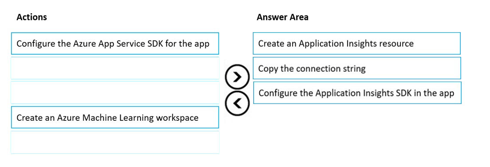
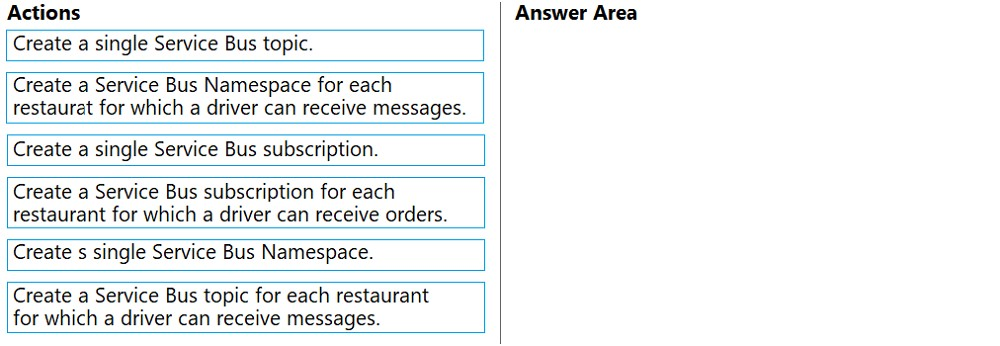
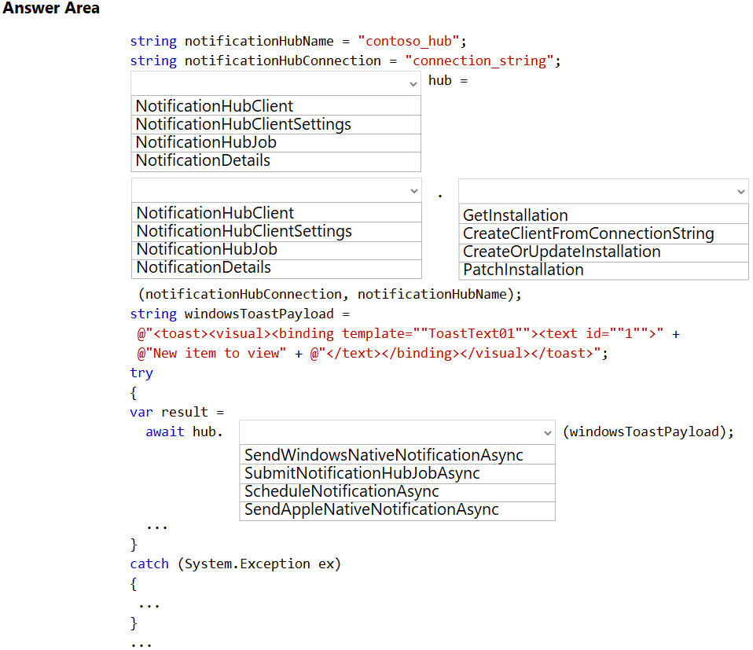
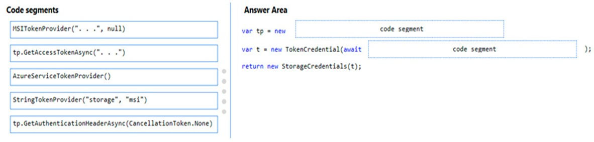
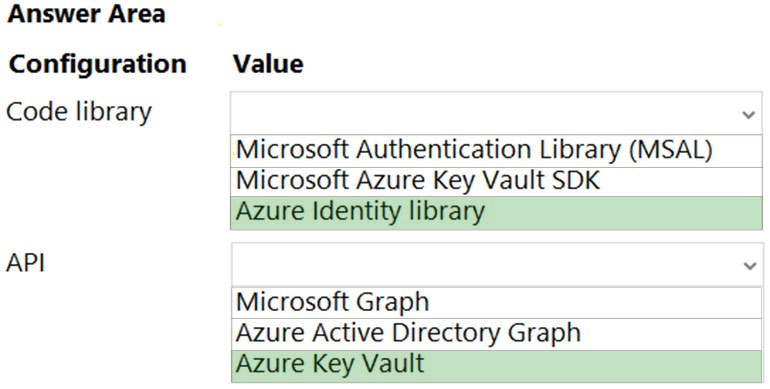

231

Question #: 21
Topic #: 5

DRAG DROP -
You develop and deploy an Azure App Service web app. The web app accesses data in an Azure SQL database.
You must update the web app to store frequently used data in a new Azure Cache for Redis Premium instance.
You need to implement the Azure Cache for Redis features.
Which feature should you implement? To answer, drag the appropriate feature to the correct requirements. Each feature may be used once, more than once, or not at all. You may need to drag the split bar between panes or scroll to view content.
NOTE: Each correct selection is worth one point.
Select and Place:


This is correct!
https://docs.microsoft.com/en-us/azure/architecture/best-practices/caching

If you look for the right words (related > set | high-performance > channel | recent > list) in documentation, it helps you validate this answer.
Ignore the other comments as it only leads to confusion.

Set（集合）：

解释： Redis 中的 Set 是一个无序的、不包含重复元素的数据结构。你可以使用 Set 存储多个值，但这些值不会有序排列。Set 支持添加、删除和检查元素的操作，是一个用于存储唯一值的有效结构。

List（列表）：

解释： Redis 中的 List 是一个有序的、可以包含重复元素的数据结构。它类似于一个动态数组，支持在两端添加和删除元素。List 常用于实现队列、堆栈等数据结构。

Channel（频道）：

解释： Redis 中的 Channel 是与发布/订阅模式相关的概念。发布/订阅模式允许多个客户端订阅某个频道，当消息发布到频道时，所有订阅该频道的客户端都会接收到该消息。这对于实现消息传递和事件通知非常有用。

---

232

Question #: 22
Topic #: 5

You are developing an ASP.NET Core Web API web service. The web service uses Azure Application Insights for all telemetry and dependency tracking. The web service reads and writes data to a database other than Microsoft SQL Server.
You need to ensure that dependency tracking works for calls to the third-party database.
Which two dependency telemetry properties should you use? Each correct answer presents part of the solution.
NOTE: Each correct selection is worth one point.

	A. Telemetry.Context.Cloud.RoleInstance
	B. Telemetry.Id
	C. Telemetry.Name
	D. Telemetry.Context.Operation.Id
	E. Telemetry.Context.Session.Id


Correct Answer: B and D
message.Properties.Add("ParentId", operation.Telemetry.Id);
message.Properties.Add("RootId", operation.Telemetry.Context.Operation.Id);

Reference:
https://docs.microsoft.com/en-us/azure/azure-monitor/app/custom-operations-tracking#enqueue

---

233

Question #: 23
Topic #: 5

HOTSPOT -
You are using Azure Front Door Service.
You are expecting inbound files to be compressed by using Brotli compression. You discover that inbound XML files are not compressed. The files are 9 megabytes (MB) in size.
You need to determine the root cause for the issue.
To answer, select the appropriate options in the answer area.
NOTE: Each correct selection is worth one point.
Hot Area:


	1.Yes
	2.No Refer - https://docs.microsoft.com/en-us/azure/frontdoor/front-door-caching ,You don’t need to purge the cache assets. Here the issue is that the file size needs to be less than 8MB
	3.Yes

---

234

Question #: 24
Topic #: 5

HOTSPOT -
You are developing an Azure App Service hosted ASP.NET Core web app to deliver video-on-demand streaming media. You enable an Azure Content Delivery
Network (CDN) Standard for the web endpoint. Customer videos are downloaded from the web app by using the following example URL: http://www.contoso.com/ content.mp4?quality=1.
All media content must expire from the cache after one hour. Customer videos with varying quality must be delivered to the closest regional point of presence
(POP) node.
You need to configure Azure CDN caching rules.
Which options should you use? To answer, select the appropriate options in the answer area.
NOTE: Each correct selection is worth one point.
Hot Area:


Box 1: Override
Override: Ignore origin-provided cache duration; use the provided cache duration instead. This will not override cache-control: no-cache.
Set if missing: Honor origin-provided cache-directive headers, if they exist; otherwise, use the provided cache duration.
Bypass cache: Do not cache and ignore origin-provided cache-directive headers.

因为我们要规定1小时，所以要override

Box 2: 1 hour
All media content must expire from the cache after one hour.

题目里说了要1小时

Box 3: Cache every unique URL
Cache every unique URL: In this mode, each request with a unique URL, including the query string, is treated as a unique asset with its own cache. For example, the response from the origin server for a request for example.ashx?q=test1 is cached at the POP node and returned for subsequent caches with the same query string. A request for example.ashx?q=test2 is cached as a separate asset with its own time-to-live setting.

Bypass caching for query strings: In this mode, requests with query strings are not cached at the CDN POP node. The POP node retrieves the asset directly from the origin server and passes it to the requestor with each request.

Ignore query strings: Default mode. In this mode, the CDN point-of-presence (POP) node passes the query strings from the requestor to the origin server on the first request and caches the asset. All subsequent requests for the asset that are served from the POP ignore the query strings until the cached asset expires.

不同质量的视频要有不同的cache，所以每个url都要cache

---

235

Question #: 25
Topic #: 5

HOTSPOT -
You are developing an ASP.NET Core time sheet application that runs as an Azure Web App. Users of the application enter their time sheet information on the first day of every month.
The application uses a third-party web service to validate data.
The application encounters periodic server errors due to errors that result from calling a third-party web server. Each request to the third-party server has the same chance of failure.
You need to configure an Azure Monitor alert to detect server errors unrelated to the third-party service. You must minimize false-positive alerts.
How should you complete the Azure Resource Manager template? To answer, select the appropriate options in the answer area.
NOTE: Each correct selection is worth one point.
Hot Area:


DynamicThresholdCriterion: Dynamic thresholds in metric alerts use advanced machine learning to learn metric
Http5XX, just a name , we are monitoring server errors, so 500 range error reponses
AlertSensitvity : would set is to low. "You must minimize false-positive alerts" 


---

236

Question #: 26
Topic #: 5

You are developing a web application that uses Azure Cache for Redis. You anticipate that the cache will frequently fill and that you will need to evict keys.
You must configure Azure Cache for Redis based on the following predicted usage pattern: A small subset of elements will be accessed much more often than the rest.
You need to configure the Azure Cache for Redis to optimize performance for the predicted usage pattern.
Which two eviction policies will achieve the goal?
NOTE: Each correct selection is worth one point.

A. noeviction
B. allkeys-lru
C. volatile-lru
D. allkeys-random
E. volatile-ttl
F. volatile-random

Suggested Answer: BC


在预测的使用模式中，小部分元素将比其他元素更频繁地访问。为了优化性能，你可以选择以下两个逐出策略：

B. allkeys-lru

说明： 使用最近最少使用（LRU）策略逐出所有键，这意味着最近最少被访问的键将被优先逐出。

C. volatile-lru

说明： 使用LRU策略逐出有过期时间的键，这允许你在键具有过期时间时执行LRU策略，确保对小部分元素的频繁访问。

其他选项的说明：

A. noeviction： 不进行逐出，当内存不足时，将返回错误。这可能导致性能问题，因为没有逐出机制。
D. allkeys-random： 随机逐出所有键，这不太适合小部分元素经常被访问的场景。
E. volatile-ttl： 使用键的过期时间进行逐出。不太适合场景，因为键的过期时间可能不与最近的访问模式对应。
F. volatile-random： 随机逐出有过期时间的键，也不太适合小部分元素经常被访问的场景。
因此，正确的答案是 B. allkeys-lru 和 C. volatile-lru。

---

237

Question #: 27
Topic #: 5

DRAG DROP -
An organization has web apps hosted in Azure.
The organization wants to track events and telemetry data in the web apps by using Application Insights.
You need to configure the web apps for Application Insights.
Which three actions should you perform in sequence? To answer, move the appropriate actions from the list of actions to the answer area and arrange them in the correct order.
Select and Place:




The given answer is correct.
	1. Create an Application Insights resource
	2. Copy the instrumentation key
	3. Install the SDK in your app
https://learn.microsoft.com/en-us/azure/azure-monitor/app/create-new-resource


---

238

Question #: 28
Topic #: 5

An organization hosts web apps in Azure. The organization uses Azure Monitor.
You discover that configuration changes were made to some of the web apps.
You need to identify the configuration changes.
Which Azure Monitor log should you review?

	A. AppServiceAppLogs
	B. AppServiceEnvironmentPlatformlogs
	C. AppServiceConsoleLogs
	D. AppServiceAuditLogs

Suggested Answer: B 

AppServiceEnvironmentPlatformlogs only logs when app services are hosted in an App Service Environment witch is a deployment of Azure App Service into a subnet in your Azure Virtual Network (VNet). It is a Premium service option

The problem is, all other anwers are wrong :
AppServiceAppLogs : logs from inside your app
AppServiceConsoleLogs : logs from the console
AppServiceAuditLogs : logs who are logged in or out.

but...
AppServiceFileAuditLogs will do the job for premium tiers.
https://ruslany.net/2020/01/how-to-monitor-azure-app-service-content-changes-and-publishing-activity/


---

239

Question #: 29
Topic #: 5

You develop and deploy an Azure App Service web app to a production environment. You enable the Always On setting and the Application Insights site extensions.
You deploy a code update and receive multiple failed requests and exceptions in the web app.
You need to validate the performance and failure counts of the web app in near real time.
Which Application Insights tool should you use?

	A. Profiler
	B. Smart Detection
	C. Live Metrics Stream
	D. Application Map
	E. Snapshot Debugger

Suggested Answer: C 

the key is near real time.
https://learn.microsoft.com/en-us/azure/azure-monitor/app/live-stream

---

240

Question #: 30
Topic #: 5

HOTSPOT -
You deploy an ASP.NET web app to Azure App Service.
You must monitor the web app by using Application Insights.
You need to configure Application Insights to meet the requirements.
Which feature should you use? To answer, select the appropriate options in the answer area.
NOTE: Each correct selection is worth one point.
Hot Area:


---

241

Question #: 31
Topic #: 5

You are building a web application that performs image analysis on user photos and returns metadata containing objects identified. The image analysis is very costly in terms of time and compute resources. You are planning to use Azure Redis Cache so duplicate uploads do not need to be reprocessed.
In case of an Azure data center outage, metadata loss must be kept to a minimum.
You need to configure the Azure Redis cache instance.
Which two actions should you perform? Each correct answer presents part of the solution.
NOTE: Each correct selection is worth one point.

	A. Configure Azure Redis with AOF persistence.
	B. Configure Azure Redis with RDB persistence.
	C. Configure second storage account for persistence.
	D. Set backup frequency to the minimum value.

The key here is "In case of an Azure data center outage, metadata loss must be kept to a minimum."

So the correct answer is AC.

使用 AOF（Append-Only File）持久性，可以将写命令追加到持久性日志文件中，以便在 Redis 重新启动时重新执行这些命令。这有助于确保在 Azure 数据中心中断的情况下最小化元数据损失。

---

242

Question #: 32
Topic #: 5

You are developing an Azure-based web application. The application goes offline periodically to perform offline data processing. While the application is offline, numerous Azure Monitor alerts fire which result in the on-call developer being paged.
The application must always log when the application is offline for any reason.
You need to ensure that the on-call developer is not paged during offline processing.
What should you do?

	A. Add Azure Monitor alert processing rules to suppress notifications.
	B. Disable Azure Monitor Service Health Alerts during offline processing.
	C. Create an Azure Monitor Metric Alert.
	D. Build an Azure Monitor action group that suppresses the alerts.

A

要确保在离线处理期间不会向在线开发人员发送警报，你可以选择以下操作：

A. 添加 Azure Monitor 警报处理规则以抑制通知。

说明： 通过配置警报处理规则，你可以在离线处理期间抑制通知，防止在此时触发通知。
其他选项的说明：

B. 在离线处理期间禁用 Azure Monitor 服务健康警报： 这样做会禁用与 Azure 服务健康相关的警报，但可能无法直接解决离线处理期间的问题。
C. 创建 Azure Monitor Metric Alert（指标警报）： 指标警报通常用于监视特定指标的变化，而在此场景中，问题是应用程序是否在线，因此指标警报可能不是最合适的选择。
D. 构建一个 Azure Monitor 操作组来抑制警报： 这是正确的思路，但通常使用警报处理规则更为直观和方便。
因此，最合适的答案是 A. 添加 Azure Monitor 警报处理规则以抑制通知。

---

243

Question #: 33
Topic #: 5

You are developing an online game that includes a feature that allows players to interact with other players on the same team within a certain distance. The calculation to determine the players in range occurs when players move and are cached in an Azure Cache for Redis instance.

The system should prioritize players based on how recently they have moved and should not prioritize players who have logged out of the game.

You need to select an eviction policy.

Which eviction policy should you use?

	A. allkeys-Iru
	B. volatile-Iru
	C. allkeys-lfu
	D. volatile-ttl
	
B

Changed my mind;
There must be a way to tell our redis that logged off users must not be prioritized.
Sample: User A moves and then automatically logs-off. With allkeys-lru we can't distinguish this particularity. With volatile-lru we can tell our redis what are good candidates to be removed using different TTL values.


在这种情况下，你应该选择 B. volatile-lru 作为逐出策略。

B. volatile-lru：

说明： 该策略使用最近最少使用（LRU）算法逐出有过期时间的键。这意味着 Redis 会优先逐出最近最少被访问的有过期时间的键，有助于确保离线或不再移动的玩家不会长时间保留在缓存中。因为在游戏中，最近移动的玩家可能更有可能与其他玩家进行交互，所以通过该策略，你可以优化缓存以满足这个要求。
其他选项的说明：

A. allkeys-lru： 使用 LRU 策略逐出所有键，而不仅仅是有过期时间的键。这在不同的场景中可能更适用，但在这个特定的游戏场景中，优先逐出有过期时间的键更有针对性。
C. allkeys-lfu： 使用最不经常使用（LFU）算法逐出所有键。在这个场景中，基于最近的移动更为重要，所以 LRU 可能更合适。
D. volatile-ttl： 使用键的过期时间进行逐出。这可能不是最佳选择，因为过期时间可能不与最近的移动模式直接对应。
因此，正确的答案是 B. volatile-lru。

---

244

Question #: 34
Topic #: 5

You develop an Azure App Service web app and deploy to a production environment. You enable Application Insights for the web app.

The web app is throwing multiple exceptions in the environment.

You need to examine the state of the source code and variables when the exceptions are thrown.

Which Application Insights feature should you configure?

A. Smart detection
B. Profiler
C. Snapshot Debugger
D. Standard test

Suggested Answer: C

---

245

Question #: 35
Topic #: 5

DRAG DROP

You develop and deploy a Java application to Azure. The application has been instrumented by using the Application Insights SDK.

The telemetry data must be enriched and processed before it is sent to the Application Insights service.

You need to modify the telemetry data.

Which Application Insights SDK features should you use? To answer, drag the appropriate features to the correct requirements. Each feature may be used once, more than once, or not at all. You may need to drag the split bar between panes or scroll to view content.

NOTE: Each correct selection is worth one point.


Correct answers
Link: https://learn.microsoft.com/en-us/azure/azure-monitor/app/api-filtering-sampling

---

246

Question #: 36
Topic #: 5

HOTSPOT

You develop new functionality in a web application for a company that provides access to seismic data from around the world. The seismic data is stored in Redis Streams within an Azure Cache for Redis instance.

The new functionality includes a real-time display of seismic events as they occur.

You need to implement the Azure Cache for Redis command to receive seismic data.

How should you complete the command? To answer, select the appropriate options in the answer area.

NOTE: Each correct selection is worth one point.


Correct.
BLOCK 0 means that we will wait infinitely (timeout 0 means it will never expire) for new items in a stream.
$ ID means that we will receive only new messages, starting from the time we started listening

https://redis.io/docs/data-types/streams-tutorial/#listening-for-new-items-with-xread

---

247

Question #: 37
Topic #: 5

You develop an ASP.NET Core app that uses Azure App Configuration. You also create an App Configuration containing 100 settings.

The app must meet the following requirements:

• Ensure the consistency of all configuration data when changes to individual settings occur.
• Handle configuration data changes dynamically without causing the application to restart.
• Reduce the overall number of requests made to App Configuration APIs.

You must implement dynamic configuration updates in the app.

What are two ways to achieve this goal? Each correct answer presents part of the solution.

NOTE: Each correct selection is worth one point.

	A. Create and register a sentinel key in the App Configuration store. Set the refreshAll parameter of the Register method to true.
	B. Increase the App Configuration cache expiration from the default value.
	C. Decrease the App Configuration cache expiration from the default value.
	D. Create and configure Azure Key Vault. Implement the Azure Key Vault configuration provider.
	E. Register all keys in the App Configuration store. Set the refreshAll parameter of the Register method to false.
	F. Create and implement environment variables for each App Configuration store setting.

AB 不确定

Correct Answers
Link: https://learn.microsoft.com/en-us/azure/azure-app-configuration/enable-dynamic-configuration-aspnet-netfx

Quotes from the reference below:
"A sentinel key is a key that you update after you complete the change of all other keys. Your app monitors the sentinel key. When a change is detected, your app refreshes all configuration values. This approach helps to ensure the consistency of configuration in your app and reduces the overall number of requests made to your App Configuration store, compared to monitoring all keys for changes."

"You can add a call to the refreshOptions.SetCacheExpiration method to specify the minimum time between configuration refreshes. In this example, you use the default value of 30 seconds. Adjust to a higher value if you need to reduce the number of requests made to your App Configuration store."

创建和注册一个 sentinel key（一个特殊的 key），当配置发生更改时，将改变这个 sentinel key 的值，以触发应用程序动态更新。将 refreshAll 参数设置为 true 以确保刷新所有配置，确保一致性。

Reference: https://learn.microsoft.com/en-us/azure/azure-app-configuration/enable-dynamic-configuration-aspnet-core?tabs=core6x

---

248

Question #: 38
Topic #: 5

HOTSPOT

You develop and deploy an Azure App Service web app that connects to Azure Cache for Redis as a content cache. All resources have been deployed to the East US 2 region.

The security team requires the following audit information from Azure Cache for Redis:

• The number of Redis client connections from an associated IP address.
• Redis operations completed on the content cache.
• The location (region) in which the Azure Cach3e for Redis instance was accessed.

The audit information must be captured and analyzed by a security team application deployed to the Central US region.

You need to log information on all client connections to the cache.

Which configuration values should you use? To answer, select the appropriate options in the answer area.

NOTE: Each correct selection is worth one point.


Correct.
Only Log Analytics supports cross-region logging

Reference: https://learn.microsoft.com/en-us/azure/azure-cache-for-redis/cache-monitor-diagnostic-settings?tabs=basic-standard-premium#enable-connection-logging-using-the-azure-portal

Log Analytics Workspace - used to store log information.
Diagnostic setting - diagnostic logs are streamed to that workspace as soon as new event data is generated

---

249

Question #: 39
Topic #: 5

You develop and deploy a web app to Azure App Service. The Azure App Service uses a Basic plan in a single region.

Users report that the web app is responding slow. You must capture the complete call stack to help identify performance issues in the code. Call stack data must be correlated across app instances. You must minimize cost and impact to users on the web app.

You need to capture the telemetry.

Which three actions should you perform? Each correct answer presents part of the solution.

NOTE: Each correct selection is worth one point.

	A. Restart all apps in the App Service plan.
	B. Enable Application Insights site extensions.
	C. Upgrade the Azure App Service plan to Premium.
	D. Enable Profiler.
	E. Enable the Always On setting for the app service.
	F. Enable Snapshot debugger.
	G. Enable remote debugging.

BDF/BDE 不确定

---

250

Question #: 40
Topic #: 5

You are building an application to track cell towers that are available to phones in near real time. A phone will send information to the application by using the Azure Web PubSub service. The data will be processed by using an Azure Functions app. Traffic will be transmitted by using a content delivery network (CDN).

The Azure function must be protected against misconfigured or unauthorized invocations.

You need to ensure that the CDN allows for the Azure function protection.

Which HTTP header should be on the allowed list?

	A. Authorization
	B. WebHook-Request-Callback
	C. Resource
	D. WebHook-Request-Origin

Suggested Answer: D

https://learn.microsoft.com/en-us/azure/azure-web-pubsub/howto-develop-eventhandler#upstream-and-validation

通过 Azure 门户或 CLI 设置事件处理程序 Webhook 时，服务遵循 CloudEvents 滥用保护措施来验证上游 Webhook。 每个已注册的上游 Webhook URL 都将通过此机制进行验证。 WebHook-Request-Origin 请求头设置为服务域名 xxx.webpubsub.azure.com，它会要求含标头 WebHook-Allowed-Origin 的响应包含此域名或 *。

---

251

Question #: 41
Topic #: 5

You are developing an Azure App Service web app.

The web app must securely store session information in Azure Redis Cache.

You need to connect the web app to Azure Redis Cache.

Which three Azure Redis Cache properties should you use? Each correct answer presents part of the solution.

NOTE: Each correct selection is worth one point.

	A. Access key
	B. SSL port
	C. Subscription name
	D. Location
	E. Host name
	F. Subscription id

Suggested Answer: ABE

When connecting a web app to Azure Redis Cache, you need to specify certain properties. Here are three Azure Redis Cache properties you should use:

Hostname: This property represents the fully qualified domain name (FQDN) or the endpoint URL of the Azure Redis Cache instance. It is used to establish a connection between the web app and the cache. The hostname typically follows the format yourcache.redis.cache.windows.net.

Port: This property specifies the port number used for communication with the Azure Redis Cache instance. The default port for Redis is 6379, but you can configure it differently if needed.

Access key: This property is the primary or secondary access key for the Azure Redis Cache instance.

---

252

Question #: 42
Topic #: 5

HOTSPOT

You are developing several microservices to run on Azure Container Apps.

You need to monitor and diagnose the microservices.

Which features should you use? To answer, select the appropriate feature in the answer area.

NOTE: Each correct selection is worth one point.


Answer is correct!

https://learn.microsoft.com/en-us/azure/container-apps/observability

From this page:
Log Streaming - View streaming system and console logs from a container in near real-time.
Container console - Connect to the Linux console in your containers to debug your application from inside the container.

---

253

Case study -

This is a case study. Case studies are not timed separately. You can use as much exam time as you would like to complete each case. However, there may be additional case studies and sections on this exam. You must manage your time to ensure that you are able to complete all questions included on this exam in the time provided.

To answer the questions included in a case study, you will need to reference information that is provided in the case study. Case studies might contain exhibits and other resources that provide more information about the scenario that is described in the case study. Each question is independent of the other questions in this case study.

At the end of this case study, a review screen will appear. This screen allows you to review your answers and to make changes before you move to the next section of the exam. After you begin a new section, you cannot return to this section.


To start the case study -
To display the first question in this case study, click the Next button. Use the buttons in the left pane to explore the content of the case study before you answer the questions. Clicking these buttons displays information such as business requirements, existing environment, and problem statements. When you are ready to answer a question, click the Question button to return to the question.


Background -

VanArsdel, Ltd. is a global office supply company. The company is based in Canada and has retail store locations across the world. The company is developing several cloud-based solutions to support their stores, distributors, suppliers, and delivery services.


Current environment -


Corporate website -

The company provides a public website located at http://www.vanarsdelltd.com. The website consists of a React JavaScript user interface, HTML, CSS, image assets, and several APIs hosted in Azure Functions.


Retail Store Locations -

The company supports thousands of store locations globally. Store locations send data every hour to an Azure Blob storage account to support inventory, purchasing and delivery services. Each record includes a location identifier and sales transaction information.


Requirements -

The application components must meet the following requirements:


Corporate website -

• Secure the website by using SSL.
• Minimize costs for data storage and hosting.
• Implement native GitHub workflows for continuous integration and continuous deployment (CI/CD).
• Distribute the website content globally for local use.
• Implement monitoring by using Application Insights and availability web tests including SSL certificate validity and custom header value verification.
• The website must have 99.95 percent uptime.


Retail store locations -

• Azure Functions must process data immediately when data is uploaded to Blob storage. Azure Functions must update Azure Cosmos DB by using native SQL language queries.
• Audit store sale transaction information nightly to validate data, process sales financials, and reconcile inventory.


Delivery services -

• Store service telemetry data in Azure Cosmos DB by using an Azure Function. Data must include an item id, the delivery vehicle license plate, vehicle package capacity, and current vehicle location coordinates.
• Store delivery driver profile information in Azure Active Directory (Azure AD) by using an Azure Function called from the corporate website.


Inventory services -

The company has contracted a third-party to develop an API for inventory processing that requires access to a specific blob within the retail store storage account for three months to include read-only access to the data.


Security -

• All Azure Functions must centralize management and distribution of configuration data for different environments and geographies, encrypted by using a company-provided RSA-HSM key.
• Authentication and authorization must use Azure AD and services must use managed identities where possible.


Issues -


Retail Store Locations -

• You must perform a point-in-time restoration of the retail store location data due to an unexpected and accidental deletion of data.
• Azure Cosmos DB queries from the Azure Function exhibit high Request Unit (RU) usage and contain multiple, complex queries that exhibit high point read latency for large items as the function app is scaling.


You need to test the availability of the corporate website.

Which two test types can you use? Each correct answer presents a complete solution.

NOTE: Each correct selection is worth one point.

A. Standard
B. URL ping
C. Custom testing using the TrackAvailability API method
D. Multi-step


A and C per this requirement: "Implement monitoring by using Application Insights and availability web tests including SSL certificate validity and custom header value verification."

A - Standard test: This single request test is similar to the URL ping test. It includes TLS/SSL certificate validity, proactive lifetime check, HTTP request verb.

C - Custom TrackAvailability test: If you decide to create a custom application to run availability tests, you can use the TrackAvailability() method to send the results to Application Insights.

https://learn.microsoft.com/en-us/azure/azure-monitor/app/availability-overview#types-of-tests


---

254

Question #: 44
Topic #: 5

You have an Azure API Management (APIM) Standard tier instance named APIM1 that uses a managed gateway.

You plan to use APIM1 to publish an API named API1 that uses a backend database that supports only a limited volume of requests per minute. You also need a policy for API1 that will minimize the possibility that the number of requests to the backend database from an individual IP address you specify exceeds the supported limit.

You need to identify a policy for API1 that will meet the requirements.

Which policy should you use?

	A. ip-filter
	B. quota-by-key
	C. rate-limit-by-key
	D. rate-limit

Suggested Answer: C


为了最小化来自特定 IP 地址的请求数量，以确保不超过支持的限制，你应该使用 C. rate-limit-by-key 策略。

C. rate-limit-by-key： 该策略允许你按照键对请求进行速率限制。你可以为每个 IP 地址分配一个键，并为该键设置速率限制。这样，就可以确保特定 IP 地址在一定时间内不会超过一定数量的请求。

---

255

Question #: 45
Topic #: 5

You develop a web application that sells access to last-minute openings for child camps that run on the weekends. The application uses Azure Application Insights for all alerting and monitoring.

The application must alert operators when a technical issue is preventing sales to camps.

You need to build an alert to detect technical issues.

Which alert type should you use?

	A. Metric alert using multiple time series
	B. Metric alert using dynamic thresholds
	C. Log alert using multiple time series
	D. Log alert using dynamic thresholds

Suggested Answer: B


---

256

 Question #1 Topic 6

Note: This question is part of a series of questions that present the same scenario. Each question in the series contains a unique solution that might meet the stated goals. Some question sets might have more than one correct solution, while others might not have a correct solution.
After you answer a question in this section, you will NOT be able to return to it. As a result, these questions will not appear in the review screen.
You are developing an Azure solution to collect point-of-sale (POS) device data from 2,000 stores located throughout the world. A single device can produce 2 megabytes (MB) of data every 24 hours. Each store location has one to five devices that send data.
You must store the device data in Azure Blob storage. Device data must be correlated based on a device identifier. Additional stores are expected to open in the future.
You need to implement a solution to receive the device data.
Solution: Provision an Azure Service Bus. Configure a topic to receive the device data by using a correlation filter.
Does the solution meet the goal?

	A. Yes
	B. No

B

First of all - that question is not about THE BEST solution but about THE VALID solution. So responses like "Event Hub is the best choice" doesn't bring anything to the table. 
That being said - is the provided solution valid? I would say NO, because:
- topics allows multiple subscribers, and here we need to process each event once
- correlation filter is for subscriptions, not topics
- even when assuming there is typo in the question and correlation filter is defined on the subscription level - it still is not a valid solution, because new stores can be opened in the future with many new device identifiers which you can't know in advance. Besides that filter make no sense in this scenario whatsoever, you just need to save data in storage account and basically partition it by device identifier.

---

257

Question #2

 Note: This question is part of a series of questions that present the same scenario. Each question in the series contains a unique solution that might meet the stated goals. Some question sets might have more than one correct solution, while others might not have a correct solution.
After you answer a question in this section, you will NOT be able to return to it. As a result, these questions will not appear in the review screen.
You are developing an Azure solution to collect point-of-sale (POS) device data from 2,000 stores located throughout the world. A single device can produce 2 megabytes (MB) of data every 24 hours. Each store location has one to five devices that send data.
You must store the device data in Azure Blob storage. Device data must be correlated based on a device identifier. Additional stores are expected to open in the future.
You need to implement a solution to receive the device data.
Solution: Provision an Azure Event Grid. Configure event filtering to evaluate the device identifier.
Does the solution meet the goal?

    A. Yes
    B. No 

B

---

258

Question #: 3
Topic #: 6

DRAG DROP -
You manage several existing Logic Apps.
You need to change definitions, add new logic, and optimize these apps on a regular basis.
What should you use? To answer, drag the appropriate tools to the correct functionalities. Each tool may be used once, more than once, or not at all. You may need to drag the split bar between panes or scroll to view content.
NOTE: Each correct selection is worth one point.
Select and Place:


---

259

Question #: 4
Topic #: 6


A company is developing a solution that allows smart refrigerators to send temperature information to a central location.
The solution must receive and store messages until they can be processed. You create an Azure Service Bus instance by providing a name, pricing tier, subscription, resource group, and location.
You need to complete the configuration.
Which Azure CLI or PowerShell command should you run?


A

I think the Service Bus has already been created and now they ask you to complete the configuration. The next step is creating the queue.

B. Create group.
C. Create Service Bus.
A. Create Queue. <-- Correct answer.
D. Get connectionstring.

---

260

Question #: 5
Topic #: 6

HOTSPOT -
You are developing an application that uses Azure Storage Queues.
You have the following code:


For each of the following statements, select Yes if the statement is true. Otherwise, select No.
NOTE: Each correct selection is worth one point.
Hot Area:


GetMessageAsync:
Gets a message from the queue using the default request options. This operation marks the retrieved message as invisible in the queue for the default visibility timeout period.

Only marks the message is invisible but does not delete.

---

261

Question #: 6
Topic #: 6

A company is developing a solution that allows smart refrigerators to send temperature information to a central location.
The solution must receive and store messages until they can be processed. You create an Azure Service Bus instance by providing a name, pricing tier, subscription, resource group, and location.
You need to complete the configuration.
Which Azure CLI or PowerShell command should you run?


Suggested Answer: C

---

262

Question #: 7
Topic #: 6

Note: This question is part of a series of questions that present the same scenario. Each question in the series contains a unique solution that might meet the stated goals. Some question sets might have more than one correct solution, while others might not have a correct solution.
After you answer a question in this section, you will NOT be able to return to it. As a result, these questions will not appear in the review screen.
You are developing an Azure Service application that processes queue data when it receives a message from a mobile application. Messages may not be sent to the service consistently.
You have the following requirements:
✑ Queue size must not grow larger than 80 gigabytes (GB).
✑ Use first-in-first-out (FIFO) ordering of messages.
✑ Minimize Azure costs.
You need to implement the messaging solution.
Solution: Use the .Net API to add a message to an Azure Storage Queue from the mobile application. Create an Azure Function App that uses an Azure Storage
Queue trigger.
Does the solution meet the goal?

	A. Yes
	B. No

Suggested Answer: B

Answer is B (NO),
Becz FIFO is supported by Service bus queue and Service bus queue should be use for data less than 80GB
https://docs.microsoft.com/en-us/azure/service-bus-messaging/service-bus-azure-and-service-bus-queues-compared-contrasted

Service Bus queues才有FIFO

---

263

Question #: 8
Topic #: 6

DRAG DROP -
You develop software solutions for a mobile delivery service. You are developing a mobile app that users can use to order from a restaurant in their area. The app uses the following workflow:
1. A driver selects the restaurants for which they will deliver orders.
2. Orders are sent to all available drivers in an area.
3. Only orders for the selected restaurants will appear for the driver.
4. The first driver to accept an order removes it from the list of available orders.
You need to implement an Azure Service Bus solution.
Which three actions should you perform in sequence? To answer, move the appropriate actions from the list of actions to the answer area and arrange them in the correct order.
Select and Place:



不确定

	Create a single Service Bus Namespace.
	Create a single Service Bus Topic.
	Create a Service Bus subscription for each restaurant for which a driver can receive orders.

---

264

Question #: 9
Topic #: 6

HOTSPOT -
You develop a news and blog content app for Windows devices.
A notification must arrive on a user's device when there is a new article available for them to view.
You need to implement push notifications.
How should you complete the code segment? To answer, select the appropriate options in the answer area.
NOTE: Each correct selection is worth one point.
Hot Area:




The answer is correct, but the first reference is not very helpful and the second one doesn't even exists. Here are references of the methods used in the answer:
https://docs.microsoft.com/en-us/dotnet/api/microsoft.azure.notificationhubs.notificationhubclient.createclientfromconnectionstring?view=azure-dotnet#Microsoft_Azure_NotificationHubs_NotificationHubClient_CreateClientFromConnectionString_System_String_System_String_
https://docs.microsoft.com/en-us/dotnet/api/microsoft.azure.notificationhubs.notificationhubclient.sendwindowsnativenotificationasync?view=azure-dotnet#Microsoft_Azure_NotificationHubs_NotificationHubClient_SendWindowsNativeNotificationAsync_System_String_


---

265

Question #: 10
Topic #: 6

You are developing an Azure messaging solution.
You need to ensure that the solution meets the following requirements:
✑ Provide transactional support.
✑ Provide duplicate detection.
✑ Store the messages for an unlimited period of time.
Which two technologies will meet the requirements? Each correct answer presents a complete solution.
NOTE: Each correct selection is worth one point.

	A. Azure Service Bus Topic
	B. Azure Service Bus Queue
	C. Azure Storage Queue
	D. Azure Event Hub

Suggested Answer: AB

Answer is correct. Queue Storage does not provide transactional support and Event Hub can't be configured to store events for infinite time.

---

266

Question #: 11
Topic #: 6

DRAG DROP -
You develop a gateway solution for a public facing news API.
The news API back end is implemented as a RESTful service and hosted in an Azure App Service instance.
You need to configure back-end authentication for the API Management service instance.
Which target and gateway credential type should you use? To answer, drag the appropriate values to the correct parameters. Each value may be used once, more than once, or not at all. You may need to drag the split bar between panes or scroll to view content.
NOTE: Each correct selection is worth one point.
Select and Place:


Answer :
1. Https(s) endpoint,
2. Client cert

Reference : https://docs.microsoft.com/en-us/azure/api-management/api-management-howto-mutual-certificates#configure-an-api-to-use-client-certificate-for-gateway-authentication

---

267

Question #: 12
Topic #: 6

HOTSPOT -
You are creating an app that uses Event Grid to connect with other services. Your app's event data will be sent to a serverless function that checks compliance.
This function is maintained by your company.
You write a new event subscription at the scope of your resource. The event must be invalidated after a specific period of time.
You need to configure Event Grid.
What should you do? To answer, select the appropriate options in the answer area.
NOTE: Each correct selection is worth one point.
Hot Area:


Dropdowns placement in Answer area is incorrect
WebHook Event Delivery ---ValidationCode handsShake
Topic publishing --- SAS Tokens

https://docs.microsoft.com/en-us/azure/event-grid/concepts
https://docs.microsoft.com/en-us/azure/event-grid/webhook-event-delivey

---

268

Question #: 13
Topic #: 6

HOTSPOT -
You are working for Contoso, Ltd.
You define an API Policy object by using the following XML markup:

For each of the following statements, select Yes if the statement is true. Otherwise, select No.
NOTE: Each correct selection is worth one point.
Hot Area:


---

269

Question #: 14
Topic #: 6

You are developing a solution that will use Azure messaging services.
You need to ensure that the solution uses a publish-subscribe model and eliminates the need for constant polling.
What are two possible ways to achieve the goal? Each correct answer presents a complete solution.
NOTE: Each correct selection is worth one point.

	A. Service Bus
	B. Event Hub
	C. Event Grid
	D. Queue

Suggested Answer: AC 

Correct Ans is A & C
https://docs.microsoft.com/en-us/azure/architecture/patterns/publisher-subscriber#issues-and-considerations

Event Hubs : event-based receiving is not possible, you still need to poll. So B falls off

Agree, but publish/subscribe is a feature of event-hub as well, but event-based receiving is not. That is why option B falls off.

---

270

Question #: 15
Topic #: 6

A company is implementing a publish-subscribe (Pub/Sub) messaging component by using Azure Service Bus. You are developing the first subscription application.
In the Azure portal you see that messages are being sent to the subscription for each topic. You create and initialize a subscription client object by supplying the correct details, but the subscription application is still not consuming the messages.
You need to ensure that the subscription client processes all messages.
Which code segment should you use?

	A. await subscriptionClient.AddRuleAsync(new RuleDescription(RuleDescription.DefaultRuleName, new TrueFilter()));
	B. subscriptionClient = new SubscriptionClient(ServiceBusConnectionString, TopicName, SubscriptionName);
	C. await subscriptionClient.CloseAsync();
	D. subscriptionClient.RegisterMessageHandler(ProcessMessagesAsync, messageHandlerOptions);

Suggested Answer: D 

Agreed on D
Clientsubcriber object initialization is done, so B incorrect.
Here Nothing to do with Rule and closeclient so A and C incorrect

---

271

Question #: 16
Topic #: 6

Note: This question is part of a series of questions that present the same scenario. Each question in the series contains a unique solution that might meet the stated goals. Some question sets might have more than one correct solution, while others might not have a correct solution.
After you answer a question in this section, you will NOT be able to return to it. As a result, these questions will not appear in the review screen.
You are developing an Azure Service application that processes queue data when it receives a message from a mobile application. Messages may not be sent to the service consistently.
You have the following requirements:
✑ Queue size must not grow larger than 80 gigabytes (GB).
✑ Use first-in-first-out (FIFO) ordering of messages.
✑ Minimize Azure costs.
You need to implement the messaging solution.
Solution: Use the .Net API to add a message to an Azure Storage Queue from the mobile application. Create an Azure VM that is triggered from Azure Storage
Queue events.
Does the solution meet the goal?

	A. Yes
	B. No

Suggested Answer: B

---

272

Question #: 17
Topic #: 6

Note: This question is part of a series of questions that present the same scenario. Each question in the series contains a unique solution that might meet the stated goals. Some question sets might have more than one correct solution, while others might not have a correct solution.
After you answer a question in this section, you will NOT be able to return to it. As a result, these questions will not appear in the review screen.
You are developing an Azure Service application that processes queue data when it receives a message from a mobile application. Messages may not be sent to the service consistently.
You have the following requirements:
✑ Queue size must not grow larger than 80 gigabytes (GB).
✑ Use first-in-first-out (FIFO) ordering of messages.
✑ Minimize Azure costs.
You need to implement the messaging solution.
Solution: Use the .Net API to add a message to an Azure Service Bus Queue from the mobile application. Create an Azure Windows VM that is triggered from Azure Service Bus Queue.
Does the solution meet the goal?

	A. Yes
	B. No

Suggested Answer: B

Using Service bus is fine, however having a Windows VM does not address the cost requirement.

Answer is 'NO'

Windows VM太贵了

---

273

Question #: 18
Topic #: 6

DRAG DROP -
You are developing a REST web service. Customers will access the service by using an Azure API Management instance.
The web service does not correctly handle conflicts. Instead of returning an HTTP status code of 409, the service returns a status code of 500. The body of the status message contains only the word conflict.
You need to ensure that conflicts produce the correct response.
How should you complete the policy? To answer, drag the appropriate code segments to the correct locations. Each code segment may be used once, more than once, or not at all. You may need to drag the split bar between panes or scroll to view content.
NOTE: Each correct selection is worth one point.
Select and Place:


---

274

Question #: 19
Topic #: 6

DRAG DROP -
You are a developer for a Software as a Service (SaaS) company. You develop solutions that provide the ability to send notifications by using Azure Notification
Hubs.
You need to create sample code that customers can use as a reference for how to send raw notifications to Windows Push Notification Services (WNS) devices.
The sample code must not use external packages.
How should you complete the code segment? To answer, drag the appropriate code segments to the correct locations. Each code segment may be used once, more than once, or not at all. You may need to drag the split bar between panes or scroll to view content.
NOTE: Each correct selection is worth one point.
Select and Place:


Answer is correct.
https://docs.microsoft.com/en-us/rest/api/notificationhubs/send-wns-native-notification

---

275

Question #: 20
Topic #: 6

Note: This question is part of a series of questions that present the same scenario. Each question in the series contains a unique solution that might meet the stated goals. Some question sets might have more than one correct solution, while others might not have a correct solution.
After you answer a question in this section, you will NOT be able to return to it. As a result, these questions will not appear in the review screen.
You are developing an Azure solution to collect point-of-sale (POS) device data from 2,000 stores located throughout the world. A single device can produce
2 megabytes (MB) of data every 24 hours. Each store location has one to five devices that send data.
You must store the device data in Azure Blob storage. Device data must be correlated based on a device identifier. Additional stores are expected to open in the future.
You need to implement a solution to receive the device data.
Solution: Provision an Azure Event Hub. Configure the machine identifier as the partition key and enable capture.
Does the solution meet the goal?

	A. Yes
	B. No

B 不确定

Answer is NO
How many partitions event hub can have? NOT MORE than 1024
https://docs.microsoft.com/en-us/azure/event-hubs/event-hubs-quotas

---

276

Question #: 21
Topic #: 6

DRAG DROP -
You are developing an Azure solution to collect inventory data from thousands of stores located around the world. Each store location will send the inventory data hourly to an Azure Blob storage account for processing.
The solution must meet the following requirements:
✑ Begin processing when data is saved to Azure Blob storage.
✑ Filter data based on store location information.
✑ Trigger an Azure Logic App to process the data for output to Azure Cosmos DB.
✑ Enable high availability and geographic distribution.
✑ Allow 24-hours for retries.
✑ Implement an exponential back off data processing.
You need to configure the solution.
What should you implement? To answer, select the appropriate options in the answer area.
NOTE: Each correct selection is worth one point.
Select and Place:


Source -> blob storage
Receiver -> event grid
Handler -> logic app

1)the source of the event, which means WHO has created the event and who is publishing this event, is the Blob Storage
2)The receiver of this event, which means who should receive this event, is the Event Grid. In the event Grid we can create Topic. Topic is where all publishers write messages --> so the Blob Storage write into a topic which is inside an Event Grid.
3)Handler of this event, which means who should handle this event, is the Logic App by creating a subscription in the event grid and connecting the Logic App to that subscription.

---

277

Question #: 22
Topic #: 6

You are creating an app that will use CosmosDB for data storage. The app will process batches of relational data.
You need to select an API for the app.
Which API should you use?

	A. MongoDB API
	B. Table API
	C. SQL API
	D. Cassandra API


C

relational data.

---

278

Question #: 23
Topic #: 6

HOTSPOT -
You are developing a .NET application that communicates with Azure Storage.
A message must be stored when the application initializes.
You need to implement the message.
How should you complete the code segment? To answer, select the appropriate options in the answer area.
NOTE: Each correct selection is worth one point.
Hot Area:


---

279

Question #: 24
Topic #: 6

HOTSPOT -
A software as a service (SaaS) company provides document management services. The company has a service that consists of several Azure web apps. All Azure web apps run in an Azure App Service Plan named PrimaryASP.
You are developing a new web service by using a web app named ExcelParser. The web app contains a third-party library for processing Microsoft Excel files.
The license for the third-party library stipulates that you can only run a single instance of the library.
You need to configure the service.
How should you complete the script? To answer, select the appropriate options in the answer area.
NOTE: Each correct selection is worth one point.
Hot Area:


https://docs.microsoft.com/en-us/azure/app-service/manage-scale-per-app

---

280

Question #: 25
Topic #: 6

DRAG DROP -
You have an application that provides weather forecasting data to external partners. You use Azure API Management to publish APIs.
You must change the behavior of the API to meet the following requirements:
✑ Support alternative input parameters
✑ Remove formatting text from responses
✑ Provide additional context to back-end services
Which types of policies should you implement? To answer, drag the policy types to the correct requirements. Each policy type may be used once, more than once, or not at all. You may need to drag the split bar between panes or scroll to view content.
NOTE: Each correct selection is worth one point.
Select and Place:


	Inbound
	Outbound
	Backend

---

281

Question #: 26
Topic #: 6

You are developing an e-commerce solution that uses a microservice architecture.
You need to design a communication backplane for communicating transactional messages between various parts of the solution. Messages must be communicated in first-in-first-out (FIFO) order.
What should you use?

	A. Azure Storage Queue
	B. Azure Event Hub
	C. Azure Service Bus
	D. Azure Event Grid

C

---

282

Question #: 27
Topic #: 6

DRAG DROP -
A company backs up all manufacturing data to Azure Blob Storage. Admins move blobs from hot storage to archive tier storage every month.
You must automatically move blobs to Archive tier after they have not been modified within 180 days. The path for any item that is not archived must be placed in an existing queue. This operation must be performed automatically once a month. You set the value of TierAgeInDays to -180.
How should you configure the Logic App? To answer, drag the appropriate triggers or action blocks to the correct trigger or action slots. Each trigger or action block may be used once, more than once, or not at all. You may need to drag the split bar between panes or scroll to view content.
NOTE: Each correct selection is worth one point.
Select and Place:


It is clear that :
box 1 should be recurrence
box 2 should be the condition

However, there is confusion about the condition, and rightly so:
the right half, ticks(addDaysInMonth(), variables("TierAgeInDays")) has a few problems,
first off: addDaysInMonth() doesn't exist as a function at all
Second, ticks does not accept two parameters as is done here.
(see reference:https://docs.microsoft.com/en-us/azure/logic-apps/workflow-definition-language-functions-reference#date-and-time-functions)

So, the condition block is bogus. However, they probably wanted to write something like: addDays(utcNow(), variables("TierAgeInDays")) which IS valid.
The less-than will return true for anything older, which leaves the next boxes to be:
box 3: Tier blob
box 4: Message queue

box 5: optional, they probably want to show the results with list blob2


---

283

Question #: 28
Topic #: 6

Note: This question is part of a series of questions that present the same scenario. Each question in the series contains a unique solution that might meet the stated goals. Some question sets might have more than one correct solution, while others might not have a correct solution.
After you answer a question in this section, you will NOT be able to return to it. As a result, these questions will not appear in the review screen.
You are developing an Azure Service application that processes queue data when it receives a message from a mobile application. Messages may not be sent to the service consistently.
You have the following requirements:
✑ Queue size must not grow larger than 80 gigabytes (GB).
✑ Use first-in-first-out (FIFO) ordering of messages.
✑ Minimize Azure costs.
You need to implement the messaging solution.
Solution: Use the .Net API to add a message to an Azure Service Bus Queue from the mobile application. Create an Azure Function App that uses an Azure Service Bus Queue trigger.
Does the solution meet the goal?

	A. Yes
	B. No

Suggested Answer: A

---

284

Question #: 29
Topic #: 6

Note: This question is part of a series of questions that present the same scenario. Each question in the series contains a unique solution that might meet the stated goals. Some question sets might have more than one correct solution, while others might not have a correct solution.
After you answer a question in this section, you will NOT be able to return to it. As a result, these questions will not appear in the review screen.
You are developing an Azure solution to collect point-of-sale (POS) device data from 2,000 stores located throughout the world. A single device can produce 2 megabytes (MB) of data every 24 hours. Each store location has one to five devices that send data.
You must store the device data in Azure Blob storage. Device data must be correlated based on a device identifier. Additional stores are expected to open in the future.
You need to implement a solution to receive the device data.
Solution: Provision an Azure Notification Hub. Register all devices with the hub.
Does the solution meet the goal?

A. Yes
B. No

Suggested Answer: B 

---

285

Question #: 30
Topic #: 6

You are building a loyalty program for a major snack producer. When customers buy a snack at any of 100 participating retailers the event is recorded in Azure Event Hub. Each retailer is given a unique identifier that is used as the primary identifier for the loyalty program.
Retailers must be able to be added or removed at any time. Retailers must only be able to record sales for themselves.
You need to ensure that retailers can record sales.
What should you do?

A. Use publisher policies for retailers.
B. Create a partition for each retailer.
C. Define a namespace for each retailer.

Suggested Answer: A

注意Retailers must be able to be added or removed at any time. Retailers must only be able to record sales for themselves.

---

286

Question #: 31
Topic #: 6

DRAG DROP -
You develop and deploy a web app to Azure App Service in a production environment. You scale out the web app to four instances and configure a staging slot to support changes.
You must monitor the web app in the environment to include the following requirements:
✑ Increase web app availability by re-routing requests away from instances with error status codes and automatically replace instances if they remain in an error state after one hour.
✑ Send web server logs, application logs, standard output, and standard error messaging to an Azure Storage blob account.
You need to configure Azure App Service.
Which values should you use? To answer, drag the appropriate configuration value to the correct requirements. Each configuration value may be used once, more than once, or not at all. You may need to drag the split bar between panes or scroll to view content.
NOTE: Each correct selection is worth one point.
Select and Place:


---

287

Question #: 32
Topic #: 6

You develop a solution that uses Azure Virtual Machines (VMs).
The VMs contain code that must access resources in an Azure resource group. You grant the VM access to the resource group in Resource Manager.
You need to obtain an access token that uses the VM's system-assigned managed identity.
Which two actions should you perform? Each correct answer presents part of the solution.

A. From the code on the VM, call Azure Resource Manager using an access token.
B. Use PowerShell on a remote machine to make a request to the local managed identity for Azure resources endpoint.
C. Use PowerShell on the VM to make a request to the local managed identity for Azure resources endpoint.
D. From the code on the VM, call Azure Resource Manager using a SAS token.
E. From the code on the VM, generate a user delegation SAS token.

AC

https://docs.microsoft.com/en-us/azure/active-directory/managed-identities-azure-resources/tutorial-windows-vm-access-arm

---

288

Question #: 33
Topic #: 6

You are developing a road tollway tracking application that sends tracking events by using Azure Event Hubs using premium tier.
Each road must have a throttling policy uniquely assigned.
You need to configure the event hub to allow for per-road throttling.
What should you do?

	A. Use a unique consumer group for each road.
	B. Ensure each road stores events in a different partition.
	C. Ensure each road has a unique connection string.
	D. Use a unique application group for each road.

D

https://docs.microsoft.com/en-us/azure/event-hubs/event-hubs-features.

Application groups
An application group is a collection of client applications that connect to an Event Hubs namespace sharing a unique identifying condition such as the security context - shared access policy or Azure Active Directory (Azure AD) application ID.

Azure Event Hubs enables you to define resource access policies such as throttling policies for a given application group and controls event streaming (publishing or consuming) between client applications and Event Hubs.

For more information, see Resource governance for client applications with application groups.

---

289

Question #: 34
Topic #: 6

You develop and deploy an ASP.NET Core application that connects to an Azure Database for MySQL instance.
Connections to the database appear to drop intermittently and the application code does not handle the connection failure.
You need to handle the transient connection errors in code by implementing retries.
What are three possible ways to achieve this goal? Each correct answer presents part of the solution.
NOTE: Each correct selection is worth one point.

	A. Close the database connection and immediately report an error.
	B. Disable connection pooling and configure a second Azure Database for MySQL instance.
	C. Wait five seconds before repeating the connection attempt to the database.
	D. Set a maximum number of connection attempts to 10 and report an error on subsequent connections.
	E. Increase connection repeat attempts exponentially up to 120 seconds.

C,D,E

The first and second case are fairly straight forward to handle. Try to open the connection again. When you succeed, the transient error has been mitigated by the system. You can use your Azure Database for MySQL again. We recommend having waits before retrying the connection. Back off if the initial retries fail. This way the system can use all resources available to overcome the error situation. A good pattern to follow is:

Wait for 5 seconds before your first retry.
For each following retry, the increase the wait exponentially, up to 60 seconds.
Set a max number of retries at which point your application considers the operation failed.

https://docs.microsoft.com/en-us/azure/mysql/single-server/concepts-connectivity

---

290

Question #: 35
Topic #: 6

You are building a B2B web application that uses Azure B2B collaboration for authentication. Paying customers authenticate to Azure B2B using federation.
The application allows users to sign up for trial accounts using any email address.
When a user converts to a paying customer, the data associated with the trial should be kept, but the user must authenticate using federation.
You need to update the user in Azure Active Directory (Azure AD) when they convert to a paying customer.
Which Graph API parameter is used to change authentication from one-time passcodes to federation?

	A. resetRedemption
	B. Status
	C. userFlowType
	D. invitedUser

A

"When a user redeems a one-time passcode and later obtains an MSA, Azure AD account, or other federated account, they'll continue to be authenticated using a one-time passcode. If you want to update the user's authentication method, you can reset their redemption status."

https://docs.microsoft.com/en-us/azure/active-directory/external-identities/one-time-passcode#user-experience-for-one-time-passcode-guest-users

---

291

Question #: 36
Topic #: 6

HOTSPOT

You develop an image upload service that is exposed using Azure API Management. Images are analyzed after upload for automatic tagging.

Images over 500 KB are processed by a different backend that offers a lower tier of service that costs less money. The lower tier of service is denoted by a header named x-large-request. Images over 500 KB must never be processed by backends for smaller images and must always be charged the lower price.

You need to implement API Management policies to ensure that images are processed correctly.
How should you complete the API Management inbound policy? To answer, select the appropriate options in the answer area.

NOTE: Each correct selection is worth one point.


The given answer looks correct
the condition here is for "Images < 500KB" so based on the below reference we need to delete the header.
https://learn.microsoft.com/en-us/azure/api-management/set-header-policy#attributes
This is also the reference for back end service
https://learn.microsoft.com/en-us/azure/api-management/set-backend-service-policy

---

292

Question #: 37
Topic #: 6

HOTSPOT

You develop several Azure Functions app functions to process JSON documents from a third-party system. The third-party system publishes events to Azure Event Grid to include hundreds of event types, such as billing, inventory, and shipping updates.

Events must be sent to a single endpoint for the Azure Functions app to process. The events must be filtered by event type before processing. You must have authorization and authentication control to partition your tenants to receive the event data.

You need to configure Azure Event Grid.

Which configuration should you use? To answer, select the appropriate values in the answer area.

NOTE: Each correct selection is worth one point.


Check this from official trainig material:
https://learn.microsoft.com/en-us/training/modules/azure-event-grid/2-event-grid-overview

1. custom topic
Because according to link:
"Topics. The event grid topic provides an endpoint where the source sends events(...)Custom topics are application and third-party topics"

2. event subscription
Because according to link:
"Event subscriptions. A subscription tells Event Grid which events on a topic you're interested in receiving. When creating the subscription, you provide an endpoint for handling the event"

---

293

Question #: 38
Topic #: 6

A company is developing a solution that allows smart refrigerators to send temperature information to a central location.

The solution must receive and store messages until they can be processed. You create an Azure Service Bus instance by providing a name, pricing tier, subscription, resource group, and location.

You need to complete the configuration.

Which Azure CLI or PowerShell command should you run?


B

The next step in the process should be to create a queue IMO (as discussed in similar questions earlier). How the commans looks depends on what type of command prompt you are using (Azure CLI, PowerShell, Bash, ...).

---

294

Question #: 39
Topic #: 6

A company is developing a solution that allows smart refrigerators to send temperature information to a central location.

The solution must receive and store messages until they can be processed. You create an Azure Service Bus instance by providing a name, pricing tier, subscription, resource group, and location.

You need to complete the configuration.

Which Azure CLI or PowerShell command should you run?


Suggested Answer: C

---

295

Question #: 40
Topic #: 6

A company is developing a solution that allows smart refrigerators to send temperature information to a central location.

The solution must receive and store messages until they can be processed. You create an Azure Service Bus instance by providing a name, pricing tier, subscription, resource group, and location.

You need to complete the configuration.

Which Azure CLI or PowerShell command should you run?


Suggested Answer: C

---

296

Question #: 41
Topic #: 6

DRAG DROP

You develop and deploy several APIs to Azure API Management.

You create the following policy fragment named APICounts:


Answers are correct. Here is an explanation of Policy fragments

https://learn.microsoft.com/en-us/azure/api-management/policy-fragments

For example, insert the policy fragment named ForwardContext in the inbound policy section:

```
<policies>
<inbound>
<include-fragment fragment-id="ForwardContext" />
<base />
</inbound>
```

---

297

Question #: 42
Topic #: 6

HOTSPOT

You are developing a solution that uses several Azure Service Bus queues. You create an Azure Event Grid subscription for the Azure Service Bus namespace. You use Azure Functions as subscribers to process the messages.

You need to emit events to Azure Event Grid from the queues. You must use the principal of least privilege and minimize costs.

Which Azure Service Bus values should you use? To answer, select the appropriate options in the answer area.

NOTE: Each correct selection is worth one point.


Remember with Service bus + event grid its always premimum

https://learn.microsoft.com/en-us/azure/service-bus-messaging/service-bus-to-event-grid-integration-concept?tabs=event-grid-event-schema

---

298

Question #: 43
Topic #: 6

You are developing several Azure API Management (APIM) hosted APIs.

The APIs have the following requirements:

• Require a subscription key to access all APIs.
• Include terms of use that subscribers must accept to use the APIs.
• Administrators must review and accept or reject subscription attempts.
• Limit the count of multiple simultaneous subscriptions.

You need to implement the APIs.

What should you do?

	A. Configure and apply header-based versioning.
	B. Create and publish a product.
	C. Configure and apply query string-based versioning.
	D. Add a new revision to all APIs. Make the revisions current and add a change log entry.
	
B

B. Create and publish a product.

To meet the requirements of needing a subscription key, including terms of use, having administrators review subscriptions, and limiting simultaneous subscriptions for Azure API Management hosted APIs, you should create and publish a product

https://learn.microsoft.com/en-us/azure/api-management/api-management-howto-add-products?tabs=azure-portal#create-and-publish-a-product

---

299

Question #: 44
Topic #: 6

HOTSPOT

You are developing a solution by using the Azure Event Hubs SDK. You create a standard Azure Event Hub with 16 partitions. You implement eight event processor clients.

You must balance the load dynamically when an event processor client fails. When an event processor client fails, another event processor must continue processing from the exact point at which the failure occurred. All events must be aggregate and upload to an Azure Blob storage account.

You need to implement event processing recovery for the solution.

Which SDK features should you use? To answer, select the appropriate options in the answer area.

NOTE: Each correct selection is worth one point.


不确定

Checkpoint for both.

The features needed to implement event processing recovery for the solution, and specifically to handle the marking of the event processor client position within a partition event sequence, are related to checkpointing. Checkpointing is the process of tracking the processing of events within a partition and is essential for ensuring that processing can continue from the exact point at which a failure occurred.

1. Ensure that event process clients mark the position within an event sequence: Again, use Checkpointing. By regularly recording checkpoints, the event processor clients can ensure that they mark their progress through the event stream, allowing for recovery from failures.


2. Mark the event processor client position within a partition event sequence: Use Checkpointing. This allows an event processor to record its position in the event stream and resume from that position if it's restarted.


An offset is the position of an event within a partition.
Checkpointing is a process by which readers mark or commit their position within a partition event sequence.
Can't make my mind, I'll say select checkpoint on both and call it a day.

---

300

Question #: 45
Topic #: 6

HOTSPOT

You are developing a new API to be hosted by Azure API Management (APIM). The backend service that implements the API has not been completed. You are creating a test API and operation.

You must enable developers to continue with the implementation and testing of the APIM instance integrations while you complete the backend API development.

You need to configure a test API response.

How should you complete the configuration? To answer, select the appropriate options in the answer area.


Answer should be:
1. mock-response
2. inbound
3. 200

refs: https://learn.microsoft.com/en-us/azure/api-management/mock-api-responses?tabs=azure-cli

记住是inbound，因为outbound是后端发给outbound再发给user，但是后端是没有写好的，所以mock都是在inbound那里设置

---

301

Question #: 46
Topic #: 6

You are developing several Azure API Management (APIM) hosted APIs.

You must inspect request processing of the APIs in APIM. Requests to APIM by using a REST client must also be included. The request inspection must include the following information:

• requests APIM sent to the API backend and the response it received
• policies applied to the response before sending back to the caller
• errors that occurred during the processing of the request and the policies applied to the errors
• original request APIM received from the caller and the policies applied to the request

You need to inspect the APIs.

Which three actions should you do? Each correct answer presents part of the solution.

NOTE: Each correct selection is worth one point.

	A. Enable the Allow tracing setting for the subscription used to inspect the API.
	B. Add the Ocp-Apim-Trace header value to the API call whit a value set to true.
	C. Add the Ocp-Apim-Subscription-Key header value to the key for a subscription that allows access to the API.
	D. Create and configure a custom policy. Apply the policy to the inbound policy section with a global scope.
	E. Create and configure a custom policy. Apply the policy to the outbound policy section with an API scope.

ABC

From: https://learn.microsoft.com/en-us/azure/api-management/api-management-howto-api-inspector
-To trace request processing, you must enable the Allow tracing setting for the subscription used to debug your API.
-When making requests to API Management using curl, a REST client such as Postman, or a client app, enable tracing by adding the following request headers:
Ocp-Apim-Trace - set value to true
Ocp-Apim-Subscription-Key - set value to the key for a tracing-enabled subscription that allows access to the API

---

302

和之前的249重复

---

303

Question #: 48
Topic #: 6

HOTSPOT

You plan to implement an Azure Functions app.

The Azure Functions app has the following requirements:

• Must be triggered by a message placed in an Azure Storage queue.
• Must use the queue name set by an app setting named input_queue.
• Must create an Azure Blob Storage named the same as the content of the message.

You need to identify how to reference the queue and blob name in the function.json file of the Azure Functions app.

How should you reference the names? To answer, select the appropriate values in the answer area.

NOTE: Each correct selection is worth one point.


```
Queue name: %input_queue%
Reference: https://learn.microsoft.com/en-us/azure/azure-functions/functions-bindings-expressions-patterns#binding-expressions---app-settings

Blob name: {queue Trigger}
Reference: https://learn.microsoft.com/en-us/azure/azure-functions/functions-bindings-expressions-patterns#trigger-metadata
```

Blobname

---

304

Question #: 49
Topic #: 6

HOTSPOT

You have an Azure API Management instance named API1 that uses a managed gateway.

You plan to implement a policy that will apply at a product scope and will set the header of inbound requests to include information about the region hosting the gateway of API1. The policy definition contains the following content:


You have the following requirements for the policy definition:

• Ensure that the header contains the information about the region hosting the gateway of API1.
• Ensure the policy applies only after any global level policies are processed first.

You need to complete the policy definition.

Which values should you choose? To answer, select the appropriate options in the answer area.

NOTE: Each correct selection is worth one point.


Given answer is correct:
https://learn.microsoft.com/en-us/azure/api-management/api-management-howto-policies#use-policy-expressions-to-modify-requests

---

305

Question #: 50
Topic #: 6

You are developing several Azure API Management (APIM) hosted APIs.

You must make several minor and non-breaking changes to one of the APIs. The API changes include the following requirements:

• Must not disrupt callers of the API.
• Enable roll back if you find issues.
• Documented to enable developers to understand what is new.
• Tested before publishing.

You need to update the API.

What should you do?

	A. Configure and apply header-based versioning.
	B. Create and publish a product.
	C. Configure and apply a custom policy.
	D. Add a new revision to the API.
	E. Configure and apply query string-based versioning.

D

---

306

Question #: 51
Topic #: 6

HOTSPOT

You are developing an application to store millions of images in Azure blob storage.

The application has the following requirements:

• Store the Exif (exchangeable image file format) data from the image as blob metadata when the application uploads the image.
• Retrieve the Exif data from the image while minimizing bandwidth and processing time.
• Utilizes the REST API.

You need to use the image Exif data as blob metadata in the application.

Which HTTP verbs should you use? To answer, select the appropriate options in the answer area.

NOTE: Each correct selection is worth one point.


---

307

Question #: 52
Topic #: 6

You are developing several microservices to run on Azure Container Apps for a company. External TCP ingress traffic from the internet has been enabled for the microservices.

The company requires that the microservices must scale based on an Azure Event Hub trigger.

You need to scale the microservices by using a custom scaling rule.

Which two Kubernetes Event-driven Autoscaling (KEDA) trigger fields should you use? Each correct answer presents part of the solution.

NOTE: Each correct selection is worth one point.

	A. metadata
	B. type
	C. authenticationRef
	D. name
	E. metricType


AB

https://keda.sh/docs/2.11/scalers/azure-event-hub/

```
- type: azure-eventhub
  metadata:
    一坨东西
```

---

308

和249差不多，反正就是建queue

---

309

和249差不多，反正就是建queue

---

310

和249差不多，反正就是建queue

---

311

Question #: 1
Topic #: 7

Case study -
This is a case study. Case studies are not timed separately. You can use as much exam time as you would like to complete each case. However, there may be additional case studies and sections on this exam. You must manage your time to ensure that you are able to complete all questions included on this exam in the time provided.
To answer the questions included in a case study, you will need to reference information that is provided in the case study. Case studies might contain exhibits and other resources that provide more information about the scenario that is described in the case study. Each question is independent of the other questions in this case study.
At the end of this case study, a review screen will appear. This screen allows you to review your answers and to make changes before you move to the next section of the exam. After you begin a new section, you cannot return to this section.

To start the case study -
To display the first question in this case study, click the Next button. Use the buttons in the left pane to explore the content of the case study before you answer the questions. Clicking these buttons displays information such as business requirements, existing environment, and problem statements. When you are ready to answer a question, click the Question button to return to the question.

Background -
Wide World Importers is moving all their datacenters to Azure. The company has developed several applications and services to support supply chain operations and would like to leverage serverless computing where possible.

Current environment -
Windows Server 2016 virtual machine
This virtual machine (VM) runs BizTalk Server 2016. The VM runs the following workflows:
Ocean Transport `" This workflow gathers and validates container information including container contents and arrival notices at various shipping ports.
Inland Transport `" This workflow gathers and validates trucking information including fuel usage, number of stops, and routes.
The VM supports the following REST API calls:
Container API `" This API provides container information including weight, contents, and other attributes.
Location API `" This API provides location information regarding shipping ports of call and trucking stops.
Shipping REST API `" This API provides shipping information for use and display on the shipping website.

Shipping Data -
The application uses MongoDB JSON document storage database for all container and transport information.

Shipping Web Site -
The site displays shipping container tracking information and container contents. The site is located at http://shipping.wideworldimporters.com/

Proposed solution -
The on-premises shipping application must be moved to Azure. The VM has been migrated to a new Standard_D16s_v3 Azure VM by using Azure Site Recovery and must remain running in Azure to complete the BizTalk component migrations. You create a Standard_D16s_v3 Azure VM to host BizTalk Server. The Azure architecture diagram for the proposed solution is shown below:


Requirements -

Shipping Logic app -
The Shipping Logic app must meet the following requirements:
Support the ocean transport and inland transport workflows by using a Logic App.
Support industry-standard protocol X12 message format for various messages including vessel content details and arrival notices.
Secure resources to the corporate VNet and use dedicated storage resources with a fixed costing model.
Maintain on-premises connectivity to support legacy applications and final BizTalk migrations.

Shipping Function app -
Implement secure function endpoints by using app-level security and include Azure Active Directory (Azure AD).

REST APIs -
The REST API's that support the solution must meet the following requirements:
Secure resources to the corporate VNet.
Allow deployment to a testing location within Azure while not incurring additional costs.
Automatically scale to double capacity during peak shipping times while not causing application downtime.
Minimize costs when selecting an Azure payment model.

Shipping data -
Data migration from on-premises to Azure must minimize costs and downtime.

Shipping website -
Use Azure Content Delivery Network (CDN) and ensure maximum performance for dynamic content while minimizing latency and costs.

Issues -

Windows Server 2016 VM -
The VM shows high network latency, jitter, and high CPU utilization. The VM is critical and has not been backed up in the past. The VM must enable a quick restore from a 7-day snapshot to include in-place restore of disks in case of failure.

Shipping website and REST APIs -
The following error message displays while you are testing the website:
Failed to load http://test-shippingapi.wideworldimporters.com/: No 'Access-Control-Allow-Origin' header is present on the requested resource. Origin 'http://test.wideworldimporters.com/' is therefore not allowed access.

HOTSPOT -
You need to configure Azure CDN for the Shipping web site.
Which configuration options should you use? To answer, select the appropriate options in the answer area.
NOTE: Each correct selection is worth one point.
Hot Area:


Standard - Microsoft - General Web Delivery should be used instead.

Akamai is retiring. Standard - Microsoft - General Web Delivery should be used instead.

General web delivery Note:
"If you are using an Azure CDN Standard from Akamai profile, select this optimization type if your average file size is smaller than 10 MB. Otherwise, if your average file size is larger than 10 MB, select Large file download from the Optimized for drop-down list."

Reference: https://learn.microsoft.com/en-us/azure/cdn/cdn-optimization-overview#general-web-delivery

To prevent reading the cases multiple times:
Please see the spots below where you can find the questions (page/topic/question/subject)
Wide World Importers
46 7 1 Azure CDN tiers
46 7 2 azure tools on/with VM
49 12 1 secure Function app : auth + token + trigger type
49 12 2 secure Logic App : tool used
55 23 1 setup workflow in logic app
55 23 2 setup network to trigger logic app from external server

---

312

Question #: 2
Topic #: 7

HOTSPOT -
You need to correct the VM issues.
Which tools should you use? To answer, select the appropriate options in the answer area.
NOTE: Each correct selection is worth one point.
Hot Area:


Accelerated Networking only works in conjunction with a Azure Virtual Network (VNet). That is mentioned in the case and is a clue as well.

---

313

暂缺

---

314

Question #: 1
Topic #: 8

Case study -
This is a case study. Case studies are not timed separately. You can use as much exam time as you would like to complete each case. However, there may be additional case studies and sections on this exam. You must manage your time to ensure that you are able to complete all questions included on this exam in the time provided.
To answer the questions included in a case study, you will need to reference information that is provided in the case study. Case studies might contain exhibits and other resources that provide more information about the scenario that is described in the case study. Each question is independent of the other questions in this case study.
At the end of this case study, a review screen will appear. This screen allows you to review your answers and to make changes before you move to the next section of the exam. After you begin a new section, you cannot return to this section.

To start the case study -
To display the first question in this case study, click the Next button. Use the buttons in the left pane to explore the content of the case study before you answer the questions. Clicking these buttons displays information such as business requirements, existing environment, and problem statements. When you are ready to answer a question, click the Question button to return to the question.

Background -
You are a developer for Litware Inc., a SaaS company that provides a solution for managing employee expenses. The solution consists of an ASP.NET Core Web
API project that is deployed as an Azure Web App.

Overall architecture -
Employees upload receipts for the system to process. When processing is complete, the employee receives a summary report email that details the processing results. Employees then use a web application to manage their receipts and perform any additional tasks needed for reimbursement.

Receipt processing -
Employees may upload receipts in two ways:
Uploading using an Azure Files mounted folder
Uploading using the web application

Data Storage -
Receipt and employee information is stored in an Azure SQL database.

Documentation -
Employees are provided with a getting started document when they first use the solution. The documentation includes details on supported operating systems for
Azure File upload, and instructions on how to configure the mounted folder.

Solution details -

Users table -


Web Application -
You enable MSI for the Web App and configure the Web App to use the security principal name WebAppIdentity.

Processing -
Processing is performed by an Azure Function that uses version 2 of the Azure Function runtime. Once processing is completed, results are stored in Azure Blob
Storage and an Azure SQL database. Then, an email summary is sent to the user with a link to the processing report. The link to the report must remain valid if the email is forwarded to another user.

Logging -
Azure Application Insights is used for telemetry and logging in both the processor and the web application. The processor also has TraceWriter logging enabled.
Application Insights must always contain all log messages.

Requirements -

Receipt processing -
Concurrent processing of a receipt must be prevented.

Disaster recovery -
Regional outage must not impact application availability. All DR operations must not be dependent on application running and must ensure that data in the DR region is up to date.

Security -
User's SecurityPin must be stored in such a way that access to the database does not allow the viewing of SecurityPins. The web application is the only system that should have access to SecurityPins.
All certificates and secrets used to secure data must be stored in Azure Key Vault.
You must adhere to the principle of least privilege and provide privileges which are essential to perform the intended function.
All access to Azure Storage and Azure SQL database must use the application's Managed Service Identity (MSI).
Receipt data must always be encrypted at rest.
All data must be protected in transit.
User's expense account number must be visible only to logged in users. All other views of the expense account number should include only the last segment, with the remaining parts obscured.
In the case of a security breach, access to all summary reports must be revoked without impacting other parts of the system.

Issues -

Upload format issue -
Employees occasionally report an issue with uploading a receipt using the web application. They report that when they upload a receipt using the Azure File
Share, the receipt does not appear in their profile. When this occurs, they delete the file in the file share and use the web application, which returns a 500 Internal
Server error page.

Capacity issue -
During busy periods, employees report long delays between the time they upload the receipt and when it appears in the web application.

Log capacity issue -
Developers report that the number of log messages in the trace output for the processor is too high, resulting in lost log messages.

Application code -

Processing.cs -


Database.cs -


ReceiptUploader.cs -


ConfigureSSE.ps1 -


DRAG DROP -
You need to add code at line PC32 in Processing.cs to implement the GetCredentials method in the Processing class.
How should you complete the code? To answer, drag the appropriate code segments to the correct locations. Each code segment may be used once, more than once, or not at all. You may need to drag the split bar between panes or scroll to view content.
NOTE: Each correct selection is worth one point.
Select and Place:




To prevent reading the cases multiple times:
Please see the spots below where you can find the questions (page/topic/question/subject)
Litware Inc
47 8 1 code : GetCredentials method
47 8 2 code : disaster recovery requirements
51 14 1 code : set encryption with request to blob storage
51 14 2 ARM set keyVault access policy
53 20 1 prevent blob writing concurrency problems
54 20 2 resolve capacity issue at function processing
54 20 3 resolve capacity issue at extensive logging


Answer is correct.

TokenCredential class receives a string in the constructor:
- https://learn.microsoft.com/en-us/dotnet/api/microsoft.azure.storage.auth.tokencredential?view=azure-dotnet#constructors

So the answer cannot be MSITokenProvider.GetAuthenticationHeaderAsync which returns an AuthenticationHeaderValue:
- https://learn.microsoft.com/en-us/dotnet/api/microsoft.azure.management.resourcemanager.fluent.authentication.msitokenprovider.getauthenticationheaderasync

AzureServiceTokenProvider.GetAccessTokenAsync on the other hand returns a string:
- https://learn.microsoft.com/en-us/dotnet/api/microsoft.azure.services.appauthentication.azureservicetokenprovider.getaccesstokenasync


---

315

Question #: 2
Topic #: 8

DRAG DROP -
You need to ensure disaster recovery requirements are met.
What code should you add at line PC16?
To answer, drag the appropriate code fragments to the correct locations. Each code fragment may be used once, more than once, or not at all. You may need to drag the split bar between panes or scroll to view content.
NOTE: Each correct selection is worth one point.
Select and Place:


	SingleTranferConext
	ShouldOverwriteCallbackAsync
	true

Answers in box 1 and 2 arent' correct. They should be SingleTranferConext and ShouldOverwriteCallbackAsync because we are copying a single blob (see CopyAsync method). We are inside a foreach loop that scan each file in the share.

---

316

暂缺

---

317

Question #: 1
Topic #: 9

HOTSPOT -
You need to configure Azure Cosmos DB.
Which settings should you use? To answer, select the appropriate options in the answer area.
NOTE: Each correct selection is worth one point.
Hot Area:


Answer is correct - Strong consistency matches requirements and MS recommends that if you have no preference or specific reason to use any of the other cosmos APIs, you should use the SQL api

To prevent reading the cases multiple times:
Please see the spots below where you can find the questions (page/topic/question/subject)
Coho Winery
47 9 1 configure Azure Cosmos DB
47 9 2 SQL
54 22 1 Review logs/history to troubleshoot workflow
54 22 2 ARM function configuration : retries etc
57 28 1 workflow for Azure Container Registry
57 28 2 access data from the user claim object

---

318


Question #: 2
Topic #: 9

HOTSPOT -
You need to retrieve all order line items from Order.json and sort the data alphabetically by the city.
How should you complete the code? To answer, select the appropriate options in the answer area.
NOTE: Each correct selection is worth one point.
Hot Area:


The last one should be o.address.city

---

319

Question #: 1
Topic #: 10

HOTSPOT -
You need to implement the Azure Function for delivery driver profile information.
Which configurations should you use? To answer, select the appropriate options in the answer area.
NOTE: Each correct selection is worth one point.
Hot Area:




Store delivery driver profile information in Azure Active Directory (Azure AD), I would use:
Code Library: MSAL
API: Microsoft Graph
https://docs.microsoft.com/en-us/azure/active-directory/develop/msal-overview

To prevent reading the cases multiple times:
Please see the spots below where you can find the questions (page/topic/question/subject)
VanArsdel, Ltd.
47 10 1 delivery profile information in code
48 10 2 grant access SAS or AD?
48 10 3 JWT +claims
48 10 4 place to store the RSA-HSM key
51 15 1 reduce read latency Cosmos DB
51 15 2 audit transactions in blob
54 21 1 systems for source-receiver-handler
57 29 1 funcion configuration : binding , trigger, direction
57 29 2 tier of SPA web app
57 30 1 Azure Blob features for point-in-time restore and accidental deletion of data

---

320

Question #: 2
Topic #: 10

You need to grant access to the retail store location data for the inventory service development effort.
What should you use?

	A. Azure AD access token
	B. Azure RBAC role
	C. Shared access signature (SAS) token
	D. Azure AD ID token
	E. Azure AD refresh token

C

Seems Correct as access is required to access for 3 months

---

321

Question #: 3
Topic #: 10

HOTSPOT -
You need to reliably identify the delivery driver profile information.
How should you configure the system? To answer, select the appropriate options in the answer area.
NOTE: Each correct selection is worth one point.
Hot Area:


Looks correct.
Ref.: https://learn.microsoft.com/en-us/azure/active-directory/develop/id-tokens

---

322

Question #: 4
Topic #: 10

You need to secure the Azure Functions to meet the security requirements.
Which two actions should you perform? Each correct answer presents part of the solution.
NOTE: Each correct selection is worth one point.

	A. Store the RSA-HSM key in Azure Key Vault with soft-delete and purge-protection features enabled.
	B. Store the RSA-HSM key in Azure Blob storage with an immutability policy applied to the container.
	C. Create a free tier Azure App Configuration instance with a new Azure AD service principal.
	D. Create a standard tier Azure App Configuration instance with an assigned Azure AD managed identity.
	E. Store the RSA-HSM key in Azure Cosmos DB. Apply the built-in policies for customer-managed keys and allowed locations.

AD

---

323

Question #: 1
Topic #: 11

DRAG DROP -
You need to add markup at line AM04 to implement the ContentReview role.
How should you complete the markup? To answer, drag the appropriate json segments to the correct locations. Each json segment may be used once, more than once, or not at all. You may need to drag the split bar between panes or scroll to view content.
NOTE: Each correct selection is worth one point.
Select and Place:


Correct. See MS example here:
https://docs.microsoft.com/de-de/azure/active-directory/develop/howto-add-app-roles-in-azure-ad-apps#example-user-app-role

To prevent reading the cases multiple times:
Please see the spots below where you can find the questions (page/topic/question/subject)
Contoso, Ltd
48 11 1 configure ApplicationManifest
48 11 2 configure ApplicationManifest
49 11 3 type of SSL certificate / proxy used
49 11 4 YAML @Azure Container Instances for mounting
49 11 5 ApplicationManifest optional claims
52 16 1 cli : az monitor metrics alert create
52 16 2 cli : az for http server log output
56 27 1 code : read properties from GRID event
56 27 2 tier of function plan @Vnet
58 31 1 choose best storage solution
58 31 2 code : bindings for function
58 31 3 docker file : Private/Public Windows/Linux

---

324

Question #: 2
Topic #: 11

HOTSPOT -
You need to add code at line AM09 to ensure that users can review content using ContentAnalysisService.
How should you complete the code? To answer, select the appropriate options in the answer area.
NOTE: Each correct selection is worth one point.
Hot Area:


Box 1: "oauth2AllowIdTokenImplicitFlow":true
This value indicates whether the web app can request ID tokens of the implicit OAuth 2.0 flow. The default setting is "false".

Box 2: "oauth2AllowImplicitFlow":true
This value indicates whether the web app can request OAuth 2.0 implicit flow access tokens. The default setting is "false".


Reference:

https://docs.microsoft.com/de-de/azure/active-directory/develop/reference-app-manifest

https://docs.microsoft.com/de-de/azure/active-directory/develop/reference-app-manifest#oauth2allowidtokenimplicitflow-attribute

https://docs.microsoft.com/de-de/azure/active-directory/develop/reference-app-manifest#oauth2allowimplicitflow-attribute

---

325

Question #: 3
Topic #: 11

HOTSPOT -
You need to ensure that network security policies are met.
How should you configure network security? To answer, select the appropriate options in the answer area.
NOTE: Each correct selection is worth one point.
Hot Area:


Box 1: Valid root certificate
Scenario: All websites and services must use SSL from a valid root certificate authority.

Box 2: Azure Application Gateway
Scenario:
- Any web service accessible over the Internet must be protected from cross site scripting attacks.
- All Internal services must only be accessible from Internal Virtual Networks (VNets).


---

326

Question #: 4
Topic #: 11

DRAG DROP -
You need to add YAML markup at line CS17 to ensure that the ContentUploadService can access Azure Storage access keys.
How should you complete the YAML markup? To answer, drag the appropriate YAML segments to the correct locations. Each YAML segment may be used once, more than once, or not at all. You may need to drag the split bar between panes or scroll to view content.
NOTE: Each correct selection is worth one point.
Select and Place:


Box 1: volumeMounts

Box 2: volumes

Box 3: secret

Reference:
https://docs.microsoft.com/en-us/azure/container-instances/container-instances-volume-secret

---

You need to add code at line AM10 of the application manifest to ensure that the requirement for manually reviewing content can be met.
How should you complete the code? To answer, select the appropriate options in the answer area.
NOTE: Each correct selection is worth one point.
Hot Area:


---

327

Question #: 1
Topic #: 12

HOTSPOT -
You need to secure the Shipping Function app.
How should you configure the app? To answer, select the appropriate options in the answer area.
NOTE: Each correct selection is worth one point.
Hot Area:


The correct answer is:
Anonymous
JWT
HTTP

Scenario: Shipping Function app: Implement secure function endpoints by using app-level security and include Azure Active Directory (Azure AD).

1. Authorization Level must be anonymous to use function app level security methods.
2. User claims must be JWT tokens; API Key is not recommended due to security issues.
3. Function App is triggered from Logic App. So it must be http

https://docs.microsoft.com/en-us/azure/azure-functions/functions-bindings-http-webhook-trigger?tabs=csharp#secure-an-http-endpoint-in-production


---

328

Question #: 2
Topic #: 12

You need to secure the Shipping Logic App.
What should you use?

	A. Azure App Service Environment (ASE)
	B. Integration Service Environment (ISE)
	C. VNet service endpoint
	D. Azure AD B2B integration

B

---

329

Question #: 1
Topic #: 13

HOTSPOT -
You need to retrieve the database connection string.
Which values should you use? To answer, select the appropriate options in the answer area.
NOTE: Each correct selection is worth one point.
Hot Area:


As per requirement:
- Azure Key Vault name: cpandlkeyvault
- Secret name: PostgreSQLConn
- Id: 80df3e46ffcd4f1cb187f79905e9a1e8
https://myvault.vault.azure.net//secrets/mysecretname/4387e9f3d6e14c459867679a90fd0f79?api-version=7.1

Box 1: cpandlkeyvault
We specify the key vault, cpandlkeyvault.

Box 2: PostgreSQLConn
We specify the secret, PostgreSQLConn.

Box 3: Environment
If a reference is not resolved properly, the reference value will be used instead. This means that for application settings, an environment variable would be created

To prevent reading the cases multiple times:
Please see the spots below where you can find the questions (page/topic/question/subject)
City Power & Light company
50 13 1 API endpoint to Key Vault + variable
50 13 2 create and import certificate in azure web app
50 13 3 configure APIM for authentication with JWT
50 13 4 authenticate user by JWT
50 13 5 MI Authentication to Azure Logic app
51 13 6 Azure Service Bus to Event Grid integration Tier of bus + RBAC role
52 17 1 Application Insights/Monitor/Log Analytics
52 17 2 Azure Blob storage settings SAS or MI, file auditing
52 18 1 solve function timeout
55 24 1 cli for integration Azure Service Bus and Azure Event Grid
55 24 2 ingestion for Grid events
58 32 1 create appropriate storage account + geo settings + cool/hot

---

330

Question #: 2
Topic #: 13

DRAG DROP -
You need to correct the corporate website error.
Which four actions should you recommend be performed in sequence? To answer, move the appropriate actions from the list of actions to the answer area and arrange them in the correct order.
Select and Place:


1. Generate a certificate.
2. Upload the certificate to Azure Key Vault.
3. Import the certificate to Azure App Service.
4. Add the certificate thumbprint to the WEBSITE_LOAD_CERTIFICATES app setting.
Prerequisite: Scale up your App Service plan if your app is in a shared infrastructure tier.
https://docs.microsoft.com/en-us/azure/app-service/configure-ssl-certificate
https://docs.microsoft.com/en-us/azure/app-service/configure-ssl-certificate-in-code#load-certificate-in-linuxwindows-containers

---

331

Question #: 3
Topic #: 13

HOTSPOT -
You need to configure API Management for authentication.
Which policy values should you use? To answer, select the appropriate options in the answer area.
NOTE: Each correct selection is worth one point.
Hot Area:


Box 1: Validate JWT
The validate-jwt policy enforces existence and validity of a JWT extracted from either a specified HTTP Header or a specified query parameter.

Box 2: Inbound
Authentication should be done on Incoming Request and that should be done in Inbound section of the policy of course.

This policy can be used in the following policy sections and scopes.
Policy sections: inbound
Policy scopes: all scopes

Reference:

https://docs.microsoft.com/en-us/azure/api-management/api-management-access-restriction-policies

https://docs.microsoft.com/en-us/azure/api-management/api-management-access-restriction-policies#ValidateJWT

https://docs.microsoft.com/en-us/azure/api-management/api-management-access-restriction-policies


---

332

Question #: 4
Topic #: 13

You need to authenticate the user to the corporate website as indicated by the architectural diagram.
Which two values should you use? Each correct answer presents part of the solution.
NOTE: Each correct selection is worth one point.

	A. ID token signature
	B. ID token claims
	C. HTTP response code
	D. Azure AD endpoint URI
	E. Azure AD tenant ID

AD

You need ID Token Claims for authorisation.
You need to validate ID Token signature as a part of authentication.
So the correct answer is A.
Having both D & E does not make sense, URI has tenant ID in it, so answer D.

---


333

Question #: 5
Topic #: 13

HOTSPOT -
You need to correct the Azure Logic app error message.
Which configuration values should you use? To answer, select the appropriate options in the answer area.
NOTE: Each correct selection is worth one point.
Hot Area:


Logic app:
You test the Logic app in a development environment. The following error message displays: '400 Bad Request'.
Troubleshooting of the error shows an HttpTrigger action to call the RequestUserApproval function.

Box 1: anonymous
To use your logic app's managed identity in your function, you must set your function's authentication level to anonymous. Otherwise, your logic app throws a "BadRequest" error.

Box 2: system-assigned
Your logic app or individual connections can use either the system-assigned identity or a single user-assigned identity, which you can share across a group of logic apps, but not both. On your logic app menu, under Settings, select Identity > System assigned


---

334

Question #: 6
Topic #: 13

HOTSPOT -
You need to configure Azure Service Bus to Event Grid integration.
Which Azure Service Bus settings should you use? To answer, select the appropriate options in the answer area.
NOTE: Each correct selection is worth one point.
Hot Area:


To enable the feature, you need the following items:
- A Service Bus Premium namespace with at least one Service Bus queue or a Service Bus topic with at least one subscription.
- Contributor access to the Service Bus namespace.

Box 1: Premium

Box 2: Contributor

Reference:

https://docs.microsoft.com/en-us/azure/service-bus-messaging/service-bus-to-event-grid-integration-concept

---

335

Question #: 1
Topic #: 14

HOTSPOT -
You need to add code at line PC26 of Processing.cs to ensure that security policies are met.
How should you complete the code that you will add at line PC26? To answer, select the appropriate options in the answer area.
NOTE: Each correct selection is worth one point.
Hot Area:


---

336

Question #: 2
Topic #: 14

You need to ensure the security policies are met.
What code do you add at line CS07 of ConfigureSSE.ps1?

	A. ג€"PermissionsToKeys create, encrypt, decrypt
	B. ג€"PermissionsToCertificates create, encrypt, decrypt
	C. ג€"PermissionsToCertificates wrapkey, unwrapkey, get
	D. ג€"PermissionsToKeys wrapkey, unwrapkey, get

D


My opinion is that the answer is D.

The policy should belong to a key. In the case study the code retrieve the key so the GET access policy is mandatory. The wrap/unwrap is used for symmetric encryption and in this case study the task is to encrypt the blobs.

Correct Answer: D

PS C:\>Set-AzKeyVaultAccessPolicy -VaultName "MyKeyVault" -ObjectId $account.Identity.PrincipalId -PermissionsToKeys wrapkey,unwrapkey,get

Reference:

https://docs.microsoft.com/en-us/powershell/module/az.storage/set-azstorageaccount?view=azps-5.8.0#example-5--set-encryption-keysource-to-keyvault

100% D - All certificates and secrets used to secure data must be stored in Azure Key Vault.

You need to retrieve the keys so get permission is required. The wrapkey and unwrapkey will be used for symmetric encryption to encrypt the blobs.

Below link contains an example of same scenario.

https://docs.microsoft.com/en-us/powershell/module/az.storage/set-azstorageaccount?view=azps-8.0.0#example-5-set-encryption-keysource-to-keyvault

https://docs.microsoft.com/en-us/azure/key-vault/keys/about-keys-details#key-access-control


---

337

暂缺

---

338

暂缺

---

339

Question #: 1
Topic #: 15

You need to reduce read latency for the retail store solution.
What are two possible ways to achieve the goal? Each correct answer presents a complete solution.
NOTE: Each correct selection is worth one point.

	A. Create a new composite index for the store location data queries in Azure Cosmos DB. Modify the queries to support parameterized SQL and update the Azure Function app to call the new queries.
	B. Provision an Azure Cosmos DB dedicated gateway. Update the Azure Function app connection string to use the new dedicated gateway endpoint.
	C. Configure Azure Cosmos DB consistency to session consistency. Cache session tokens in a new Azure Redis cache instance after every write. Update reads to use the session token stored in Azure Redis.
	D. Provision an Azure Cosmos DB dedicated gateway. Update blob storage to use the new dedicated gateway endpoint.
	E. Configure Azure Cosmos DB consistency to strong consistency. Increase the RUs for the container supporting store location data.

AB 

不确定

A. Create a new composite index for the store location data queries in Azure Cosmos DB. Modify the queries to support parameterized SQL and update the Azure Function app to call the new queries:
By creating a composite index tailored to the specific queries used, you can potentially reduce the query cost and improve performance. Parameterized queries can further improve efficiency.

B. Provision an Azure Cosmos DB dedicated gateway. Update the Azure Function app connection string to use the new dedicated gateway endpoint:
A dedicated gateway in Azure Cosmos DB provides improved performance for query execution and can reduce latency. Connecting the Azure Function app to this dedicated gateway can leverage these performance improvements.

---

340

Question #: 2
Topic #: 15

You need to audit the retail store sales transactions.
What are two possible ways to achieve the goal? Each correct answer presents a complete solution.
NOTE: Each correct selection is worth one point.

	A. Update the retail store location data upload process to include blob index tags. Create an Azure Function to process the blob index tags and filter by store location.
	B. Process the change feed logs of the Azure Blob storage account by using an Azure Function. Specify a time range for the change feed data.
	C. Enable blob versioning for the storage account. Use an Azure Function to process a list of the blob versions per day.
	D. Process an Azure Storage blob inventory report by using an Azure Function. Create rule filters on the blob inventory report.
	E. Subscribe to blob storage events by using an Azure Function and Azure Event Grid. Filter the events by store location.

BE

B. Process the change feed logs of the Azure Blob storage account by using an Azure Function. Specify a time range for the change feed data.
The change feed provides a way to log changes to blobs in a storage account. By using an Azure Function to process the change feed logs, it is possible to track and audit sales transaction information. The time range for the change feed data can be specified to capture the transactions within a specific time period.

E. Subscribe to blob storage events by using an Azure Function and Azure Event Grid. Filter the events by store location.
Azure Event Grid allows subscribing to events raised by Azure services or third-party services. By using an Azure Function and Event Grid, it is possible to filter the events for a specific store location and track sales transactions. This approach can help to monitor sales transactions in real-time and provide an audit trail for reconciliation.

---

341

Question #: 1
Topic #: 16

You need to monitor ContentUploadService according to the requirements.
Which command should you use?

	A. az monitor metrics alert create ג€"n alert ג€"g ג€¦ - -scopes ג€¦ - -condition "avg Percentage CPU > 8"
	B. az monitor metrics alert create ג€"n alert ג€"g ג€¦ - -scopes ג€¦ - -condition "avg Percentage CPU > 800"
	C. az monitor metrics alert create ג€"n alert ג€"g ג€¦ - -scopes ג€¦ - -condition "CPU Usage > 800"
	D. az monitor metrics alert create ג€"n alert ג€"g ג€¦ - -scopes ג€¦ - -condition "CPU Usage > 8"

C

C is the correct answer. We are dealing with containers here not VM so "CPU usage" is a valid condition. Had it been VM then it should have been "Percentage CPU usage". 800 is also correct since for containers its measured in millicores.
Ref : https://docs.microsoft.com/en-us/azure/azure-monitor/platform/metrics-supported#microsoftcontainerinstancecontainergroups

---

342

Question #: 2
Topic #: 16

You need to investigate the http server log output to resolve the issue with the ContentUploadService.
Which command should you use first?

	A. az webapp log
	B. az ams live-output
	C. az monitor activity-log
	D. az container attach

D

Answer is az container attach

Ref: https://docs.microsoft.com/en-us/azure/container-instances/container-instances-get-logs

---

343

Question #: 1
Topic #: 17

You need to investigate the Azure Function app error message in the development environment.
What should you do?

	A. Connect Live Metrics Stream from Application Insights to the Azure Function app and filter the metrics.
	B. Create a new Azure Log Analytics workspace and instrument the Azure Function app with Application Insights.
	C. Update the Azure Function app with extension methods from Microsoft.Extensions.Logging to log events by using the log instance.
	D. Add a new diagnostic setting to the Azure Function app to send logs to Log Analytics.


A

Given answer is correct.
Live Metrics Stream:
when your function app is connected to Application Insights, you can view log data and other metrics in near real time in the Azure portal using Live Metrics Stream. Open below link for this statement.
https://docs.microsoft.com/en-us/azure/azure-functions/functions-monitoring

---

344

Question #: 2
Topic #: 17

HOTSPOT -
You need to configure security and compliance for the corporate website files.
Which Azure Blob storage settings should you use? To answer, select the appropriate options in the answer area.
NOTE: Each correct selection is worth one point.
Hot Area:


Box 1: shared access signature (SAS) token
According to the diagram, blob storage is accessed from Azure CDN. Azure CDN doesn't support authentication with managed identity. If you want to grant limited access to private storage containers, you can use the Shared Access Signature (SAS) feature of your Azure storage account. Also, using a managed identity you can't restrict access by IP as requested.

Box 2: change feed
The purpose of the change feed is to provide transaction logs of all the changes that occur to the blobs and the blob metadata in your storage account.
The file updates must be read-only, stored in the order in which they occurred, include only create, update, delete, and copy operations, and be retained for compliance reasons.

Reference:
https://docs.microsoft.com/en-us/azure/cdn/cdn-sas-storage-support
https://docs.microsoft.com/en-us/azure/storage/blobs/storage-blob-change-feed?tabs=azure-portal

---

345

暂缺

---

346

暂缺

---

347

Question #: 1
Topic #: 18

You need to correct the RequestUserApproval Function app error.
What should you do?

	A. Update line RA13 to use the async keyword and return an HttpRequest object value.
	B. Configure the Function app to use an App Service hosting plan. Enable the Always On setting of the hosting plan.
	C. Update the function to be stateful by using Durable Functions to process the request payload.
	D. Update the functionTimeout property of the host.json project file to 15 minutes.

C

Answer is correct. In addition you can see this pattern in microosoft documentation and it's known as Human Interaction.
https://docs.microsoft.com/en-us/azure/azure-functions/durable/durable-functions-overview?tabs=csharp#human

http trigger timeout is maxed to 230 seconds, so the only available option is to change to a durable one

---

348

暂缺

---

349

Question #: 1
Topic #: 19

DRAG DROP -
You need to implement the Log policy.
How should you complete the Azure Event Grid subscription? To answer, drag the appropriate JSON segments to the correct locations. Each JSON segment may be used once, more than once, or not at all. You may need to drag the split bar between panes to view content.
NOTE: Each correct selection is worth one point.
Select and Place:


Looks correct based on the provided reference.
https://docs.microsoft.com/en-us/azure/event-grid/subscription-creation-schema

To prevent reading the cases multiple times:
Please see the spots below where you can find the questions (page/topic/question/subject)
Proseware, Inc.
53 19 1 ARM for Azure Event Grid subscription, enable + filter logging
53 19 2 use Application Insights for scaling
53 19 3 code : telemetry filter/ telemetry processor
53 19 4 code : telemetry initializer
55 25 1 code : if-then condition on properties of incomming event from GRID
56 25 2 code : class for login event, properties needed
56 25 3 code : programatically update application settings for blob
56 26 1 azure function delay : always on and tier

---

350

Question #: 2
Topic #: 19

You need to ensure that the solution can meet the scaling requirements for Policy Service.
Which Azure Application Insights data model should you use?

	A. an Application Insights dependency
	B. an Application Insights event
	C. an Application Insights trace
	D. an Application Insights metric

D

Application Insights provides three additional data types for custom telemetry:
- Trace: used either directly, or through an adapter to implement diagnostics logging using an instrumentation framework that is familiar to you, such as Log4Net or System.Diagnostics.
- Event: typically used to capture user interaction with your service, to analyze usage patterns.
- Metric: used to report periodic scalar measurements.

Scenario:
Policy service must use Application Insights to automatically scale with the number of policy actions that it is performing.

So, it is D.

---

351

Question #: 3
Topic #: 19

DRAG DROP -
You need to implement telemetry for non-user actions.
How should you complete the Filter class? To answer, drag the appropriate code segments to the correct locations. Each code segment may be used once, more than once, or not at all. You may need to drag the split bar between panes or scroll to view content.
NOTE: Each correct selection is worth one point.
Select and Place:


The question is so wrong
"You need to implement telemetry for non-user actions"
that MUST be:
"You need to implement telemetry to exclude non-user actions" (according to the requirements).

In that case you have to exclude RequestTelemetry in combination with /health

---

352

Question #: 4
Topic #: 19

DRAG DROP -
You need to ensure that PolicyLib requirements are met.
How should you complete the code segment? To answer, drag the appropriate code segments to the correct locations. Each code segment may be used once, more than once, or not at all. You may need to drag the split bar between panes or scroll to view content.
NOTE: Each correct selection is worth one point.
Select and Place:


Box 1: ITelemetryInitializer
Box 2: Initialize
Box 3: Telemetry.Context
Box 4: EventGridController.EventId.Value

Scenario: The application reacts to events from Azure Event Grid and performs policy actions based on those events. The application must include the Event Grid Event ID field in all Application Insights telemetry.

You can add properties to telemetry by implementing ITelemetryInitializer which defines the Initialize method.

https://docs.microsoft.com/en-us/azure/azure-monitor/app/api-custom-events-metrics#sampling-filtering-and-processing-telemetry

```
* EventId is held by class EventGridController
* You can add properties to telemetry by implementing ITelemetryInitializer which defines the Initialize method.
* ITelemetry.Context.Properties is correct, but shouldnt be used any more as obsoloete

public class IncludeEventId : ITelemetryInitializer
{
	public void Initialize (ITelemetry telemetry)
	{
		telemetry.Context.Properties["EventId"] = EventgridController.EventId.Value;
	}
}

https://docs.microsoft.com/en-us/azure/azure-monitor/app/api-custom-events-metrics#sampling-filtering-and-processing-telemetry
https://docs.microsoft.com/en-us/dotnet/api/microsoft.applicationinsights.datacontracts.telemetrycontext.properties?view=azure-dotnet#Microsoft_ApplicationInsights_DataContracts_TelemetryContext_Properties
```

---

353

Question #: 1
Topic #: 20

You need to ensure receipt processing occurs correctly.
What should you do?

	A. Use blob properties to prevent concurrency problems
	B. Use blob SnapshotTime to prevent concurrency problems
	C. Use blob metadata to prevent concurrency problems
	D. Use blob leases to prevent concurrency problems

D

I think it is lease (see this link)
https://docs.microsoft.com/en-us/azure/storage/blobs/concurrency-manage?tabs=dotnet

blobLease 是 Azure Blob Storage 中的一种机制，用于管理 Blob（二进制大对象）的访问权限和锁定状态。

具体来说，blobLease 提供了一种机制，允许一个客户端获取对 Blob 的独占访问权限，这样其他客户端就无法修改或删除该 Blob，直到租赁期满或租赁被显式释放。

---

354

Question #: 2
Topic #: 20

You need to resolve the capacity issue.
Scenario: Capacity issue: During busy periods, employees report long delays between the time they upload the receipt and when it appears in the web application.


What should you do?

	A. Convert the trigger on the Azure Function to an Azure Blob storage trigger
	B. Ensure that the consumption plan is configured correctly to allow scaling
	C. Move the Azure Function to a dedicated App Service Plan
	D. Update the loop starting on line PC09 to process items in parallel

D

---

355

Question #: 3
Topic #: 20


Scenario, the log capacity issue: Developers report that the number of log message in the trace output for the processor is too high, resulting in lost log messages.

You need to resolve the log capacity issue.
What should you do?

A. Create an Application Insights Telemetry Filter
B. Change the minimum log level in the host.json file for the function
C. Implement Application Insights Sampling
D. Set a LogCategoryFilter during startup

C

---

356

Question #: 1
Topic #: 21

HOTSPOT -
You need to implement event routing for retail store location data.
Which configurations should you use? To answer, select the appropriate options in the answer area.
NOTE: Each correct selection is worth one point.
Hot Area:


blob/grid/function

---

357

暂缺

---

358

Question #: 1
Topic #: 22

Scenario: The order workflow fails to run upon initial deployment to Azure.

You need to troubleshoot the order workflow.
Which two actions should you perform? Each correct answer presents part of the solution.
NOTE: Each correct selection is worth one point.

	A. Review the API connections.
	B. Review the activity log.
	C. Review the run history.
	D. Review the trigger history.

CD

Check runs history: Each time that the trigger fires for an item or event, the Logic Apps engine creates and runs a separate workflow instance for each item or event. If a run fails, follow these steps to review what happened during that run, including the status for each step in the workflow plus the inputs and outputs for each step.
Check the workflow's run status by checking the runs history. To view more information about a failed run, including all the steps in that run in their status, select the failed run.

因为是看workflow，所以要看run和trigger正不正常，具体的activity log不用看

---

359

Question #: 2
Topic #: 22

Issues -
Calls to the Printer API App fail periodically due to printer communication timeouts.
Printer communication timeouts occur after 10 seconds. The label printer must only receive up to 5 attempts within one minute.
The order workflow fails to run upon initial deployment to Azure.

HOTSPOT -
You need to update the order workflow to address the issue when calling the Printer API App.
How should you complete the code? To answer, select the appropriate options in the answer area.
NOTE: Each correct selection is worth one point.
Hot Area:


1. Fixed
2. PT10S
3. 5
PT10 means retry after 10sec ,
https://docs.microsoft.com/en-us/azure/logic-apps/logic-apps-exception-handling

---

360

暂缺

---

361

Question #: 1
Topic #: 23

DRAG DROP -
You need to support the message processing for the ocean transport workflow.
Which four actions should you perform in sequence? To answer, move the appropriate actions from the list of actions to the answer area and arrange them in the correct order.
Select and Place:


This is about logic app, which is not part anymore of the exam

However :

1.Create integration account
2.Link Logic app
3.Add partners...
4.Update logic app

https://learn.microsoft.com/en-us/azure/logic-apps/add-artifacts-integration-service-environment-ise#create-integration-accounts

Why not custom connector? X12 is Managed connector, as it is opposed to a custom connector

https://learn.microsoft.com/en-us/azure/logic-apps/add-artifacts-integration-service-environment-ise#add-ise-connectors

---

362

Question #: 2
Topic #: 23


Scenario: The Shipping Logic app must meet the following requirements:
✑ Support the ocean transport and inland transport workflows by using a Logic App.
✑ Support industry-standard protocol X12 message format for various messages including vessel content details and arrival notices.
✑ Secure resources to the corporate VNet and use dedicated storage resources with a fixed costing model.
✑ Maintain on-premises connectivity to support legacy applications and final BizTalk migrations.

You need to support the requirements for the Shipping Logic App.
What should you use?

	A. Azure Active Directory Application Proxy
	B. Site-to-Site (S2S) VPN connection
	C. On-premises Data Gateway
	D. Point-to-Site (P2S) VPN connection

C 不确定

---

363

Question #: 3
Topic #: 23

You need to access user claims in the e-commerce web app.
What should you do first?

	A. Using the Azure CLI, enable Cross-origin resource sharing (CORS) from the e-commerce checkout API to the e-commerce web app.
	B. Update the e-commerce web app to read the HTTP request header values.
	C. Assign the Contributor RBAC role to the e-commerce web app by using the Resource Manager create role assignment API.
	D. Write custom code to make a Microsoft Graph API call from the e-commerce web app.

B

For all language frameworks, App Service makes the claims in the incoming token (whether from an authenticated end user or a client application) available to your code by injecting them into the request headers. External requests aren't allowed to set these headers, so they are present only if set by App Service. Some example headers include:

X-MS-CLIENT-PRINCIPAL-NAME
X-MS-CLIENT-PRINCIPAL-ID

https://docs.microsoft.com/en-us/azure/app-service/configure-authentication-user-identities

---

364

Question #: 4
Topic #: 23

Scenario: The LabelMaker applications must be secured by using an AAD account that has full access to all namespaces of the Azure Kubernetes Service (AKS) cluster.

You need to meet the LabelMaker application security requirement.
What should you do?

	A. Create a conditional access policy and assign it to the Azure Kubernetes Service cluster.
	B. Place the Azure Active Directory account into an Azure AD group. Create a ClusterRoleBinding and assign it to the group.
	C. Create a RoleBinding and assign it to the Azure AD account.
	D. Create a Microsoft Azure Active Directory service principal and assign it to the Azure Kubernetes Service (AKS) cluster.

D 不确定

This is a tough question because multiple answers appear supported by the MSFT documentation.

B: Supported by this documentation, but it says "This article assumes that you have an existing AKS cluster enabled with Azure AD integration" -- so I think that since this will be a new AKS cluster, D is the correct answer.
https://docs.microsoft.com/en-us/azure/aks/azure-ad-rbac

D: supported by this (legacy) documentation, for new AKS clusters
https://docs.microsoft.com/en-us/azure/aks/azure-ad-integration-cli

---

365

Question #: 1
Topic #: 24

HOTSPOT -
You need to configure the integration for Azure Service Bus and Azure Event Grid.
How should you complete the CLI statement? To answer, select the appropriate options in the answer area.
NOTE: Each correct selection is worth one point.
Hot Area:


Appeared in exam I took on 27 May 2023
1 eventgrid
2 event-subscription
3 servicebusqueue
Following is the example from Azcli command of az eventgrid

Create a new event subscription for an Azure subscription, using default filters, and an Azure
ServiceBusQueue as a destination.
az eventgrid event-subscription create --name es2 \
--source-resource-id /subscriptions/{SubID} \
--endpoint-type servicebusqueue \
--endpoint /subscriptions/{SubID}/resourceGroups/TestRG/providers/Microsoft.ServiceBus/n
amespaces/ns1/queues/queue1

---

366

Question #: 2
Topic #: 24

You need to ensure that all messages from Azure Event Grid are processed.
What should you use?

	A. Azure Event Grid topic
	B. Azure Service Bus topic
	C. Azure Service Bus queue
	D. Azure Storage queue
	E. Azure Logic App custom connector

C

Answer is Correct C. Service Bus
Only C. ServiceBus Queue and B. Service Bus Topic give a guarantee of delivery.
Since Topics can only receive messages from a Queue that leaves only C.

---

367

Question #: 1
Topic #: 25

Scenario, Log policy: All Azure App Service Web Apps must write logs to Azure Blob storage.

DRAG DROP -
You need to add code at line EG15 in EventGridController.cs to ensure that the Log policy applies to all services.
How should you complete the code? To answer, drag the appropriate code segments to the correct locations. Each code segment may be used once, more than once, or not at all. You may need to drag the split bar between panes or scroll to view content.
NOTE: Each correct selection is worth one point.
Select and Place:


Answer seems to be correct.

Once a new web app is created, an event is triggered from the resource group...
https://docs.microsoft.com/en-us/azure/event-grid/event-schema-resource-groups?tabs=event-grid-event-schema

That event contains the status, which must be Succeeded in order for it to make sense to apply the policy. The above site also mentions that the event["data"] contains an operationName property for resource group events, which in this case is an "Microsoft.web/sites/write" operation.

---

368

Question #: 2
Topic #: 25

HOTSPOT -
You need to insert code at line LE03 of LoginEvent.cs to ensure that all authentication events are processed correctly.
How should you complete the code? To answer, select the appropriate options in the answer area.
NOTE: Each correct selection is worth one point.
Hot Area:


Answer is correct : metadataVersion string Not required, but if included, must match the Event Grid Schema

---

369

Question #: 3
Topic #: 25

Log policy -
All Azure App Service Web Apps must write logs to Azure Blob storage. All log files should be saved to a container named logdrop. Logs must remain in the container for 15 days.

HOTSPOT -
You need to implement the Log policy.
How should you complete the EnsureLogging method in EventGridController.cs? To answer, select the appropriate options in the answer area.
NOTE: Each correct selection is worth one point.
Hot Area:


Box 1: logdrop -
All log files should be saved to a container named logdrop.

Box 2: 15 -
Logs must remain in the container for 15 days.

Box 3: UpdateApplicationSettings
All Azure App Service Web Apps must write logs to Azure Blob storage.
Reference:
https://blog.hompus.nl/2017/05/29/adding-application-logging-blob-to-a-azure-web-app-service-using-powershell/

answer is correct

---

370

Question #: 1
Topic #: 26

Scenario: Notification latency: Users report that anomaly detection emails can sometimes arrive several minutes after an anomaly is detected.
You need to resolve a notification latency issue.
Which two actions should you perform? Each correct answer presents part of the solution.
NOTE: Each correct selection is worth one point.

A. Set Always On to true.
B. Ensure that the Azure Function is using an App Service plan.
C. Set Always On to false.
D. Ensure that the Azure Function is set to use a consumption plan.

AB

Correct Answer: A and B

Always On enables waking up on HTTP trigger, but does not prevent the exceeding the max time out time of 230 seconds.
If your function app is on the Consumption plan, there can be up to a 10-minute delay in processing new blobs if a function app has gone idle. To avoid this latency, you can switch to an App Service plan with Always On enabled. You can also use an Event Grid trigger with your Blob storage account.

Reference:

https://docs.microsoft.com/en-us/azure/azure-functions/dedicated-plan#always-on

https://github.com/Azure/Azure-Functions/wiki/Enable-Always-On-when-running-on-dedicated-App-Service-Plan

https://docs.microsoft.com/en-us/azure/storage/blobs/storage-blob-event-overview

https://docs.microsoft.com/en-us/azure/azure-functions/functions-bindings-storage-blob-trigger?tabs=csharp#event-grid-trigger

---

371

Question #: 1
Topic #: 27

HOTSPOT -
You need to ensure that validation testing is triggered per the requirements.
How should you complete the code segment? To answer, select the appropriate values in the answer area.
NOTE: Each correct selection is worth one point.
Hot Area:


Incorrect...
1. ImagePushed
2. repository
3. topic

https://learn.microsoft.com/zh-cn/azure/event-grid/event-schema-container-registry?tabs=event-grid-event-schema

---

372

Question #: 2
Topic #: 27

Scenario:
You must minimize costs for all Azure services.
All Internal services must only be accessible from internal Virtual Networks (VNets).

You need to deploy the CheckUserContent Azure Function. The solution must meet the security and cost requirements.
Which hosting model should you use?

	A. Premium plan
	B. App Service plan
	C. Consumption plan

B

Premium does NOT support VNET in multiple regions: https://docs.microsoft.com/en-us/azure/azure-functions/functions-scale#networking-features, i beleive it's B

---

373

Question #: 1
Topic #: 28

DRAG DROP -
You need to deploy a new version of the LabelMaker application to ACR.
Which three actions should you perform in sequence? To answer, move the appropriate actions from the list of actions to the answer area and arrange them in the correct order.
Select and Place:


Correct answer given.
Step 1: Build a new application image by using dockerfile

FROM node:8.9.3-alpine
RUN mkdir -p /usr/src/app
COPY ./app/ /usr/src/app/
WORKDIR /usr/src/app
RUN npm install
CMD node /usr/src/app/index.js

docker build ./aci-helloworld -t aci-test-app
docker images
docker run -d -p 8080:80 aci-test-app
(Example to build image only and run locally)

Step 2: Create an alias if the image with the fully qualified path to the registry
docker tag mcr.microsoft.com/oss/nginx/nginx:1.15.5-alpine myregistry.azurecr.io/samples/nginx

Step 3: Log in to the registry and push image
docker push myregistry.azurecr.io/samples/nginx


---

374

Question #: 2
Topic #: 28

You need to access data from the user claim object in the e-commerce web app.
What should you do first?

A. Write custom code to make a Microsoft Graph API call from the e-commerce web app.
B. Assign the Contributor RBAC role to the e-commerce web app by using the Resource Manager create role assignment API.
C. Update the e-commerce web app to read the HTTP request header values.
D. Using the Azure CLI, enable Cross-origin resource sharing (CORS) from the e-commerce checkout API to the e-commerce web app.

C


https://docs.microsoft.com/en-us/azure/app-service/configure-authentication-user-identities
The answer C

I would say this is correct because the JWT is sent in the header and it contains the claims. No need to access the GraphAPI


---

375

Question #: 1
Topic #: 29

Scenario: Retail store locations: Azure Functions must process data immediately when data is uploaded to Blob storage.

HOTSPOT -
You need to implement the retail store location Azure Function.
How should you configure the solution? To answer, select the appropriate options in the answer area.
NOTE: Each correct selection is worth one point.
Hot Area:


1. (binding) = Azure CosmosDB
reason: Azure Functions must update Azure Cosmos DB
2. (direction) = output
reason: all triggers are input, so we are not talking about the trigger binding. we must update Azure Cosmos DB so we need output binding. If input and output were selectable, i'd probably go for that
3. (trigger) = blob storage
reason: the azure function is triggered by an EventGrid event so that processing happens immediately

---

376

Question #: 2
Topic #: 29
[All AZ-204 Questions]
HOTSPOT -
You need to implement the corporate website.
How should you configure the solution? To answer, select the appropriate options in the answer area.
NOTE: Each correct selection is worth one point.
Hot Area:


All below requirements are met with standard plan

Secure the website by using SSL.
Minimize costs for data storage and hosting.
Implement native GitHub workflows for continuous integration and continuous deployment (CI/CD).
Distribute the website content globally for local use.
Implement monitoring by using Application Insights and availability web tests including SSL certificate validity and custom header value verification.
The website must have 99.95 percent uptime.

---

377

Question #: 1
Topic #: 30

Scenario: You must perform a point-in-time restoration of the retail store location data due to an unexpected and accidental deletion of data.

You need to implement a solution to resolve the retail store location data issue.
Which three Azure Blob features should you enable? Each correct answer presents part of the solution.
NOTE: Each correct selection is worth one point.

	A. Soft delete
	B. Change feed
	C. Snapshots
	D. Versioning
	E. Object replication
	F. Immutability

ABD

Correct
Microsoft recommends that after you enable blob versioning, you also update your application to stop taking snapshots of block blobs. If versioning is enabled for your storage account, all block blob updates and deletions are captured and preserved by versions. Taking snapshots does not offer any additional protections to your block blob data if blob versioning is enabled, and may increase costs and application complexity.

---

378

Question #: 1
Topic #: 31

You need to store the user agreements.
Where should you store the agreement after it is completed?

	A. Azure Storage queue
	B. Azure Event Hub
	C. Azure Service Bus topic
	D. Azure Event Grid topic

B

Correct: "Information regarding agreements is used by multiple divisions within Contoso, Ltd. User responses must not be lost and must be available to all parties regardless of individual service uptime. The volume of agreements is expected to be in the millions per hour."

---

379

Question #: 2
Topic #: 31
[All AZ-204 Questions]
HOTSPOT -
You need to implement the bindings for the CheckUserContent function.
How should you complete the code segment? To answer, select the appropriate options in the answer area.
NOTE: Each correct selection is worth one point.
Hot Area:


不确定

```
1- Queue Trigre[]
2- Blob[]
```
The "content" parameter is of type "string" so it must be QueueTrigger.

---

380

Question #: 3
Topic #: 31

Scenario: All Internal services must only be accessible from Internal Virtual Networks (VNets)

You need to configure the ContentUploadService deployment.
Which two actions should you perform? Each correct answer presents part of the solution.
NOTE: Each correct selection is worth one point.

A. Add the following markup to line CS23: type: Private
B. Add the following markup to line CS24: osType: Windows
C. Add the following markup to line CS24: osType: Linux
D. Add the following markup to line CS23: type: Public

A
https://docs.microsoft.com/en-us/azure/container-instances/container-instances-virtual-network-concepts#unsupported-networking-scenarios

C
https://docs.microsoft.com/en-us/azure/container-instances/container-instances-region-availability#windows-container-groups

---

381

Question #: 1
Topic #: 32
[All AZ-204 Questions]
Data must be replicated to a secondary region and three availability zones.
Scenario: Azure Storage blob will be used (refer to the exhibit). Data storage costs must be minimized.
HOTSPOT -
You need to configure the Account Kind, Replication, and Access tier options for the corporate website's Azure Storage account.
How should you complete the configuration? To answer, select the appropriate options in the dialog box in the answer area.
NOTE: Each correct selection is worth one point.
Hot Area:


Storage V2 (general purpose v2), GZRS, Cool

Replication should be GZRS.
Requirements ask "Data must be replicated to a secondary region and three availability zones". GRS option doesn't copy data in different availability zones