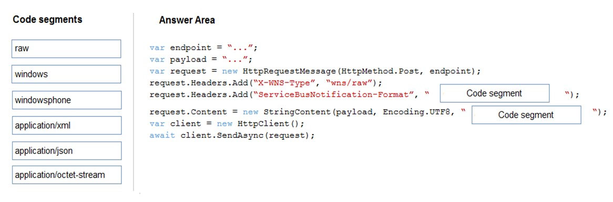
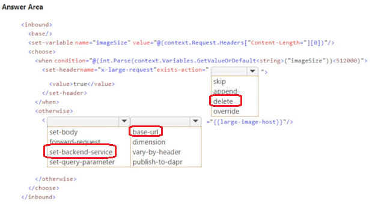

231

Question #: 21
Topic #: 5

DRAG DROP -
You develop and deploy an Azure App Service web app. The web app accesses data in an Azure SQL database.
You must update the web app to store frequently used data in a new Azure Cache for Redis Premium instance.
You need to implement the Azure Cache for Redis features.
Which feature should you implement? To answer, drag the appropriate feature to the correct requirements. Each feature may be used once, more than once, or not at all. You may need to drag the split bar between panes or scroll to view content.
NOTE: Each correct selection is worth one point.
Select and Place:


This is correct!
https://docs.microsoft.com/en-us/azure/architecture/best-practices/caching

If you look for the right words (related > set | high-performance > channel | recent > list) in documentation, it helps you validate this answer.
Ignore the other comments as it only leads to confusion.

Set（集合）：

解释： Redis 中的 Set 是一个无序的、不包含重复元素的数据结构。你可以使用 Set 存储多个值，但这些值不会有序排列。Set 支持添加、删除和检查元素的操作，是一个用于存储唯一值的有效结构。

List（列表）：

解释： Redis 中的 List 是一个有序的、可以包含重复元素的数据结构。它类似于一个动态数组，支持在两端添加和删除元素。List 常用于实现队列、堆栈等数据结构。

Channel（频道）：

解释： Redis 中的 Channel 是与发布/订阅模式相关的概念。发布/订阅模式允许多个客户端订阅某个频道，当消息发布到频道时，所有订阅该频道的客户端都会接收到该消息。这对于实现消息传递和事件通知非常有用。

---

232

Question #: 22
Topic #: 5

You are developing an ASP.NET Core Web API web service. The web service uses Azure Application Insights for all telemetry and dependency tracking. The web service reads and writes data to a database other than Microsoft SQL Server.
You need to ensure that dependency tracking works for calls to the third-party database.
Which two dependency telemetry properties should you use? Each correct answer presents part of the solution.
NOTE: Each correct selection is worth one point.

	A. Telemetry.Context.Cloud.RoleInstance
	B. Telemetry.Id
	C. Telemetry.Name
	D. Telemetry.Context.Operation.Id
	E. Telemetry.Context.Session.Id


Correct Answer: B and D
message.Properties.Add("ParentId", operation.Telemetry.Id);
message.Properties.Add("RootId", operation.Telemetry.Context.Operation.Id);

Reference:
https://docs.microsoft.com/en-us/azure/azure-monitor/app/custom-operations-tracking#enqueue

---

233

Question #: 23
Topic #: 5

HOTSPOT -
You are using Azure Front Door Service.
You are expecting inbound files to be compressed by using Brotli compression. You discover that inbound XML files are not compressed. The files are 9 megabytes (MB) in size.
You need to determine the root cause for the issue.
To answer, select the appropriate options in the answer area.
NOTE: Each correct selection is worth one point.
Hot Area:


	1.Yes
	2.No Refer - https://docs.microsoft.com/en-us/azure/frontdoor/front-door-caching ,You don’t need to purge the cache assets. Here the issue is that the file size needs to be less than 8MB
	3.Yes

---

234

Question #: 24
Topic #: 5

HOTSPOT -
You are developing an Azure App Service hosted ASP.NET Core web app to deliver video-on-demand streaming media. You enable an Azure Content Delivery
Network (CDN) Standard for the web endpoint. Customer videos are downloaded from the web app by using the following example URL: http://www.contoso.com/ content.mp4?quality=1.
All media content must expire from the cache after one hour. Customer videos with varying quality must be delivered to the closest regional point of presence
(POP) node.
You need to configure Azure CDN caching rules.
Which options should you use? To answer, select the appropriate options in the answer area.
NOTE: Each correct selection is worth one point.
Hot Area:


Box 1: Override
Override: Ignore origin-provided cache duration; use the provided cache duration instead. This will not override cache-control: no-cache.
Set if missing: Honor origin-provided cache-directive headers, if they exist; otherwise, use the provided cache duration.
Bypass cache: Do not cache and ignore origin-provided cache-directive headers.

因为我们要规定1小时，所以要override

Box 2: 1 hour
All media content must expire from the cache after one hour.

题目里说了要1小时

Box 3: Cache every unique URL
Cache every unique URL: In this mode, each request with a unique URL, including the query string, is treated as a unique asset with its own cache. For example, the response from the origin server for a request for example.ashx?q=test1 is cached at the POP node and returned for subsequent caches with the same query string. A request for example.ashx?q=test2 is cached as a separate asset with its own time-to-live setting.

Bypass caching for query strings: In this mode, requests with query strings are not cached at the CDN POP node. The POP node retrieves the asset directly from the origin server and passes it to the requestor with each request.

Ignore query strings: Default mode. In this mode, the CDN point-of-presence (POP) node passes the query strings from the requestor to the origin server on the first request and caches the asset. All subsequent requests for the asset that are served from the POP ignore the query strings until the cached asset expires.

不同质量的视频要有不同的cache，所以每个url都要cache

---

235

Question #: 25
Topic #: 5

HOTSPOT -
You are developing an ASP.NET Core time sheet application that runs as an Azure Web App. Users of the application enter their time sheet information on the first day of every month.
The application uses a third-party web service to validate data.
The application encounters periodic server errors due to errors that result from calling a third-party web server. Each request to the third-party server has the same chance of failure.
You need to configure an Azure Monitor alert to detect server errors unrelated to the third-party service. You must minimize false-positive alerts.
How should you complete the Azure Resource Manager template? To answer, select the appropriate options in the answer area.
NOTE: Each correct selection is worth one point.
Hot Area:


DynamicThresholdCriterion: Dynamic thresholds in metric alerts use advanced machine learning to learn metric
Http5XX, just a name , we are monitoring server errors, so 500 range error reponses
AlertSensitvity : would set is to low. "You must minimize false-positive alerts" 


---

236

Question #: 26
Topic #: 5

You are developing a web application that uses Azure Cache for Redis. You anticipate that the cache will frequently fill and that you will need to evict keys.
You must configure Azure Cache for Redis based on the following predicted usage pattern: A small subset of elements will be accessed much more often than the rest.
You need to configure the Azure Cache for Redis to optimize performance for the predicted usage pattern.
Which two eviction policies will achieve the goal?
NOTE: Each correct selection is worth one point.

A. noeviction
B. allkeys-lru
C. volatile-lru
D. allkeys-random
E. volatile-ttl
F. volatile-random

Suggested Answer: BC


在预测的使用模式中，小部分元素将比其他元素更频繁地访问。为了优化性能，你可以选择以下两个逐出策略：

B. allkeys-lru

说明： 使用最近最少使用（LRU）策略逐出所有键，这意味着最近最少被访问的键将被优先逐出。

C. volatile-lru

说明： 使用LRU策略逐出有过期时间的键，这允许你在键具有过期时间时执行LRU策略，确保对小部分元素的频繁访问。

其他选项的说明：

A. noeviction： 不进行逐出，当内存不足时，将返回错误。这可能导致性能问题，因为没有逐出机制。
D. allkeys-random： 随机逐出所有键，这不太适合小部分元素经常被访问的场景。
E. volatile-ttl： 使用键的过期时间进行逐出。不太适合场景，因为键的过期时间可能不与最近的访问模式对应。
F. volatile-random： 随机逐出有过期时间的键，也不太适合小部分元素经常被访问的场景。
因此，正确的答案是 B. allkeys-lru 和 C. volatile-lru。

---

237

Question #: 27
Topic #: 5

DRAG DROP -
An organization has web apps hosted in Azure.
The organization wants to track events and telemetry data in the web apps by using Application Insights.
You need to configure the web apps for Application Insights.
Which three actions should you perform in sequence? To answer, move the appropriate actions from the list of actions to the answer area and arrange them in the correct order.
Select and Place:


The given answer is correct.
	1. Create an Application Insights resource
	2. Copy the instrumentation key
	3. Install the SDK in your app
https://learn.microsoft.com/en-us/azure/azure-monitor/app/create-new-resource


---

238

Question #: 28
Topic #: 5

An organization hosts web apps in Azure. The organization uses Azure Monitor.
You discover that configuration changes were made to some of the web apps.
You need to identify the configuration changes.
Which Azure Monitor log should you review?

	A. AppServiceAppLogs
	B. AppServiceEnvironmentPlatformlogs
	C. AppServiceConsoleLogs
	D. AppServiceAuditLogs

Suggested Answer: B 

AppServiceEnvironmentPlatformlogs only logs when app services are hosted in an App Service Environment witch is a deployment of Azure App Service into a subnet in your Azure Virtual Network (VNet). It is a Premium service option

The problem is, all other anwers are wrong :
AppServiceAppLogs : logs from inside your app
AppServiceConsoleLogs : logs from the console
AppServiceAuditLogs : logs who are logged in or out.

but...
AppServiceFileAuditLogs will do the job for premium tiers.
https://ruslany.net/2020/01/how-to-monitor-azure-app-service-content-changes-and-publishing-activity/


---

239

Question #: 29
Topic #: 5

You develop and deploy an Azure App Service web app to a production environment. You enable the Always On setting and the Application Insights site extensions.
You deploy a code update and receive multiple failed requests and exceptions in the web app.
You need to validate the performance and failure counts of the web app in near real time.
Which Application Insights tool should you use?

	A. Profiler
	B. Smart Detection
	C. Live Metrics Stream
	D. Application Map
	E. Snapshot Debugger

Suggested Answer: C 

the key is near real time.
https://learn.microsoft.com/en-us/azure/azure-monitor/app/live-stream

---

240

Question #: 30
Topic #: 5

HOTSPOT -
You deploy an ASP.NET web app to Azure App Service.
You must monitor the web app by using Application Insights.
You need to configure Application Insights to meet the requirements.
Which feature should you use? To answer, select the appropriate options in the answer area.
NOTE: Each correct selection is worth one point.
Hot Area:


---

241

Question #: 31
Topic #: 5

You are building a web application that performs image analysis on user photos and returns metadata containing objects identified. The image analysis is very costly in terms of time and compute resources. You are planning to use Azure Redis Cache so duplicate uploads do not need to be reprocessed.
In case of an Azure data center outage, metadata loss must be kept to a minimum.
You need to configure the Azure Redis cache instance.
Which two actions should you perform? Each correct answer presents part of the solution.
NOTE: Each correct selection is worth one point.

	A. Configure Azure Redis with AOF persistence.
	B. Configure Azure Redis with RDB persistence.
	C. Configure second storage account for persistence.
	D. Set backup frequency to the minimum value.

The key here is "In case of an Azure data center outage, metadata loss must be kept to a minimum."

So the correct answer is AC.

使用 AOF（Append-Only File）持久性，可以将写命令追加到持久性日志文件中，以便在 Redis 重新启动时重新执行这些命令。这有助于确保在 Azure 数据中心中断的情况下最小化元数据损失。

---

242

Question #: 32
Topic #: 5

You are developing an Azure-based web application. The application goes offline periodically to perform offline data processing. While the application is offline, numerous Azure Monitor alerts fire which result in the on-call developer being paged.
The application must always log when the application is offline for any reason.
You need to ensure that the on-call developer is not paged during offline processing.
What should you do?

	A. Add Azure Monitor alert processing rules to suppress notifications.
	B. Disable Azure Monitor Service Health Alerts during offline processing.
	C. Create an Azure Monitor Metric Alert.
	D. Build an Azure Monitor action group that suppresses the alerts.

A

要确保在离线处理期间不会向在线开发人员发送警报，你可以选择以下操作：

A. 添加 Azure Monitor 警报处理规则以抑制通知。

说明： 通过配置警报处理规则，你可以在离线处理期间抑制通知，防止在此时触发通知。
其他选项的说明：

B. 在离线处理期间禁用 Azure Monitor 服务健康警报： 这样做会禁用与 Azure 服务健康相关的警报，但可能无法直接解决离线处理期间的问题。
C. 创建 Azure Monitor Metric Alert（指标警报）： 指标警报通常用于监视特定指标的变化，而在此场景中，问题是应用程序是否在线，因此指标警报可能不是最合适的选择。
D. 构建一个 Azure Monitor 操作组来抑制警报： 这是正确的思路，但通常使用警报处理规则更为直观和方便。
因此，最合适的答案是 A. 添加 Azure Monitor 警报处理规则以抑制通知。

---

243

Question #: 33
Topic #: 5

You are developing an online game that includes a feature that allows players to interact with other players on the same team within a certain distance. The calculation to determine the players in range occurs when players move and are cached in an Azure Cache for Redis instance.

The system should prioritize players based on how recently they have moved and should not prioritize players who have logged out of the game.

You need to select an eviction policy.

Which eviction policy should you use?

	A. allkeys-Iru
	B. volatile-Iru
	C. allkeys-lfu
	D. volatile-ttl
	
B

Changed my mind;
There must be a way to tell our redis that logged off users must not be prioritized.
Sample: User A moves and then automatically logs-off. With allkeys-lru we can't distinguish this particularity. With volatile-lru we can tell our redis what are good candidates to be removed using different TTL values.


在这种情况下，你应该选择 B. volatile-lru 作为逐出策略。

B. volatile-lru：

说明： 该策略使用最近最少使用（LRU）算法逐出有过期时间的键。这意味着 Redis 会优先逐出最近最少被访问的有过期时间的键，有助于确保离线或不再移动的玩家不会长时间保留在缓存中。因为在游戏中，最近移动的玩家可能更有可能与其他玩家进行交互，所以通过该策略，你可以优化缓存以满足这个要求。
其他选项的说明：

A. allkeys-lru： 使用 LRU 策略逐出所有键，而不仅仅是有过期时间的键。这在不同的场景中可能更适用，但在这个特定的游戏场景中，优先逐出有过期时间的键更有针对性。
C. allkeys-lfu： 使用最不经常使用（LFU）算法逐出所有键。在这个场景中，基于最近的移动更为重要，所以 LRU 可能更合适。
D. volatile-ttl： 使用键的过期时间进行逐出。这可能不是最佳选择，因为过期时间可能不与最近的移动模式直接对应。
因此，正确的答案是 B. volatile-lru。

---

244

Question #: 34
Topic #: 5

You develop an Azure App Service web app and deploy to a production environment. You enable Application Insights for the web app.

The web app is throwing multiple exceptions in the environment.

You need to examine the state of the source code and variables when the exceptions are thrown.

Which Application Insights feature should you configure?

A. Smart detection
B. Profiler
C. Snapshot Debugger
D. Standard test

Suggested Answer: C

---

245

Question #: 35
Topic #: 5

DRAG DROP

You develop and deploy a Java application to Azure. The application has been instrumented by using the Application Insights SDK.

The telemetry data must be enriched and processed before it is sent to the Application Insights service.

You need to modify the telemetry data.

Which Application Insights SDK features should you use? To answer, drag the appropriate features to the correct requirements. Each feature may be used once, more than once, or not at all. You may need to drag the split bar between panes or scroll to view content.

NOTE: Each correct selection is worth one point.


Correct answers
Link: https://learn.microsoft.com/en-us/azure/azure-monitor/app/api-filtering-sampling

---

246

Question #: 36
Topic #: 5

HOTSPOT

You develop new functionality in a web application for a company that provides access to seismic data from around the world. The seismic data is stored in Redis Streams within an Azure Cache for Redis instance.

The new functionality includes a real-time display of seismic events as they occur.

You need to implement the Azure Cache for Redis command to receive seismic data.

How should you complete the command? To answer, select the appropriate options in the answer area.

NOTE: Each correct selection is worth one point.


Correct.
BLOCK 0 means that we will wait infinitely (timeout 0 means it will never expire) for new items in a stream.
$ ID means that we will receive only new messages, starting from the time we started listening

https://redis.io/docs/data-types/streams-tutorial/#listening-for-new-items-with-xread

---

247

Question #: 37
Topic #: 5

You develop an ASP.NET Core app that uses Azure App Configuration. You also create an App Configuration containing 100 settings.

The app must meet the following requirements:

• Ensure the consistency of all configuration data when changes to individual settings occur.
• Handle configuration data changes dynamically without causing the application to restart.
• Reduce the overall number of requests made to App Configuration APIs.

You must implement dynamic configuration updates in the app.

What are two ways to achieve this goal? Each correct answer presents part of the solution.

NOTE: Each correct selection is worth one point.

	A. Create and register a sentinel key in the App Configuration store. Set the refreshAll parameter of the Register method to true.
	B. Increase the App Configuration cache expiration from the default value.
	C. Decrease the App Configuration cache expiration from the default value.
	D. Create and configure Azure Key Vault. Implement the Azure Key Vault configuration provider.
	E. Register all keys in the App Configuration store. Set the refreshAll parameter of the Register method to false.
	F. Create and implement environment variables for each App Configuration store setting.

AB 不确定

Correct Answers
Link: https://learn.microsoft.com/en-us/azure/azure-app-configuration/enable-dynamic-configuration-aspnet-netfx

Quotes from the reference below:
"A sentinel key is a key that you update after you complete the change of all other keys. Your app monitors the sentinel key. When a change is detected, your app refreshes all configuration values. This approach helps to ensure the consistency of configuration in your app and reduces the overall number of requests made to your App Configuration store, compared to monitoring all keys for changes."

"You can add a call to the refreshOptions.SetCacheExpiration method to specify the minimum time between configuration refreshes. In this example, you use the default value of 30 seconds. Adjust to a higher value if you need to reduce the number of requests made to your App Configuration store."

创建和注册一个 sentinel key（一个特殊的 key），当配置发生更改时，将改变这个 sentinel key 的值，以触发应用程序动态更新。将 refreshAll 参数设置为 true 以确保刷新所有配置，确保一致性。

Reference: https://learn.microsoft.com/en-us/azure/azure-app-configuration/enable-dynamic-configuration-aspnet-core?tabs=core6x

---

248

Question #: 38
Topic #: 5

HOTSPOT

You develop and deploy an Azure App Service web app that connects to Azure Cache for Redis as a content cache. All resources have been deployed to the East US 2 region.

The security team requires the following audit information from Azure Cache for Redis:

• The number of Redis client connections from an associated IP address.
• Redis operations completed on the content cache.
• The location (region) in which the Azure Cach3e for Redis instance was accessed.

The audit information must be captured and analyzed by a security team application deployed to the Central US region.

You need to log information on all client connections to the cache.

Which configuration values should you use? To answer, select the appropriate options in the answer area.

NOTE: Each correct selection is worth one point.


Correct.
Only Log Analytics supports cross-region logging

Reference: https://learn.microsoft.com/en-us/azure/azure-cache-for-redis/cache-monitor-diagnostic-settings?tabs=basic-standard-premium#enable-connection-logging-using-the-azure-portal

Log Analytics Workspace - used to store log information.
Diagnostic setting - diagnostic logs are streamed to that workspace as soon as new event data is generated

---

249

Question #: 39
Topic #: 5

You develop and deploy a web app to Azure App Service. The Azure App Service uses a Basic plan in a single region.

Users report that the web app is responding slow. You must capture the complete call stack to help identify performance issues in the code. Call stack data must be correlated across app instances. You must minimize cost and impact to users on the web app.

You need to capture the telemetry.

Which three actions should you perform? Each correct answer presents part of the solution.

NOTE: Each correct selection is worth one point.

	A. Restart all apps in the App Service plan.
	B. Enable Application Insights site extensions.
	C. Upgrade the Azure App Service plan to Premium.
	D. Enable Profiler.
	E. Enable the Always On setting for the app service.
	F. Enable Snapshot debugger.
	G. Enable remote debugging.

BDF 不确定

---

250

Question #: 40
Topic #: 5

You are building an application to track cell towers that are available to phones in near real time. A phone will send information to the application by using the Azure Web PubSub service. The data will be processed by using an Azure Functions app. Traffic will be transmitted by using a content delivery network (CDN).

The Azure function must be protected against misconfigured or unauthorized invocations.

You need to ensure that the CDN allows for the Azure function protection.

Which HTTP header should be on the allowed list?

	A. Authorization
	B. WebHook-Request-Callback
	C. Resource
	D. WebHook-Request-Origin

Suggested Answer: D

https://learn.microsoft.com/en-us/azure/azure-web-pubsub/howto-develop-eventhandler#upstream-and-validation

通过 Azure 门户或 CLI 设置事件处理程序 Webhook 时，服务遵循 CloudEvents 滥用保护措施来验证上游 Webhook。 每个已注册的上游 Webhook URL 都将通过此机制进行验证。 WebHook-Request-Origin 请求头设置为服务域名 xxx.webpubsub.azure.com，它会要求含标头 WebHook-Allowed-Origin 的响应包含此域名或 *。

---

251

Question #: 41
Topic #: 5

You are developing an Azure App Service web app.

The web app must securely store session information in Azure Redis Cache.

You need to connect the web app to Azure Redis Cache.

Which three Azure Redis Cache properties should you use? Each correct answer presents part of the solution.

NOTE: Each correct selection is worth one point.

	A. Access key
	B. SSL port
	C. Subscription name
	D. Location
	E. Host name
	F. Subscription id

Suggested Answer: ABE

When connecting a web app to Azure Redis Cache, you need to specify certain properties. Here are three Azure Redis Cache properties you should use:

Hostname: This property represents the fully qualified domain name (FQDN) or the endpoint URL of the Azure Redis Cache instance. It is used to establish a connection between the web app and the cache. The hostname typically follows the format yourcache.redis.cache.windows.net.

Port: This property specifies the port number used for communication with the Azure Redis Cache instance. The default port for Redis is 6379, but you can configure it differently if needed.

Access key: This property is the primary or secondary access key for the Azure Redis Cache instance.

---

252

Question #: 42
Topic #: 5

HOTSPOT

You are developing several microservices to run on Azure Container Apps.

You need to monitor and diagnose the microservices.

Which features should you use? To answer, select the appropriate feature in the answer area.

NOTE: Each correct selection is worth one point.


Answer is correct!

https://learn.microsoft.com/en-us/azure/container-apps/observability

From this page:
Log Streaming - View streaming system and console logs from a container in near real-time.
Container console - Connect to the Linux console in your containers to debug your application from inside the container.

---

253

Case study -

This is a case study. Case studies are not timed separately. You can use as much exam time as you would like to complete each case. However, there may be additional case studies and sections on this exam. You must manage your time to ensure that you are able to complete all questions included on this exam in the time provided.

To answer the questions included in a case study, you will need to reference information that is provided in the case study. Case studies might contain exhibits and other resources that provide more information about the scenario that is described in the case study. Each question is independent of the other questions in this case study.

At the end of this case study, a review screen will appear. This screen allows you to review your answers and to make changes before you move to the next section of the exam. After you begin a new section, you cannot return to this section.


To start the case study -
To display the first question in this case study, click the Next button. Use the buttons in the left pane to explore the content of the case study before you answer the questions. Clicking these buttons displays information such as business requirements, existing environment, and problem statements. When you are ready to answer a question, click the Question button to return to the question.


Background -

VanArsdel, Ltd. is a global office supply company. The company is based in Canada and has retail store locations across the world. The company is developing several cloud-based solutions to support their stores, distributors, suppliers, and delivery services.


Current environment -


Corporate website -

The company provides a public website located at http://www.vanarsdelltd.com. The website consists of a React JavaScript user interface, HTML, CSS, image assets, and several APIs hosted in Azure Functions.


Retail Store Locations -

The company supports thousands of store locations globally. Store locations send data every hour to an Azure Blob storage account to support inventory, purchasing and delivery services. Each record includes a location identifier and sales transaction information.


Requirements -

The application components must meet the following requirements:


Corporate website -

• Secure the website by using SSL.
• Minimize costs for data storage and hosting.
• Implement native GitHub workflows for continuous integration and continuous deployment (CI/CD).
• Distribute the website content globally for local use.
• Implement monitoring by using Application Insights and availability web tests including SSL certificate validity and custom header value verification.
• The website must have 99.95 percent uptime.


Retail store locations -

• Azure Functions must process data immediately when data is uploaded to Blob storage. Azure Functions must update Azure Cosmos DB by using native SQL language queries.
• Audit store sale transaction information nightly to validate data, process sales financials, and reconcile inventory.


Delivery services -

• Store service telemetry data in Azure Cosmos DB by using an Azure Function. Data must include an item id, the delivery vehicle license plate, vehicle package capacity, and current vehicle location coordinates.
• Store delivery driver profile information in Azure Active Directory (Azure AD) by using an Azure Function called from the corporate website.


Inventory services -

The company has contracted a third-party to develop an API for inventory processing that requires access to a specific blob within the retail store storage account for three months to include read-only access to the data.


Security -

• All Azure Functions must centralize management and distribution of configuration data for different environments and geographies, encrypted by using a company-provided RSA-HSM key.
• Authentication and authorization must use Azure AD and services must use managed identities where possible.


Issues -


Retail Store Locations -

• You must perform a point-in-time restoration of the retail store location data due to an unexpected and accidental deletion of data.
• Azure Cosmos DB queries from the Azure Function exhibit high Request Unit (RU) usage and contain multiple, complex queries that exhibit high point read latency for large items as the function app is scaling.


You need to test the availability of the corporate website.

Which two test types can you use? Each correct answer presents a complete solution.

NOTE: Each correct selection is worth one point.

A. Standard
B. URL ping
C. Custom testing using the TrackAvailability API method
D. Multi-step


A and C per this requirement: "Implement monitoring by using Application Insights and availability web tests including SSL certificate validity and custom header value verification."

A - Standard test: This single request test is similar to the URL ping test. It includes TLS/SSL certificate validity, proactive lifetime check, HTTP request verb.

C - Custom TrackAvailability test: If you decide to create a custom application to run availability tests, you can use the TrackAvailability() method to send the results to Application Insights.

https://learn.microsoft.com/en-us/azure/azure-monitor/app/availability-overview#types-of-tests


---

254

Question #: 44
Topic #: 5

You have an Azure API Management (APIM) Standard tier instance named APIM1 that uses a managed gateway.

You plan to use APIM1 to publish an API named API1 that uses a backend database that supports only a limited volume of requests per minute. You also need a policy for API1 that will minimize the possibility that the number of requests to the backend database from an individual IP address you specify exceeds the supported limit.

You need to identify a policy for API1 that will meet the requirements.

Which policy should you use?

	A. ip-filter
	B. quota-by-key
	C. rate-limit-by-key
	D. rate-limit

Suggested Answer: C


为了最小化来自特定 IP 地址的请求数量，以确保不超过支持的限制，你应该使用 C. rate-limit-by-key 策略。

C. rate-limit-by-key： 该策略允许你按照键对请求进行速率限制。你可以为每个 IP 地址分配一个键，并为该键设置速率限制。这样，就可以确保特定 IP 地址在一定时间内不会超过一定数量的请求。

---

255

Question #: 45
Topic #: 5

You develop a web application that sells access to last-minute openings for child camps that run on the weekends. The application uses Azure Application Insights for all alerting and monitoring.

The application must alert operators when a technical issue is preventing sales to camps.

You need to build an alert to detect technical issues.

Which alert type should you use?

	A. Metric alert using multiple time series
	B. Metric alert using dynamic thresholds
	C. Log alert using multiple time series
	D. Log alert using dynamic thresholds

Suggested Answer: B


---

256

暂缺

---

257

暂缺

---

258

Question #: 3
Topic #: 6

DRAG DROP -
You manage several existing Logic Apps.
You need to change definitions, add new logic, and optimize these apps on a regular basis.
What should you use? To answer, drag the appropriate tools to the correct functionalities. Each tool may be used once, more than once, or not at all. You may need to drag the split bar between panes or scroll to view content.
NOTE: Each correct selection is worth one point.
Select and Place:


---

259

Question #: 4
Topic #: 6


A company is developing a solution that allows smart refrigerators to send temperature information to a central location.
The solution must receive and store messages until they can be processed. You create an Azure Service Bus instance by providing a name, pricing tier, subscription, resource group, and location.
You need to complete the configuration.
Which Azure CLI or PowerShell command should you run?


A

I think the Service Bus has already been created and now they ask you to complete the configuration. The next step is creating the queue.

B. Create group.
C. Create Service Bus.
A. Create Queue. <-- Correct answer.
D. Get connectionstring.

---

260

Question #: 5
Topic #: 6

HOTSPOT -
You are developing an application that uses Azure Storage Queues.
You have the following code:


For each of the following statements, select Yes if the statement is true. Otherwise, select No.
NOTE: Each correct selection is worth one point.
Hot Area:


GetMessageAsync:
Gets a message from the queue using the default request options. This operation marks the retrieved message as invisible in the queue for the default visibility timeout period.

Only marks the message is invisible but does not delete.

---

261

Question #: 6
Topic #: 6

A company is developing a solution that allows smart refrigerators to send temperature information to a central location.
The solution must receive and store messages until they can be processed. You create an Azure Service Bus instance by providing a name, pricing tier, subscription, resource group, and location.
You need to complete the configuration.
Which Azure CLI or PowerShell command should you run?


Suggested Answer: C

---

262

Question #: 7
Topic #: 6

Note: This question is part of a series of questions that present the same scenario. Each question in the series contains a unique solution that might meet the stated goals. Some question sets might have more than one correct solution, while others might not have a correct solution.
After you answer a question in this section, you will NOT be able to return to it. As a result, these questions will not appear in the review screen.
You are developing an Azure Service application that processes queue data when it receives a message from a mobile application. Messages may not be sent to the service consistently.
You have the following requirements:
✑ Queue size must not grow larger than 80 gigabytes (GB).
✑ Use first-in-first-out (FIFO) ordering of messages.
✑ Minimize Azure costs.
You need to implement the messaging solution.
Solution: Use the .Net API to add a message to an Azure Storage Queue from the mobile application. Create an Azure Function App that uses an Azure Storage
Queue trigger.
Does the solution meet the goal?

	A. Yes
	B. No

Suggested Answer: B

Answer is B (NO),
Becz FIFO is supported by Service bus queue and Service bus queue should be use for data less than 80GB
https://docs.microsoft.com/en-us/azure/service-bus-messaging/service-bus-azure-and-service-bus-queues-compared-contrasted

Service Bus queues才有FIFO

---

263

Question #: 8
Topic #: 6

DRAG DROP -
You develop software solutions for a mobile delivery service. You are developing a mobile app that users can use to order from a restaurant in their area. The app uses the following workflow:
1. A driver selects the restaurants for which they will deliver orders.
2. Orders are sent to all available drivers in an area.
3. Only orders for the selected restaurants will appear for the driver.
4. The first driver to accept an order removes it from the list of available orders.
You need to implement an Azure Service Bus solution.
Which three actions should you perform in sequence? To answer, move the appropriate actions from the list of actions to the answer area and arrange them in the correct order.
Select and Place:


不确定

	Create a single Service Bus Namespace.
	Create a single Service Bus Topic.
	Create a Service Bus subscription for each restaurant for which a driver can receive orders.

---

264

Question #: 9
Topic #: 6

HOTSPOT -
You develop a news and blog content app for Windows devices.
A notification must arrive on a user's device when there is a new article available for them to view.
You need to implement push notifications.
How should you complete the code segment? To answer, select the appropriate options in the answer area.
NOTE: Each correct selection is worth one point.
Hot Area:


The answer is correct, but the first reference is not very helpful and the second one doesn't even exists. Here are references of the methods used in the answer:
https://docs.microsoft.com/en-us/dotnet/api/microsoft.azure.notificationhubs.notificationhubclient.createclientfromconnectionstring?view=azure-dotnet#Microsoft_Azure_NotificationHubs_NotificationHubClient_CreateClientFromConnectionString_System_String_System_String_
https://docs.microsoft.com/en-us/dotnet/api/microsoft.azure.notificationhubs.notificationhubclient.sendwindowsnativenotificationasync?view=azure-dotnet#Microsoft_Azure_NotificationHubs_NotificationHubClient_SendWindowsNativeNotificationAsync_System_String_


---

265

Question #: 10
Topic #: 6

You are developing an Azure messaging solution.
You need to ensure that the solution meets the following requirements:
✑ Provide transactional support.
✑ Provide duplicate detection.
✑ Store the messages for an unlimited period of time.
Which two technologies will meet the requirements? Each correct answer presents a complete solution.
NOTE: Each correct selection is worth one point.

	A. Azure Service Bus Topic
	B. Azure Service Bus Queue
	C. Azure Storage Queue
	D. Azure Event Hub

Suggested Answer: AB

Answer is correct. Queue Storage does not provide transactional support and Event Hub can't be configured to store events for infinite time.

---

266

Question #: 11
Topic #: 6

DRAG DROP -
You develop a gateway solution for a public facing news API.
The news API back end is implemented as a RESTful service and hosted in an Azure App Service instance.
You need to configure back-end authentication for the API Management service instance.
Which target and gateway credential type should you use? To answer, drag the appropriate values to the correct parameters. Each value may be used once, more than once, or not at all. You may need to drag the split bar between panes or scroll to view content.
NOTE: Each correct selection is worth one point.
Select and Place:


Answer :
1. Https(s) endpoint,
2. Client cert

Reference : https://docs.microsoft.com/en-us/azure/api-management/api-management-howto-mutual-certificates#configure-an-api-to-use-client-certificate-for-gateway-authentication

---

267

Question #: 12
Topic #: 6

HOTSPOT -
You are creating an app that uses Event Grid to connect with other services. Your app's event data will be sent to a serverless function that checks compliance.
This function is maintained by your company.
You write a new event subscription at the scope of your resource. The event must be invalidated after a specific period of time.
You need to configure Event Grid.
What should you do? To answer, select the appropriate options in the answer area.
NOTE: Each correct selection is worth one point.
Hot Area:


Dropdowns placement in Answer area is incorrect
WebHook Event Delivery ---ValidationCode handsShake
Topic publishing --- SAS Tokens

https://docs.microsoft.com/en-us/azure/event-grid/concepts
https://docs.microsoft.com/en-us/azure/event-grid/webhook-event-delivey

---

268

Question #: 13
Topic #: 6

HOTSPOT -
You are working for Contoso, Ltd.
You define an API Policy object by using the following XML markup:

For each of the following statements, select Yes if the statement is true. Otherwise, select No.
NOTE: Each correct selection is worth one point.
Hot Area:


---

269

Question #: 14
Topic #: 6

You are developing a solution that will use Azure messaging services.
You need to ensure that the solution uses a publish-subscribe model and eliminates the need for constant polling.
What are two possible ways to achieve the goal? Each correct answer presents a complete solution.
NOTE: Each correct selection is worth one point.

	A. Service Bus
	B. Event Hub
	C. Event Grid
	D. Queue

Suggested Answer: AC 

Correct Ans is A & C
https://docs.microsoft.com/en-us/azure/architecture/patterns/publisher-subscriber#issues-and-considerations

Event Hubs : event-based receiving is not possible, you still need to poll. So B falls off

Agree, but publish/subscribe is a feature of event-hub as well, but event-based receiving is not. That is why option B falls off.

---

270

Question #: 15
Topic #: 6

A company is implementing a publish-subscribe (Pub/Sub) messaging component by using Azure Service Bus. You are developing the first subscription application.
In the Azure portal you see that messages are being sent to the subscription for each topic. You create and initialize a subscription client object by supplying the correct details, but the subscription application is still not consuming the messages.
You need to ensure that the subscription client processes all messages.
Which code segment should you use?

	A. await subscriptionClient.AddRuleAsync(new RuleDescription(RuleDescription.DefaultRuleName, new TrueFilter()));
	B. subscriptionClient = new SubscriptionClient(ServiceBusConnectionString, TopicName, SubscriptionName);
	C. await subscriptionClient.CloseAsync();
	D. subscriptionClient.RegisterMessageHandler(ProcessMessagesAsync, messageHandlerOptions);

Suggested Answer: D 

Agreed on D
Clientsubcriber object initialization is done, so B incorrect.
Here Nothing to do with Rule and closeclient so A and C incorrect

---

271

Question #: 16
Topic #: 6

Note: This question is part of a series of questions that present the same scenario. Each question in the series contains a unique solution that might meet the stated goals. Some question sets might have more than one correct solution, while others might not have a correct solution.
After you answer a question in this section, you will NOT be able to return to it. As a result, these questions will not appear in the review screen.
You are developing an Azure Service application that processes queue data when it receives a message from a mobile application. Messages may not be sent to the service consistently.
You have the following requirements:
✑ Queue size must not grow larger than 80 gigabytes (GB).
✑ Use first-in-first-out (FIFO) ordering of messages.
✑ Minimize Azure costs.
You need to implement the messaging solution.
Solution: Use the .Net API to add a message to an Azure Storage Queue from the mobile application. Create an Azure VM that is triggered from Azure Storage
Queue events.
Does the solution meet the goal?

	A. Yes
	B. No

Suggested Answer: B

---

272

Question #: 17
Topic #: 6

Note: This question is part of a series of questions that present the same scenario. Each question in the series contains a unique solution that might meet the stated goals. Some question sets might have more than one correct solution, while others might not have a correct solution.
After you answer a question in this section, you will NOT be able to return to it. As a result, these questions will not appear in the review screen.
You are developing an Azure Service application that processes queue data when it receives a message from a mobile application. Messages may not be sent to the service consistently.
You have the following requirements:
✑ Queue size must not grow larger than 80 gigabytes (GB).
✑ Use first-in-first-out (FIFO) ordering of messages.
✑ Minimize Azure costs.
You need to implement the messaging solution.
Solution: Use the .Net API to add a message to an Azure Service Bus Queue from the mobile application. Create an Azure Windows VM that is triggered from Azure Service Bus Queue.
Does the solution meet the goal?

	A. Yes
	B. No

Suggested Answer: B

Using Service bus is fine, however having a Windows VM does not address the cost requirement.

Answer is 'NO'

Windows VM太贵了

---

273

Question #: 18
Topic #: 6

DRAG DROP -
You are developing a REST web service. Customers will access the service by using an Azure API Management instance.
The web service does not correctly handle conflicts. Instead of returning an HTTP status code of 409, the service returns a status code of 500. The body of the status message contains only the word conflict.
You need to ensure that conflicts produce the correct response.
How should you complete the policy? To answer, drag the appropriate code segments to the correct locations. Each code segment may be used once, more than once, or not at all. You may need to drag the split bar between panes or scroll to view content.
NOTE: Each correct selection is worth one point.
Select and Place:


---

274

Question #: 19
Topic #: 6

DRAG DROP -
You are a developer for a Software as a Service (SaaS) company. You develop solutions that provide the ability to send notifications by using Azure Notification
Hubs.
You need to create sample code that customers can use as a reference for how to send raw notifications to Windows Push Notification Services (WNS) devices.
The sample code must not use external packages.
How should you complete the code segment? To answer, drag the appropriate code segments to the correct locations. Each code segment may be used once, more than once, or not at all. You may need to drag the split bar between panes or scroll to view content.
NOTE: Each correct selection is worth one point.
Select and Place:




Answer is correct.
https://docs.microsoft.com/en-us/rest/api/notificationhubs/send-wns-native-notification

---

275

Question #: 20
Topic #: 6

Note: This question is part of a series of questions that present the same scenario. Each question in the series contains a unique solution that might meet the stated goals. Some question sets might have more than one correct solution, while others might not have a correct solution.
After you answer a question in this section, you will NOT be able to return to it. As a result, these questions will not appear in the review screen.
You are developing an Azure solution to collect point-of-sale (POS) device data from 2,000 stores located throughout the world. A single device can produce
2 megabytes (MB) of data every 24 hours. Each store location has one to five devices that send data.
You must store the device data in Azure Blob storage. Device data must be correlated based on a device identifier. Additional stores are expected to open in the future.
You need to implement a solution to receive the device data.
Solution: Provision an Azure Event Hub. Configure the machine identifier as the partition key and enable capture.
Does the solution meet the goal?

	A. Yes
	B. No

B 不确定

Answer is NO
How many partitions event hub can have? NOT MORE than 1024
https://docs.microsoft.com/en-us/azure/event-hubs/event-hubs-quotas

---

276

Question #: 21
Topic #: 6

DRAG DROP -
You are developing an Azure solution to collect inventory data from thousands of stores located around the world. Each store location will send the inventory data hourly to an Azure Blob storage account for processing.
The solution must meet the following requirements:
✑ Begin processing when data is saved to Azure Blob storage.
✑ Filter data based on store location information.
✑ Trigger an Azure Logic App to process the data for output to Azure Cosmos DB.
✑ Enable high availability and geographic distribution.
✑ Allow 24-hours for retries.
✑ Implement an exponential back off data processing.
You need to configure the solution.
What should you implement? To answer, select the appropriate options in the answer area.
NOTE: Each correct selection is worth one point.
Select and Place:


Source -> blob storage
Receiver -> event grid
Handler -> logic app

1)the source of the event, which means WHO has created the event and who is publishing this event, is the Blob Storage
2)The receiver of this event, which means who should receive this event, is the Event Grid. In the event Grid we can create Topic. Topic is where all publishers write messages --> so the Blob Storage write into a topic which is inside an Event Grid.
3)Handler of this event, which means who should handle this event, is the Logic App by creating a subscription in the event grid and connecting the Logic App to that subscription.

---

277

Question #: 22
Topic #: 6

You are creating an app that will use CosmosDB for data storage. The app will process batches of relational data.
You need to select an API for the app.
Which API should you use?

	A. MongoDB API
	B. Table API
	C. SQL API
	D. Cassandra API


C

relational data.

---

278

Question #: 23
Topic #: 6

HOTSPOT -
You are developing a .NET application that communicates with Azure Storage.
A message must be stored when the application initializes.
You need to implement the message.
How should you complete the code segment? To answer, select the appropriate options in the answer area.
NOTE: Each correct selection is worth one point.
Hot Area:


---

279

Question #: 24
Topic #: 6

HOTSPOT -
A software as a service (SaaS) company provides document management services. The company has a service that consists of several Azure web apps. All Azure web apps run in an Azure App Service Plan named PrimaryASP.
You are developing a new web service by using a web app named ExcelParser. The web app contains a third-party library for processing Microsoft Excel files.
The license for the third-party library stipulates that you can only run a single instance of the library.
You need to configure the service.
How should you complete the script? To answer, select the appropriate options in the answer area.
NOTE: Each correct selection is worth one point.
Hot Area:


https://docs.microsoft.com/en-us/azure/app-service/manage-scale-per-app

---

280

Question #: 25
Topic #: 6

DRAG DROP -
You have an application that provides weather forecasting data to external partners. You use Azure API Management to publish APIs.
You must change the behavior of the API to meet the following requirements:
✑ Support alternative input parameters
✑ Remove formatting text from responses
✑ Provide additional context to back-end services
Which types of policies should you implement? To answer, drag the policy types to the correct requirements. Each policy type may be used once, more than once, or not at all. You may need to drag the split bar between panes or scroll to view content.
NOTE: Each correct selection is worth one point.
Select and Place:


	Inbound
	Outbound
	Backend

---

281

Question #: 26
Topic #: 6

You are developing an e-commerce solution that uses a microservice architecture.
You need to design a communication backplane for communicating transactional messages between various parts of the solution. Messages must be communicated in first-in-first-out (FIFO) order.
What should you use?

	A. Azure Storage Queue
	B. Azure Event Hub
	C. Azure Service Bus
	D. Azure Event Grid

C

---

282

Question #: 27
Topic #: 6

DRAG DROP -
A company backs up all manufacturing data to Azure Blob Storage. Admins move blobs from hot storage to archive tier storage every month.
You must automatically move blobs to Archive tier after they have not been modified within 180 days. The path for any item that is not archived must be placed in an existing queue. This operation must be performed automatically once a month. You set the value of TierAgeInDays to -180.
How should you configure the Logic App? To answer, drag the appropriate triggers or action blocks to the correct trigger or action slots. Each trigger or action block may be used once, more than once, or not at all. You may need to drag the split bar between panes or scroll to view content.
NOTE: Each correct selection is worth one point.
Select and Place:


Admin, please correct this answer.
The box 3 shown in the image (When there are messages in a queue) differs from the solution (Put a message on a queue).
"Put a message on a queue" is the right answer!

Box 1: Reoccurance..
To regularly run tasks, processes, or jobs on specific schedule, you can start your logic app workflow with the built-in Recurrence - Schedule trigger. You can set a date and time as well as a time zone for starting the workflow and a recurrence for repeating that workflow.
Set the interval and frequency for the recurrence. In this example, set these properties to run your workflow every week.

Box 2: Condition..
To run specific actions in your logic app only after passing a specified condition, add a conditional statement. This control structure compares the data in your workflow against specific values or fields. You can then specify different actions that run based on whether or not the data meets the condition.

Box 3: Put a message on a queue -
The path for any item that is not archived must be placed in an existing queue.
Note: Under If true and If false, add the steps to perform based on whether the condition is met.
Box 4: ..tier it to Cool or Archive tier.
Archive item.

Box 5: List blobs 2 -
Reference:
https://docs.microsoft.com/en-us/azure/connectors/connectors-native-recurrence https://docs.microsoft.com/en-us/azure/logic-apps/logic-apps-control-flow-loops https://docs.microsoft.com/en-us/azure/logic-apps/logic-apps-control-flow-conditional-statement


---

283

Question #: 28
Topic #: 6

Note: This question is part of a series of questions that present the same scenario. Each question in the series contains a unique solution that might meet the stated goals. Some question sets might have more than one correct solution, while others might not have a correct solution.
After you answer a question in this section, you will NOT be able to return to it. As a result, these questions will not appear in the review screen.
You are developing an Azure Service application that processes queue data when it receives a message from a mobile application. Messages may not be sent to the service consistently.
You have the following requirements:
✑ Queue size must not grow larger than 80 gigabytes (GB).
✑ Use first-in-first-out (FIFO) ordering of messages.
✑ Minimize Azure costs.
You need to implement the messaging solution.
Solution: Use the .Net API to add a message to an Azure Service Bus Queue from the mobile application. Create an Azure Function App that uses an Azure
Service Bus Queue trigger.
Does the solution meet the goal?

	A. Yes
	B. No

Suggested Answer: A

---

284

Question #: 29
Topic #: 6

Note: This question is part of a series of questions that present the same scenario. Each question in the series contains a unique solution that might meet the stated goals. Some question sets might have more than one correct solution, while others might not have a correct solution.
After you answer a question in this section, you will NOT be able to return to it. As a result, these questions will not appear in the review screen.
You are developing an Azure solution to collect point-of-sale (POS) device data from 2,000 stores located throughout the world. A single device can produce 2 megabytes (MB) of data every 24 hours. Each store location has one to five devices that send data.
You must store the device data in Azure Blob storage. Device data must be correlated based on a device identifier. Additional stores are expected to open in the future.
You need to implement a solution to receive the device data.
Solution: Provision an Azure Notification Hub. Register all devices with the hub.
Does the solution meet the goal?

A. Yes
B. No

Suggested Answer: B 

---

285

Question #: 30
Topic #: 6

You are building a loyalty program for a major snack producer. When customers buy a snack at any of 100 participating retailers the event is recorded in Azure Event Hub. Each retailer is given a unique identifier that is used as the primary identifier for the loyalty program.
Retailers must be able to be added or removed at any time. Retailers must only be able to record sales for themselves.
You need to ensure that retailers can record sales.
What should you do?

A. Use publisher policies for retailers.
B. Create a partition for each retailer.
C. Define a namespace for each retailer.

Suggested Answer: A

注意Retailers must be able to be added or removed at any time. Retailers must only be able to record sales for themselves.

---

286

Question #: 31
Topic #: 6

DRAG DROP -
You develop and deploy a web app to Azure App Service in a production environment. You scale out the web app to four instances and configure a staging slot to support changes.
You must monitor the web app in the environment to include the following requirements:
✑ Increase web app availability by re-routing requests away from instances with error status codes and automatically replace instances if they remain in an error state after one hour.
✑ Send web server logs, application logs, standard output, and standard error messaging to an Azure Storage blob account.
You need to configure Azure App Service.
Which values should you use? To answer, drag the appropriate configuration value to the correct requirements. Each configuration value may be used once, more than once, or not at all. You may need to drag the split bar between panes or scroll to view content.
NOTE: Each correct selection is worth one point.
Select and Place:


---

287

Question #: 32
Topic #: 6

You develop a solution that uses Azure Virtual Machines (VMs).
The VMs contain code that must access resources in an Azure resource group. You grant the VM access to the resource group in Resource Manager.
You need to obtain an access token that uses the VM's system-assigned managed identity.
Which two actions should you perform? Each correct answer presents part of the solution.

A. From the code on the VM, call Azure Resource Manager using an access token.
B. Use PowerShell on a remote machine to make a request to the local managed identity for Azure resources endpoint.
C. Use PowerShell on the VM to make a request to the local managed identity for Azure resources endpoint.
D. From the code on the VM, call Azure Resource Manager using a SAS token.
E. From the code on the VM, generate a user delegation SAS token.

AC

https://docs.microsoft.com/en-us/azure/active-directory/managed-identities-azure-resources/tutorial-windows-vm-access-arm

---

288

Question #: 33
Topic #: 6

You are developing a road tollway tracking application that sends tracking events by using Azure Event Hubs using premium tier.
Each road must have a throttling policy uniquely assigned.
You need to configure the event hub to allow for per-road throttling.
What should you do?

	A. Use a unique consumer group for each road.
	B. Ensure each road stores events in a different partition.
	C. Ensure each road has a unique connection string.
	D. Use a unique application group for each road.

D

https://docs.microsoft.com/en-us/azure/event-hubs/event-hubs-features.

Application groups
An application group is a collection of client applications that connect to an Event Hubs namespace sharing a unique identifying condition such as the security context - shared access policy or Azure Active Directory (Azure AD) application ID.

Azure Event Hubs enables you to define resource access policies such as throttling policies for a given application group and controls event streaming (publishing or consuming) between client applications and Event Hubs.

For more information, see Resource governance for client applications with application groups.

---

289

Question #: 34
Topic #: 6

You develop and deploy an ASP.NET Core application that connects to an Azure Database for MySQL instance.
Connections to the database appear to drop intermittently and the application code does not handle the connection failure.
You need to handle the transient connection errors in code by implementing retries.
What are three possible ways to achieve this goal? Each correct answer presents part of the solution.
NOTE: Each correct selection is worth one point.

	A. Close the database connection and immediately report an error.
	B. Disable connection pooling and configure a second Azure Database for MySQL instance.
	C. Wait five seconds before repeating the connection attempt to the database.
	D. Set a maximum number of connection attempts to 10 and report an error on subsequent connections.
	E. Increase connection repeat attempts exponentially up to 120 seconds.

C,D,E

The first and second case are fairly straight forward to handle. Try to open the connection again. When you succeed, the transient error has been mitigated by the system. You can use your Azure Database for MySQL again. We recommend having waits before retrying the connection. Back off if the initial retries fail. This way the system can use all resources available to overcome the error situation. A good pattern to follow is:

Wait for 5 seconds before your first retry.
For each following retry, the increase the wait exponentially, up to 60 seconds.
Set a max number of retries at which point your application considers the operation failed.

https://docs.microsoft.com/en-us/azure/mysql/single-server/concepts-connectivity

---

290

Question #: 35
Topic #: 6

You are building a B2B web application that uses Azure B2B collaboration for authentication. Paying customers authenticate to Azure B2B using federation.
The application allows users to sign up for trial accounts using any email address.
When a user converts to a paying customer, the data associated with the trial should be kept, but the user must authenticate using federation.
You need to update the user in Azure Active Directory (Azure AD) when they convert to a paying customer.
Which Graph API parameter is used to change authentication from one-time passcodes to federation?

	A. resetRedemption
	B. Status
	C. userFlowType
	D. invitedUser

A

"When a user redeems a one-time passcode and later obtains an MSA, Azure AD account, or other federated account, they'll continue to be authenticated using a one-time passcode. If you want to update the user's authentication method, you can reset their redemption status."

https://docs.microsoft.com/en-us/azure/active-directory/external-identities/one-time-passcode#user-experience-for-one-time-passcode-guest-users

---

291

Question #: 36
Topic #: 6

HOTSPOT

You develop an image upload service that is exposed using Azure API Management. Images are analyzed after upload for automatic tagging.

Images over 500 KB are processed by a different backend that offers a lower tier of service that costs less money. The lower tier of service is denoted by a header named x-large-request. Images over 500 KB must never be processed by backends for smaller images and must always be charged the lower price.

You need to implement API Management policies to ensure that images are processed correctly.
How should you complete the API Management inbound policy? To answer, select the appropriate options in the answer area.

NOTE: Each correct selection is worth one point.




The given answer looks correct
the condition here is for "Images < 500KB" so based on the below reference we need to delete the header.
https://learn.microsoft.com/en-us/azure/api-management/set-header-policy#attributes
This is also the reference for back end service
https://learn.microsoft.com/en-us/azure/api-management/set-backend-service-policy

---

292

Question #: 37
Topic #: 6

HOTSPOT

You develop several Azure Functions app functions to process JSON documents from a third-party system. The third-party system publishes events to Azure Event Grid to include hundreds of event types, such as billing, inventory, and shipping updates.

Events must be sent to a single endpoint for the Azure Functions app to process. The events must be filtered by event type before processing. You must have authorization and authentication control to partition your tenants to receive the event data.

You need to configure Azure Event Grid.

Which configuration should you use? To answer, select the appropriate values in the answer area.

NOTE: Each correct selection is worth one point.


Check this from official trainig material:
https://learn.microsoft.com/en-us/training/modules/azure-event-grid/2-event-grid-overview

1. custom topic
Because according to link:
"Topics. The event grid topic provides an endpoint where the source sends events(...)Custom topics are application and third-party topics"

2. event subscription
Because according to link:
"Event subscriptions. A subscription tells Event Grid which events on a topic you're interested in receiving. When creating the subscription, you provide an endpoint for handling the event"

---

293

Question #: 38
Topic #: 6

A company is developing a solution that allows smart refrigerators to send temperature information to a central location.

The solution must receive and store messages until they can be processed. You create an Azure Service Bus instance by providing a name, pricing tier, subscription, resource group, and location.

You need to complete the configuration.

Which Azure CLI or PowerShell command should you run?


B

The next step in the process should be to create a queue IMO (as discussed in similar questions earlier). How the commans looks depends on what type of command prompt you are using (Azure CLI, PowerShell, Bash, ...).

---

294

Question #: 39
Topic #: 6

A company is developing a solution that allows smart refrigerators to send temperature information to a central location.

The solution must receive and store messages until they can be processed. You create an Azure Service Bus instance by providing a name, pricing tier, subscription, resource group, and location.

You need to complete the configuration.

Which Azure CLI or PowerShell command should you run?


Suggested Answer: C

---

295

Question #: 40
Topic #: 6

A company is developing a solution that allows smart refrigerators to send temperature information to a central location.

The solution must receive and store messages until they can be processed. You create an Azure Service Bus instance by providing a name, pricing tier, subscription, resource group, and location.

You need to complete the configuration.

Which Azure CLI or PowerShell command should you run?


Suggested Answer: C

---

296

Question #: 41
Topic #: 6
[All AZ-204 Questions]
DRAG DROP

You develop and deploy several APIs to Azure API Management.

You create the following policy fragment named APICounts:


Answers are correct. Here is an explanation of Policy fragments

https://learn.microsoft.com/en-us/azure/api-management/policy-fragments

For example, insert the policy fragment named ForwardContext in the inbound policy section:

```
<policies>
<inbound>
<include-fragment fragment-id="ForwardContext" />
<base />
</inbound>
```

---

297

Question #: 42
Topic #: 6
[All AZ-204 Questions]
HOTSPOT

You are developing a solution that uses several Azure Service Bus queues. You create an Azure Event Grid subscription for the Azure Service Bus namespace. You use Azure Functions as subscribers to process the messages.

You need to emit events to Azure Event Grid from the queues. You must use the principal of least privilege and minimize costs.

Which Azure Service Bus values should you use? To answer, select the appropriate options in the answer area.

NOTE: Each correct selection is worth one point.


Remember with Service bus + event grid its always premimum

https://learn.microsoft.com/en-us/azure/service-bus-messaging/service-bus-to-event-grid-integration-concept?tabs=event-grid-event-schema

---

298

Question #: 43
Topic #: 6
[All AZ-204 Questions]
You are developing several Azure API Management (APIM) hosted APIs.

The APIs have the following requirements:

• Require a subscription key to access all APIs.
• Include terms of use that subscribers must accept to use the APIs.
• Administrators must review and accept or reject subscription attempts.
• Limit the count of multiple simultaneous subscriptions.

You need to implement the APIs.

What should you do?

	A. Configure and apply header-based versioning.
	B. Create and publish a product.
	C. Configure and apply query string-based versioning.
	D. Add a new revision to all APIs. Make the revisions current and add a change log entry.
	
B

B. Create and publish a product.

To meet the requirements of needing a subscription key, including terms of use, having administrators review subscriptions, and limiting simultaneous subscriptions for Azure API Management hosted APIs, you should create and publish a product

https://learn.microsoft.com/en-us/azure/api-management/api-management-howto-add-products?tabs=azure-portal#create-and-publish-a-product

---

299

Question #: 44
Topic #: 6
[All AZ-204 Questions]
HOTSPOT

You are developing a solution by using the Azure Event Hubs SDK. You create a standard Azure Event Hub with 16 partitions. You implement eight event processor clients.

You must balance the load dynamically when an event processor client fails. When an event processor client fails, another event processor must continue processing from the exact point at which the failure occurred. All events must be aggregate and upload to an Azure Blob storage account.

You need to implement event processing recovery for the solution.

Which SDK features should you use? To answer, select the appropriate options in the answer area.

NOTE: Each correct selection is worth one point.


不确定

Checkpoint for both.

The features needed to implement event processing recovery for the solution, and specifically to handle the marking of the event processor client position within a partition event sequence, are related to checkpointing. Checkpointing is the process of tracking the processing of events within a partition and is essential for ensuring that processing can continue from the exact point at which a failure occurred.

1. Ensure that event process clients mark the position within an event sequence: Again, use Checkpointing. By regularly recording checkpoints, the event processor clients can ensure that they mark their progress through the event stream, allowing for recovery from failures.


2. Mark the event processor client position within a partition event sequence: Use Checkpointing. This allows an event processor to record its position in the event stream and resume from that position if it's restarted.


An offset is the position of an event within a partition.
Checkpointing is a process by which readers mark or commit their position within a partition event sequence.
Can't make my mind, I'll say select checkpoint on both and call it a day.

---

300

Question #: 45
Topic #: 6
[All AZ-204 Questions]
HOTSPOT
-

You are developing a new API to be hosted by Azure API Management (APIM). The backend service that implements the API has not been completed. You are creating a test API and operation.

You must enable developers to continue with the implementation and testing of the APIM instance integrations while you complete the backend API development.

You need to configure a test API response.

How should you complete the configuration? To answer, select the appropriate options in the answer area.


Answer should be:
1. mock-response
2. inbound
3. 200

refs: https://learn.microsoft.com/en-us/azure/api-management/mock-api-responses?tabs=azure-cli


