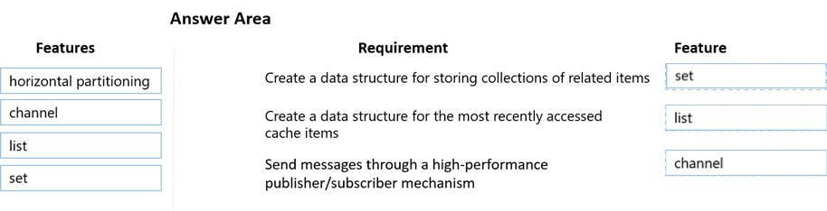

231

Question #: 21
Topic #: 5

DRAG DROP -
You develop and deploy an Azure App Service web app. The web app accesses data in an Azure SQL database.
You must update the web app to store frequently used data in a new Azure Cache for Redis Premium instance.
You need to implement the Azure Cache for Redis features.
Which feature should you implement? To answer, drag the appropriate feature to the correct requirements. Each feature may be used once, more than once, or not at all. You may need to drag the split bar between panes or scroll to view content.
NOTE: Each correct selection is worth one point.
Select and Place:

This is correct!
https://docs.microsoft.com/en-us/azure/architecture/best-practices/caching

If you look for the right words (related > set | high-performance > channel | recent > list) in documentation, it helps you validate this answer.
Ignore the other comments as it only leads to confusion.

Set（集合）：

解释： Redis 中的 Set 是一个无序的、不包含重复元素的数据结构。你可以使用 Set 存储多个值，但这些值不会有序排列。Set 支持添加、删除和检查元素的操作，是一个用于存储唯一值的有效结构。

List（列表）：

解释： Redis 中的 List 是一个有序的、可以包含重复元素的数据结构。它类似于一个动态数组，支持在两端添加和删除元素。List 常用于实现队列、堆栈等数据结构。

Channel（频道）：

解释： Redis 中的 Channel 是与发布/订阅模式相关的概念。发布/订阅模式允许多个客户端订阅某个频道，当消息发布到频道时，所有订阅该频道的客户端都会接收到该消息。这对于实现消息传递和事件通知非常有用。

---

232

Question #: 22
Topic #: 5

You are developing an ASP.NET Core Web API web service. The web service uses Azure Application Insights for all telemetry and dependency tracking. The web service reads and writes data to a database other than Microsoft SQL Server.
You need to ensure that dependency tracking works for calls to the third-party database.
Which two dependency telemetry properties should you use? Each correct answer presents part of the solution.
NOTE: Each correct selection is worth one point.

	A. Telemetry.Context.Cloud.RoleInstance
	B. Telemetry.Id
	C. Telemetry.Name
	D. Telemetry.Context.Operation.Id
	E. Telemetry.Context.Session.Id

Correct Answer: B and D
message.Properties.Add("ParentId", operation.Telemetry.Id);
message.Properties.Add("RootId", operation.Telemetry.Context.Operation.Id);

Reference:
https://docs.microsoft.com/en-us/azure/azure-monitor/app/custom-operations-tracking#enqueue

---

233

Question #: 23
Topic #: 5

HOTSPOT -
You are using Azure Front Door Service.
You are expecting inbound files to be compressed by using Brotli compression. You discover that inbound XML files are not compressed. The files are 9 megabytes (MB) in size.
You need to determine the root cause for the issue.
To answer, select the appropriate options in the answer area.
NOTE: Each correct selection is worth one point.
Hot Area:

	1.Yes
	2.No Refer - https://docs.microsoft.com/en-us/azure/frontdoor/front-door-caching ,You don’t need to purge the cache assets. Here the issue is that the file size needs to be less than 8MB
	3.Yes

---

234

Question #: 24
Topic #: 5

HOTSPOT -
You are developing an Azure App Service hosted ASP.NET Core web app to deliver video-on-demand streaming media. You enable an Azure Content Delivery
Network (CDN) Standard for the web endpoint. Customer videos are downloaded from the web app by using the following example URL: http://www.contoso.com/ content.mp4?quality=1.
All media content must expire from the cache after one hour. Customer videos with varying quality must be delivered to the closest regional point of presence
(POP) node.
You need to configure Azure CDN caching rules.
Which options should you use? To answer, select the appropriate options in the answer area.
NOTE: Each correct selection is worth one point.
Hot Area:

Box 1: Override
Override: Ignore origin-provided cache duration; use the provided cache duration instead. This will not override cache-control: no-cache.
Set if missing: Honor origin-provided cache-directive headers, if they exist; otherwise, use the provided cache duration.
Bypass cache: Do not cache and ignore origin-provided cache-directive headers.

因为我们要规定1小时，所以要override

Box 2: 1 hour
All media content must expire from the cache after one hour.

题目里说了要1小时

Box 3: Cache every unique URL
Cache every unique URL: In this mode, each request with a unique URL, including the query string, is treated as a unique asset with its own cache. For example, the response from the origin server for a request for example.ashx?q=test1 is cached at the POP node and returned for subsequent caches with the same query string. A request for example.ashx?q=test2 is cached as a separate asset with its own time-to-live setting.

Bypass caching for query strings: In this mode, requests with query strings are not cached at the CDN POP node. The POP node retrieves the asset directly from the origin server and passes it to the requestor with each request.

Ignore query strings: Default mode. In this mode, the CDN point-of-presence (POP) node passes the query strings from the requestor to the origin server on the first request and caches the asset. All subsequent requests for the asset that are served from the POP ignore the query strings until the cached asset expires.

不同质量的视频要有不同的cache，所以每个url都要cache

---

235

Question #: 25
Topic #: 5

HOTSPOT -
You are developing an ASP.NET Core time sheet application that runs as an Azure Web App. Users of the application enter their time sheet information on the first day of every month.
The application uses a third-party web service to validate data.
The application encounters periodic server errors due to errors that result from calling a third-party web server. Each request to the third-party server has the same chance of failure.
You need to configure an Azure Monitor alert to detect server errors unrelated to the third-party service. You must minimize false-positive alerts.
How should you complete the Azure Resource Manager template? To answer, select the appropriate options in the answer area.
NOTE: Each correct selection is worth one point.
Hot Area:

DynamicThresholdCriterion: Dynamic thresholds in metric alerts use advanced machine learning to learn metric
Http5XX, just a name , we are monitoring server errors, so 500 range error reponses
AlertSensitvity : would set is to low. "You must minimize false-positive alerts" 

---

236

Question #: 26
Topic #: 5

You are developing a web application that uses Azure Cache for Redis. You anticipate that the cache will frequently fill and that you will need to evict keys.
You must configure Azure Cache for Redis based on the following predicted usage pattern: A small subset of elements will be accessed much more often than the rest.
You need to configure the Azure Cache for Redis to optimize performance for the predicted usage pattern.
Which two eviction policies will achieve the goal?
NOTE: Each correct selection is worth one point.

A. noeviction
B. allkeys-lru
C. volatile-lru
D. allkeys-random
E. volatile-ttl
F. volatile-random

Suggested Answer: BC

在预测的使用模式中，小部分元素将比其他元素更频繁地访问。为了优化性能，你可以选择以下两个逐出策略：

B. allkeys-lru

说明： 使用最近最少使用（LRU）策略逐出所有键，这意味着最近最少被访问的键将被优先逐出。

C. volatile-lru

说明： 使用LRU策略逐出有过期时间的键，这允许你在键具有过期时间时执行LRU策略，确保对小部分元素的频繁访问。

其他选项的说明：

A. noeviction： 不进行逐出，当内存不足时，将返回错误。这可能导致性能问题，因为没有逐出机制。
D. allkeys-random： 随机逐出所有键，这不太适合小部分元素经常被访问的场景。
E. volatile-ttl： 使用键的过期时间进行逐出。不太适合场景，因为键的过期时间可能不与最近的访问模式对应。
F. volatile-random： 随机逐出有过期时间的键，也不太适合小部分元素经常被访问的场景。
因此，正确的答案是 B. allkeys-lru 和 C. volatile-lru。

---

237

Question #: 27
Topic #: 5
[All AZ-204 Questions]
DRAG DROP -
An organization has web apps hosted in Azure.
The organization wants to track events and telemetry data in the web apps by using Application Insights.
You need to configure the web apps for Application Insights.
Which three actions should you perform in sequence? To answer, move the appropriate actions from the list of actions to the answer area and arrange them in the correct order.
Select and Place:

The given answer is correct.
	1. Create an Application Insights resource
	2. Copy the instrumentation key
	3. Install the SDK in your app
https://learn.microsoft.com/en-us/azure/azure-monitor/app/create-new-resource

---

238

Question #: 28
Topic #: 5

An organization hosts web apps in Azure. The organization uses Azure Monitor.
You discover that configuration changes were made to some of the web apps.
You need to identify the configuration changes.
Which Azure Monitor log should you review?

	A. AppServiceAppLogs
	B. AppServiceEnvironmentPlatformlogs
	C. AppServiceConsoleLogs
	D. AppServiceAuditLogs

Suggested Answer: B 

AppServiceEnvironmentPlatformlogs only logs when app services are hosted in an App Service Environment witch is a deployment of Azure App Service into a subnet in your Azure Virtual Network (VNet). It is a Premium service option

The problem is, all other anwers are wrong :
AppServiceAppLogs : logs from inside your app
AppServiceConsoleLogs : logs from the console
AppServiceAuditLogs : logs who are logged in or out.

but...
AppServiceFileAuditLogs will do the job for premium tiers.
https://ruslany.net/2020/01/how-to-monitor-azure-app-service-content-changes-and-publishing-activity/

---

239

Question #: 29
Topic #: 5
[All AZ-204 Questions]
You develop and deploy an Azure App Service web app to a production environment. You enable the Always On setting and the Application Insights site extensions.
You deploy a code update and receive multiple failed requests and exceptions in the web app.
You need to validate the performance and failure counts of the web app in near real time.
Which Application Insights tool should you use?

	A. Profiler
	B. Smart Detection
	C. Live Metrics Stream
	D. Application Map
	E. Snapshot Debugger

Suggested Answer: C 

the key is near real time.
https://learn.microsoft.com/en-us/azure/azure-monitor/app/live-stream

---

240

Question #: 30
Topic #: 5
[All AZ-204 Questions]
HOTSPOT -
You deploy an ASP.NET web app to Azure App Service.
You must monitor the web app by using Application Insights.
You need to configure Application Insights to meet the requirements.
Which feature should you use? To answer, select the appropriate options in the answer area.
NOTE: Each correct selection is worth one point.
Hot Area:

---

