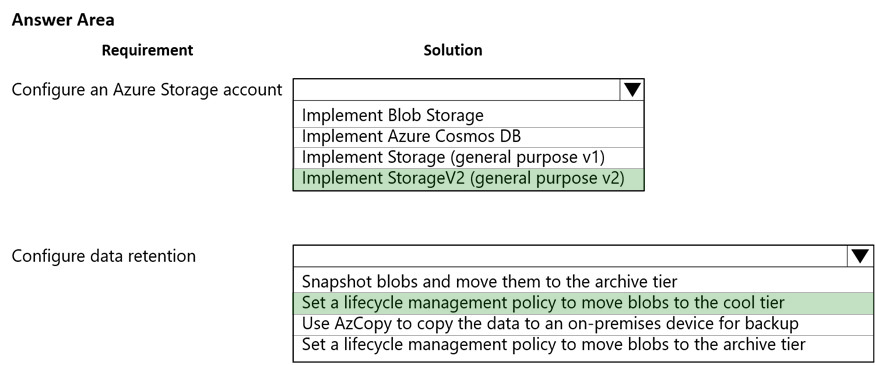
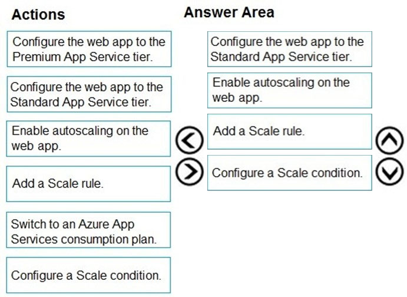
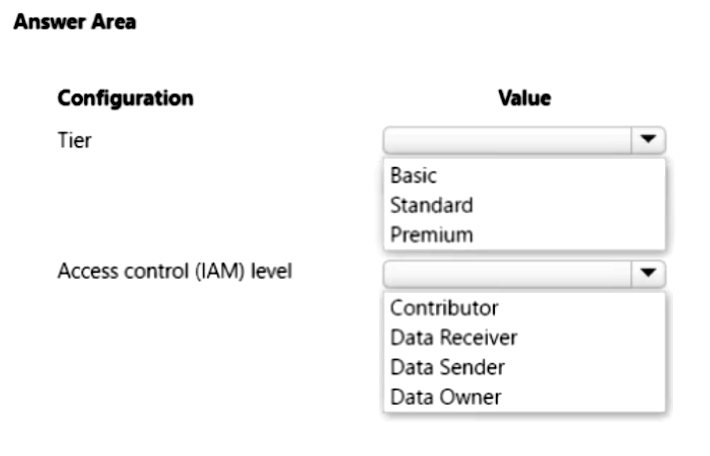
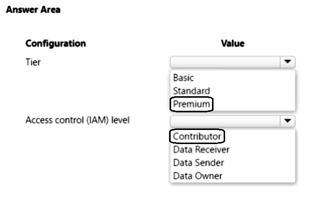

Question #20

You develop a Web App on a tier D1 app service plan.
You notice that page load times increase during periods of peak traffic.
You want to implement automatic scaling when CPU load is above 80 percent. Your solution must minimize costs.
What should you do first?

	A. Enable autoscaling on the Web App.
	B. Switch to the Premium App Service tier plan.
	C. Switch to the Standard App Service tier plan.
	D. Switch to the Azure App Services consumption plan.

Correct Answer: C

Configure the web app to the Standard App Service Tier. The Standard tier supports auto-scaling, and we should minimize the cost. We can then enable autoscaling on the web app, add a scale rule and add a Scale condition.
Reference:
https://docs.microsoft.com/en-us/azure/monitoring-and-diagnostics/monitoring-autoscale-get-started https://azure.microsoft.com/en-us/pricing/details/app-service/plans/

Tier D1 is a basically shared app service plan, so we need to move standard or premium plan to enable auto scaling. As we need to provide low cost solution, then standard plan will be best for this approach

---

Question #36

HOTSPOT

You are building a software-as-a-service (SaaS) application that analyzes DNA data that will run on Azure virtual machines (VMs) in an availability zone. The data is stored on managed disks attached to the VM. The performance of the analysis is determined by the speed of the disk attached to the VM.

You have the following requirements:

• The application must be able to quickly revert to the previous day’s data if a systemic error is detected.
• The application must minimize downtime in the case of an Azure datacenter outage.

You need to provision the managed disk for the VM to maximize performance while meeting the requirements.

Which type of Azure Managed Disk should you use? To answer, select the appropriate options in the answer area.

NOTE: Each correct selection is worth one point.

Wrong answer: Managed disk doesn't support GRS

Ans: Premium SSD and ZRS
They are asking for high performance workloads which is supported by Premium tier https://learn.microsoft.com/en-us/azure/virtual-machines/disks-types
Also they are asking for zone redundancy (if datacenter goes down, NOT region outage). Also managed disk doesn't support GRS https://learn.microsoft.com/en-us/azure/virtual-machines/disks-redundancy

Locally Redundant Storage (LRS):

* 冗余级别： 数据在同一区域的多个存储节点上进行三次复制。
* 故障转移范围： 限于同一 Azure 区域。
* 成本： 相对较低，是较为经济的选项。
* 应用场景： 适用于对数据冗余要求不高，但仍希望在同一区域内获得某种程度的冗余和可靠性。

Geo-Redundant Storage (GRS):

* 冗余级别： 数据在主区域内进行 LRS 复制，同时异步复制到辅助区域。
* 故障转移范围： 跨 Azure 区域。
* 成本： 相对较高，因为提供了跨区域的冗余。
* 应用场景： 适用于对数据要求较高的冗余，希望在主要区域发生故障时能够迅速切换到辅助区域。

Zone-Redundant Storage (ZRS):

* 冗余级别： 数据在同一区域的不同可用性区域内进行复制。
* 故障转移范围： 限于同一 Azure 区域，但是可以跨多个可用性区域。
* 成本： 介于 LRS 和 GRS 之间。
* 应用场景： 适用于要求高可用性且能够抵御单一可用性区域故障的情况。

WHEN THEY SAY 'Azure datacenter outage' they are implying a data center within a region which is hosted in one of the region's three zones. That alone gives it away that its ZRS with P-SSD.

---

114

Question #21Topic 3
HOTSPOT -
You are developing a web application that will use Azure Storage. Older data will be less frequently used than more recent data.
You need to configure data storage for the application. You have the following requirements:
✑ Retain copies of data for five years.
✑ Minimize costs associated with storing data that is over one year old.
✑ Implement Zone Redundant Storage for application data.
What should you do? To answer, select the appropriate options in the answer area.
NOTE: Each correct selection is worth one point.
Hot Area:

---

91

Question #54Topic 2
HOTSPOT

You plan to develop an Azure Functions app with an HTTP trigger.

The app must support the following requirements:

• Event-driven scaling
• Ability to use custom Linux images for function execution

You need to identify the app’s hosting plan and the maximum amount of time that the app function can take to respond to incoming requests.

Which configuration setting values should you use? To answer, select the appropriate values in the answer area.

NOTE: Each correct selection is worth one point.

Correct:
The Premium plan supports event-driven scaling and allows to use custom Linux images.
The default timeout for Azure Functions on the Consumption and Premium plans is 5 minutes (300 seconds), and 230 is a good fit.

---

93

Question #56Topic 2
HOTSPOT

You plan to develop an Azure Functions app with an Azure Blob Storage trigger. The app will be used infrequently, with a limited duration of individual executions.

The app must meet the following requirements:

• Event-driven scaling
• Support for deployment slots
• Minimize costs

You need to identify the hosting plan and the maximum duration when executing the app.

Which configuration setting values should you use? To answer, select the appropriate values in the answer area.

NOTE: Each correct selection is worth one point.

Right Answer: Premium - 230

Event-Driven requirement:
Is only souported by Consumption and Premium
https://learn.microsoft.com/en-us/azure/azure-functions/functions-scale#scale

Slot requirement:
Is only souported by Dedicated and Premium
"Function apps running under the Apps Service plan may have multiple slots, while under the Consumption plan only one slot is allowed."
https://learn.microsoft.com/en-us/azure/azure-functions/functions-deployment-slots

Minimize costs:
Is not relevant because there is just one service plan that meets the previous requirements

---

137

Question #44Topic 3
You are developing an inventory tracking solution. The solution includes an Azure Function app containing multiple functions triggered by Azure Cosmos DB. You plan to deploy the solution to multiple Azure regions.

The solution must meet the following requirements:

• Item results from Azure Cosmos DS must return the most recent committed version of an item.
• Items written to Azure Cosmos DB must provide ordering guarantees.

You need to configure the consistency level for the Azure Cosmos DB deployments.

Which consistency level should you use?

	A. consistent prefix
	B. eventual
	C. bounded staleness
	D. strong
	E. session

D 不确定

I think it's D.
Strong consistency is not supported for multiple WRITE regions, and I don't see any such requirements in the question. https://learn.microsoft.com/en-us/azure/cosmos-db/high-availability#multiple-write-regions

---

211

Question #: 1
Topic #: 5

DRAG DROP -
You develop a web app that uses the tier D1 app service plan by using the Web Apps feature of Microsoft Azure App Service.
Spikes in traffic have caused increases in page load times.
You need to ensure that the web app automatically scales when CPU load is about 85 percent and minimize costs.
Which four actions should you perform in sequence? To answer, move the appropriate actions from the list of actions to the answer area and arrange them in the correct order.
NOTE: More than one order of answer choices is correct. You will receive credit for any of the correct orders you select.
Select and Place:

the correct answer is :-
Configure the web app to the Standard App Service Tier
Enable autoscaling on the web app
Add a Scale condition
Add a scale rule
Please refer - https://docs.microsoft.com/en-us/learn/modules/app-service-autoscale-rules/6-autoscale-a-web-app

Standard App Service Tier就支持auto scale了
要先加condition才能加rule

---

297

Question #: 42
Topic #: 6

HOTSPOT

You are developing a solution that uses several Azure Service Bus queues. You create an Azure Event Grid subscription for the Azure Service Bus namespace. You use Azure Functions as subscribers to process the messages.

You need to emit events to Azure Event Grid from the queues. You must use the principal of least privilege and minimize costs.

Which Azure Service Bus values should you use? To answer, select the appropriate options in the answer area.

NOTE: Each correct selection is worth one point.

Remember with Service bus + event grid its always premimum

https://learn.microsoft.com/en-us/azure/service-bus-messaging/service-bus-to-event-grid-integration-concept?tabs=event-grid-event-schema

